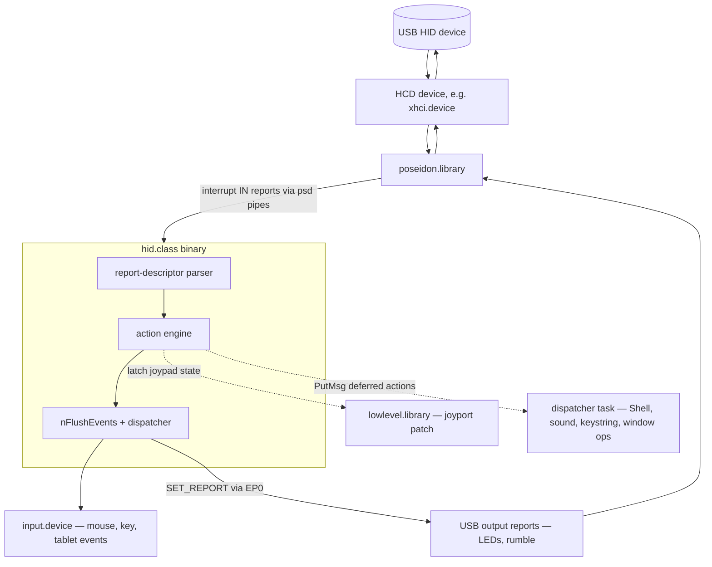
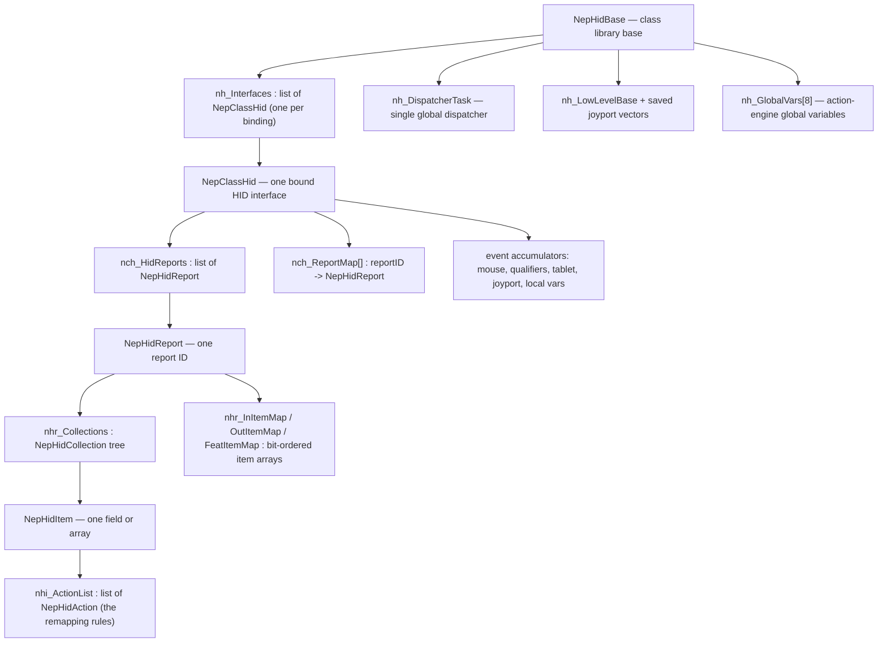
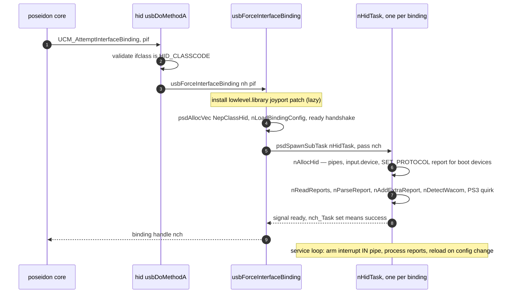
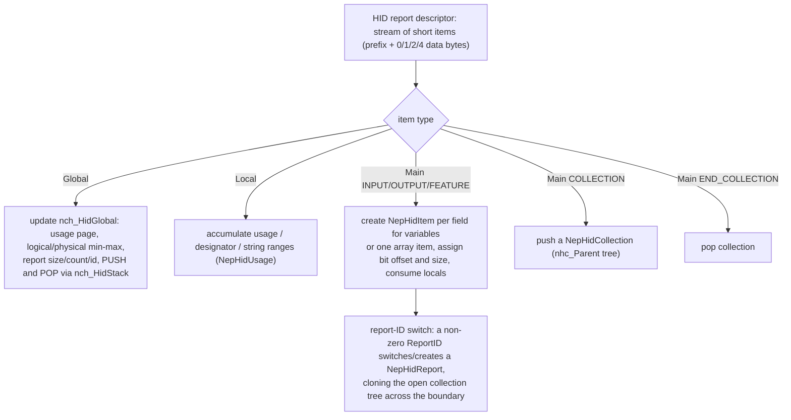
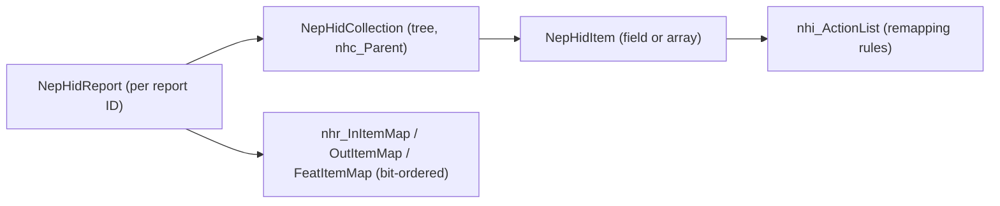
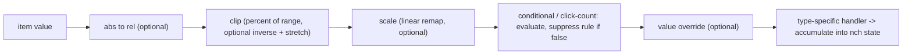
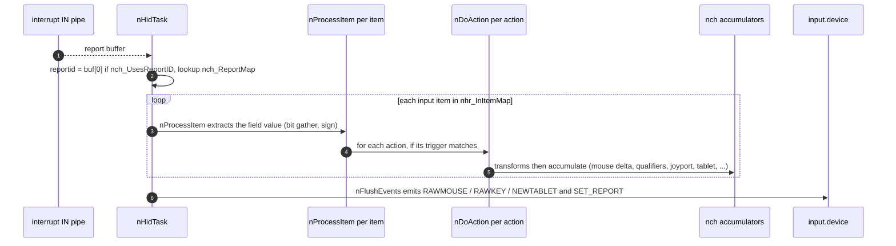
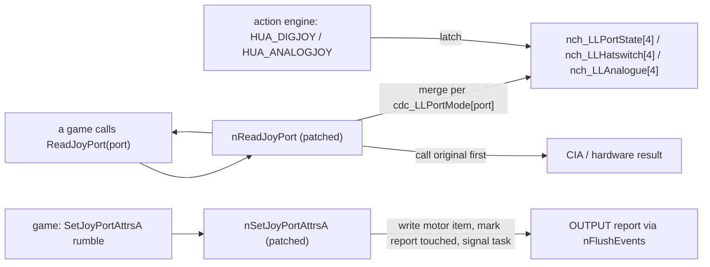

# hid.class — Architecture (reverse-engineered)

> Scope: the **`hid.class`** USB Human Interface Device driver — the most feature-rich class in
> the stack (~14.5k lines across 4 source files). It is a *consumer* of `poseidon.library`
> ([core doc](poseidon.library-architecture.md)) and feeds Amiga **`input.device`**, **patches
> `lowlevel.library`** (joyports), and drives **USB output reports** (LEDs/rumble). At its heart is
> a fully **configurable HID-to-Amiga remapping engine**.
>
> Sources: `classes/hid/hid.class.c` (~7.4k lines), `hid.h`, `hid.class.h`, the two MUI GUIs
> `hid.gui.c` / `hidctrl.gui.c`, and `numtostr.c` (string tables). Line numbers are indicative.

---

## Table of contents

1. [What this driver is](#1-what-this-driver-is)
2. [Layering and the four output edges](#2-layering-and-the-four-output-edges)
3. [Object model](#3-object-model)
4. [Binding and task model](#4-binding-and-task-model)
5. [The HID report-descriptor parser](#5-the-hid-report-descriptor-parser)
6. [The action system — the remapping engine](#6-the-action-system--the-remapping-engine)
7. [Report processing and input.device feeding](#7-report-processing-and-inputdevice-feeding)
8. [The lowlevel.library joyport patch](#8-the-lowlevellibrary-joyport-patch)
9. [Device quirks — Wacom and PS3](#9-device-quirks--wacom-and-ps3)
10. [Config and the two GUIs](#10-config-and-the-two-guis)
11. [End-to-end flows](#11-end-to-end-flows)
12. [State machines](#12-state-machines)
13. [Notable quirks and refactoring hazards](#13-notable-quirks-and-refactoring-hazards)
14. [Appendix — maps and indexes](#14-appendix--maps-and-indexes)

---

## 1. What this driver is

`hid.class` is the generic USB HID driver — keyboards, mice, joysticks/gamepads, tablets, and the
consumer/system controls on top of them. Unlike `bootmouse`/`bootkeyboard` (which speak only the
fixed boot protocol), it parses the device's full **HID report descriptor** and then maps every
field to Amiga input through a **configurable action engine** — essentially a tiny event-scripting
VM with operators, variables, and per-usage default mappings.

Conceptually it does four things:

1. **Parse** the HID report descriptor into an in-memory model (reports → collections → items).
2. **Assign actions** — auto-detect sensible defaults per HID usage, or load user-configured
   mappings.
3. **Process** incoming interrupt reports — extract each field's value, run its action list.
4. **Emit** to one of **four output edges** (§2): `input.device`, the `lowlevel.library` joyport
   patch, USB output reports, or a global dispatcher task for slow/blocking work.

---

## 2. Layering and the four output edges



The class consumes the `psd*` pipe API on its lower edge (one interrupt-IN pipe per binding, plus
an EP0 control pipe). Its upper edge is **four distinct output sinks**:

| Output edge | Carries | Mechanism |
|---|---|---|
| `input.device` | mouse, rawkey, qualifiers, tablet | `IND_WRITEEVENT`/`IND_ADDEVENT` of `IECLASS_RAWMOUSE`/`RAWKEY`/`NEWPOINTERPOS` |
| `lowlevel.library` | joystick/gamepad state | `SetFunction` patch of `ReadJoyPort`/`SetJoyPortAttrsA` (§8) |
| USB output reports | LEDs, rumble motors | `UHR_SET_REPORT` on the EP0 control pipe |
| dispatcher task | Shell launch, sound, key strings, window/screen ops | `PutMsg` to a global "Last Action Hero" task (§4) |

---

## 3. Object model



* **`NepHidBase`** — class base: `nh_Interfaces` (all bindings), `nh_DispatcherTask` (the single
  global offload task), the `lowlevel.library` patch vectors, `nh_GlobalVars[8]` (action-engine
  globals shared across all devices), `nh_DummyNCH` (default-config carrier), `nh_Sounds`.
* **`NepClassHid`** — per bound HID interface: the pipes, the input.device IORequest, the parsed
  HID model (`nch_HidReports`/`nch_ReportMap`), and a large set of **event accumulators**
  (`nch_MouseDeltaX/Y`, `nch_KeyQualifiers`, `nch_TabPressure`, `nch_LLPortState[4]`,
  `nch_LocalVars[8]`, …) plus two big blocks of MUI GUI objects.
* **The parsed HID model**: `NepHidReport` (one per report ID) → `NepHidCollection` tree →
  `NepHidItem` (one field, or one array). Each item owns a `nhi_ActionList`.
* **`NepHidAction`** — one remapping rule: a type (`HUA_*`) + trigger + transform config +
  operator/operand parameters. This is the unit of the configurable engine (§6).

---

## 4. Binding and task model



* **Binding gate** (`usbAttemptInterfaceBinding`, `:144`): accepts **any** `HID_CLASSCODE` (0x03)
  interface — boot or report protocol. `usbForceInterfaceBinding` (`:171`) installs the joyport
  patch, allocates the `NepClassHid`, and spawns `nHidTask` with the standard `psdBorrowLocksWait`
  ready handshake (success = `nch_Task != NULL`).
* **`nAllocHid`** (`:1047`, in the subtask): finds the interrupt IN (and optional OUT) endpoint,
  opens `input.device`, allocates the EP0 control + interrupt IN pipes, and for **boot devices**
  issues `SET_IDLE` + **`SET_PROTOCOL(report)`** to force full report mode. Then parses the
  descriptor (§5).
* **`nHidTask`** (`:681`): the per-binding service loop arms the interrupt-IN pipe
  (`psdSendPipe`), and on each completion decodes the report-ID prefix, looks up
  `nch_ReportMap[id]`, and runs `nProcessItem` over the report's input items (§7). It also
  performs **live config reload** (re-parse) when the config CRC changes (§10), runs the synthetic
  `[Extra]` init/quit actions at start/stop, and handles suspend/resume.
* **The global dispatcher task** (`nDispatcherTask` / "Last Action Hero", `:6930`): one per
  libbase, lazily spawned. It is the single sink for action effects that **must not** run in the
  HID interrupt/task context — launching a Shell, playing a datatypes sound, typing a key string,
  window/screen manipulation, reboot. Actions queue to it via `ActionMsg` on `nh_DTaskMsgPort`.
* **Two GUI subtasks** per binding (config editor + control panel) — §10.

---

## 5. The HID report-descriptor parser

`nReadReports` (`:2032`) fetches the HID descriptor (preferring the copy cached during
enumeration) and each `UDT_REPORT` descriptor, then `nParseReport` (`:2571`) parses the report
descriptor byte stream into the model.



Parse mechanics:

* **Item prefix**: `tag | size | type` in one byte; `size` ∈ {0,1,2,4} data bytes, read as both
  signed (`data`) and unsigned (`udata`). Long items are skipped.
* **Global items** set the running register file `nch_HidGlobal` (usage page, logical/physical
  min/max, report size/count/id). `PUSH`/`POP` save/restore it via the LIFO `nch_HidStack`.
* **Local items** accumulate usage/designator/string **ranges** (`NepHidUsage`), consumed
  front-to-back as each Main item is created, then flushed.
* **Main items**: `INPUT`/`OUTPUT`/`FEATURE` create `NepHidItem`s — one **per field** for variable
  items (each pulling the next usage), or one **array item** (with a per-value `nhi_UsageMap[]` and
  `nhi_ActionMap[]`, plus `nhi_Buffer`/`nhi_OldBuffer` for diffing). Bit offsets/sizes are tracked
  in `bitpos`. `COLLECTION`/`END_COLLECTION` build the `nhc_Parent` tree.
* **Report-ID handling**: a non-zero report ID switches the active `NepHidReport` (creating one on
  demand and **cloning the open collection chain** so each report has its own tree). The post-pass
  sets `nch_UsesReportID`, sizes (`nhr_Report{In,Out,Feat}Size`), builds `nch_ReportMap[]` for
  O(1) lookup, and carves each report's flat **bit-ordered item maps**
  (`nhr_InItemMap`/`OutItemMap`/`FeatItemMap`).
* **Item IDs**: each item gets a 16-bit ID stored in its action-list's `lh_Type`
  (`GET_WTYPE`/`SET_WTYPE`) — referenced by `HUA_OUTPUT`/`HUA_FEATURE` actions.
* **`nAddExtraReport`** (`:1451`) appends a synthetic `[Extra]` report (ID `0xffff`) with
  init/quit pseudo-items (so the user can bind start/stop actions) and caches rumble-motor output
  items into `nch_RumbleMotors[]`.

The resulting tree:



---

## 6. The action system — the remapping engine

Every input item owns a list of `NepHidAction` rules. When an item's value changes, the engine
runs each rule through `nDoAction` (`:5104`). This is effectively a small **event-scripting
language**.

**Action types (`HUA_*`)** — what the rule emits:

| Group | Types |
|---|---|
| Keyboard | `QUALIFIER`, `KEYMAP` (USB→rawkey via configurable map), `RAWKEY`, `EXTRAWKEY`, `VANILLA`, `KEYSTRING` |
| Mouse | `MOUSEPOS`, `BUTTONS`, `WHEEL` |
| Tablet | `TABLET` (pressure/rotation/proximity) |
| Joyport | `DIGJOY`, `ANALOGJOY` |
| Output | `OUTPUT`, `FEATURE` (LEDs/rumble/feature writes) |
| System | `SOUND`, `SHELL`, `MISC` (window/screen/reboot), `VARIABLES` |

**Triggers** gate when a rule fires: `DOWNEVENT` (value rose), `UPEVENT` (value fell), `ALWAYS`,
or `NAN` (value out of `[LogicalMin,LogicalMax]` — used to neutralize a hatswitch on its null
code).

**The transform pipeline** (each rule, in order, gated by `nha_*Enable` flags):



**The `HUAT_*` operator/operand sub-language** drives the conditional, value-override, and
`HUA_VARIABLES` paths:

* **Operands**: the (transformed or original) item value, a constant, click-count, click-time,
  qualifiers, random bit/value, a free-running timer, the 8 per-device **local variables**
  (`nch_LocalVars[]`), and the 8 class-global **global variables** (`nh_GlobalVars[]`).
* **Operators**: arithmetic (`SET/ASSIGN/ADD/SUB/MULTIPLY/DIVIDE/MODULO/...`), logical and bitwise
  (`AND/OR/XOR/NAND/...`, `ASL/ASR`), and comparisons (`EQ/NE/LT/LE/GT/GE`).

This is what lets the prefs editor express things like "fire joystick-up only when the Y axis is
above 75% of range", "toggle CapsLock and mirror it to the LED", or "accumulate a counter in
global variable A". **Default mappings** are auto-generated per usage by `nDetectDefaultAction`
(`:3676`): mouse X/Y→`MOUSEPOS`, buttons→`BUTTONS`, wheel→`WHEEL`, joystick axes→threshold
`DIGJOY` + `ANALOGJOY`, hatswitch→`DIGJOY`, keyboard modifiers→`QUALIFIER` + every key gets
`KEYMAP`, digitizer→`TABLET`, consumer/system controls→`EXTRAWKEY` via a PS/2 code table.

---

## 7. Report processing and input.device feeding



* **`nProcessItem`** (`:4802`) extracts a field's value (fast paths for aligned 8/16/32-bit and
  1-bit, slow bit loop with sign extension otherwise), maintains double-click/hold state, and runs
  the item's action list on change (or always). **Array items** diff `nhi_Buffer` vs
  `nhi_OldBuffer` to synthesize discrete **up** then **down** events — how an N-key-rollover
  keyboard array becomes key presses.
* **`nDoAction`** accumulates into per-device state (`nch_MouseDeltaX/Y`, `nch_KeyQualifiers`,
  `nch_MouseButtons`, `nch_TabPressure`, `nch_LLPortState[]`, …). Some effects emit immediately
  (button clicks carry the pending mouse delta so the click lands at the right spot); slow effects
  are deferred to the dispatcher.
* **`nFlushEvents`** (`:6307`) runs once per report batch: ships any touched OUTPUT/FEATURE reports
  via `UHR_SET_REPORT`, emits a relative `IECLASS_RAWMOUSE` if there's mouse delta, emits an
  absolute `IECLASS_NEWPOINTERPOS`/`NEWTABLET` (with a dynamically-built tag list) for
  tablet/absolute data, and ends with `nCheckReset`.
* **`nCheckReset`** (`:6487`): Ctrl-Amiga-Amiga runs registered keyboard reset handlers (honoring
  app cache-flush handlers) then `ColdReboot` after a delay; Ctrl-Alt-Del reboots immediately.
* **Key-string injection** (`nInvertString`/`nSendKeyString`): converts a string into an
  `InputEvent` chain and replays it as down/up rawkeys — driven from the dispatcher task.

---

## 8. The lowlevel.library joyport patch

USB gamepads are surfaced as native `lowlevel.library` joyports so games read them transparently.



* **`nInstallLLPatch`** (`:440`) `SetFunction`s `ReadJoyPort` (LVO −5) and `SetJoyPortAttrsA`
  (LVO −22), saving the originals. Installed lazily on first bind and on `UCM_DOSAvailableEvent`.
* **`nReadJoyPort`** (`:6716`) calls the original (hardware) vector, then for `port < 4` merges each
  bound HID interface's latched USB state per that port's `cdc_LLPortMode[port]`: **0** don't touch,
  **1** overwrite with USB, **2** merge (only over hardware's button/direction bits), **3** disable,
  **4** analogue. The action engine is the *writer* of the latches; the patch is a pure reader.
* **Rumble** flows the other way: `nSetJoyPortAttrsA` writes the motor speed into the cached
  rumble-motor output item, marks the report touched, and signals the device task, which ships the
  OUTPUT report (same EP0 `SET_REPORT` path as LEDs).

---

## 9. Device quirks — Wacom and PS3

* **Wacom tablets** (`nDetectWacom` `:1789` / `nParseWacom` `:1568`): Wacom's older tablets don't
  describe themselves usefully via HID, so for VID `0x056a` the class looks the PID up in a model
  table (`WacomCapsTable`) and **synthesizes a virtual report** (`NepHidReport` ID `0xfffe`) whose
  items point into a `struct WacomReport`. Incoming packets are decoded by a per-model custom
  parser (`nParseWacom`) into that struct, which then **re-joins the normal pipeline** via
  `nProcessItem` — so the generic action/tablet machinery still applies.
* **PS3 SixAxis** (`nQuirkPS3Controller` `:2006`): the Sony pad ships silent until a magic feature
  report is read. The quirk issues `GET_REPORT` with `wValue = 0x03f2` once at init to wake it;
  afterwards it streams normally through the generic HID path.

---

## 10. Config and the two GUIs

**Config persistence** is a Poseidon IFF tree keyed by device-ID + interface-ID, with this shape:

```
device-cfg ── HIDC (ClsDevCfg: reset/shell/joyport prefs)
            ── KMAP (KeymapCfg, only if non-default)
            ── one FORM per report (RPTn / XRPT / WCOM)
                 └─ one FORM per item ("I%03x")
                      └─ one FORM per action ("ACTN")
                           ├─ ACDF (NepHidActionChunk = action params)
                           └─ optional SNDF/VANS/KEYS/EXES/OARR strings
```

* **Only customized actions are saved** — `nCheckForDefaultAction` flags each action as default by
  comparing it field-by-field against a freshly generated default, so `nSaveItem` skips unmodified
  mappings.
* **Live reload**: `nCalcConfigCRC` digests the device's IFF context; on a `UCM_ConfigChangedEvent`
  the binding recomputes the CRC and, if it differs, sets `nch_ReloadCfg` and signals the task,
  which **frees the parsed model and re-parses from scratch** — so a Save in the editor takes
  effect on a running device without re-plugging.

**Two MUI GUIs**, each a subtask with its own custom BOOPSI `ActionClass`:

* **Config / action editor** (`hid.gui.c`, `nGUITask`): a three-stage drill-down
  (report → item → action) plus an action-parameter page-group (one page per `HUA_*` type), the
  optional clip/scale/condition/value sub-panels, and a USB↔raw keymap editor. The custom
  `ActionDispatcher` implements the whole `MUIM_Action_*` method set (edit/copy/move/store).
* **HID control panel** (`hidctrl.gui.c`, `nHIDCtrlGUITask`): an on-screen panel of buttons/sliders
  auto-generated from the device's OUTPUT items, letting you drive LEDs/outputs by hand.

**The dual MUI-base trick**: both GUIs use MUI's `__inline` `…Object…End` constructors, which
resolve the MUI base at file scope. To stay ROM-residentable (no writable global base), `mui_base.h`
redefines the base accessor to fetch it from the running subtask's `tc_UserData` (the `nch`). The
config GUI binds to `nch_MUIBase`; the control GUI predefines `MUI_BASE_FIELD = nch_HCMUIBase`
*before* including the header, so the two run **concurrent, independent muimaster bases** without
colliding.

---

## 11. End-to-end flows

**Plug → working device:** bind → `nAllocHid` (pipes, `SET_PROTOCOL` for boot) →
`nReadReports`/`nParseReport` build the model → `nLoadActionConfig`/`nDetectDefaultAction` assign
actions → service loop arms the interrupt pipe.

**A report → events** (the hot path, §7): interrupt report → `nProcessItem` per field →
`nDoAction` accumulates → `nFlushEvents` ships `input.device` events (and any LED/rumble output
report).

**A game reading a USB pad:** the pad's reports run the action engine, which latches
`HUA_DIGJOY`/`HUA_ANALOGJOY` results into `nch_LLPortState[port]`; the game's `ReadJoyPort` call is
intercepted by `nReadJoyPort`, which merges those latches with the hardware result per the port
mode (§8).

---

## 12. State machines

| Machine | Kind | State carrier |
|---|---|---|
| Per-binding lifecycle | implicit | `nch_Running`/`nch_IOStarted` + the ready handshake |
| Item value tracking | implicit | `nhi_OldValue` / `nhi_OldBuffer` (down/up edge detection) |
| Double-click | implicit | `nhi_ClickCount` + hold timestamps |
| Config reload | edge | `nch_LastCfgCRC` vs recomputed CRC → `nch_ReloadCfg` |
| Action engine variables | explicit-ish | `nch_LocalVars[8]` + `nh_GlobalVars[8]` (a tiny register file) |
| Joyport latches | sticky | `nch_LLPortState/Hatswitch/Analogue[4]` |

The most interesting "machine" is the **action engine** itself — a per-event evaluator with a
register file (8 local + 8 global variables), operators, and conditionals. It is closer to a tiny
scripting VM than a state machine, and it is what makes the class so configurable.

---

## 13. Notable quirks and refactoring hazards

* **The action engine is a mini scripting VM.** `nDoAction` is ~1200 lines implementing the
  `HUA_*`/`HUAT_*` type+operator+operand+transform system. Powerful, but the single largest and
  most intricate function in the class — touch with tests.
* **`HUAT_MODULO` is implemented incorrectly** (it assigns the value instead of computing a
  remainder). A latent bug in the variable-arithmetic path.
* **`HUA_EXTRAWKEY` emission is `#if 0`'d** for the AROS port — consumer/media-key default actions
  are *generated* but the extended rawkeys aren't actually delivered yet. Re-enabling needs a
  working extended-rawkey path.
* **Polling mode is `#if 0`** — only the interrupt-IN path is live.
* **The `lh_Type`-as-item-ID overload** (`GET_WTYPE`/`SET_WTYPE` on an action list's list header)
  is a non-obvious trick that `HUA_OUTPUT`/`HUA_FEATURE` and `nFindItemID`/`nFindItemUsage` depend
  on. Easy to break with an innocent list refactor.
* **Wacom bypasses the generic HID path entirely** — a whole parallel custom parser keyed by a
  model table, feeding a synthetic report. A model not in the table degrades to whatever generic
  HID the device exposes.
* **Two concurrent MUI bases** (config GUI vs control GUI) via the predefine-before-include
  mechanism — fragile to include-order changes.
* **The global dispatcher task is the only safe sink** for Shell/sound/keystring/window-ops because
  the action engine runs in interrupt/HID-task context. Don't call those inline.
* **All four output edges share the OUTPUT-report machinery** (`nhr_OutTouched` → `nFlushEvents` →
  `SET_REPORT`): LEDs, rumble (from the joyport patch), and the control-panel GUI all converge
  there.

---

## 14. Appendix — maps and indexes

### 14.1 Action types (`HUA_*`, `hid.h:155`)

`NOP`, `QUALIFIER`, `KEYMAP`, `RAWKEY`, `VANILLA`, `KEYSTRING`, `MOUSEPOS`, `BUTTONS`, `TABLET`,
`DIGJOY`, `ANALOGJOY`, `WHEEL`, `SOUND`, `SHELL`, `AREXX` (unimpl), `OUTPUT`, `FEATURE`, `MISC`,
`VARIABLES`, `EXTRAWKEY`. Triggers: `DOWNEVENT`/`UPEVENT`/`ALWAYS`/`NAN`.

### 14.2 Key functions by area

* **Library/binding:** `libInit`/`libOpen`/`libClose`/`libExpunge`, `usbAttempt`/`Force`/
  `ReleaseInterfaceBinding`, `usbDoMethodA`/`usbGetAttrsA`.
* **Per-binding task:** `nHidTask`, `nAllocHid`, `nFreeHid`.
* **Parser:** `nReadReports`, `nParseReport`, `nAddExtraReport`, `nFindItemID`/`nFindItemUsage`/
  `nFindCollID`.
* **Action engine:** `nDetectDefaultAction`/`nCheckForDefaultAction`/`nAllocAction`,
  `nProcessItem`, `nDoAction`, `nFlushEvents`, `nSendRawKey`, `nCheckReset`,
  `nGenerateOut/FeatReport`/`nEncodeItemBuffer`, `nInvertString`/`nSendKeyString`.
* **Joyport patch:** `nInstallLLPatch`, `nReadJoyPort`, `nSetJoyPortAttrsA`.
* **Quirks:** `nDetectWacom`/`nParseWacom`, `nQuirkPS3Controller`.
* **Dispatcher/sound:** `nDispatcherTask`/`nLastActionHero`/`nInstallLastActionHero`,
  `nLoadSound`/`nPlaySound`.
* **Config/GUI:** `nLoadClassConfig`/`nLoadBindingConfig`/`nLoadActionConfig`,
  `nSaveItem`/`nLoadItem`, `nCalcConfigCRC`, `nGUITask` (hid.gui.c), `nHIDCtrlGUITask`
  (hidctrl.gui.c).

### 14.3 Key structures

| Struct | Role |
|---|---|
| `NepHidBase` (`hid.h:745`) | class base: `nh_Interfaces`, `nh_DispatcherTask`, joyport vectors, `nh_GlobalVars[8]` |
| `NepClassHid` (`hid.h:459`) | per binding: pipes, input.device, parsed model, event accumulators, GUI objects |
| `NepHidReport` (`hid.h:437`) | one report ID; bit-ordered item maps |
| `NepHidCollection` (`hid.h:368`) | collection tree node |
| `NepHidItem` (`hid.h:378`) | one field/array; `nhi_ActionList` (+ `lh_Type` = item ID) |
| `NepHidAction` (`hid.h:85`) | one remapping rule: type + trigger + transforms + operator params |
| `NepHidGlobal` (`hid.h:346`) | HID global-item register file (live + `nch_HidStack` frames) |

### 14.4 File map

| File | Contents |
|---|---|
| `hid.class.c` | binding, task, parser, action engine, feeding, joyport patch, quirks, dispatcher |
| `hid.h` / `hid.class.h` | structs, `HUA_*`/`HUAT_*`, prototypes, `GET/SET_WTYPE` |
| `hid.gui.c` | config / action-editor MUI GUI (custom `ActionClass`) |
| `hidctrl.gui.c` | HID control-panel MUI GUI |
| `numtostr.c` | usage-name and keymap string tables |

### 14.5 See also

[poseidon.library-architecture.md](poseidon.library-architecture.md) (§5 pipes, §7 binding), and
[usbaudio.class-architecture.md](usbaudio.class-architecture.md) / the other class docs for the
shared per-instance MUI-base and binding-handshake patterns.
</content>
