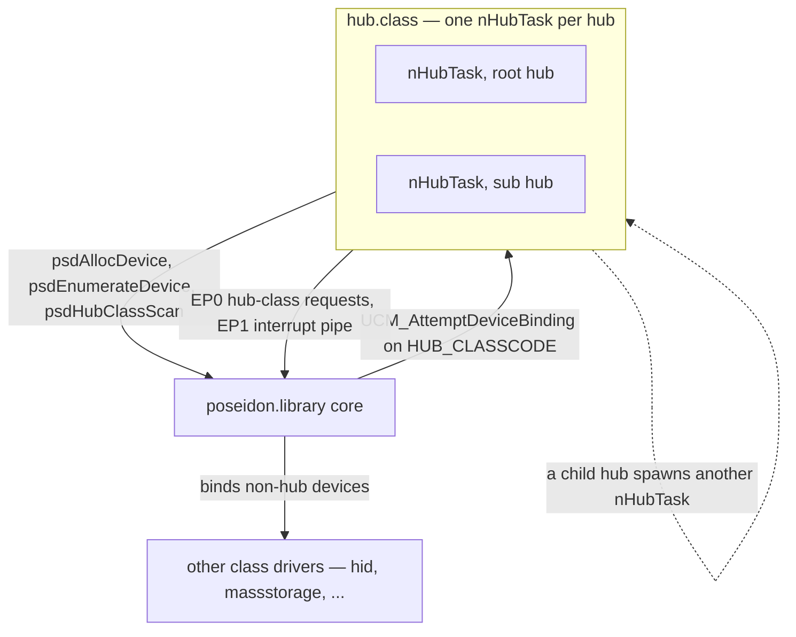
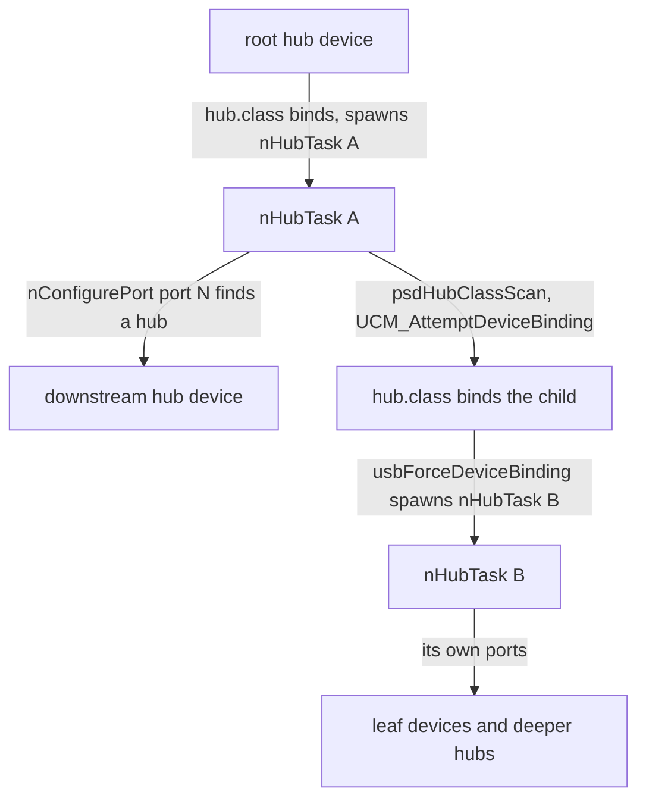
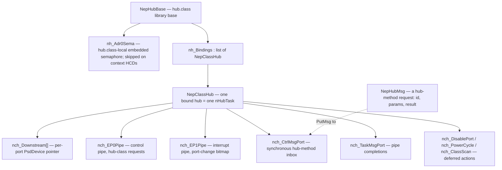
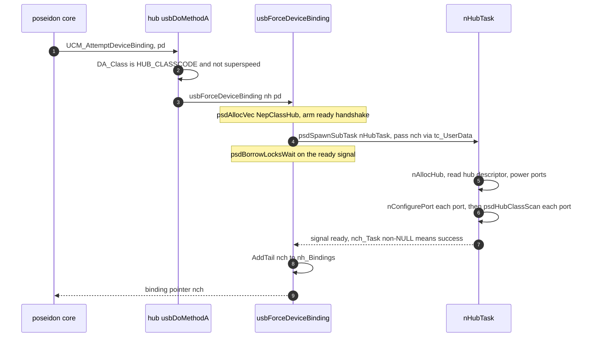
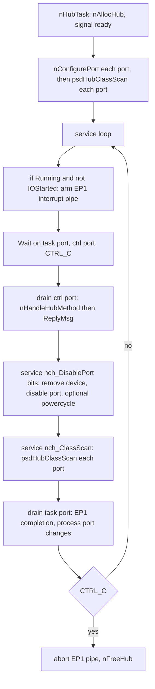
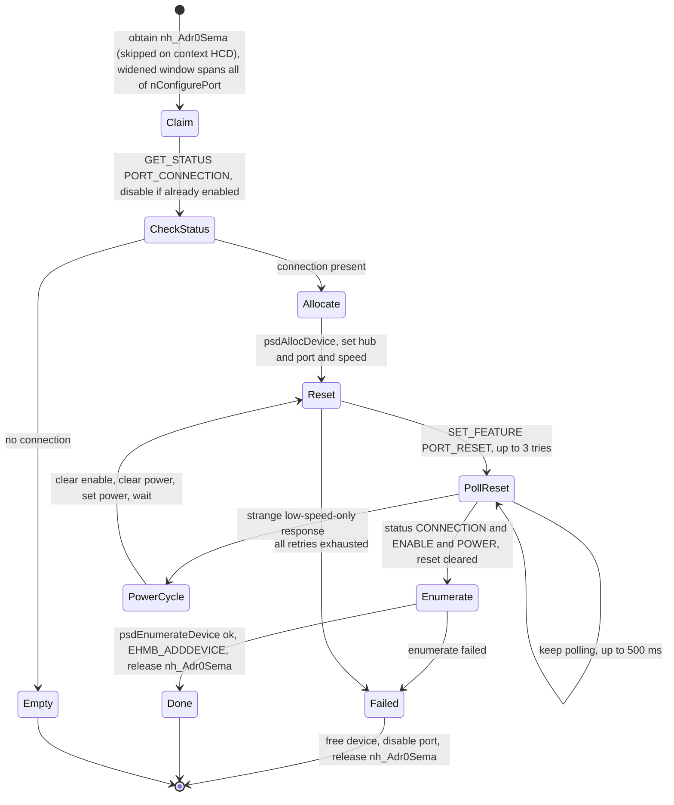
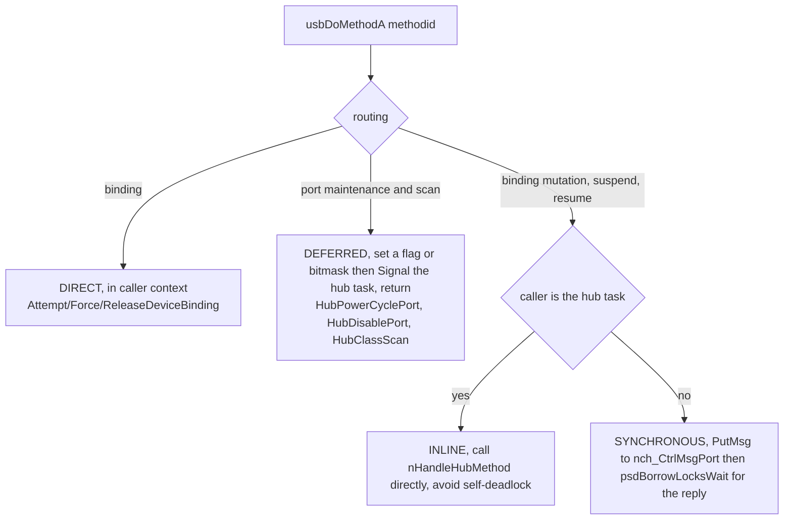
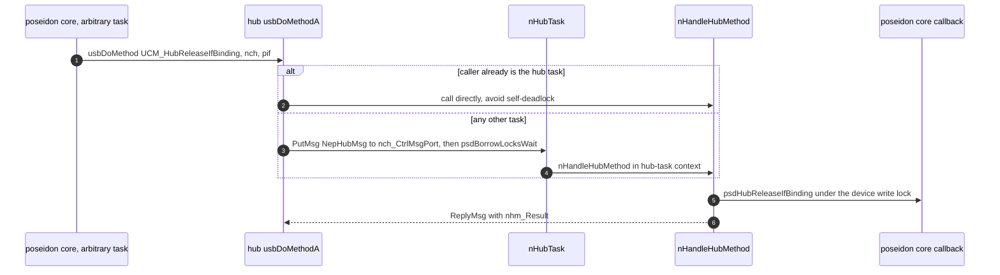

# hub.class — Architecture (reverse-engineered)

> Scope: the **`hub.class`** USB hub driver — the single *mandatory* class in the stack, and the
> component that recursively builds the entire USB device tree. It is a *consumer* of
> `poseidon.library` (see [poseidon.library-architecture.md](poseidon.library-architecture.md));
> this doc is the hub-internal view of the connect/disconnect flow summarised in the core doc §12,
> and the other half of the hub-task method detour in core doc §7.4.
>
> Sources: `classes/hub/hub.class.c` (~1.7k lines), `classes/hub/hub.h`, `classes/hub/hub.class.h`,
> the shared class skeleton `classes/class_main.c`, and `include/devices/usb_hub.h` (hub-class
> descriptors, port-status bits, feature selectors). Line numbers are indicative.

---

## Table of contents

1. [What this driver is](#1-what-this-driver-is)
2. [Role in the stack](#2-role-in-the-stack)
3. [Object model](#3-object-model)
4. [Binding lifecycle](#4-binding-lifecycle)
5. [The hub task and per-hub state](#5-the-hub-task-and-per-hub-state)
6. [Port configuration — the reset and speed FSM](#6-port-configuration--the-reset-and-speed-fsm)
7. [Hot-plug via the interrupt pipe](#7-hot-plug-via-the-interrupt-pipe)
   — 7.1 [USB-3 hub-half pairing via Container ID](#71-usb-3-hub-half-pairing-via-container-id)
8. [The method protocol — three routing strategies](#8-the-method-protocol--three-routing-strategies)
9. [Suspend and resume](#9-suspend-and-resume)
10. [Hub-level conditions — power, over-current, TT](#10-hub-level-conditions--power-over-current-tt)
11. [Teardown and tree recursion](#11-teardown-and-tree-recursion)
12. [State machines](#12-state-machines)
13. [Notable quirks and refactoring hazards](#13-notable-quirks-and-refactoring-hazards)
14. [Appendix — maps and indexes](#14-appendix--maps-and-indexes)

---

## 1. What this driver is

`hub.class` is the USB hub driver. It is special among class drivers in two ways:

1. **It is mandatory.** Without it the stack can enumerate only the root hub's immediate
   children — nothing downstream exists. It is the engine that turns the flat
   `phw_Devices` list into a topology (core doc §3/§6).
2. **It is recursive and self-replicating.** Each bound hub runs its own subtask (`nHubTask`);
   when a downstream device is itself a hub, `hub.class` binds it and spawns *another* `nHubTask`.
   The USB tree is therefore discovered by a tree of hub tasks, one per hub, expanding leaf-ward.

It binds at the **device** level (`UCM_AttemptDeviceBinding` on `HUB_CLASSCODE`), not the
interface level — a hub *is* the whole device.

It is primarily the **USB 2.0 / 1.1** hub driver, but note how the split with `hubss.class` actually
works: `usbAttemptDeviceBinding` here checks **only** `DA_Class == HUB_CLASSCODE` — there is no
SuperSpeed rejection. The partition comes from the *other* class: `hubss.class` has the
`DA_IsSuperspeed` gate and a higher scan priority (`UCCA_Priority` 1 vs 0), so it is offered every
hub first and takes the SuperSpeed ones. `hub.class` is the **catch-all**, and it will bind a
SuperSpeed hub whenever `hubss.class` declines one — which it does on any non-context HCD. That is
not a corner case: it is why this class carries its own SS-half handling (`nch_IsSSHalf`, §7.1).

It is also the component the core's public binding-management API routes *through*: every
`psdReleaseDevBinding`/`psdReleaseIfBinding`/`psdClaimAppBinding`/suspend/resume ultimately runs
inside the owning hub's task (§8). So `hub.class` is both the tree-builder and the serialization
point for per-device binding mutations.

---

## 2. Role in the stack

The hub class talks **only** to `poseidon.library` (it has no upper edge of its own — unlike
`usbaudio.class`, it provides nothing to a higher subsystem). It uses the core's pipe API for two
channels per hub: the **EP0 control pipe** (hub-class requests: `GET_DESCRIPTOR`, port
`SET/CLEAR_FEATURE`, `GET_STATUS`) and the **EP1 interrupt pipe** (the port-change bitmap). It
calls `psdAllocDevice`/`psdEnumerateDevice` to create downstream devices and `psdHubClassScan`/
`psdClassScan` to get them bound by other classes.

---

## 3. Object model

* **`NepHubBase`** — the library base. Holds the `nh_Bindings` list of all bound hubs and
  **`nh_Adr0Sema`**, `hub.class`'s own class-wide embedded `SignalSemaphore` (`InitSemaphore`d once
  in `libInit`) that serialises address-0 enumeration — only one device may sit at USB address 0 at
  a time across all this class's hubs and controllers (§6). This lock is **`hub.class`-local**: it
  is not owned by `poseidon.library` and it is **not** shared with `hubss.class` — SuperSpeed hubs
  are context-only and have no software default-address phase, so they don't serialise address 0 at
  all. On a **context-backend HCD** (detected via `HA_ContextBackend`) `hub.class` **skips** the
  semaphore too, because `CREATE_DEVICE` is atomic in the driver; only the legacy USB-2 path takes
  it.
* **`NepClassHub`** — one bound hub. The important fields:
  * `nch_Downstream[]` — array of `PsdDevice *`, one slot per port. **This is the source of
    truth** for "is there a device on port N" (NULL = empty).
  * `nch_EP0Pipe` / `nch_EP1Pipe` — the control and interrupt pipes.
  * `nch_TaskMsgPort` — pipe completion port; `nch_CtrlMsgPort` — the inbox for synchronous
    hub-method messages (§8).
  * `nch_DisablePort` / `nch_PowerCycle` (per-port bitmasks) and `nch_ClassScan` (flag) —
    deferred actions set by the dispatcher and serviced in the task loop.
  * `nch_NumPorts`, `nch_HubAttr`, `nch_PwrGoodTime`, `nch_HubCurrent`, `nch_Removable`,
    `nch_IsUSB20`, `nch_IsRootHub`, `nch_Running`/`nch_IOStarted` (interrupt-pipe gating),
    `nch_PortChanges[4]` (the interrupt bitmap buffer).
  * `nch_CtxHardware` — set from the `HA_ContextBackend` attr; TRUE on a context-backend HCD. It
    gates **exactly one thing**: the address-0 semaphore (§6). Nothing else in the class branches
    on it — reset, speed decode, power, TT and the interrupt pipe are identical on both backends.
  * `nch_IsSSHalf` / `nch_ContainerId` — which half of a physical USB-3 hub this is, and its
    16-byte BOS Container ID (library-owned pointer, NULL = pairing disabled). See §7.1.
  * up-links and handshake fields: `nch_Node`, `nch_HubBase`, `nch_Base`, `nch_Hardware`,
    `nch_Device`, `nch_Config`, `nch_Interface`, `nch_EP1`; `nch_Task`, `nch_ReadySigTask`,
    `nch_ReadySignal` (the spawn handshake, §4).
* **`NepHubMsg`** — a request envelope (`nhm_MethodID`, `nhm_Params`, `nhm_Result`) `PutMsg`'d to
  `nch_CtrlMsgPort` to run a hub method inside the hub's task.

There is **no per-port state enum**: per-port state is `nch_Downstream[port]` (present/empty) plus
the live `UPSF_*` status bits read on demand. The "state machine" is the `nConfigurePort` loop.

---

## 4. Binding lifecycle

The class implements the `usbclass` ABI via the shared skeleton; `usbDoMethodA` (`:246`) is the
dispatcher (§8). Device binding:

* `usbAttemptDeviceBinding` (`:55`) accepts only `DA_Class == HUB_CLASSCODE` (and, under the
  USB-3.0 build, non-SuperSpeed). `usbForceDeviceBinding` (`:87`) allocates the `NepClassHub`,
  spawns `nHubTask`, and blocks in `psdBorrowLocksWait` until the task signals ready — success is
  read from `nch_Task != NULL`. This is the standard Poseidon make-the-async-bind-synchronous
  pattern (the **borrow-lock** is what lets the spawning task wait without deadlocking against the
  task it's waiting on — core doc §10).
* `usbReleaseDeviceBinding` (`:140`) signals the hub task `SIGBREAKF_CTRL_C` and waits (again via
  `psdBorrowLocksWait`) until `nch_Task` clears, then removes and frees the binding.
* `usbGetAttrsA` (`:179`): `UCCA_Priority = 0`, description "Root/external hub base class",
  `UCCA_SupportsSuspend = TRUE`. (See §13 on why the scan priority is 0 yet the romtag priority is
  high.)

---

## 5. The hub task and per-hub state

`nHubTask` (`:372`) is the heart. After `nAllocHub` it does an initial pass — `nConfigurePort`
every port, then `psdHubClassScan` every discovered device — and then enters its service loop.

`nAllocHub` (`:744`) builds the hub: it picks the hub interface (preferring the **multi-TT**
alternate, protocol 2, falling back to any), finds the interrupt-IN endpoint (EP1), creates the
two message ports, allocates the EP0 + EP1 pipes (EP0 armed with a 1000 ms NAK timeout), reads the
hub descriptor (`GET_DESCRIPTOR(UDT_HUB)` → `nch_NumPorts`/`nch_HubAttr`/`nch_PwrGoodTime`/
`nch_HubCurrent`/`nch_Removable`/think-time), reads hub status (self-powered / over-current →
`CA_SelfPowered` + `psdCalculatePower`), allocates `nch_Downstream[]`, powers every port
(`SET_FEATURE(PORT_POWER)`), waits `nch_PwrGoodTime + 15` ms, and publishes `nch_Task`.

`nAllocHub` does **not** touch the address-0 semaphore (that lives entirely in `nConfigurePort` and
the hot-plug `GET_STATUS`, §6/§7); it only reads `HA_ContextBackend` into `nch_CtxHardware`. It also
selects the alternate with `psdSetAltInterface` and arms the EP1 pipe with
`PPA_AllowRuntPackets, TRUE`.

It publishes the hub facts the context backend needs for its `UPDATE_HUB` op — `DA_HubNumPorts`,
`DA_IsMultiTT` and `DA_HubThinkTime` — in **one** `psdSetAttrs`, because it is `DA_HubNumPorts`
arriving that makes the library fire the op. Note `DA_IsMultiTT` is read back from the **selected**
interface (`IFA_Protocol == 2`), not inferred from which selection branch was taken — the
class-only fallback can also land on a protocol-2 interface.

Finally it reads `DA_Protocol` / `DA_IsSuperspeed` / `DA_ContainerId` to establish the hub-half role
for pairing (§7.1).

The service loop multiplexes four things on one `Wait`:

* **Control messages** (`nch_CtrlMsgPort`) → `nHandleHubMethod` → `ReplyMsg` (§8).
* **Deferred port actions** (`nch_DisablePort` / `nch_PowerCycle`) → remove the device, `CLEAR
  PORT_ENABLE`, and (if power-cycling) delay 250 ms, re-`nConfigurePort`, re-`psdHubClassScan`.
* **Deferred class scan** (`nch_ClassScan`) → `psdHubClassScan` every downstream device.
* **Pipe completions** (`nch_TaskMsgPort`) — chiefly the EP1 interrupt pipe returning a
  port-change bitmap (§7).

**The loop does not `Wait` when work is already queued.** If `nch_DisablePort || nch_ClassScan` it
samples signals non-destructively — `sigs = SetSignal(0, 0) & SIGBREAKF_CTRL_C` — and falls
straight through. This is required, not an optimisation: the `Signal` that accompanied the flag may
have been consumed by a `psdDoPipe` wait inside a concurrent `nConfigurePort` (a twin-evict request
arriving mid-enumeration, §7.1), so the *flag* has to drive the loop, never the signal.

The initial port pass is also not quite "every port": it skips any port the SuperSpeed peer half
already owns (§7.1).

---

## 6. Port configuration — the reset and speed FSM

`nConfigurePort` (`:1132`) is the imperative core of enumeration: it turns "something is plugged
into port N" into an enumerated `PsdDevice`. On a legacy HCD it holds `hub.class`'s own
`nh_Adr0Sema` across the *whole* of `nConfigurePort` — the window was widened to span the initial
`GET_STATUS`/port-disable as well as reset + enumeration (part of the dev-0 mis-parenting fix, §7);
the hotplug change-discovery `GET_STATUS` (§7) also takes it, so this is no longer the sole holder.
On a **context-backend HCD** the semaphore is skipped entirely, because `CREATE_DEVICE` is atomic in
the driver.

Step detail:

1. `GET_STATUS(PORT_CONNECTION)`. If the port is already enabled, disable it first. If nothing is
   connected, return NULL.
2. Under `Forbid()`, `psdAllocDevice(nch_Hardware)` then `psdLockWriteDevice`. Set `DA_HubDevice`
   (= this hub), `DA_IsConnected`, `DA_AtHubPortNumber`, and low-speed if the pre-reset status
   says so.
3. **Claim `hub.class`'s `nh_Adr0Sema`** — on a legacy HCD the window is widened to span the *whole*
   of `nConfigurePort` (opened before the step-1 `GET_STATUS`/port-disable, held across reset +
   enumeration) so only one device sits at address 0. On a **context-backend HCD** this is skipped —
   `CREATE_DEVICE` is atomic in the driver.
4. **Reset loop** (≤3 tries): `SET_FEATURE(PORT_RESET)`; root hubs add a 50 ms settle; then poll
   `GET_STATUS` until the status reads `CONNECTION | ENABLE | POWER` with `RESET` cleared. The poll
   counter accumulates **milliseconds, not iterations** (`for(delayretries = 0; delayretries < 500;
   delayretries += delaytime)`), so: the budget is 500 ms per attempt, the interval starts at 10 ms
   and stretches to 300 ms once ~20 ms has elapsed (i.e. after about three polls), and each
   subsequent reset attempt restarts at a 200 ms interval. The loop also bails immediately if
   `PORT_CONNECTION` drops — the device was unplugged mid-reset.
5. **Speed + split detection** from the post-reset status: high-speed → `DA_IsHighspeed`;
   otherwise low-speed → `DA_IsLowspeed`, and inherit `DA_NeedsSplitTrans` from the hub — **forced
   TRUE if this is a USB-2.0 hub** carrying a low/full-speed device (split transactions).
   Two subtleties: low speed is **re-decoded after reset** (some hubs — the Apple Keyboard's
   built-in one is the cited case — only report speed correctly once reset completes), and the
   high-speed determination is a **sticky latch** across reset retries, so a device seen at high
   speed is never downgraded by a later attempt. The re-decoded low-speed flag is what picks the
   settle delay in step 6.
6. `nClearPortStatus`, settle delay (1000 ms low-speed, else 100 ms), then `psdAllocPipe` +
   **`psdEnumerateDevice`** (core doc §6). On success: free the pipe, unlock, `EHMB_ADDDEVICE`,
   release `nh_Adr0Sema`, return the device.
7. A "strange port response" (low-speed-only with no enable) triggers a **real electrical
   power-cycle** of the port (`CLEAR ENABLE` → `CLEAR POWER` → `SET POWER` → wait power-good) and
   retries. On total failure: unlock, `psdFreeDevice`, `CLEAR PORT_ENABLE` (don't leave a crazy
   device on the bus), release `nh_Adr0Sema`.

`nClearPortStatus` (`:1071`) acknowledges the port's change bits by
`CLEAR_FEATURE(C_PORT_CONNECTION / C_PORT_ENABLE / C_PORT_SUSPEND / C_PORT_OVER_CURRENT /
C_PORT_RESET)`.

---

## 7. Hot-plug via the interrupt pipe

A hub reports change via its interrupt endpoint: EP1 returns a **bitmap** in `nch_PortChanges[]`
(bit 0 = hub-global change, bit N = port N change). The task arms the pipe with `psdSendPipe`
whenever `nch_Running && !nch_IOStarted`; the HCD completes it when something changes.

On completion the task:

* If `psdGetPipeError == UHIOERR_TIMEOUT` → **the hub itself is gone**: mark its device
  `DA_IsConnected = FALSE`, force `nch_PortChanges = 0xff…` and raise `CTRL_C` to fall through to
  teardown (`nFreeHub` then frees all children).
* **Bit 0** → `GET_STATUS` the hub: over-current → unpower *all* ports; local-power-lost/restored
  → flip `CA_SelfPowered` + `psdCalculatePower`.
* **Each set port bit** → `GET_STATUS` that port + `nClearPortStatus`, then react to the changes.
  On a legacy HCD this change-discovery `GET_STATUS` is taken inside the widened `nh_Adr0Sema`
  window (part of the dev-0 mis-parenting fix — §6); context HCDs skip the semaphore. The changes:
  * over-current → unpower the port;
  * suspend change → three arms, not one: (i) the port is **no longer** suspended *and*
    `DA_IsSuspended` was previously TRUE (an `oldsusp` read guards this) → remote resume:
    `EHMB_DEVRESUMED` + `psdResumeBindings`; (ii) the port **is** suspended → log it; (iii) no
    device on the port → "Bogus suspend/resume change";
  * connection change → **device gone**: `DA_IsConnected = FALSE`, `psdFreeDevice`,
    `EHMB_REMDEVICE`, clear the slot; **new device**: 100 ms debounce, then (on a USB-2 half) the
    shadow debounce of §7.1, then `nConfigurePort` and `psdClassScan`.

This is the live half of the connect/disconnect flow in core doc §12; the steps marked `[H]` there
are exactly this loop.

### 7.1 USB-3 hub-half pairing via Container ID

A physical USB-3 hub is **two logical hubs**: a SuperSpeed half and a USB-2 half, sharing one set of
physical connectors and one Vbus rail, with identical port numbering. A dual-mode device in
connector *n* therefore appears on port *n* of **both** halves, and without coordination the stack
enumerates it twice.

The halves are matched by the **BOS Container ID** — a 16-byte UUID both halves report, which is
exactly what it exists for. `nAllocHub` records `nch_ContainerId` (the library-owned pointer) and
`nch_IsSSHalf = (DA_Protocol == 3) || DA_IsSuperspeed`; protocol 3 is tested *in addition to* the
speed flag so the half is still recognised through an HCD 3.0→2.0 translator. **An all-zero
Container ID sets the pointer to NULL and disables pairing for that hub** — counterfeit hubs report
zeros, and pairing every zero-ID hub with every other would be worse than not pairing at all.

`hub.class` implements **both** halves' behaviour, because it can be bound to either (§1):

| Function | Half | Role |
|---|---|---|
| `nFindPeerHub` | both | Under `psdLockReadPBase`, walks `psdGetNextDevice` for a hub that is connected, alive, bound, has a Container ID matching this one's, and holds the **opposite** half role. **VID/PID are deliberately not compared** — the halves legitimately differ (the VIA VL817 reports 2109:2817 vs 2109:0817). Callers must hold the PBase read lock. |
| `nNotifyPeerTwinEvict` | SS only | Called from `nConfigurePort`'s success path, after `EHMB_ADDDEVICE` and after releasing `nh_Adr0Sema`. Cross-dispatches `usbDoMethod(UCM_HubDisablePort, peer, port)` into the **peer's own class** (which may be `hub.class` or `hubss.class`), using the peer's `DA_BindingClass` → `UCA_ClassBase`. Sent **unconditionally**, not only when a twin is visible, because the twin may still be mid-enumeration — the persistent `nch_DisablePort` bit closes that race. It **never touches `PORT_POWER`**: Vbus is one shared rail per connector, so unpowering via the 2.0 half could brown out the SS link. |
| `nPortShadowedByPeer` | USB-2 only | Is the same-numbered port on the SS peer already taken? Deliberately does **not** check `DA_IsConnected`, so a child that is merely *mid-enumeration* counts — `nConfigurePort` sets `DA_HubDevice`/`DA_AtHubPortNumber` before it issues `PORT_RESET`. |
| `nConnectShadowDebounce` | USB-2 only | Three-way: already shadowed → TRUE with no delay; **no peer hub at all → FALSE with no delay** (an unpaired 2.0 hub pays zero latency); otherwise `psdDelayMS(500)` and re-check. SS devices present a transient D+ pull-up until link training succeeds, so the SS half needs time to win the connector. |

**The SS half wins.** A SuperSpeed-capable device should run at SuperSpeed, so the SS half
enumerates and then evicts its USB-2 twin; the USB-2 half defensively skips ports the SS half
already owns. The 2.0 half applies `nPortShadowedByPeer` at three points — the initial port scan,
the deferred power-cycle re-configure, and (via `nConnectShadowDebounce`) the hot-plug connect path,
where a shadowed connect costs the usual 100 ms settle plus the 500 ms debounce before being
dropped.

**Receiving an eviction.** `UCM_HubDisablePort` is addressed **by `PsdDevice`** — the dispatcher
searches `nh_Bindings` for the binding whose `nch_Device` matches — which is precisely what lets the
peer evict without knowing the target's binding struct (§8). It sets only `nch_DisablePort`, *not*
`nch_PowerCycle`, so the service loop frees the device, fires `EHMB_REMDEVICE`, clears the slot and
issues `CLEAR_FEATURE(PORT_ENABLE)` — with no re-`nConfigurePort`. The twin stays gone.

This is the one place `hub.class` calls *out* of `poseidon.library` into another class, which is
why the file includes `<inline/usbclass.h>` (the clib prototype can't be used — it is 2-arg, while
the class's own `usbDoMethodA` is 3-arg) and why the build gained a `usbclass_headers` dependency.

---

## 8. The method protocol — three routing strategies

`usbDoMethodA` (`:246`) is where the core's `UCM_*` calls land. The architecturally distinctive
thing about the hub is that it routes different methods **three different ways**, because some can
run in the caller's context and some *must* run in the hub task (to hold the device write lock and
to touch the hub's own pipes without races):

1. **Direct** — `UCM_AttemptDeviceBinding` / `ForceDeviceBinding` / `ReleaseDeviceBinding`: run
   immediately in the caller's task (they spawn/kill the hub task, they don't need to *be* it).
2. **Deferred** — `UCM_HubPowerCyclePort` / `UCM_HubDisablePort` (set a `nch_DisablePort` /
   `nch_PowerCycle` bit) and `UCM_HubClassScan` (set `nch_ClassScan`): just flag the work and
   `Signal` the hub task, return TRUE. The service loop performs it later. Fire-and-forget.
3. **Synchronous via the control port** — `UCM_AttemptSuspendDevice` / `AttemptResumeDevice`,
   `UCM_HubClaimAppBinding`, `UCM_HubReleaseIfBinding` / `HubReleaseDevBinding`,
   `UCM_HubSuspendDevice` / `HubResumeDevice`: these must run *in the hub task* and the caller
   needs the result. So:

The **self-deadlock guard** (`if(nch_Task == FindTask(NULL))`) is essential: a hub method can be
triggered from inside the hub task itself (e.g. during a class scan), and sending a message to your
own port and waiting for the reply would hang forever — so in that case it calls `nHandleHubMethod`
inline.

`nHandleHubMethod` (`:1374`) is the actual implementation, always running in hub-task context. It
**calls back into the core**: `UCM_HubClaimAppBinding` → `psdHubClaimAppBindingA`,
`UCM_HubReleaseIfBinding` → `psdHubReleaseIfBinding`, `UCM_HubReleaseDevBinding` →
`psdHubReleaseDevBinding`. (`UCM_AttemptSuspendDevice`/`Resume` and `UCM_HubSuspend/ResumeDevice`
are §9.) This is the mechanism behind core doc §7.4: the core's public `psdRelease*Binding` detour
through here so the binding mutation happens under the right lock in the right task.

---

## 9. Suspend and resume

Two levels:

* **Whole-hub** (`UCM_AttemptSuspendDevice` / `AttemptResumeDevice`, handled in
  `nHandleHubMethod`): suspend tries `psdSuspendDevice` on *every* downstream device; only if all
  succeed does it abort the EP1 pipe and clear `nch_Running` (the hub goes quiet). **Resume does
  not re-arm EP1 itself** — it only sets `nch_Running = TRUE` and `psdResumeDevice`s every child.
  The service loop is the sole owner of the EP1 submission (§5) and re-arms it on the next pass,
  once the aborted transfer has drained (`nch_IOStarted` clears on completion; the `IOERR_ABORTED`
  reply is ignored). Resubmitting from the resume method as well is precisely the bug that
  submitted the same status-change interrupt twice.
* **Single-device port suspend** (`UCM_HubSuspendDevice` / `HubResumeDevice` → `nHubSuspendDevice`
  `:1444` / `nHubResumeDevice` `:1483`): `SET_FEATURE` / `CLEAR_FEATURE(PORT_SUSPEND)` on that
  device's port, set `DA_IsSuspended`, and fire `EHMB_DEVSUSPENDED` / `EHMB_DEVRESUMED`. This is
  the concrete realization of per-device suspend that the core's `UHSF_*` HCD state machine leaves
  unimplemented (core doc §14): there is no controller-level device suspend — it is done at the
  hub port.

Remote-wakeup resume is also detected passively in the interrupt loop (§7): a `PORT_SUSPEND`
change with the bit cleared means the device woke itself, so the hub clears `DA_IsSuspended` and
runs `psdResumeBindings`.

---

## 10. Hub-level conditions — power, over-current, TT

`hub.class` carries the USB-specific hub housekeeping the rest of the stack doesn't model:

* **Power budget.** `nch_PwrGoodTime` (from the descriptor) gates how long to wait after powering
  ports. Self-powered vs bus-powered is reflected into the device's config (`CA_SelfPowered`) and
  fed to `psdCalculatePower` so the core's power model (core doc §13.3) is accurate; a
  `LOCAL_POWER_LOST` change flips it live.
* **Over-current.** A hub-global over-current unpowers *all* ports; a per-port one unpowers that
  port. Both clear the corresponding change feature. Note the **bind-time** check in `nAllocHub` is
  advisory only: it logs *"Hub over-current situation detected! Resolve this first!"* but the line
  that would abort the binding is commented out, so the hub binds regardless.
* **Transaction translators (TT).** `nAllocHub` prefers the **multi-TT** hub interface
  (protocol 2) when present; `DA_HubThinkTime` is set from the descriptor's think-time field; and
  a low/full-speed device behind a USB-2.0 hub is forced to `DA_NeedsSplitTrans` so the core fills
  the split-transaction fields when it builds pipes (core doc §5.5).
* **Removable bitmask** (`nch_Removable`) is parsed but informational.
* **Device quirk:** Genesys Logic (`vendid 0x05E3`) high-speed hubs get a logged warning about
  USB-2.0 device failures.

---

## 11. Teardown and tree recursion

`nFreeHub` (`:997`), reached when the hub task exits (release, or hub-gone), walks **every port**:
for each present device it marks it disconnected (only if the hub itself is already gone),
`psdFreeDevice`s it, fires `EHMB_REMDEVICE`, and clears the slot; if the hub is still connected it
also `CLEAR_FEATURE(PORT_POWER)` on each port. Then it frees the pipes and `nch_Downstream`, drains
and replies any pending control messages, deletes the ports, and clears `nch_Task` (unblocking the
releaser).

Because a child hub is itself a device with its own binding and task, **removing a hub unwinds
leaf-first**: releasing the parent's binding releases the children's bindings, whose tasks exit and
free *their* children first. There is no explicit recursive descent — the task tree does it.

---

## 12. State machines

| Machine | Kind | State carrier |
|---|---|---|
| Port configuration | **explicit-ish** (the `nConfigurePort` retry loop) | local vars + live `UPSF_*` bits |
| Per-port presence | Implicit | `nch_Downstream[port]` (NULL vs device) |
| Hub run state | Implicit | `nch_Running` / `nch_IOStarted` (interrupt-pipe gating) |
| Method routing | n/a (a dispatch, not a state) | `usbDoMethodA` switch |

The only thing resembling a real FSM is `nConfigurePort`'s reset/poll/power-cycle loop (§6). The
rest is event-driven reaction to USB status/change bits, with all sequencing in local variables —
the same implicit style as the core (core doc §14). The deferred-action bitmasks
(`nch_DisablePort`/`nch_PowerCycle`/`nch_ClassScan`) are a tiny work-queue, not a state.

---

## 13. Notable quirks and refactoring hazards

* **The control-message detour + self-deadlock guard** is the single most important and most
  fragile mechanism here. Any code path that can call a `UCM_Hub*` method from inside the hub task
  must keep the `nch_Task == FindTask(NULL)` inline branch, or it self-deadlocks. A refactor that
  "simplifies" the dispatch by always messaging will hang.
* **The address-0 lock is `hub.class`-local and legacy-only.** `nh_Adr0Sema` is `hub.class`'s own
  embedded class-wide semaphore (the stack-wide library-owned one was retired); it enforces one
  device at a time at address 0 across this class's hubs and controllers — a USB-1/2 assumption. It
  is **not** shared with `hubss.class`: SuperSpeed hubs are context-only and have no software
  default-address phase, so they don't serialise address 0 at all. On a **context-backend HCD**
  `hub.class` skips it too, because `CREATE_DEVICE` is atomic in the driver and per-slot addressing
  needs no cross-hub serialisation. Only the legacy USB-2 path still takes it; there a stuck reset
  holds it and stalls every other `hub.class` enumeration. (Same point as core doc §15.)
* **Two priorities, easily confused.** The CMake `PRI 47` is the **romtag/resident** priority
  (the library initialises early at boot); the **class-scan** priority returned by `usbGetAttrsA`
  is `UCCA_Priority = 0`. The hub doesn't need a high scan priority because it binds at the
  *device* level on `HUB_CLASSCODE` devices that no interface class competes for — so the two are
  independent, despite the CMake comment phrasing it as "binds first."
* **`nch_Downstream[port]` is the single source of truth** for presence; the connect/disconnect
  logic keys entirely off "slot NULL vs non-NULL" plus the change bits. Keep that invariant.
* **Hub-gone detection is `UHIOERR_TIMEOUT` on the interrupt pipe**, which forces an all-ports
  teardown. The core's HCD contract must keep returning that error promptly (the stack notes this
  as a non-regress item).
* **Over-current and self-power changes mutate the global power model** via `psdCalculatePower` —
  hub events have stack-wide side effects, not just local ones.
* **SuperSpeed hubs are *not* out of scope.** There is no SuperSpeed check in
  `usbAttemptDeviceBinding`; this class is the catch-all and binds an SS half whenever
  `hubss.class` declines one (§1). Don't "tidy up" by adding a speed rejection — it would break
  SS hubs on legacy HCDs and orphan the `nch_IsSSHalf` pairing path. (There are no
  `#ifdef AROS_USB30_CODE` / `UDT_SSHUB` remnants in this file; the USB-3 awareness here is the
  live pairing code.)
* **Don't resubmit the EP1 pipe from the resume method** (§9). One submitter, at the top of the
  service loop. This was a real bug.
* **Don't make the service loop always `Wait`** (§5). When `nch_DisablePort`/`nch_ClassScan` is
  set it must fall through via `SetSignal(0,0)`, because the accompanying `Signal` can be eaten by
  a pipe wait inside a concurrent enumeration. Making the loop uniformly `Wait` would strand
  twin-evict requests until the next unrelated event.
* **NULL-guard every `DA_ProductName`.** It is NULL for un-enumerated or string-descriptor-less
  devices, and `psdAddErrorMsg` formats it through `RawDoFmt`. This class does it at all 12 sites
  (`hubunknown` for hub names, `devunknown` for downstream ones); keep the convention when adding
  a log line.
* **The `PsdDevice` for a removed child is freed via `psdFreeDevice`** but, per the core's deferred
  -free rules (core doc §13.6), the struct may linger if a driver still holds a pipe — the hub
  doesn't (and shouldn't) wait for that.

---

## 14. Appendix — maps and indexes

### 14.1 Function index

**20 functions.**

* **Library:** `libInit` (init `nh_Bindings` + `InitSemaphore` the class-local `nh_Adr0Sema`),
  `libExpunge`.
* **Binding (usbclass ABI):** `usbDoMethodA`, `usbGetAttrsA`, `usbSetAttrsA`,
  `usbAttemptDeviceBinding`, `usbForceDeviceBinding`, `usbReleaseDeviceBinding`.
* **USB-3 hub-half pairing (§7.1):** `nFindPeerHub`, `nNotifyPeerTwinEvict`, `nPortShadowedByPeer`,
  `nConnectShadowDebounce`.
* **Per-hub task:** `nHubTask`, `nAllocHub`, `nFreeHub`.
* **Port mechanics:** `nConfigurePort`, `nClearPortStatus`.
* **Hub methods (core callbacks):** `nHandleHubMethod`, `nHubSuspendDevice`, `nHubResumeDevice`.

`hubss.class` has the same list plus `nReadPortStatus` and `nWarmResetPort`, with `nHubssTask`
replacing `nHubTask` — 22 in total.

### 14.2 Key structures (in `hub.h`)

| Struct | Role |
|---|---|
| `NepHubBase` | library base; `nh_Bindings`, `nh_Adr0Sema` (class-local embedded address-0 semaphore), plus `nh_Library`, `nh_SegList`, `nh_Flags`, `nh_UtilityBase` |
| `NepClassHub` | one bound hub = one `nHubTask`; 32 members — ports, pipes, control port, deferred-action flags, `nch_Downstream[]`, `nch_CtxHardware` (from `HA_ContextBackend`), `nch_IsSSHalf` / `nch_ContainerId` (pairing, §7.1) |
| `NepHubMsg` | a hub-method request envelope sent to `nch_CtrlMsgPort` |

### 14.3 Core APIs consumed

`psdAllocDevice` / `psdEnumerateDevice` / `psdFreeDevice` (device lifecycle),
`psdHubClassScan` / `psdClassScan` (get children bound), `psdAllocPipe` / `psdPipeSetup` /
`psdDoPipe` / `psdSendPipe` / `psdAbortPipe` (EP0 hub-class requests + EP1 interrupt pipe),
`psdSetAttrs` / `psdGetAttrs` (device attributes incl. `DA_HubDevice` / `DA_AtHubPortNumber` /
`DA_NeedsSplitTrans` / `DA_IsSuspended`, and the `DA_HubNumPorts` / `DA_IsMultiTT` /
`DA_HubThinkTime` UPDATE_HUB facts), `HA_ContextBackend` (detect a context-backend HCD, to gate the
address-0 skip), the context `UPDATE_HUB`
op (fired by the library when the hub facts arrive), `psdHubClaimAppBindingA` /
`psdHubReleaseIfBinding` / `psdHubReleaseDevBinding` (the hub-task binding mutations),
`psdSuspendDevice` / `psdResumeDevice` / `psdResumeBindings`, `psdCalculatePower`, `psdSendEvent`,
`psdSpawnSubTask`, `psdBorrowLocksWait`, `psdFindInterface` / `psdFindEndpoint` /
`psdSetAltInterface`, `psdWaitPipe` / `psdGetPipeError`.

For hub-half pairing (§7.1): `psdGetNextDevice`, `psdLockReadPBase` / `psdUnlockPBase`, the
attributes `DA_ContainerId` / `DA_IsSuperspeed` / `DA_Protocol` / `DA_IsDead` / `DA_Binding` /
`DA_BindingClass`, `UCA_ClassBase` (`PGA_USBCLASS`) — and the cross-class
`usbDoMethod(UCM_HubDisablePort, …)`, the only call this class makes *out* of `poseidon.library`.

### 14.4 USB hub-class requests used (`usb_hub.h`)

`GET_DESCRIPTOR(UDT_HUB)`, `GET_STATUS` (hub + port), and `SET_FEATURE` / `CLEAR_FEATURE` on
`PORT_POWER`, `PORT_RESET`, `PORT_ENABLE`, `PORT_SUSPEND`, and the `C_PORT_*` / `C_HUB_*` change
selectors.
</content>
