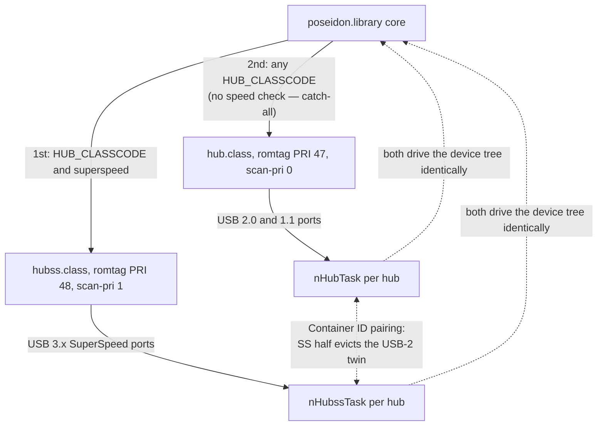
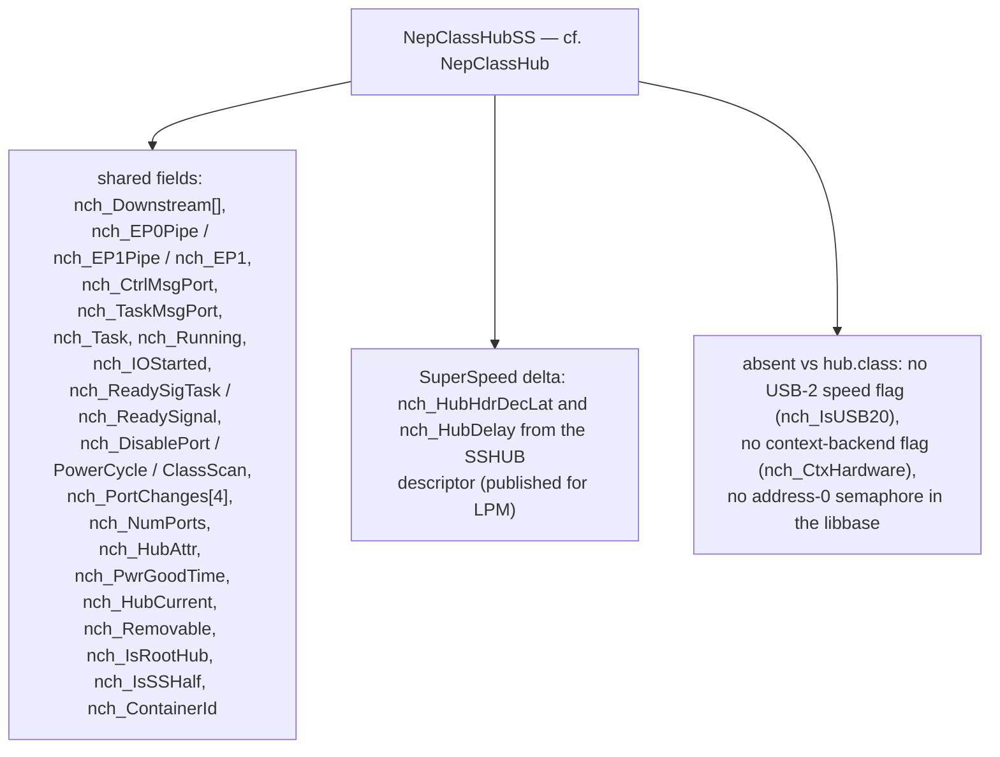
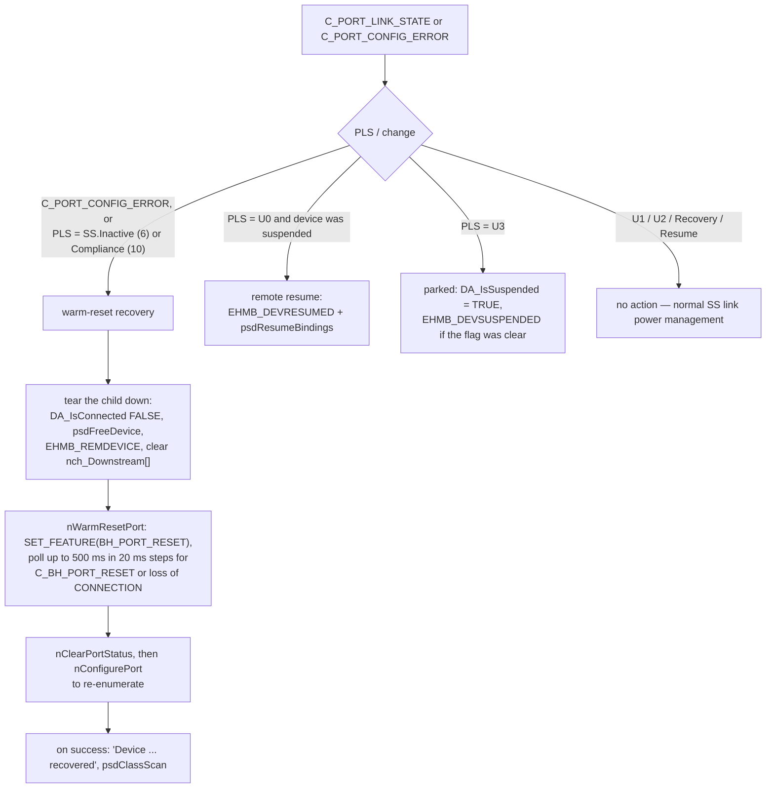
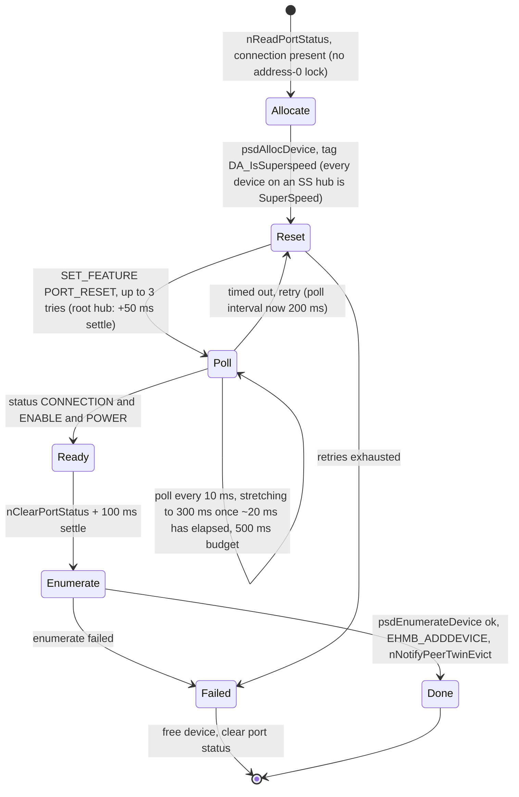
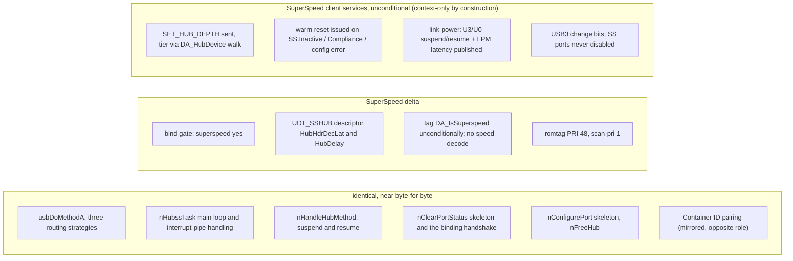

# hubss.class — Architecture (reverse-engineered)

> Scope: the **`hubss.class`** USB 3.0 SuperSpeed hub driver. It is the SuperSpeed sibling of
> [`hub.class`](hub.class-architecture.md) — it began as an AROS-native rewrite of it and still
> shares much of its structure, though the two have since diverged (§8). It is **context-only by
> construction** (§1). This doc leans on the [hub.class doc](hub.class-architecture.md) for the
> still-shared mechanics and concentrates on the SuperSpeed delta and a side-by-side comparison (§8).
>
> Sources: `classes/hubss/hubss.class.c` (~1.7k lines), `classes/hubss/hubss.class.h`,
> `include/devices/usb_hub.h`. Line numbers are indicative.

---

## Table of contents

1. [What this driver is](#1-what-this-driver-is)
2. [Role in the stack](#2-role-in-the-stack)
3. [Object model](#3-object-model)
4. [What it shares with hub.class](#4-what-it-shares-with-hubclass)
5. [The SuperSpeed delta](#5-the-superspeed-delta)
6. [USB3 hub-half pairing via Container ID](#6-usb3-hub-half-pairing-via-container-id)
7. [Port configuration on SuperSpeed](#7-port-configuration-on-superspeed)
8. [Comparison with hub.class](#8-comparison-with-hubclass)
9. [Notable quirks and refactoring hazards](#9-notable-quirks-and-refactoring-hazards)
10. [Appendix — maps and indexes](#10-appendix--maps-and-indexes)

---

## 1. What this driver is

`hubss.class` is the driver for **USB 3.x SuperSpeed hubs**. The stack splits hub duty by speed:
`hub.class` owns USB 2.0 / 1.1 hubs, `hubss.class` owns SuperSpeed hubs. They are otherwise the
same kind of component — the mandatory, recursive **tree-builder** (one task per hub; child hubs
spawn their own task) that turns the core's flat device list into a topology and routes the core's
binding-management calls through the owning hub task.

`hubss.class` is **context-only by construction.** A SuperSpeed device only ever enumerates on a
context-ABI HCD: when `xhci.device` ran the legacy ABI it emulated a USB **2.0** hub, so SuperSpeed
hubs were bound by `hub.class`, never by `hubss.class`. `hubss.class` has therefore **never** run on
a legacy/snooping HCD. It enforces that at init: `nAllocHub` queries `HA_ContextBackend` and, if the
HCD is not a context backend, logs a `RETURN_FAIL` error (*"hubss.class requires a context-ABI HCD;
ignoring SuperSpeed hub"*) and **declines the binding** — fail-fast. There are no legacy/USB-2
fallback paths in this class; the SuperSpeed services below are simply what the class does.

`hubss.class` originated as an AROS-native rewrite of `hub.class` and still shares much of its
structure — most functions have the same names and control flow, and some bodies are byte-for-byte
identical (e.g. `usbDoMethodA`). But the two have since **diverged**: `hubss.class` shed the legacy
USB-2 machinery (the speed ladder, split-transaction inheritance) and the address-0 lock, while
`hub.class` keeps the full dual-backend USB-2 path (§8). The SuperSpeed-aware code is **complete**:
the class provides the client-side SuperSpeed services (SET_HUB_DEPTH, USB3 port-status/change
semantics, warm reset, link-power suspend/resume, LPM latency publication) that were previously done
covertly by the driver's now-deleted `ss_hub_emulation`.

---

## 2. Role in the stack

Both classes bind at the **device** level on `HUB_CLASSCODE`. What steers a hub to one or the other
is `hubss.class`'s `DA_IsSuperspeed` gate (the attribute is set by the parent during enumeration
from the reset speed / BOS capabilities) *combined with* its higher scan priority: `hubss.class` is
offered every hub first and takes the SuperSpeed ones; `hub.class` has no speed check and picks up
whatever is left — including a SuperSpeed hub that `hubss.class` declined.
`hubss.class` consumes the same core APIs as `hub.class`
(`psdAllocDevice`/`psdEnumerateDevice`, `psdHubClassScan`, the EP0 control + EP1 interrupt pipes,
`psdHubClaimAppBindingA`/`psdHubReleaseIfBinding`/`psdHubReleaseDevBinding`, suspend/resume). Unlike
`hub.class` it does **not** participate in address-0 serialization: it has no software
default-address phase (the driver's `CREATE_DEVICE` is atomic), so it holds no address-0 lock.

The one place the two classes talk to each other is **hub-half pairing** (§6): a physical USB3 hub
presents as two logical hubs, and the SS half cross-dispatches into the USB-2 half's class to evict
a duplicate.

---

## 3. Object model

`NepHubSSBase` / `NepClassHubSS` / `NepHubSSMsg` mirror hub's `NepHubBase` / `NepClassHub` /
`NepHubMsg`, with a SuperSpeed delta and one omission:

So a `NepClassHubSS` is a `NepClassHub` **minus** the legacy USB-2 machinery **plus** the two
SuperSpeed-hub-descriptor fields `nch_HubHdrDecLat`/`nch_HubDelay`. Those two are **published** (as
`DA_HubHdrDecLat`/`DA_HubDelay`) for the library's LPM math, not merely captured.

Three shared fields matter more than their names suggest:

* **`nch_IsRootHub`** gates `SET_HUB_DEPTH` (a root hub needs none) and the mandatory 50 ms
  post-reset delay in `nConfigurePort`.
* **`nch_IsSSHalf` / `nch_ContainerId`** drive hub-half pairing (§6). Both also exist in
  `hub.class` — they are *not* a hubss delta.
* `nch_Removable` is a `UWORD` here (the SS hub descriptor's `DeviceRemovable` is 16-bit) versus
  `ULONG` in `hub.class` — the one type divergence in an otherwise parallel struct.

---

## 4. What it shares with hub.class

These behave exactly as documented in the [hub.class doc](hub.class-architecture.md); refer there
for detail rather than repeating it:

* **Binding lifecycle** (§4 there) — `usbForceDeviceBinding` allocates the binding, spawns the
  hub task (`nHubssTask`), and blocks in `psdBorrowLocksWait` for the ready signal;
  `usbReleaseDeviceBinding` signals `CTRL_C` and waits for `nch_Task` to clear. Identical.
* **The hub task** (§5 there) — `nHubssTask` does the same initial `nConfigurePort`-each-port +
  `psdHubClassScan`-each-port pass, then the same service loop multiplexing control messages,
  deferred port actions (`nch_DisablePort`/`nch_PowerCycle`), deferred class scan
  (`nch_ClassScan`), and EP1 interrupt-pipe completions.
* **The method protocol** (§8 there) — `usbDoMethodA` is **byte-for-byte identical** (modulo type
  names): the same three routing strategies (direct bind; deferred flag+signal for
  PowerCycle/DisablePort/ClassScan; the synchronous `nch_CtrlMsgPort` detour with the
  `nch_Task == FindTask(NULL)` self-deadlock guard). `nHandleHubMethod` calls back into the same
  core functions (`psdHubClaimAppBindingA`, `psdHubReleaseIfBinding`, `psdHubReleaseDevBinding`).
* **Hot-plug via the interrupt pipe** (§7 there) — the same hub-gone-on-`UHIOERR_TIMEOUT`,
  over-current, remote-resume, and connect/disconnect handling, **including the synthesis rule**:
  once the hub's `DA_IsConnected` is clear both classes skip the per-port `GET_PORT_STATUS` (it could
  only return a manufactured timeout) and synthesize `wPortStatus = 0,
  wPortChange = C_PORT_CONNECTION` — nothing wider. The USB3 link-state events layered on top are
  hubss-only (§5.2).
* **Teardown** (`nFreeHub`, §11 there) — the same.

Two shared invariants are easy to break and worth stating here, because both were bugs once:

* **The EP1 status-change pipe is submitted from exactly one place** — the top of the service loop,
  `if(nch_Running && !nch_IOStarted) { psdSendPipe(...); nch_IOStarted = TRUE; }`, cleared only on
  completion. `UCM_AttemptSuspendDevice` only aborts the pipe and clears `nch_Running`;
  `UCM_AttemptResumeDevice` only *sets* `nch_Running` and lets the loop resubmit once the aborted
  request has drained. Resubmitting inside the resume method — as both classes used to — submits
  the same status-change interrupt twice.
* **The service loop does not sleep when work is already queued.** If `nch_DisablePort ||
  nch_ClassScan` it does `SetSignal(0,0) & SIGBREAKF_CTRL_C` instead of `Wait(sigmask)`, because
  the wake-up `Signal` may have been consumed by a pipe wait inside a concurrent enumeration. This
  is what makes cross-class twin eviction (§6) race-free.

**Address-0 serialization is *not* shared:** `hubss.class` holds no address-0 lock at all (it has no
software default-address phase — the driver's `CREATE_DEVICE` is atomic), so there is nothing here
matching hub.class's `nConfigurePort` semaphore window.

---

## 5. The SuperSpeed delta

The SuperSpeed-specific surface, in full:

1. **Binding speed gate** (`usbAttemptDeviceBinding`). Binds `HUB_CLASSCODE` **with**
   `DA_IsSuperspeed` set. Note the asymmetry: `hub.class` has **no** speed check at all — it accepts
   any `HUB_CLASSCODE` device. The partition therefore comes from *this* class's gate plus its
   higher scan priority (item 2), with `hub.class` as the catch-all.
2. **Priorities.** Romtag `PRI 48` (vs hub's 47) and `UCCA_Priority = 1` (vs hub's 0). These
   priorities are **load-bearing**, not cosmetic: `hubss.class` is offered the device first and
   takes it if it is SuperSpeed; `hub.class` only ever sees an SS hub if `hubss.class` declined it.
   That happens on a non-context HCD (§1), which is exactly why `hub.class` carries its own
   SS-half handling — see §6.
3. **SuperSpeed hub descriptor** (`nAllocHub`). Reads `GET_DESCRIPTOR(UDT_SSHUB)` into a
   `struct UsbSSHubDesc` (instead of `UDT_HUB` / `UsbHubDesc`), validates `buf[1] == UDT_SSHUB`,
   and reads the SuperSpeed-only fields `bHubHdrDecLat` → `nch_HubHdrDecLat` and `wHubDelay` →
   `nch_HubDelay` (byte-swap fixed), plus the 16-bit `DeviceRemovable`. It then **publishes**
   `DA_HubNumPorts` plus the two latency fields as `DA_HubHdrDecLat`/`DA_HubDelay` — setting
   `DA_HubNumPorts` is what triggers the library's `UPDATE_HUB` op on a context backend, carrying
   all three to the driver's LPM math (§5.1).
4. **SuperSpeed device tagging** (`nConfigurePort`). Every device on a SuperSpeed hub is
   SuperSpeed, so it sets `DA_IsSuperspeed` unconditionally on the new device (so the child is
   itself routed to `hubss.class` if it is a hub, and enumerated as SuperSpeed) — this is derived
   from the hub binding, **not** from any port-status speed field. `UPSF_SS_PORT_SPEED` is never
   read.
5. **Style.** `usbGetAttrsA` uses a `NextTagItem` loop rather than hub's `FindTagItem` chain, and
   the file uses `__func__` in debug prints — cosmetic AROS-rewrite differences.

### 5.1 SuperSpeed client services

`hubss.class` performs the client-side SuperSpeed hub services itself — the work the driver's
now-deleted `ss_hub_emulation` used to do covertly. Because the class is context-only (§1) these are
**unconditional**: they are simply what `hubss.class` does, with no legacy fallback to gate them
against.

* **`SET_HUB_DEPTH` — sent.** For a non-root hub (`nch_IsRootHub` false) it sends `SET_HUB_DEPTH`
  so the hub can interpret the 20-bit route string in packet headers. The tier is computed by
  walking the `DA_HubDevice` parent chain, **not counting the root hub**. Failure is `RETURN_WARN`
  and non-fatal.
* **Port status — native USB3, no translation.** `nReadPortStatus()` is a thin
  `GET_PORT_STATUS` + endian-swap helper that dedupes the four call sites. It performs **no** format
  normalization: every hub this class binds already speaks the USB 3 wire format (power at bit 9,
  link state at bits 8:5, a zero speed field). It also performs **no speed decode** — see item 4
  above.
* **Change-clear semantics.** `nClearPortStatus` clears the USB3 change bits best-effort —
  connection, `C_PORT_LINK_STATE`, `C_PORT_CONFIG_ERROR`, `C_BH_PORT_RESET`, over-current and reset
  — returning the first error rather than aborting on it, so a sticky change bit can't retrigger
  events forever. `C_PORT_ENABLE` / `C_PORT_SUSPEND` (USB-2) are not in the set.
* **Warm reset — issued.** See §5.2.
* **Link-power suspend/resume.** The suspend/resume methods drive `PORT_LINK_STATE` to U3 / U0
  respectively, rather than `SET/CLEAR_FEATURE(PORT_SUSPEND)`.
* **SS ports are never disabled.** The `UCM_HubDisablePort` deferred action frees the device but
  issues no `CLEAR_FEATURE(PORT_ENABLE)` — SuperSpeed ports cannot be disabled that way, so the
  request is a no-op on the wire.
* **LPM latency publication.** As above (item 3).

These use the USB3 selectors in `<devices/usb_hub.h>` (`SET_HUB_DEPTH`, `PORT_LINK_STATE`,
`BH_PORT_RESET`, `C_PORT_LINK_STATE`, `C_BH_PORT_RESET`, `C_PORT_CONFIG_ERROR`, and the U0/U3
link-state values).

### 5.2 Link-state events and warm reset

The port-change handler in `nHubssTask` decodes the USB3 link state (PLS, `wPortStatus &
UPSF_SS_PORT_LINK_STATE >> UPSS_SS_PORT_LINK_STATE`) whenever `C_PORT_LINK_STATE` or
`C_PORT_CONFIG_ERROR` is set, and branches four ways:

**Warm reset is a link-recovery path, not a reset retry.** A warm reset is the only way to clear an
SS.Inactive or Compliance link, and it returns the device to the Default state — which is why the
handler must free the old device first and re-enumerate afterwards, rather than calling
`nWarmResetPort` from inside `nConfigurePort`'s reset loop. `nConfigurePort` is the *consumer* of a
warm reset, never its caller; its own loop issues only plain `UFS_PORT_RESET`.

**The warm-reset arm is reachable only from a real link event, or from a real `PPA_NakTimeoutTime`
(1 s) transfer failure on a hub that is still connected — never from hub-gone.** It used to be: the
hub-gone path synthesized `wPortChange = 0xffff`, which carries `C_PORT_CONFIG_ERROR`, and this arm
is evaluated before the connection arm, so *every* port on an unplugged hub took warm-reset recovery.
That cost `nWarmResetPort` (1 pipe) + `nClearPortStatus` (6 pipes) + `nConfigurePort` (1 pipe) ≈
450 ms and about five misleading errors per port — *"Link error (state 0) on port N,
warm-resetting"*, *"BH_PORT_RESET for port N failed"*, two *"CLEAR_PORT_FEATURE … failed"* and
*"GET_PORT_STATUS failed"* — on every USB3 hub unplug, for what is simply a disconnect. Don't
reinstate the wide synthesis (hub doc §7, §13).

---

## 6. USB3 hub-half pairing via Container ID

A physical USB3 hub is **two logical hubs** on the wire: a SuperSpeed half and a USB-2 half, sharing
one set of physical connectors and one Vbus rail. A dual-mode device plugged into connector *n*
therefore appears on port *n* of **both** halves, and without coordination the stack enumerates it
twice.

The two halves are matched by the **BOS Container ID** — a 16-byte UUID both halves report, which
is exactly what it exists for. Four functions implement this, mirrored in `hub.class`:

| Function | Role |
|---|---|
| `nFindPeerHub()` | Walks the device list for a hub whose `DA_ContainerId` matches this one's, is connected, alive and bound, and holds the **opposite** half role (`peerisss != nch_IsSSHalf`). VID/PID are deliberately *not* compared — only the Container ID. |
| `nNotifyPeerTwinEvict()` | SS-half only. After a child enumerates, cross-dispatches `usbDoMethod(UCM_HubDisablePort, peer, port)` into the peer hub's class to evict the USB-2 twin on the same connector. |
| `nPortShadowedByPeer()` | USB-2-half-only helper: is the same-numbered port on the SS peer already occupied? |
| `nConnectShadowDebounce()` | USB-2-half-only helper: 500 ms debounce before deciding a port is unshadowed. |

**The SS half wins.** A SuperSpeed-capable device should run at SuperSpeed, so the SS half enumerates
and then evicts its USB-2 twin. The two shadow helpers are the mirror-image case (the USB-2 half
declining to enumerate when the SS peer already has the port) and, in `hubss.class`, are inert —
`nch_IsSSHalf` is always TRUE here, so they self-gate to FALSE. They exist for clone parity with
`hub.class`, where they do the work; the full two-sided description, including what happens on the
receiving end of an eviction, is in [hub.class-architecture.md](hub.class-architecture.md) §7.1.

Setup happens in `nAllocHub`: `nch_IsSSHalf = (proto == 3) || issuperspeed` and `nch_ContainerId`
from the device. **An all-zero Container ID disables pairing** for that hub — counterfeit hubs
report zeros, and pairing every zero-ID hub with every other would be worse than not pairing at all.

Eviction is dispatched from four call sites: the initial port scan, the power-cycle path, the
hot-plug connect path, and `nConfigurePort` on success. Note the interaction with §4's
non-sleeping service loop: an eviction arriving mid-`nConfigurePort` is what that `SetSignal`
branch exists to survive.

---

## 7. Port configuration on SuperSpeed

`nConfigurePort` is the same reset/poll/power-cycle loop as hub.class, with the SuperSpeed tagging
branch added and the USB-2 speed ladder removed:

The notable thing is what is **absent**. There is no speed branch: `DA_IsSuperspeed` is set
unconditionally from the binding, and the USB-2 speed-code ladder (`UPSF_PORT_HIGH_SPEED` /
`UPSF_PORT_LOW_SPEED` / `DA_NeedsSplitTrans` inheritance) is gone entirely — the port-status speed
field is never read. There is no address-0 lock (§4). Reset is plain `UFS_PORT_RESET`; warm reset is
driven by link-state events, not from this loop (§5.2).

---

## 8. Comparison with hub.class

The two classes share a lot of structure — `hubss.class` began as `hub.class` with the type names
changed — but they have **diverged**: `hubss.class` dropped the legacy USB-2 machinery and the
address-0 lock (it is context-only), while `hub.class` keeps the full dual-backend USB-2 path. They
are kept as **separate sources on purpose** (§9), not as a pending merge.

| Aspect | `hub.class` | `hubss.class` |
|---|---|---|
| Bound devices | any `HUB_CLASSCODE` — **no speed check**; the catch-all | `HUB_CLASSCODE` **and** `DA_IsSuperspeed` |
| Romtag priority | 47 | 48 |
| `UCCA_Priority` (scan) | 0 | 1 — offered first, so it wins SS hubs |
| Libbase / binding struct | `NepHubBase` / `NepClassHub` | `NepHubSSBase` / `NepClassHubSS` |
| Hub descriptor | `UDT_HUB` (`UsbHubDesc`) | `UDT_SSHUB` (`UsbSSHubDesc`) + `bHubHdrDecLat`, `wHubDelay` |
| USB-2 speed flag | `nch_IsUSB20` | none (context-only, no USB-2 path) |
| Context-backend flag | `nch_CtxHardware` | none — context-only, checked once at bind and refused otherwise |
| Hub interface select | prefers **multi-TT** alt (protocol 2) | any `HUB_CLASSCODE` interface (no TT on SS) |
| Device speed | decoded from port status (low/high, split-transaction inheritance) | **not decoded** — `DA_IsSuperspeed` set unconditionally from the binding |
| Port reset | `UFS_PORT_RESET` | `UFS_PORT_RESET`, plus **`BH_PORT_RESET`** warm reset on link failure |
| Port disable | `CLEAR_FEATURE(PORT_ENABLE)` | no-op — SS ports cannot be disabled |
| `SET_HUB_DEPTH` | n/a (USB2) | **sent** (non-root; tier via `DA_HubDevice` walk) |
| Link power (U0–U3) | n/a | **U3/U0** suspend/resume via `PORT_LINK_STATE`, link-state events handled, LPM latency published |
| Container ID pairing | USB-2 half: **shadow/debounce** (declines a port the SS peer holds) | SS half: **evicts** the USB-2 twin after enumerating |
| `usbDoMethodA` dispatch | three routing strategies | **identical** |
| `nHandleHubMethod` + suspend/resume | per §9 of hub doc | **identical** |
| Hot-plug / interrupt-pipe loop | per §7 of hub doc | identical **plus** the USB3 link-state branches |
| Address-0 lock | class-local `nh_Adr0Sema` (embedded, legacy USB-2 path) | **none** — no default-address phase, doesn't serialize address 0 |
| `devname` NULL guard | `if (!devname) devname = devunknown;` at every use | **absent** |
| GUI | none | none |

On address-0: `hubss.class` **does not serialize address 0 at all.** It has no software
default-address phase — the driver's `CREATE_DEVICE` is atomic, so device identity is the HCD's
opaque handle and there is never a "device at address 0" window to protect. The address-0 lock lives
entirely in `hub.class` now (its own embedded class-wide `nh_Adr0Sema`), guarding the legacy USB-2
enumeration path; SuperSpeed hubs simply have no part in it.

---

## 9. Notable quirks and refactoring hazards

* **Shared structure with `hub.class`, kept separate on purpose.** The two classes share a lot of
  code — binding handshake, task loop, three-strategy dispatch, hot-plug, suspend/resume, teardown,
  Container ID pairing — because `hubss.class` began as a rewrite of `hub.class`. They are **not**
  unified into one source, and this is deliberate: stripping the legacy USB-2 machinery and the
  address-0 lock out of `hubss.class` (context-only) made it diverge from `hub.class` (which keeps
  the full dual-backend USB-2 path), so the earlier "just merge the near-duplicates" argument no
  longer holds. A shared mechanism that changes must still be updated in both files — a known
  maintenance cost, accepted in exchange for each class staying simple in its own lane. The
  resume-resubmit bug and the pairing logic are both examples that had to land twice.
* **`hubss.class` does not serialize address 0.** It has no software default-address phase (the
  driver's `CREATE_DEVICE` is atomic), so it holds no address-0 lock. The address-0 lock is
  `hub.class`-local (its own embedded class-wide `nh_Adr0Sema`) and guards only the legacy USB-2
  enumeration path — see §8.
* **The self-deadlock guard** in `usbDoMethodA` (`nch_Task == FindTask(NULL)` → inline
  `nHandleHubMethod`) is as essential here as in `hub.class`; it is duplicated verbatim. Keep it.
  Cross-class twin eviction (§6) dispatches into the *peer's* class, so the guard is what keeps a
  hub from deadlocking on itself if the peer lookup ever resolves to the caller.
* **Don't resubmit the EP1 pipe from the resume method** (§4). One submitter, at the top of the
  service loop. This was a real bug in both classes.
* **Don't narrow the warm-reset path to a reset retry.** A warm reset returns the device to Default
  state, so the caller *must* free the old device and re-enumerate. Calling `nWarmResetPort` from
  inside `nConfigurePort`'s retry loop would leave the stack's device object pointing at a device
  that no longer has an address.
* **An all-zero Container ID disables pairing** (§6), on purpose — counterfeit hubs report zeros
  and would otherwise all pair with each other.
* **SS latency fields are wired up.** `nch_HubHdrDecLat` / `nch_HubDelay` are published
  (`DA_HubHdrDecLat`/`DA_HubDelay`) and feed the library's LPM math — not scaffolding. Note that
  setting `DA_HubNumPorts` is what actually triggers the `UPDATE_HUB` op that carries them.

---

## 10. Appendix — maps and indexes

### 10.1 Function index

**22 functions.** Shared with `hub.class` (same names, `nHubssTask` the only rename, vs `nHubTask`):

`libInit` / `libExpunge`; `usbAttemptDeviceBinding` / `usbForceDeviceBinding` /
`usbReleaseDeviceBinding`; `usbDoMethodA` / `usbGetAttrsA` / `usbSetAttrsA`; **`nHubssTask`**;
`nAllocHub` / `nFreeHub`; `nConfigurePort` / `nClearPortStatus`; `nHandleHubMethod` /
`nHubSuspendDevice` / `nHubResumeDevice`; and the four Container ID pairing functions
`nFindPeerHub` / `nNotifyPeerTwinEvict` / `nPortShadowedByPeer` / `nConnectShadowDebounce` (§6).

**hubss-only (2):** `nReadPortStatus` (GET_PORT_STATUS + endian swap, §5.1) and `nWarmResetPort`
(`BH_PORT_RESET` + completion poll, §5.2). `hub.class` has 20 functions — this list minus those two.

### 10.2 Key structures (in `hubss.class.h`)

| Struct | hub.class equivalent | Delta |
|---|---|---|
| `NepHubSSBase` | `NepHubBase` | **minus** the address-0 semaphore; otherwise name only |
| `NepClassHubSS` | `NepClassHub` | **minus** the USB-2 speed flag (`nch_IsUSB20`) and the context-backend flag (`nch_CtxHardware`); **plus** `nch_HubHdrDecLat`, `nch_HubDelay`; `nch_Removable` is `UWORD` not `ULONG` |
| `NepHubSSMsg` | `NepHubMsg` | name only |

`nch_IsSSHalf`, `nch_ContainerId` and `nch_IsRootHub` are present in **both** classes — shared
fields, not a delta (§3).

### 10.3 SuperSpeed-relevant constants

`UDT_SSHUB` (SuperSpeed hub descriptor type), `UsbSSHubDesc` (`bHubHdrDecLat`, `wHubDelay`,
16-bit `DeviceRemovable`), and the native USB3 `wPortStatus` layout `UPSF_SS_*` (link state at
bits 8:5 via `UPSF_SS_PORT_LINK_STATE`/`UPSS_SS_PORT_LINK_STATE`, power at bit 9, speed field at
bits 12:10 — **read by neither class**).

USB3 selectors in `<devices/usb_hub.h>` used by the SS client services (§5.1, §5.2):
`UHR_SET_HUB_DEPTH` (hub request, 0x0c); features `PORT_LINK_STATE` (driven to the U0/U3 link-state
values for suspend/resume) and `UFS_BH_PORT_RESET` (warm reset); change selectors
`C_PORT_LINK_STATE`, `C_BH_PORT_RESET` and `C_PORT_CONFIG_ERROR`. Link-state values used in
decisions: `UPLS_U0` (0), `UPLS_U3` (3), `UPLS_SS_INACTIVE` (6), `UPLS_COMPLIANCE` (10).

Standard hub requests/features (`GET_DESCRIPTOR`, `GET_STATUS`, `SET/CLEAR_FEATURE` on `PORT_POWER`
/ `PORT_RESET` and the `C_PORT_*` change selectors) are shared with `hub.class`; `PORT_ENABLE` and
`PORT_SUSPEND` are not used here.

### 10.4 See also

[hub.class-architecture.md](hub.class-architecture.md) for the full description of every shared
mechanism, and [poseidon.library-architecture.md](poseidon.library-architecture.md) §5–§7, §12 for
the core pipe/RT, binding, and connect/disconnect contracts both hub classes rely on.
