# massstorage.class — Architecture (reverse-engineered)

> Scope: the **`massstorage.class`** USB Mass-Storage driver — the largest class in the stack
> (~9.4k lines across six C files, plus a ~2.1k-line vendored mounter). It is a *consumer* of
> `poseidon.library` ([core doc](poseidon.library-architecture.md)) on its lower edge and a
> *provider* to **AmigaDOS** on its upper edge, exposing USB storage as an embedded
> `usbscsi.device` and auto-mounting partitions as DOS volumes.
>
> Sources: `classes/massstorage/massstorage.class.c` (~5.8k lines), `massstorage.h`,
> `massstorage.class.h`, `dev.c`/`dev.h` (the `usbscsi.device` glue), the three transports
> `massstorage_bulk.c` / `massstorage_cbi.c` / `massstorage_uas.c`, the removable-media poller
> `massstorage_removable.c`, and the vendored A4091 mounter in `mounter/`. Function names are the
> anchors throughout — this document carries no line references.

---

## Table of contents

1. [What this driver is](#1-what-this-driver-is)
2. [Layering](#2-layering)
3. [The dual-library structure](#3-the-dual-library-structure)
4. [Object model](#4-object-model)
5. [Binding and the per-LUN model](#5-binding-and-the-per-lun-model)
6. [Task and serialization model](#6-task-and-serialization-model)
7. [The AmigaDOS device edge — usbscsi.device](#7-the-amigados-device-edge--usbscsidevice)
8. [The SCSI layer — nScsiDirect](#8-the-scsi-layer--nscsidirect)
9. [The three USB transports](#9-the-three-usb-transports)
10. [Removable media and auto-mount](#10-removable-media-and-auto-mount)
11. [Partition parsing and mounting](#11-partition-parsing-and-mounting)
12. [Config and GUI](#12-config-and-gui)
13. [End-to-end flows](#13-end-to-end-flows)
14. [State machines](#14-state-machines)
15. [Notable quirks and refactoring hazards](#15-notable-quirks-and-refactoring-hazards)
16. [Appendix — maps and indexes](#16-appendix--maps-and-indexes)

---

## 1. What this driver is

`massstorage.class` turns USB storage devices into AmigaDOS volumes. It is the most multi-faceted
component in the stack, with five distinct subsystems in one binary:

1. A **Poseidon class driver** (`NepMSBase`) that binds USB mass-storage *interfaces*.
2. An **embedded `usbscsi.device`** (`NepMSDevBase`) — a real Exec device exposing one unit per
   USB **LUN** to AmigaDOS as a trackdisk/SCSI device.
3. **Three USB transports** — Bulk-Only (BBB), Control/Bulk/Interrupt (CBI/CB), and USB Attached
   SCSI (UAS) — under a uniform `SCSICmd` interface.
4. A **removable-media poller** that drives the vendored **A4091 mounter**
   (RDB/MBR/GPT/superfloppy/CD) to auto-mount volumes.
5. A **MUI config GUI** with a large per-device quirk panel.

It also carries a substantial **quirk system** (the `PFF_*` patch flags) to cope with the
notoriously non-conformant world of cheap USB storage firmware, set three ways: hard-wired
vendor/product tables, GUI toggles, and runtime auto-fallback.

---

## 2. Layering

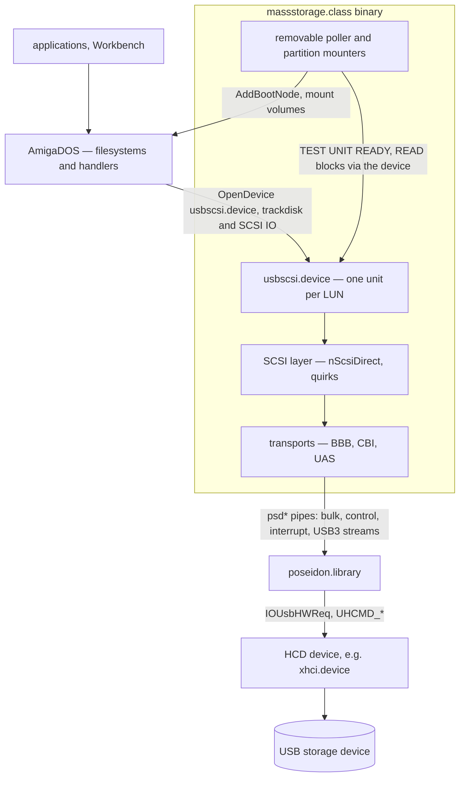

The class sits between two worlds and speaks a different protocol to each:

* **Down to `poseidon.library`** — the `psd*` pipe API (bulk/control/interrupt transfers, and
  USB3 streams for UAS). It implements the `usbclass` ABI the core calls.
* **Up to AmigaDOS** — it *is* `usbscsi.device` (a trackdisk/SCSI device), and it drives
  `expansion.library`/`dos.library` to mount partitions. Filesystems and handlers (fat95, RDB
  filesystems, cdrom-fs) sit above it like they would above any disk device.

**On DMA:** the class hands `psd*` ordinary pointers and never inspects a buffer. On PiStorm the
HCD (`xhci.device`) bounce-buffers anything it cannot DMA to directly, so correctness is never the
class's problem — but a bounce costs a full-payload copy per transfer, which is why the mounter
steers DOS's own buffer cache into the driver's direct-DMA path (§11).

---

## 3. The dual-library structure

Like `usbaudio.class`, this is **two Exec libraries in one binary** — but here the second one is a
*device*, not a library:

| Library | Base struct | Name | Role |
|---|---|---|---|
| Poseidon class | `NepMSBase` | `massstorage.class` | implements the `usbclass` ABI + GUI |
| Embedded device | `NepMSDevBase` | `usbscsi.device` | trackdisk/SCSI device exposing LUNs to AmigaDOS |

`libInit` builds the device via
`MakeLibrary(DevFuncTable, NULL, devInit, sizeof(NepMSDevBase), NULL)`, sets `np_ClsBase = nh`,
**`AddDevice`**s it into the system device list, and pins its open count so it can't expunge while
the class is resident. The name is not a `MakeLibrary` argument — `devInit` sets
`ln_Name = "usbscsi.device"`. `DevFuncTable` is the standard device vector set
`devOpen/devClose/devExpunge/devReserved/devBeginIO/devAbortIO`. Any program (or DOS) can then
`OpenDevice("usbscsi.device", unit, …)` and reach a USB LUN. Teardown is driven by the class's
`libExpunge`, which `RemDevice`s it.

This is the same trick `usbaudio.class` uses for its AHI sub-driver — a co-resident Exec entity
sharing the class's address space.

---

## 4. Object model

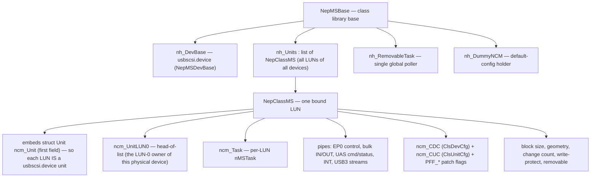

The defining structural fact: **`NepClassMS` embeds `struct Unit ncm_Unit` as its first field**, so
a `NepClassMS *` and a `usbscsi.device` `Unit *` are the same pointer. **One USB LUN = one
`NepClassMS` = one device unit.** All LUNs of one physical device share a `ncm_UnitLUN0` head
pointer (the LUN-0 instance owns the cross-LUN transfer lock). The unit's `unit_MsgPort` doubles as
the per-LUN list node *and* the command port the LUN's task waits on.

* **`NepMSBase`** — the class base: `nh_DevBase` (the device), `nh_Units` (every LUN), the single
  `nh_RemovableTask` + `nh_TaskLock` + the spawn handshake (`nh_ReadySigTask`/`nh_ReadySignal`),
  `nh_DummyNCM` (the class-default config), the lazily-opened `expansion`/`dos`/`psd` bases, the
  3-second poll timer, and `nh_RestartIt` (the DOS-appeared relaunch flag).
* **`NepClassMS`** — per LUN: the embedded `Unit`, the per-transport pipes, the SCSI/geometry
  state, `ncm_DmaAlign` (cached `HA_DMAAlignment`, handed to the mounter, §11), the disk-change
  machinery (`ncm_ChangeCount`/`ncm_DCInts`), the FIFO (`ncm_XFerQueue`), the UAS tag array
  (`ncm_UasTags[]` + `ncm_UasQueueDepth`), the config (`ncm_CDC`/`ncm_CUC`), and a large block of
  MUI GUI objects. There are **no per-instance stream-pipe fields** — the stream pipes live
  per-tag inside `ncm_UasTags[]`.
* **`NepMSDevBase`** — the `usbscsi.device` base (`np_ClsBase` back to the class).

---

## 5. Binding and the per-LUN model

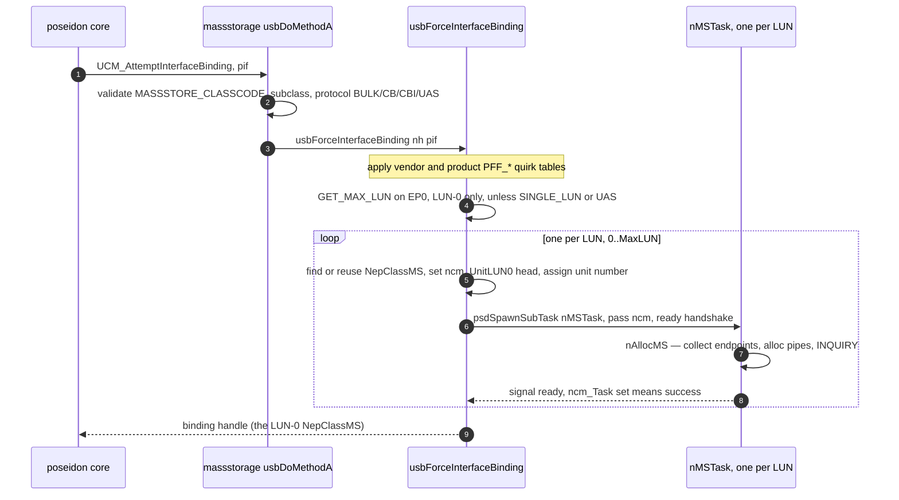

* **Validation** (`usbAttemptInterfaceBinding`): `MASSSTORE_CLASSCODE` (0x08), a known
  subclass (SCSI/RBC/ATAPI/UFI/…), and protocol BULK (0x50) / CB (0x01) / CBI (0x00) / UAS
  (0x62). It blacklists a known Huawei modem that mis-advertises as storage. It may also
  **decline** an otherwise valid BOT interface in favour of a UAS alternate — see §9.3.
* **GET_MAX_LUN** (`usbForceInterfaceBinding`): issued once on the LUN-0 control pipe
  (unless `PFF_SINGLE_LUN` or UAS), with three retries at 500 ms and a clamp (>7 → 3); failure
  falls back to `PFF_SINGLE_LUN` and defers the config store.
* **One `NepClassMS` per LUN**: the binding loops `0..MaxLUN`, finding-or-reusing a `NepClassMS`
  (reuse matched by DevID+IfID+LUN strings, so re-plug returns to the same unit number), assigning
  a unit number starting from `cuc_DefaultUnit`, and spawning a `nMSTask` per LUN with the
  standard `psdBorrowLocksWait` ready handshake.
* **Quirk application**: vendor/product `PFF_*` tables are OR'd in here (Genesys, JetFlash,
  Olympus, Prolific, ZIP, …), then merged with saved config (§12).
* **Release** (`usbReleaseInterfaceBinding`): tears down all sibling LUNs of the device; the
  `NepClassMS` memory is kept (freed only in `libExpunge`) so re-plug reuses it.
* **`ncm_DenyRequests` is the unit's open/closed gate.** Because a unit is never unlinked from
  `nh_Units`, it is the *only* thing standing between `devOpen` and a unit with no task behind it.
  The invariant: **FALSE exactly while a live `nMSTask` owns the port** — set TRUE at unit creation
  (before the `AddTail`), cleared by `nMSTask` once `nAllocMS` hands it a live task (before the
  startup `nBulkReset`, which itself bails out on the flag), and set TRUE again by release, by task
  teardown, and by a failed `nAllocMS`, which also disarms the port (`PA_IGNORE` +
  `mp_SigTask = NULL`, as `nFreeMS` does) since its signal bit is already freed.

---

## 6. Task and serialization model

Three kinds of task, and a careful serialization scheme because multiple LUNs share one physical
USB pipe set.

| Task | Count | Role |
|---|---|---|
| `nMSTask` | one per LUN | the **only** executor of that LUN's USB IO; runs the device-command service loop |
| `nRemovableTask` (`massstorage_removable.c`) | one global | polls every removable LUN every ~3 s for media change and auto-mounts |
| `nGUITask` | on demand | the MUI config window |

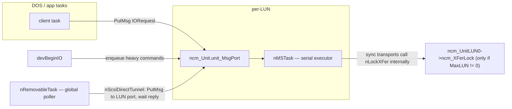

* **Per-LUN serialization is automatic**: `devBeginIO` `PutMsg`s heavy commands to the LUN's
  `unit_MsgPort`, the single `nMSTask` moves them onto the Forbid-protected `ncm_XFerQueue` FIFO
  and drains it from the head. With the UAS tag engine on (§9.3), eligible block IO submits
  asynchronously onto free tags — up to `cdc_UasQueueDepth` commands concurrently on the wire.
  Everything else runs through the **synchronous transport**, which is not a barrier: it claims a
  free tag of its own (`nUasClaimTag`, waiting for one if the engine is saturated) and blocks only
  the unit task, not the wire, because `psdWaitPipe()` consumes only its own pipe's reply and
  restores the port signal. `devAbortIO` removes queued requests from the FIFO under Forbid and
  flags in-flight tags (`ut_AbortReq` + task Signal); the request completes with `IOERR_ABORTED`
  through the normal path.
* **What drains the engine** (`nUasDrainTags`) is the semantic minimum — three callers:
  `CMD_RESET`/`CMD_FLUSH`, barriers by definition; `TD_EJECT`/`CMD_START`/`CMD_STOP`, because a
  medium-state change must not overlap in-flight data (SIMPLE tasks may be reordered, and spinning
  down under a write is the case that bites); and the task teardown. The suspend probe
  (`UCM_AttemptSuspendDevice`) **refuses rather than drains** — it fails outright on `ncm_CmdBusy`,
  on `!nUasTagsIdle()`, or on a failed `AttemptSemaphore` of `ncm_XFerLock`. On BOT/CBI the drain
  is a no-op and every request is strictly serial.
* **What "eligible" means** (`nUasEligible`) is narrower than "READ/WRITE families": non-zero queue
  depth, an opcode in `CMD_READ`/`CMD_WRITE`/`TD_READ64`/`TD_WRITE64`/`NSCMD_TD_READ64`/
  `NSCMD_TD_WRITE64`, **`ncm_BlockSize` already known** (the first block IO after a bind probes it
  synchronously), `PFF_EMUL_LARGE_BLK` clear, non-zero length, and both length and offset
  block-aligned. Everything else — `TD_FORMAT*`, `TD_SEEK*`, `HD_SCSICMD`, geometry — takes the
  synchronous transport. Since the task executes one FIFO entry at a time, at most **one**
  synchronous command is ever in flight: the only concurrency is sync-vs-async-block-IO, and the
  read-modify-write emulation paths (which make *all* IO ineligible) can never overlap each other.
* **Cross-LUN serialization** uses `ncm_XFerLock`, a semaphore in the **LUN-0** instance, taken
  **only when `ncm_MaxLUN != 0`**. The bracketing lives **inside the synchronous transports**
  (`nScsiDirectBulk`/`CBI`/`UAS`), not in `nMSTask`, which takes it only around the initial
  `nBulkReset`; the suspend probe is the one other user. Two consequences: **the async tag path
  takes no transport lock at all**, and **the lock is inert for UAS entirely** (UAS skips
  `GET_MAX_LUN`, so `ncm_MaxLUN == 0`). UAS serialization comes purely from the single-threaded
  unit task.
* **The LUN-0 tunnel** (`nIOCmdTunnel` / `nScsiDirectTunnel`): background work — the removable
  poller, write-protect/geometry refresh — runs in the global task, which must not touch the bulk
  pipes directly. It *tunnels* instead: `PutMsg`s a fake `HD_SCSICMD` IORequest to the target LUN's
  port and waits for the reply on `nh_IOMsgPort`, keeping the LUN task the single executor for that
  physical device even for background IO.

---

## 7. The AmigaDOS device edge — usbscsi.device

`devBeginIO` (`dev.c`) classifies each `io_Command` into three buckets:

* **Inline** (caller context, no task hop): `TD_CHANGENUM`/`TD_CHANGESTATE`/`TD_PROTSTATUS`
  (read cached state), `TD_ADDCHANGEINT`/`TD_REMCHANGEINT` (register a disk-change interrupt into
  `ncm_DCInts` — the add is never replied; it lives until removed), and the NOPs
  `CMD_CLEAR`/`CMD_UPDATE`/`TD_MOTOR` (there is no cache layer).
* **Enqueue to the LUN task**: `CMD_READ`/`CMD_WRITE`, `TD_READ64`/`WRITE64`/`SEEK64`/`FORMAT64`
  (+ their `NSCMD_*` aliases), `TD_GETGEOMETRY`, `CMD_START`/`STOP`/`RESET`/`FLUSH`, `TD_EJECT`,
  `HD_SCSICMD` — `PutMsg`'d to the unit port, replied by `nMSTask`.
* **NSD**: `NSCMD_DEVICEQUERY` reports `NSDEVTYPE_TRACKDISK` and the full supported-command list.

Read/write path (executed in `nMSTask`):

* `nRead64`/`nWrite64` compute the LBA from the trackdisk-64 `io_Offset`/`io_Actual` convention,
  emit **READ(10)/WRITE(10)** (or READ(16)/WRITE(16) above 2 TB), and **chunk** each transfer at
  `maxtrans = 1 << (cdc_MaxTransfer + 16)`.
* **Large-block emulation** (`nRead64Emul`/`nWrite64Emul`): when the medium's block size is not 512
  (e.g. 2048-byte CD), it presents a 512-byte logical sector to AmigaDOS via a one-block bounce
  buffer (`ncm_OneBlock`) and **read-modify-write** for partial blocks.
* **Geometry** (`nGetGeometry`): READ CAPACITY → block size + count; MODE SENSE pages 0x03/0x04/0x05
  → CHS; missing fields filled arithmetically; and `nFakeGeometry` synthesizes CHS by
  **prime-factorizing** the block count when the device gives nothing usable.
* **Disk-change reporting**: `ncm_ChangeCount` (bumped on media insert/remove/WP-change),
  `TD_CHANGENUM`/`TD_CHANGESTATE`, and `Cause()` on every `ncm_DCInts` interrupt when the medium
  changes.

(Full command/dispatch detail is in §16.1.)

---

## 8. The SCSI layer — nScsiDirect

Every storage operation funnels through `nScsiDirect(ncm, scsicmd)`, which presents a uniform
Amiga `struct SCSICmd` interface and **owns all the quirk handling** before dispatching to a
transport:

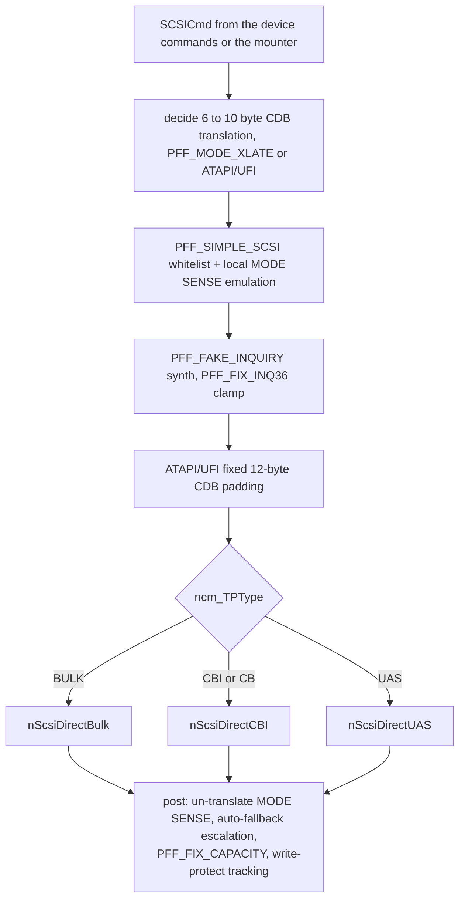

The transports never see quirks — they get an already-massaged `SCSICmd`. **The default patch-flag
set is already non-empty at bind** — `MODE_XLATE | NO_RESET | FIX_INQ36 | SIMPLE_SCSI` — so
everything below is out-of-the-box behaviour, not an opt-in. Key behaviors:

* **6→10 byte CDB translation** (`PFF_MODE_XLATE`, or forced for ATAPI/UFI which never take 6-byte
  CDBs).
* **`PFF_SIMPLE_SCSI`** — a hard command whitelist that fabricates MODE SENSE pages locally from
  `ncm_Geometry` and rejects everything else with a synthetic CHECK CONDITION, keeping fragile
  firmware from crashing on unexpected opcodes.
* **INQUIRY handling** — `PFF_FAKE_INQUIRY` synthesizes a 36-byte response from Poseidon's known
  vendor/product strings; `PFF_FIX_INQ36` clamps the allocation length.
* **Auto-fallback escalation** — on phase errors the class *escalates quirks and persists them*:
  `PFF_FIX_INQ36 → PFF_FAKE_INQUIRY`, `PFF_MODE_XLATE → PFF_SIMPLE_SCSI`, each saved via
  `nStoreConfig`. The driver learns a device's brokenness and remembers it.
* **CD/DVD NAK floor** — an INQUIRY reporting `PDT_CDROM`/`PDT_WORM` also puts a floor under the
  NAK timeout, because optical drives NAK for many seconds while seeking or spinning up: a
  configured value below `MIN_CD_NAKTIMEOUT` (15 s) is raised to it across *every* live pipe via
  `nApplyNakTimeout`. It is a floor, not an override — a longer setting is left alone and a
  configured 0 ("NAK timeouts off") is honoured. Unlike the escalations above it is deliberately
  **not** persisted: the default sits above the floor, so reaching this path means the value was
  chosen on purpose, and the stored preference stays intact.
* **`PFF_FIX_CAPACITY`** (off-by-one READ CAPACITY) and live **write-protect tracking** from MODE
  SENSE replies.

The 15 `PFF_*` flags are listed in §16.2.

---

## 9. The three USB transports

`nScsiDirect` dispatches by `ncm_TPType` to one of three back-ends, each a different USB protocol.

### 9.1 BBB — Bulk-Only (the common case)

The classic 3-phase Command/Data/Status over two bulk pipes:

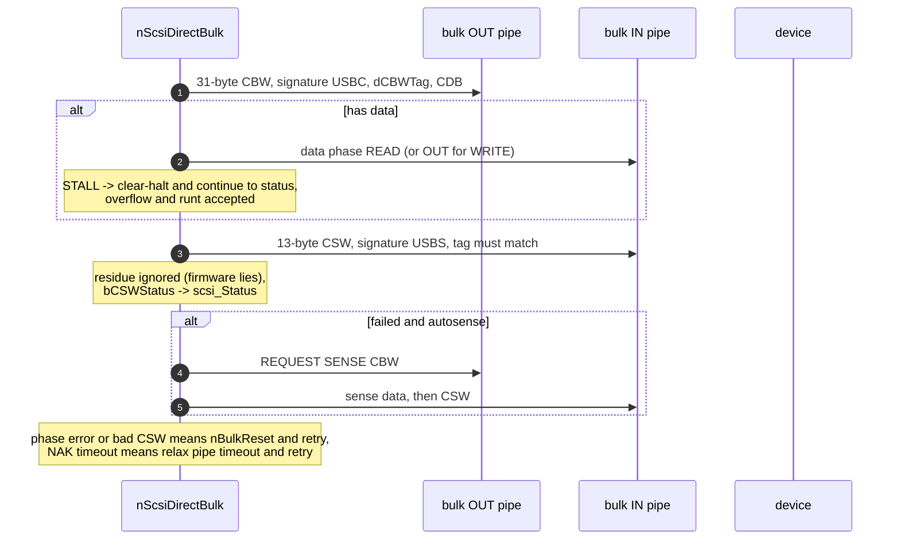

* **CBW** = 31 bytes (sent as `UMSCBW_SIZEOF`, *not* `sizeof` which pads to 32). `dCBWTag` is
  `(IPTR)scsicmd + ++ncm_TagCount` — pointer-derived *plus* an incrementing counter, so a retry and
  its follow-up sense CBW get distinct tags — and is matched in the CSW.
* Data-phase errors are handled leniently so the code **usually reaches the CSW** (the device's
  status is authoritative), and the residue is deliberately ignored. The exception is a data-phase
  **NAK timeout**, which breaks straight to the retry rung without reading the CSW.
* **"Device sent too much" is forgiven on every transport, via `nIsOverflowErr()`**, which treats
  `UHIOERR_BABBLE` exactly like `UHIOERR_OVERFLOW` — the same wire condition, reported as overflow
  by UHCI/OHCI/EHCI and folded into Babble Detected by xHCI. All three transports go through it:
  BBB on data, CSW, sense data and sense CSW; CBI on data; UAS via `nUasErrForgiven`. **Any new
  error check meaning "too much data" must use it.**
* Recovery ladder, more precisely than "clear then reset":
  * a **CBW-phase** stall → `nBulkClear`;
  * a **data-** or **CSW-phase** stall → an inline EP0 `CLEAR_FEATURE(ENDPOINT_HALT)`, *not*
    `nBulkClear`. These stay open-coded on purpose: the endpoint address is a per-phase
    conditional and the result handling differs at each site. Only the fixed sequences in
    `nBulkReset`/`nBulkClear` go through `nClearEndpointHalt()` (silent) and
    `nClearEndpointHaltMsg()` (logs the `CLEAR_ENDPOINT_HALT %ld failed` warning);
  * phase errors and hard errors → `nBulkReset` (Bulk-Only Mass Storage Reset + clear-halt both
    endpoints);
  * NAK-timeouts are treated as "busy": back off 500 ms and **relax the pipe NAK timeout** (CSW
    and CBW to 120 s, data to 60 s read / 120 s write) for slow flash erase/program.
* **`nBulkReset` self-degrades.** One failed `BULK_ONLY_RESET` sets `ncm_BulkResetBorks`, after
  which the class-specific reset is never attempted again on that device — recovery silently
  becomes clear-halt-only. Worth knowing when a device "stops recovering" mid-session.
* **The "command-level retry loop" is one retry, not a loop.** `retrycnt` starts at **0** unless
  the caller set the autoretry flag (`scsi_Flags & 0x80`) or a NAK-timeout bumped it to 1.
* **BOT is queue-depth 1 by specification, not by driver limitation.** Exactly one CBW may be
  outstanding — the device must return the CSW before the host sends the next one — and the tag
  merely validates that single command (`dCSWTag == dCBWTag`); it is not a queuing mechanism. A
  CBW sent early is read as data-phase payload or as a protocol violation. Every OS runs BOT at
  QD1; UAS (§9.3) is the transport that adds the queuing BOT structurally lacks. Class-level
  substitutes are deliberately not attempted: read-ahead is off by design, and coalescing would
  not pay — concurrent requests come from different partitions and are rarely adjacent.

### 9.2 CBI — Control/Bulk/Interrupt

Command via a control transfer (ADSC), data via bulk, status via the interrupt endpoint:

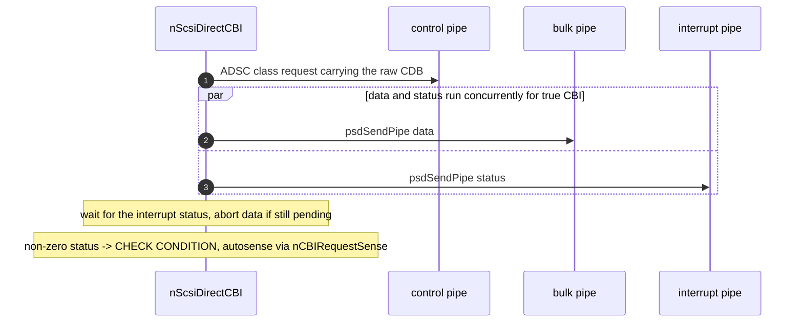

The fork-join (data ‖ interrupt-status) is necessary because the device may signal completion on
the interrupt endpoint before the data transfer finishes — the status pipe is armed *first*, then
the data pipe. Plain CB (no interrupt EP) degrades to a synchronous data phase with a synthesized
PASS status. Three details the diagram flattens: the fork-join runs **only when there is data** (a
zero-length command reads the status synchronously with `psdDoPipe`); the status byte is
**pre-seeded to `USMF_CSW_PHASEERR`** before arming, so an aborted or short status reads as a phase
error rather than success (a `UHIOERR_RUNTPACKET` there is forgiven); and **recovery is shared with
BBB** — the command-phase stall uses `nBulkClear` and the reset rung is the same `nBulkReset`,
which for CBI/CB issues the 12-byte `0x1D 0x04 FF…` reset command instead of the Bulk-Only class
request.

### 9.3 UAS — USB Attached SCSI (USB3)

Replaces the serial CBW/CSW model with tagged **Information Units** over up to four pipes, and on
USB3 uses **bulk streams** for pipelining:

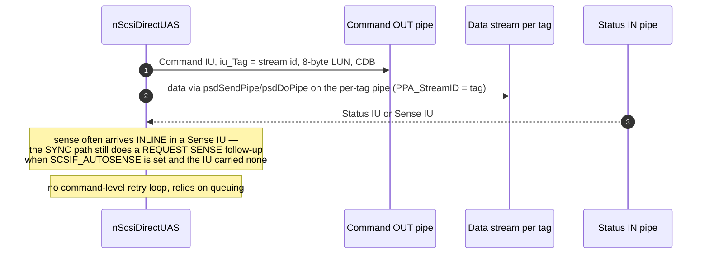

**Binding prefers the UAS alternate** when it can actually run. `usbAttemptInterfaceBinding` returns
NULL for an offered *active BOT* interface — declining it — if the device is SuperSpeed, its
hardware reports `HA_StreamsSupported`, and the interface has a UAS alternate; the class scan then
comes back with that alternate, which is accepted and switched to once. HS devices and stream-less
backends keep binding BOT. Two qualifiers:

* The whole preference is skipped when **`PFF_NO_UAS`** is set, and that flag is read from the
  **class-default** config (`nh_DummyNCM`), not the per-device one — so the "Prefer UAS" GUI toggle
  (§12) is a global opt-out, not a per-device one.
* The alternate is switched by `nAllocMS` itself via `psdSetAltInterface`, deliberately **before**
  stream setup and INQUIRY, because the enumerator's own switch of the accepted alternate happens
  after the bind task has run — too late for the endpoints to exist when the streams are allocated.

The transport itself:

* The **stream ID is the tag**, binding a command's data and status to its stream (on SS the
  Status IU for tag *n* arrives on stream *n* of the status pipe; the command pipe stays plain per
  the UAS spec). On the context backend the library backs those pipes with real xHCI stream rings
  (`NSCMD_USB_ALLOC_STREAMS`, issued when the pipes join the stream id space; freed on close).
* **The multi-tag engine is the only UAS transport.** `nUasInitTags` builds `ncm_UasQueueDepth` tag
  contexts (`struct UasTag`, up to `NCM_MAXTAGS` 16, clamped from `cdc_UasQueueDepth` here and
  nowhere else), each with its own status/data-in/data-out pipes at `PPA_StreamID == tag` — ids
  assigned descending, so the library's `ALLOC_STREAMS` fires once per endpoint — then verifies
  `EA_StreamsAlloc ≥ QD` on all three endpoints. That verify is load-bearing: a silent single-ring
  fallback would interleave tags on one ring and corrupt data. **A failed gate fails the bind
  loudly** (`RETURN_FAIL` in the Trident log; the *"MSD … available through usbscsi.device unit N!"*
  line never appears and the unit gets no task) — the binding already guaranteed a SuperSpeed device
  on a stream-capable HCD, so a failure here is a genuine fault, not a degraded mode. The one
  in-between outcome: a device advertising **fewer** streams than the configured depth silently
  **clamps the depth down**, and only a *zero* `EA_MaxStreams` is fatal.
* Per chunk, a tag arms its status pipe, then its data pipe (`psdSendPipe`), then sends the Command
  IU with a blocking `psdDoPipe` on the shared command pipe (Linux uas ordering). The task reaps
  completions off `ncm_TaskMsgPort`, chunks large transfers on the same tag (`cdc_MaxTransfer`
  granularity), aborts a failed chunk's sibling pipe, and replies the client request from
  `nUasFinalizeTag`. Synchronous commands claim a free tag of their own (`nUasClaimTag` inside
  `nUasDoCommand`) — the stream endpoints are in LSA mode, so plain pipes cannot reach them — marked
  `UTS_RUNNING` with no `ut_IOReq`, which keeps both the FIFO dispatcher and the reaper off them.
* **A killed tag is quarantined, not freed** (`UTS_QUARANTINE`). A host-side kill — NAK timeout,
  `AbortIO`, any pipe error — leaves the *device* still owning the command whenever the Command IU
  was delivered and no Sense IU came back (tracked per chunk as `ut_CmdSent` / `ut_StatusSeen`).
  Reusing that tag would let the old command's Sense IU land in the new command's status transfer,
  so the tag stays unusable until the device lets go. The ladder:
  1. **ABORT TASK** Task Management IU on the command pipe (`nUasIssueTMF`), one TMF at a time. The
     TM IU carries a tag of its own: stream id **QD+1**, reserved at `nUasInitTags` when
     `EA_MaxStreams` has the headroom — allocated *first*, because the first `PPA_StreamID` on an
     endpoint sizes its ring set. Without headroom the engine runs in **borrow mode**: it waits for
     every other tag to go idle and lends the TMF one of theirs (never the target's, which would
     collide with the task being aborted), and at QD 1 skips straight to the reset.
  2. The **Response IU** arrives on the TM tag's status stream; only `TMF_COMPLETE`/`TMF_SUCCEEDED`
     release the tag. The TM pipe's NAK timeout *is* the TMF deadline — there is no second timer.
  3. Anything else (refused, garbled, timed out) escalates to **`psdResetDevice()`**, which
     port-resets and re-addresses the device; the engine is then torn down and rebuilt on the fresh
     endpoint contexts. If the stack cannot reset, the class logs one warning and releases the tags
     anyway rather than wedging the unit for good.

  Quarantined tags count as busy for `nUasTagsIdle()`, so both `nUasDrainTags()` and the suspend
  probe wait for the ladder to resolve — which it does in bounded time, by construction.
* **Engine invariants:**
  * **A tag is reused only at `ut_Outstanding == 0`.** A failed chunk aborts its sibling pipe;
    reusing the tag before both pipes have retired would let a late sibling reply land in the
    reused tag's fresh transfer.
  * **Completions are reaped with `psdCheckPipe` + `psdWaitPipe`, never `GetMsg`.** `psdWaitPipe`
    on a replied-but-not-yet-dequeued pipe collects the result with full DeadCount/IOBusyCount
    bookkeeping and removes the node safely; `GetMsg` followed by `psdWaitPipe` would Remove the
    same node twice. It also consumes only *its own* pipe's reply, which is what lets a synchronous
    command block on one tag while others stay in flight.
  * **Only a Sense IU closes a command.** `nUasParseStatusIU` reads the SCSI status from byte 6 for
    a Sense IU *only*; in any other IU that byte means something else (in a Response IU, additional
    response info). An unexpected IU on a command tag is a protocol violation → `HFERR_Phase`, and
    the tag is quarantined because the command's device-side fate is unknown.
  * **No autosense follow-up on the tagged path.** Sense arrives inline in the Sense IU and the
    block-IO family discards it anyway, so a bad status maps straight to `HFERR_BadStatus`.
  * **Completion ordering across tags is not guaranteed, by design.** Submission is FIFO, but tags
    carry the SCSI SIMPLE attribute and may complete in any order — safe here, because concurrent
    requests cover disjoint block ranges and exec IO promises no cross-request ordering anyway.
* **UAS is LUN 0 only.** `GET_MAX_LUN` is a BOT request, skipped for UAS, so exactly one unit binds
  (and `ncm_XFerLock` is inert, §6). Multi-LUN UAS would need `REPORT LUNS` discovery at bind (the
  Command IU's 8-byte LUN field is already filled by `nUasFillLun`) plus a per-interface transport
  object holding the tag engine for the LUN units to share.
* The per-tag pipes are armed with `PPA_AllowRuntPackets` on status, `PPA_NoShortPackets` on
  data-out, and the configured NAK timeout on all three.

Sequential-read throughput on UAS is bounded by the platform's PCIe link, not by the stack — see
[massstorage-throughput.md](massstorage-throughput.md) §2.

---

## 10. Removable media and auto-mount

One global `nRemovableTask`, started lazily by the first removable LUN (`nStartRemovableTask`,
semaphore-guarded and idempotent), polls every ~3 seconds — or every 250 ms while the ROM boot
gate is still watching (§10.2).

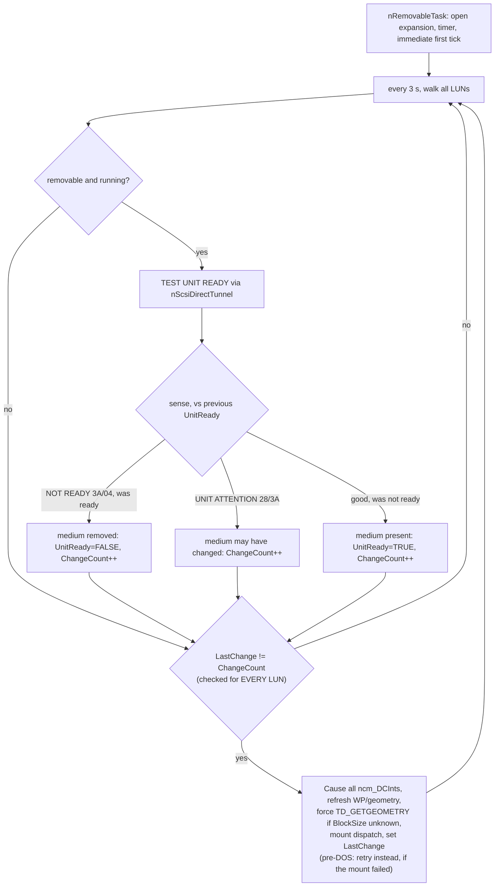

* **Media-change is edge-triggered** by comparing `ncm_LastChange != ncm_ChangeCount`. On an edge
  it `Cause()`s every registered disk-change interrupt (telling DOS the disk changed), refreshes
  write-protect/geometry, and runs the mount dispatch (§11).
* **The change check runs for *every* LUN, not just removable ones** — it sits outside the
  removable/TUR branch. That is exactly how **fixed** disks get mounted: `nMSTask` sets
  `ncm_ForceRTCheck` for non-removables and their `ChangeCount` is bumped from elsewhere. Both TUR
  edges are guarded by the *previous* `ncm_UnitReady`, so `ChangeCount` moves only on a genuine
  transition, not on every poll.
* Before mounting, a `TD_GETGEOMETRY` is forced when `ncm_BlockSize` is still 0 — the mounter
  needs the block size — and a freshly inserted medium on a UFI-subclass unit gets a `CMD_START`.
* **The DOS-availability dance**: at cold boot the task may run before `dos.library` exists. It
  retries `OpenLibrary("dos.library")` each pass; once DOS appears (`nRTDOSArrived`) it sets
  `ncm_RemountPending` on the units that need it and relaunches itself as a *process* (so it can
  safely call DOS).
* **Startup delay** (`cdc_StartupDelay`) is applied per-device in `nMSTask` before the first
  INQUIRY, giving slow drives time to spin up. **Auto-unmount** (`cuc_AutoUnmount`) tears down
  volumes when a LUN goes away.

### 10.1 Safe eject

`UCM_SafeEject` (→ `nSafeEjectDevice`) is the deliberate counterpart of the reactive teardown above:
the user asks for the device *before* unplugging it. It is **device-scoped** — the unit the caller
named is only a handle on its `PsdDevice`, and every unit whose `ncm_Device` matches takes part,
which covers extra LUNs and extra storage interfaces in one predicate. `poseidon.library`'s
`psdSafeEjectDevice()` orchestrates and drops the hub port afterwards; the class does the storage
half only and never touches the bus.

* **Latch first.** `ncm_Ejected` is set on every unit of the device before anything else, so the 3 s
  tick above cannot mount behind the operation. It gates *only* the mount branch: `LastChange` still
  follows `ChangeCount`, so the bumps an eject itself provokes (UNIT ATTENTION after `CMD_STOP`, TUR
  edges) are consumed instead of re-tested every tick. `nMSTask` clears it at startup, because units
  are reused across replugs — a stale latch would silently veto every future mount.
* **All-or-nothing, and the user can veto.** Every DOS node riding one of the device's units is
  collected under one `LDF_DEVICES` read lock (never send a packet while holding it — an inhibit may
  need that very list), then each handler gets `ACTION_FLUSH` plus a *checked* `ACTION_INHIBIT`. One
  refusal releases the handlers already inhibited, clears the latch, and returns `SAFEEJECT_BUSY`
  with the offending volume named for the requester. `ERROR_DEVICE_NOT_MOUNTED` is benign;
  `ERROR_ACTION_NOT_KNOWN` proceeds after the flush.
* **Then the point of no return:** `ACTION_DIE` + `RemDosEntry` per node, then SYNCHRONIZE CACHE,
  ALLOW MEDIUM REMOVAL and `CMD_STOP` per LUN — best effort, since the data is already safe, and
  skipped for `PFF_SIMPLE_SCSI` devices. That IO runs over a `MsgPort`/`IOStdReq` of the eject's own
  (as `AutoDetectMaxTransfer` does) because `nh_IOReq`/`nIOCmdTunnel` belong to the removable task's
  tick; `CMD_STOP` rides the unit task's START/STOP arm and so inherits the UAS drain barrier.
* Runs on the **caller's** task, which must be a Process (`DoPkt`), and may block for seconds.

### 10.2 The pre-DOS verdict, and why TEST UNIT READY is not enough

`ncm_MediaUnsettled` answers one question for the ROM boot gate (`romstartup/`, read through
`UCM_MediaPending`): *has this unit produced its final pre-DOS answer yet?* The gate holds the
coldstart chain while any unit says no, and a unit that says yes too early loses its place in
the boot menu permanently — once `dos.library` exists, the mounter's `AddBootNode()` gets a NULL
`ConfigDev` and the node is not an `NT_BOOTNODE`, so a later mount can never be booted from.

| TEST UNIT READY answer | unsettled | why |
|---|---|---|
| good | until the mount resolves | a medium is there; the gate wants the *volume*, so the flag spans the mount |
| `2/04` LOGICAL UNIT NOT READY | yes, unbudgeted | the drive is explicitly asking us to wait; the gate's own cap bounds it |
| `2/3A` MEDIUM NOT PRESENT | **no** | empty tray or cardless reader — the one answer that settles negatively |
| `6/xx` UNIT ATTENTION | yes, budgeted | says nothing about the medium; `28`/`3A` additionally bump `ChangeCount` |
| unreadable or other | yes, budgeted | inconclusive, not negative |

**UNIT ATTENTION is the warm-reboot case.** An Amiga reboot does not cut VBUS, but `xhci.device`
still issues a full HCRST and the stack resets every root port, so an already spun-up drive greets
the new session with `6/29` (power on, reset, or bus device reset) — where a cold boot would answer
`2/04` for seconds. Treating it as "nothing coming" would drop such a drive from the boot menu on
every reboot.

Two budgets keep a drive that never gives a usable answer from costing the gate's full media
timeout on every boot: `ncm_SenseRetries` (`RT_SENSE_RETRIES`) for inconclusive TURs and
`ncm_MountRetries` (`RT_MOUNT_RETRIES`) for mounts that fail — the mounter retries READ TOC and the
PVD read three times back to back with *no* delay, which a still-settling optical drive loses. Both
are cheap because the poll drops to `RT_FAST_POLL_MS` (250 ms) while anything is unsettled and DOS
does not exist — the whole budget is spent in about two seconds. A pass that only *deferred* (the
medium read fine, its handler needs DOS) spends no retry at all: nothing can change before DOS, so
the unit settles at once.

Only sense bytes the device actually returned are believed: `sensedata` is a task local reused by
every unit on every tick, and a command that fails without autosense is precisely what a bus reset
produces.

### 10.3 The two-pass mount, and the rule that keeps it safe

Mounting happens twice on a ROM-boot machine: once before `dos.library` exists (so strap can
find a boot volume) and once after. The invariant that makes the second pass harmless:

> **A pre-DOS mount may only create a DeviceNode it can actually service, which before DOS
> means a `FileSystem.resource` entry and nothing else.**

`is_fs_available()` answers "can this be served **now**", so a partition whose handler must come
from `L:` is *deferred* pre-DOS rather than mounted: counted in `MountResult.deferred` and mounted
properly on the second pass, under its own name. A node created pre-DOS that nothing can load would
still have **claimed the DOS name**, and the second pass would then find the name taken, bump it,
and mount the same volume twice under two names.

Three mechanisms, each covering a distinct failure:

| mechanism | stops |
|---|---|
| `is_fs_available()` / `attach_fs()` refuse an `L:` handler pre-DOS | the dead node that steals the name |
| `ncm_MountDeferred` (from `MountResult.deferred`) gates the second pass | re-probing a drive that has nothing to gain |
| `ncm_RemountPending` instead of a `ncm_ChangeCount` bump | `Cause()`ing a fake media change on the volume DOS is booting from — *"Please replace volume X in any drive"* |
| `is_extent_mounted()` (device + unit + `de_LowCyl`/`de_HighCyl`) | any re-probe duplicating a live node, whatever triggered it |

**Note the asymmetry with `is_name_taken()`**, which matches on the DOS *name*. A name collision
means *another drive wants this name* → rename. An extent match means *this is the same volume,
already mine* → skip. The two must not be conflated.

RDB partitions never defer: `parse_part()` takes their handler from the drive's own FSHD
blocks and never consults `is_fs_available()`, so an RDB-only drive is mounted exactly
once, on the first pass.

`nRTMountPass` logs the per-unit outcome — `mounted / already / deferred / renamed` — through
`psdAddErrorMsg`, so the accounting is visible in Trident's log even on a release build, where the
mounter's own logging is compiled out. A nonzero `renamed` means two nodes wanted one name.

---

## 11. Partition parsing and mounting

All media parsing and mounting lives in the **vendored A4091 mounter** (fork, branch
`poseidon-fixes`; `mounter.c` + `mounter_rdb.c` + `mounter_legacy.c` + `mounter_cd.c`, compiled with
`-DMOUNTER_LOG -DMOUNTER_TRACE=1`). The class builds four `struct MountFS` "recipes" (FAT / NTFS /
exFAT / CD: dostype, handler path, DOS name, `de_Control`, buffers, MaxTransfer, `MOUNTFS_*` flags)
from its config in `nFillMountFS` and calls `MountDrive()` once per media insert.

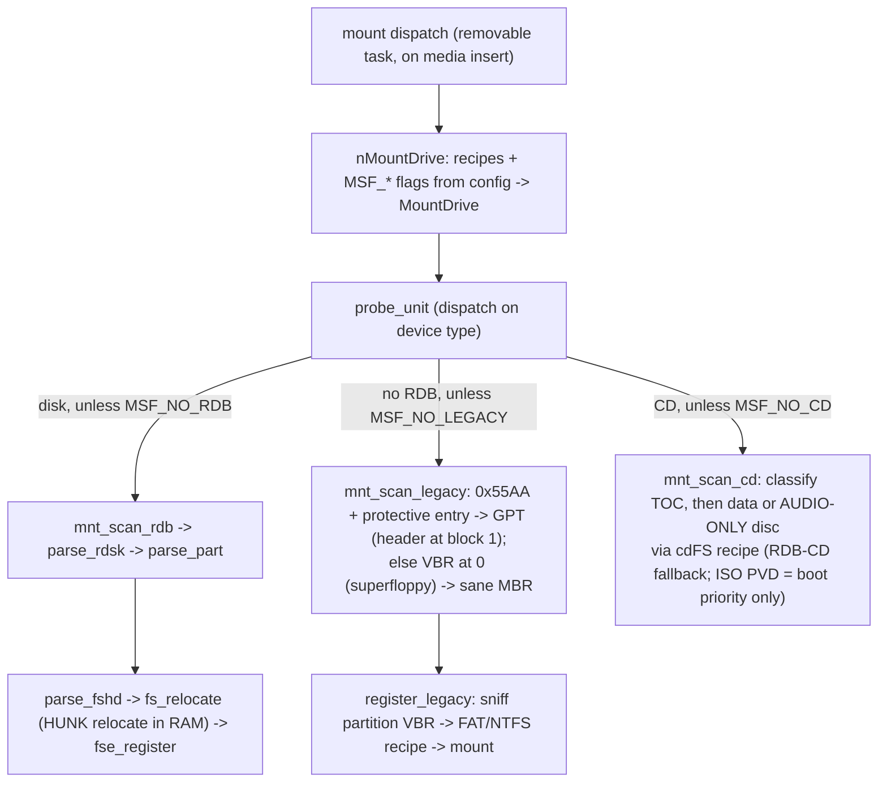

* **RDB**: `mnt_scan_rdb` → `parse_part`; filesystems come from `FileSystem.resource` or are HUNK-
  relocated in RAM from the RDB's FSHD/LSEG blocks (`fs_relocate`) and published to the resource.
* **MBR/GPT/superfloppy**: `mnt_scan_legacy` disambiguates a filesystem-at-block-0 (VBR) from a real
  partition table, then `register_legacy` sniffs each partition's own boot sector to pick the
  **FAT or NTFS recipe** (the MBR type byte / GPT GUID is only a hint); exFAT/unknown content is
  skipped. Extended containers (0x05/0x0F/0x85) are walked; entries are sanity-checked.
* **CDs**: `mnt_scan_cd` classifies the disc from its TOC (`classify_cd`: data track 1, audio
  track 1, or unreadable), then mounts it whole-medium with the CD recipe; RDB CDs fall back to
  `mnt_scan_rdb` first. `read_pvd` reads sector 16 **only to decide boot priority** — an
  Amiga-bootable disc ("AMIGA BOOT"/"CDTV" as the ISO System ID) gets `bootPri = 5`. Whether the
  disc is *mountable* is the handler's business, gated by two **recipe** flags derived from the
  configured handler name (`nCDFSCaps()`, a case-insensitive basename prefix match for
  `odfilesystem`): `MOUNTFS_CD_ANYFMT` hands a data disc with no ISO 9660 PVD to the handler rather
  than rejecting it, and treats an unreadable TOC as a data disc (some enclosures answer `READ TOC`
  poorly for exactly the DVD/BD media UDF lives on) — though sector 16 must still read back, so a
  dead disc is not mounted blind; `MOUNTFS_CD_AUDIO` allows audio-only discs, which the mounter
  otherwise refuses. A handler the prefix match does not recognise gets neither flag, and with it
  ISO-only, no-audio behaviour.
* **DMA alignment is handed to the mounter.** `ncm_DmaAlign` (cached from `HA_DMAAlignment` at
  bind) becomes `ms.dmaAlign`; when it is **greater than 1**, recipe mounts get
  `de_BufMemType = MEMF_FAST|MEMF_PUBLIC|MEMF_CLEAR` and `de_Mask = 0x7FFFFFFE & ~(dmaAlign-1)`
  instead of the classic `MEMF_ANY` / word-aligned defaults — this is what keeps DOS's buffer cache
  in the driver's direct-DMA path on PiStorm (§2).
* **Filesystem resolution** (`attach_fs`): `FileSystem.resource` by dostype first, else the
  recipe's handler file becomes `dn_Handler` (+ `dn_GlobalVec = -1`) so DOS loads it from `L:` on
  first access — no resource entry needed for fat95/NTFS/exFAT/ODFileSystem.
  **`MOUNTFS_FORCELOAD` inverts that order** (post-DOS only), and is set on the CD recipe alone
  (§12.1). `is_fs_available` **checks that the handler file exists** before a node is created, so a
  recipe pointing at a handler nobody installed skips the partition instead of leaving a node that
  fails the moment something touches it. That check is a `Lock()`, so it only runs post-DOS from a
  Process (`pr_WindowPtr = -1`, no requesters); pre-DOS boot mounts take the handler on trust.
* **Naming**: the recipe DOS name gets a trailing digit ensured (`UMSD` → `UMSD0`) and bumped past
  collisions via `fix_name_collision`, which checks `eb_MountList` and the live DOS
  device/volume/assign lists; the `MS0`/`CD0` fallbacks fire only when the recipe name is *empty*.
  **Each filesystem carries its own DOS name and buffer count** (§12), so a disc lands in the
  `UCD*` pool with CD-sized buffering while a stick keeps the `UMSD*` one — two recipes given the
  same name simply share one numbering sequence. **RDB partitions are not recipe-mounted at all**
  (`parse_part` takes their name and environment from the RDB), so none of this reaches them.
* **Config gating**: `cuc_AutoMountRDB` → `MSF_NO_RDB`, `cuc_AutoMountLegacy` → `MSF_NO_LEGACY`,
  `cuc_MountAllLegacy` → `MSF_LEGACY_FIRST_ONLY`, `cuc_Boot` → `MSF_NO_BOOT`, `cuc_AutoMountCD` →
  `MSF_NO_CD` (the `cdFS` recipe pointer is always passed; only the flag gates the scan). The two
  flag words are distinct: **`MSF_*` gates a scan, `MOUNTFS_*` describes a recipe.** Clearing a
  handler row in the GUI is the off switch for a filesystem — an empty name means
  "`FileSystem.resource` lookup only", and a dostype that resolves to neither a resource entry nor
  an installed handler file is skipped.
* **Unmount** (`nUnmountPartition`, on removal with `cuc_AutoUnmount`): finds DOS device entries
  whose FSSM points at our unit, `ACTION_INHIBIT`+`ACTION_DIE`s live handlers (skipping
  never-started ones), `RemDosEntry`s the node and unlinks any stale `BootNode`.

No ISO 9660, Joliet, Rock Ridge, UDF or HFS *parsing* lives anywhere in this tree, by design: the
mounter decides only whether to mount and with what, and the on-disc format is entirely the
handler's problem.

---

## 12. Config and GUI

Two IFF config chunks (`massstorage.h`), keyed by device-ID + interface-ID strings:

* **`ClsDevCfg`** (chunk `MSDC`, per device/interface): NAK timeout, **`cdc_PatchFlags`**
  (the `PFF_*` quirk bitmask), FAT/CD/NTFS/exFAT handler names + dostypes + control strings,
  `cdc_StartupDelay`, `cdc_MaxTransfer`, `cdc_UasQueueDepth` (UAS tag-engine queue depth,
  default 4, GUI slider 1–16 next to the NAK timeout).
* **`ClsUnitCfg`** (chunk `LUN0 + LUN`, per LUN): `cuc_AutoMountLegacy` (**MBR/GPT** — the GUI
  label is "AutoMount MBR/GPT partitions"; it is not a FAT switch), `cuc_MountAllLegacy` (mount
  every legacy partition, not just the first), `cuc_AutoMountRDB`, `cuc_AutoMountCD`,
  `cuc_Boot`, `cuc_DefaultUnit`, `cuc_AutoUnmount`, and one **`struct MSFsCfg`** (DOS name +
  buffer count) **per filesystem**: `cuc_FatFS`, `cuc_NTFSFS`, `cuc_CDFS`, `cuc_ExFATFS`.

`nLoadClassConfig`/`nLoadBindingConfig` overlay saved config onto hard-coded defaults via
`psdGetClsCfg`/`psdGetUsbDevCfg`; `nStoreConfig` writes the `MSDC` entry plus a per-LUN `LUN0+n`
chunk for each sibling.

### 12.1 The filesystem table

`MSFsTable` (`massstorage.class.c`, one `static const` row per `MSFS_*`) is the only place that
tells the filesystems apart. Each row carries the GUI label and file-requester title, the DOS-name
and buffer-count defaults, the `MOUNTFS_*` recipe flags, and the **offsets** of that filesystem's
fields in the two config chunks — offsets rather than pointers so the table stays shared and
ROM-safe. (The default handler paths and dostypes are not in the table; they are set in
`nLoadClassConfig`.) The mount recipes, both GUI pages, the config defaults and the migration all
loop over it, so **adding a filesystem is one table row plus the config fields it points at**:
`cdc_*Name`/`*DosType`/`*Control` appended to `ClsDevCfg`, one `struct MSFsCfg` appended to
`ClsUnitCfg`, an `MSFS_*` value, and the mounter given the matching recipe pointer in
`nMountDrive`. Nothing stores the `MSFS_*` values — the config layout is keyed by the offsets in
the table — so their order is presentation order only.

Fresh-install defaults and handlers — only the CD splits off the name pool, so a stick keeps
landing in one predictable sequence whatever it is formatted with:

| | DOS name | Buffers | Default handler | DOS type | Flags |
|---|---|---|---|---|---|
| FAT | `UMSD` | 100 | `L:fat95` | `FAT\1` | |
| NTFS | `UMSD` | 100 | `L:NTFileSystem3G` | `NTFS` | |
| exFAT | `UMSD` | 100 | `L:exFATFileSystem` | `FATX` | |
| CD/DVD | `UCD` | 25 | `L:ODFileSystem` | `CD01` | `MOUNTFS_FORCELOAD` |

**Why the CD row carries `MOUNTFS_FORCELOAD`.** `CD01` is ODFileSystem's own dostype, and also the
one every controller ROM shipping a CD filesystem has registered in `FileSystem.resource` — for an
ISO 9660-only handler. Since `attach_fs` normally prefers a resource entry, without the flag that
ROM filesystem wins and a UDF, HFS or High Sierra disc lands on something that cannot read it. The
flag tries `L:ODFileSystem` first and keeps the resource entry as fallback, so a machine carrying
ODFileSystem *only* in ROM still mounts. It is the mountlist `ForceLoad = 1` as a recipe flag.

**exFAT is enabled by default but ships with nothing.** `exFATFileSystem` (relan libexfat on
`filesysbox.library`, GPL-2) is not part of this distribution, so `is_fs_available` finds no handler
file and the partition is skipped. The recipe is inert until someone installs the handler.

**Config growth is append-only.** `struct MSFsCfg` is `char[32] + IPTR`, exactly the bytes the
single `cuc_DOSName`/`cuc_Buffers` pair occupies, so `cuc_FatFS` sits at the legacy offsets and
every stored config still loads — two `_Static_assert`s in `massstorage.h` hold that. New slots must
be **appended**: the loader `min()`s on the stored `cuc_Length` and there is no version field.
`nMigrateUnitFs` seeds each slot the stored chunk stopped short of from the FAT one, per slot, so an
upgrade keeps its existing naming and only a fresh install sees the defaults above.

**The queue depth is latched at bind, not live.** `nUasInitTags` reads `cdc_UasQueueDepth` once
while building the tag contexts (clamping it into 1–`NCM_MAXTAGS`); moving the slider changes
nothing until the next rebind. **QD 1 is not a bypass** — it is the engine at depth one, with the
pre-posted Status IU, per-tag pipes, FIFO dispatcher, chunk continuation and in-flight `devAbortIO`
handling all active: the serialization escape hatch that still exercises the engine path.

The **GUI** (`nGUITask`) is a large MUI window of quirk toggles, filesystem strings and a LUN
listview, using the same ROM-safe per-instance MUI base mechanism as the other classes (the
instance `ncm` carried in `tc_UserData`). Gadgets worth naming:

* **"Prefer UAS"** — an **inverted** checkbox over `PFF_NO_UAS` (ticked = flag clear = prefer the
  UAS alternate, §9.3). Next to the **NAK timeout**, the **UAS queue depth** slider
  (1–`NCM_MAXTAGS`).
* **One filesystem row per `MSFsTable` entry** — handler name, DOS type, and a `Ctrl` string that
  becomes the recipe's `de_Control` (BSTR + `de_TableSize = 19`). The rows are not in the object
  tree: the group is created empty and `nAddFsRows` loops over the table adding cells with
  `OM_ADDMEMBER` before the window opens (as `classes/hid/hidctrl.gui.c` does).
* **`cdc_MaxTransfer`** as a cycle gadget plus an **"Auto-detect"** button →
  `AutoDetectMaxTransfer`, a benchmark that opens the unit through the public `usbscsi.device`,
  reads a reference block-by-block, re-reads it in one `maxtrans` chunk, and escalates until a read
  mis-compares.
* Per-LUN page: the auto-mount switches (including `cuc_MountAllLegacy` and `cuc_AutoMountCD`) and
  a **"Mount name and buffers"** table, one row per filesystem from the same `nAddFsRows` loop.
  These show one LUN at a time — `nGetLunFsGadgets`/`nSetLunFsGadgets` harvest and refill them
  around every LUN switch and before every save.

---

## 13. End-to-end flows

**Plug → volumes:**

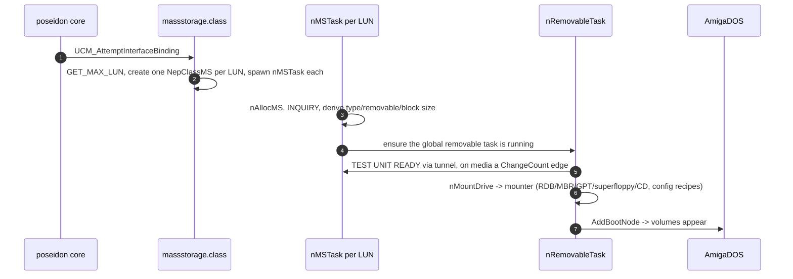

**A read request:**

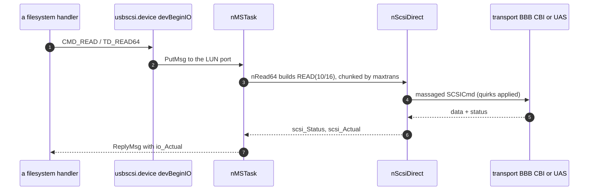

---

## 14. State machines

| Machine | Kind | State carrier |
|---|---|---|
| Per-LUN IO completion | implicit | the `unit_MsgPort` queue + the single `nMSTask` |
| Media presence / change | implicit edge | `ncm_UnitReady` + `ncm_ChangeCount` vs `ncm_LastChange` |
| BBB transport phase | implicit | the Command→Data→Status sequence + retry counter |
| Quirk escalation | implicit, persistent | `PFF_*` bits in `cdc_PatchFlags`, learned at runtime and saved |
| Cross-LUN bus access | lock | `ncm_UnitLUN0->ncm_XFerLock` (only if `MaxLUN != 0`) |
| UAS tag lifecycle | explicit, per tag | `ut_State` (`UTS_FREE`/`UTS_RUNNING`/`UTS_QUARANTINE`) + `ut_Outstanding` |

The most interesting one is **quirk escalation**: the `PFF_*` flag set is effectively a learned
device-compatibility state that ratchets toward "safer" behavior on errors and is **persisted**, so
the second encounter with a broken device starts already-adapted. The **media-change** machine is a
classic edge detector driving both DOS disk-change interrupts and the mount dispatch.

---

## 15. Notable quirks and refactoring hazards

* **The `PFF_*` quirk soup** (§8, §16.2) — 15 flags set three ways and persisted. Any refactor must
  preserve the *learned-and-saved* escalation behavior.
* **`usbscsi.device` is a co-resident `MakeLibrary`'d device** (§3, same trick as usbaudio's AHI
  sub-driver) — don't split it from the class.
* **The XFerLock-only-if-`MaxLUN` rule and the LUN-0 tunnel** (§6) are subtle: removing the tunnel
  re-introduces cross-task pipe races, and the async UAS tag path is protected by nothing but the
  single-threaded unit task.
* **EP0's NAK timeout is deliberately 100 ms longer than the data pipes'**, so the control pipe —
  which carries the recovery traffic (`CLEAR_FEATURE(ENDPOINT_HALT)`, bulk-only reset) — outlives
  the pipe whose timeout triggered the recovery. That offset is why EP0 cannot be handed to
  `nSetNakTimeout` alongside the others: with NAK timeouts switched off the sum would be a live
  100 ms window instead of "off". `nApplyNakTimeout` owns both the offset and its zero case; arm
  pipes through it rather than open-coding `PPA_NakTimeout`.
* **Residue is intentionally ignored** in BBB and the CSW signature check is skippable
  (`PFF_CSS_BROKEN`): correctness deliberately yields to firmware reality. Don't "fix" these.
* **Units are reused across replugs, so endpoint pointers must be reassigned unconditionally.**
  A unit is matched back to a returning device by DevID/IfID/LUN, which means a rebind starts with
  the *previous* device's object pointers still in place. `nUasCollectEndpoints` therefore clears
  the four UAS endpoint pointers before collecting, and `nFreeMS` NULLs every pipe pointer after
  freeing. Both are load-bearing: an "assign only if NULL" collector would keep the freed device's
  endpoints and allocate pipes against them, and a UAS↔BOT transport flip on the same unit would
  double-free the stale UAS pipes.

---

## 16. Appendix — maps and indexes

### 16.1 `usbscsi.device` command set (`devBeginIO`)

* **Block IO:** `CMD_READ`, `CMD_WRITE`, `TD_READ64`, `TD_WRITE64`, `TD_FORMAT64`, `TD_SEEK64`,
  `TD_FORMAT`, `TD_SEEK`, and the `NSCMD_TD_*64` aliases → `nRead64`/`nWrite64`/`nSeek64`.
  (`nFormat64` is prototyped but never defined — `TD_FORMAT*` all fall through to `nWrite64`.)
* **Geometry/control:** `TD_GETGEOMETRY` → `nGetGeometry`; `CMD_START`/`STOP`/`TD_EJECT` →
  `nStartStop`; `CMD_RESET`/`CMD_FLUSH` (abort pending/queued); `CMD_CLEAR`/`CMD_UPDATE`/`TD_MOTOR`
  (NOPs).
* **State:** `TD_CHANGENUM`, `TD_CHANGESTATE`, `TD_PROTSTATUS`, `TD_ADDCHANGEINT`/`TD_REMCHANGEINT`
  (inline).
* **Passthrough:** `HD_SCSICMD` → `nScsiDirect`. **NSD:** `NSCMD_DEVICEQUERY` →
  `NSDEVTYPE_TRACKDISK` + a 28-command `NSDSupported[]`.
* **Gone-device short-circuit:** when `ncm_DenyRequests` is set, enqueued commands are rejected
  *before* the `PutMsg`, with two different errors — `TDERR_DiskChanged` for the legacy group and
  `IOERR_ABORTED` for the `NSCMD_TD_*64` group.
* **`cmdNSDeviceQuery` validates strictly** (null `io_Data`, short `io_Length`, non-zero
  `DevQueryFormat` or `SizeAvailable` → `IOERR_NOCMD`). On that failure path it calls `TermIO`
  itself and returns `RC_DONTREPLY`, deliberately, so the dispatcher's error path can't write past
  a short IORequest; the success path returns `RC_OK` normally.

### 16.2 `PFF_*` patch flags (`massstorage.h`)

15 flags: `SINGLE_LUN` (0x0001), `MODE_XLATE` (0x0002, 6→10), `EMUL_LARGE_BLK` (0x0004),
`REM_SUPPORT` (0x0010), `FIX_INQ36` (0x0040), `DELAY_DATA` (0x0080), `SIMPLE_SCSI` (0x0100),
`NO_RESET` (0x0200), `FAKE_INQUIRY` (0x0400), `FIX_CAPACITY` (0x0800), `NO_FALLBACK` (0x1000),
`CSS_BROKEN` (0x2000), `CLEAR_EP` (0x4000), `DEBUG` (0x8000), `NO_UAS` (0x010000 — force Bulk-Only,
§9.3). Bits 0x08 and 0x20 are unallocated gaps. Default set at bind:
`MODE_XLATE | NO_RESET | FIX_INQ36 | SIMPLE_SCSI`.

### 16.3 Key structures

| Struct | Role |
|---|---|
| `NepMSBase` | class base: `nh_DevBase`, `nh_Units`, `nh_RemovableTask`, `nh_DummyNCM`, `nh_TaskLock`, the expansion/DOS/psd bases, the poll timer, `nh_RestartIt` |
| `NepClassMS` | one LUN; embeds `struct Unit`; per-transport pipes, `ncm_UasTags[]`, `ncm_XFerQueue`, `ncm_DmaAlign`, SCSI state, config, GUI objects |
| `UasTag` | one UAS tag context: `ut_IOReq`, its three stream pipes, `ut_Tag`/`ut_State` (`UTS_FREE`/`UTS_RUNNING`/`UTS_QUARANTINE`)/`ut_Outstanding`, the armed flags `ut_StatusArmed`/`ut_DataArmed`, `ut_AbortReq`/`ut_Failed`/`ut_IOErr`/`ut_IsRead`, the device-ownership pair `ut_CmdSent`/`ut_StatusSeen` (both set at finalize ⇒ quarantine), the chunk cursor (`ut_Data`/`ut_Offset`/`ut_Remain`/`ut_ChunkLen`/`ut_StartBlock`/`ut_StartBlockHigh`), `ut_CmdIU`, `ut_StatusBuf[64]`. `NCM_MAXTAGS` = 16. Walk the live ones with `MS_FOREACH_TAG(ncm, ut)` (`massstorage.h`) — the teardown loop in `nUasDisableTags` deliberately does not, since it must cover all `NCM_MAXTAGS` slots after the depth is already zeroed |
| `NepMSDevBase` | the `usbscsi.device` base |
| `ClsDevCfg` / `ClsUnitCfg` | per-device (`MSDC`) / per-LUN (`LUN0+n`) config |
| `MountFS` / `MountData` / `MountResult` (`mounter/`) | one filesystem recipe / mounter session state / per-run outcome counters |

### 16.4 File map

| File | Contents |
|---|---|
| `massstorage.class.c` | class + binding + tasks + device commands + SCSI hub + the mounter recipe builder (`nFillMountFS`/`nMountDrive`) + the GUI |
| `massstorage.h` / `massstorage.class.h` | structs, `PFF_*`, `nIsOverflowErr()`, `MS_FOREACH_TAG`, `MS_IOERR_FMT`/`MS_IOERR_ARGS`, the `RT_*` poll constants, prototypes |
| `dev.c` / `dev.h` | the `usbscsi.device` Exec device vectors |
| `massstorage_bulk.c` | BBB transport (CBW/CSW), `nBulkReset`/`nBulkClear`, the shared `nClearEndpointHalt` |
| `massstorage_cbi.c` | CBI/CB transport |
| `massstorage_uas.c` | UAS transport: IUs, the sync path, and the multi-tag engine — organised bottom-up in nine banner sections, definitions before uses |
| `massstorage_removable.c` | the global poller (`nRemovableTask` + its `nRT*` statics) and safe eject — eight banner sections, same bottom-up order |
| `mounter/mounter.c` | vendored A4091 mounter core: `MountDrive`, `probe_unit`, filesystem resolution (`attach_fs`, `is_fs_available`), naming (`is_name_taken`, `fix_name_collision`), `is_extent_mounted`. The three scanners live beside it — `mounter_rdb.c` (`mnt_scan_rdb`, `parse_rdsk`, `parse_part`, `parse_fshd`, `fs_relocate`, `fse_register`), `mounter_legacy.c` (`mnt_scan_legacy`, `parse_mbr`, `parse_gpt`, `register_legacy`) and `mounter_cd.c` (`mnt_scan_cd`, `classify_cd`, `read_pvd`) |
| `mounter/mounter.h`, `mounter_internal.h`, `legacy.h` | recipe/result structs and `MOUNTFS_*` flags; mounter-internal decls; on-disc MBR/GPT layouts |
| `CMakeLists.txt` | builds the mounter with `MOUNTER_LOG` + `MOUNTER_TRACE=1` |

### 16.5 See also

[poseidon.library-architecture.md](poseidon.library-architecture.md) (§5 pipes, §7 binding, §10
locks), [massstorage-throughput.md](massstorage-throughput.md) (transport ceilings and the DMA
bounce), and [usbaudio.class-architecture.md](usbaudio.class-architecture.md) for the comparable
dual-library (`MakeLibrary`'d co-resident) pattern.
