# massstorage.class — Architecture (reverse-engineered)

> Scope: the **`massstorage.class`** USB Mass-Storage driver — the largest class in the stack
> (~8.6k lines across 6 files + a vendored mounter submodule). It is a *consumer* of
> `poseidon.library` ([core doc](poseidon.library-architecture.md)) on its lower edge and a
> *provider* to **AmigaDOS** on its upper edge, exposing USB storage as an embedded
> `usbscsi.device` and auto-mounting partitions as DOS volumes.
>
> Sources: `classes/massstorage/massstorage.class.c` (~5.5k lines), `massstorage.h`,
> `massstorage.class.h`, `dev.c`/`dev.h` (the `usbscsi.device` glue), the three transports
> `massstorage_bulk.c` / `massstorage_cbi.c` / `massstorage_uas.c`, and the vendored A4091
> `mounter/mounter.c` (RDB/MBR/GPT/CD). Line numbers are indicative.

---

## Table of contents

1. [What this driver is](#1-what-this-driver-is)
2. [Layering](#2-layering)
3. [The dual-library structure](#3-the-dual-library-structure)
4. [Object model](#4-object-model)
5. [Binding and the per-LUN model](#5-binding-and-the-per-lun-model)
6. [Task and serialization model](#6-task-and-serialization-model)
7. [The AmigaDOS device edge — usbscsi.device](#7-the-amigados-device-edge--usbscsidevice)
8. [The SCSI layer — nScsiDirect](#8-the-scsi-layer--nscsidirect)
9. [The three USB transports](#9-the-three-usb-transports)
10. [Removable media and auto-mount](#10-removable-media-and-auto-mount)
11. [Partition parsing and mounting](#11-partition-parsing-and-mounting)
12. [Config and GUI](#12-config-and-gui)
13. [End-to-end flows](#13-end-to-end-flows)
14. [State machines](#14-state-machines)
15. [Notable quirks and refactoring hazards](#15-notable-quirks-and-refactoring-hazards)
16. [Appendix — maps and indexes](#16-appendix--maps-and-indexes)

---

## 1. What this driver is

`massstorage.class` turns USB storage devices into AmigaDOS volumes. It is the most multi-faceted
component in the stack, with five distinct subsystems in one binary:

1. A **Poseidon class driver** (`NepMSBase`) that binds USB mass-storage *interfaces*.
2. An **embedded `usbscsi.device`** (`NepMSDevBase`) — a real Exec device exposing one unit per
   USB **LUN** to AmigaDOS as a trackdisk/SCSI device.
3. **Three USB transports** — Bulk-Only (BBB), Control/Bulk/Interrupt (CBI/CB), and USB Attached
   SCSI (UAS) — under a uniform `SCSICmd` interface.
4. A **removable-media poller** that drives the vendored **A4091 mounter** (RDB/MBR/GPT/superfloppy/NTFS/CD) to auto-mount
   volumes.
5. A **MUI config GUI** with a large per-device quirk panel.

It also carries a substantial **quirk system** (the `PFF_*` patch flags) to cope with the
notoriously non-conformant world of cheap USB storage firmware, set three ways: hard-wired
vendor/product tables, GUI toggles, and runtime auto-fallback.

---

## 2. Layering

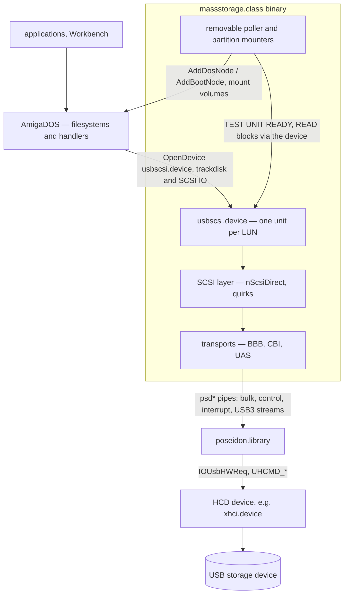

The class sits between two worlds and speaks a different protocol to each:

* **Down to `poseidon.library`** — the `psd*` pipe API (bulk/control/interrupt transfers, and
  USB3 streams for UAS). It implements the `usbclass` ABI the core calls.
* **Up to AmigaDOS** — it *is* `usbscsi.device` (a trackdisk/SCSI device), and it drives
  `expansion.library`/`dos.library` to mount partitions. Filesystems and handlers (fat95, RDB
  filesystems, cdrom-fs) sit above it like they would above any disk device.

Note the storage stack's PiStorm reality (recorded project constraint): the HCD (`xhci.device`)
bounce-buffers DMA through Fast RAM, so this class doesn't need to worry about DMA-unreachable
buffers — it just hands `psd*` ordinary pointers.

---

## 3. The dual-library structure

Like `usbaudio.class`, this is **two Exec libraries in one binary** — but here the second one is a
*device*, not a library:

| Library | Base struct | Name | Role |
|---|---|---|---|
| Poseidon class | `NepMSBase` (`massstorage.h:270`) | `massstorage.class` | implements the `usbclass` ABI + GUI |
| Embedded device | `NepMSDevBase` (`massstorage.h:301`) | `usbscsi.device` | trackdisk/SCSI device exposing LUNs to AmigaDOS |

`libInit` (`massstorage.class.c:64`) builds the device via
`MakeLibrary(DevFuncTable, NULL, devInit, sizeof(NepMSDevBase), NULL)`, sets `np_ClsBase = nh`,
**`AddDevice`**s it into the system device list as `usbscsi.device`, and pins its open count so it
can't expunge while the class is resident. `DevFuncTable` is the standard device vector set
`devOpen/devClose/devExpunge/devReserved/devBeginIO/devAbortIO`. Any program (or DOS) can then
`OpenDevice("usbscsi.device", unit, …)` and reach a USB LUN. Teardown is driven by the class's
`libExpunge` (`:151`), which `RemDevice`s it.

This is the same trick `usbaudio.class` uses for its AHI sub-driver — a co-resident Exec entity
sharing the class's address space.

---

## 4. Object model

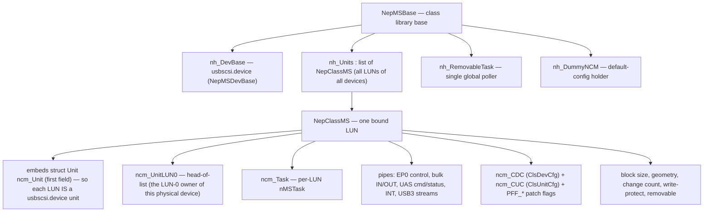

The defining structural fact: **`NepClassMS` embeds `struct Unit ncm_Unit` as its first field**
(`massstorage.h:132`), so a `NepClassMS *` and a `usbscsi.device` `Unit *` are the same pointer.
**One USB LUN = one `NepClassMS` = one device unit.** All LUNs of one physical device share a
`ncm_UnitLUN0` head pointer (the LUN-0 instance owns the cross-LUN transfer lock). The unit's
`unit_MsgPort` doubles as the per-LUN list node *and* the command port the LUN's task waits on.

* **`NepMSBase`** — the class base: `nh_DevBase` (the device), `nh_Units` (every LUN), the single
  `nh_RemovableTask` + `nh_TaskLock` + the spawn handshake (`nh_ReadySigTask`/`nh_ReadySignal`),
  `nh_DummyNCM` (the class-default config), the lazily-opened `expansion`/`dos`/`psd` bases, the
  3-second poll timer, and `nh_RestartIt` (the DOS-appeared relaunch flag).
* **`NepClassMS`** — per LUN: the embedded `Unit`, the per-transport pipes, the SCSI/geometry
  state, `ncm_DmaAlign` (cached `HA_DMAAlignment`, handed to the mounter, §11), the disk-change
  machinery (`ncm_ChangeCount`/`ncm_DCInts`), the FIFO (`ncm_XFerQueue`), the UAS tag array
  (`ncm_UasTags[]` + `ncm_UasQueueDepth`), the config (`ncm_CDC`/`ncm_CUC`), and a large block of
  MUI GUI objects. Note there are **no per-instance stream-pipe fields** — since the tag engine,
  the stream pipes live per-tag inside `ncm_UasTags[]`.
* **`NepMSDevBase`** — the `usbscsi.device` base (`np_ClsBase` back to the class).

---

## 5. Binding and the per-LUN model

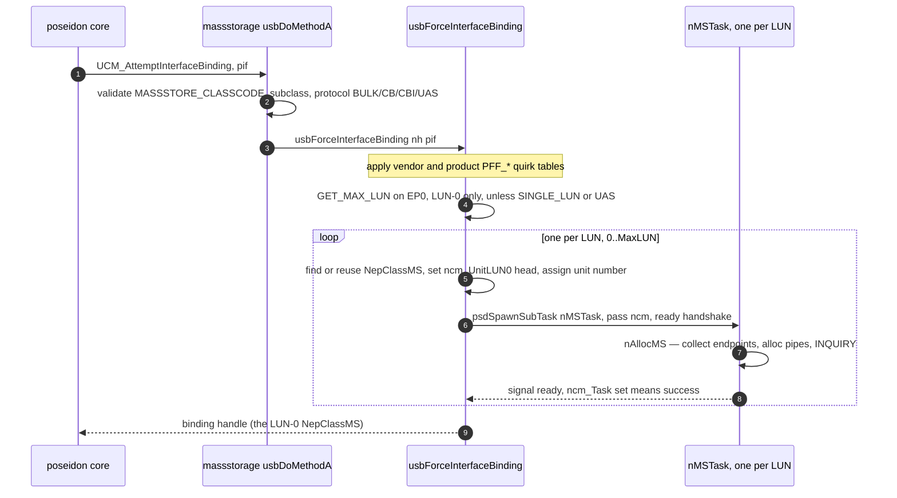

* **Validation** (`usbAttemptInterfaceBinding`): `MASSSTORE_CLASSCODE` (0x08), a known
  subclass (SCSI/RBC/ATAPI/UFI/…), and protocol BULK (0x50) / CB (0x01) / CBI (0x00) / UAS
  (0x62). It blacklists a known Huawei modem that mis-advertises as storage.
* **Declining BOT in favour of UAS** (`nPreferUasAlternate`): when the offered interface is an
  *active BOT* one, the class checks whether the device is SuperSpeed, its hardware reports
  `HA_StreamsSupported`, and the interface has a UAS alternate — and if so returns NULL to
  **decline**, so the scan comes back with the UAS alternate instead (§9.3). The whole check is
  skipped when `PFF_NO_UAS` is set in the **class-default** config (`nh_DummyNCM`), making the
  "Prefer UAS" GUI toggle a global opt-out rather than a per-device one.
* **GET_MAX_LUN** (`usbForceInterfaceBinding`): issued once on the LUN-0 control pipe
  (unless `PFF_SINGLE_LUN` or UAS), with three retries at 500 ms and a clamp (>7 → 3); failure
  falls back to `PFF_SINGLE_LUN` and defers the config store.
* **One `NepClassMS` per LUN**: the binding loops `0..MaxLUN`, finding-or-reusing a `NepClassMS`
  (reuse matched by DevID+IfID+LUN strings, so re-plug returns to the same unit number), assigning
  a unit number starting from `cuc_DefaultUnit`, and spawning a `nMSTask` per LUN with the
  standard `psdBorrowLocksWait` ready handshake.
* **Quirk application**: vendor/product `PFF_*` tables are OR'd in here (Genesys, JetFlash,
  Olympus, Prolific, ZIP, …), then merged with saved config (§12).
* **Release** (`usbReleaseInterfaceBinding`, `:686`): tears down all sibling LUNs of the device;
  the `NepClassMS` memory is kept (freed only in `libExpunge`) so re-plug reuses it.
* **`ncm_DenyRequests` is the unit's open/closed gate**, and because a unit is never unlinked from
  `nh_Units` it is the *only* thing standing between `devOpen` and a unit with no task behind it.
  The invariant: **FALSE exactly while a live `nMSTask` owns the port.** Set TRUE at unit creation
  (before the `AddTail`), cleared by `nMSTask` the moment `nAllocMS` hands it a live task — before
  the startup `nBulkReset`, which itself bails out on the flag — and set TRUE again by release, by
  the task's teardown, and by a failed `nAllocMS` (which also disarms the port, `PA_IGNORE` +
  `mp_SigTask = NULL`, exactly as `nFreeMS` does, since its signal bit is already freed).

---

## 6. Task and serialization model

Three kinds of task, and a careful serialization scheme because multiple LUNs share one physical
USB pipe set.

| Task | Count | Role |
|---|---|---|
| `nMSTask` (`:1117`) | one per LUN | the **only** executor of that LUN's USB IO; runs the device-command service loop |
| `nRemovableTask` (`:3833`) | one global | polls every removable LUN every ~3 s for media change and auto-mounts |
| `nGUITask` (`:5373`) | on demand | the MUI config window |

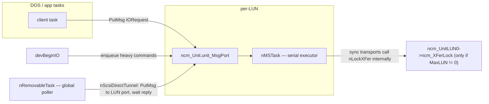

* **Per-LUN serialization is automatic**: `devBeginIO` `PutMsg`s heavy commands to the LUN's
  `unit_MsgPort`, and the single `nMSTask` owns their execution. The task moves arriving requests
  onto the Forbid-protected `ncm_XFerQueue` FIFO and drains it from the head: with the UAS tag
  engine on (§9.3), eligible block IO submits asynchronously onto free tags — up to
  `cdc_UasQueueDepth` commands concurrently on the wire. Everything else runs through the
  **synchronous transport**, which is no longer a barrier: it claims a free tag of its own
  (`nUasClaimTag`, waiting for one if the engine is saturated) and blocks only the unit task, not
  the wire — sibling tags keep their data moving underneath. This is safe because `psdWaitPipe()`
  consumes only its own pipe's reply and restores the port signal, so the other tags' replies
  simply queue for the next reap.
  `devAbortIO` removes queued requests from the FIFO under Forbid and flags in-flight tags
  (`ut_AbortReq` + task Signal; the request completes with `IOERR_ABORTED` through the normal
  completion path).
* **What still drains** (`nUasDrainTags`) is the semantic minimum: `CMD_RESET`/`CMD_FLUSH`, which
  are barriers by definition; `TD_EJECT`/`CMD_START`/`CMD_STOP`, because a medium-state change must
  not overlap in-flight data (SCSI SIMPLE tasks may be reordered, and spinning down under a write
  is exactly the case that bites); the task teardown; and the suspend probe. On BOT/CBI (no engine)
  the drain is a no-op and every request is strictly serial, i.e. the classic behavior.
* **What "eligible" actually means** (`nUasEligible`) is narrower than "READ/WRITE families":
  the opcode must be one of `CMD_READ`/`CMD_WRITE`/`TD_READ64`/`TD_WRITE64`/`NSCMD_TD_READ64`/
  `NSCMD_TD_WRITE64`, **`ncm_BlockSize` must already be known** (the first block IO after a bind
  probes it through the synchronous transport), the `PFF_EMUL_LARGE_BLK` quirk must be clear, the
  length must be non-zero, and both length and offset must be block-aligned. Everything else —
  `TD_FORMAT*`, `TD_SEEK*`, `HD_SCSICMD`, geometry — takes the synchronous transport. Note that
  because the unit task executes one FIFO entry at a time, at most **one** synchronous command is
  ever in flight, so the only concurrency introduced is sync-command-vs-async-block-IO; the
  read-modify-write emulation paths (`PFF_EMUL_LARGE_BLK`, which makes *all* IO ineligible) can
  never overlap each other.
* **Cross-LUN serialization** uses `ncm_XFerLock`, a semaphore living in the **LUN-0** instance —
  but **only when `ncm_MaxLUN != 0`**; single-LUN devices skip the lock entirely. The bracketing
  lives **inside the synchronous transports** (`nScsiDirectBulk`/`CBI`/`UAS`), not in `nMSTask`,
  which takes it only around the initial `nBulkReset`. Consequence: **the async tag path takes no
  transport lock at all** — `nUasSubmitChunk` never touches it. That is safe only because UAS
  implies `ncm_MaxLUN == 0`, which makes the lock a no-op anyway.
* **The LUN-0 tunnel** (`nIOCmdTunnel` `:4249` / `nScsiDirectTunnel` `:4269`): background work
  (the removable poller, write-protect/geometry refresh) runs in the global task, which must not
  touch the bulk pipes directly. So it *tunnels* — `PutMsg`s a fake `HD_SCSICMD` IORequest to the
  target LUN's port and waits for the reply on `nh_IOMsgPort`. This keeps the LUN task the single
  executor for that physical device even for background IO.

---

## 7. The AmigaDOS device edge — usbscsi.device

`devBeginIO` (`dev.c:173`) classifies each `io_Command` into three buckets:

* **Inline** (caller context, no task hop): `TD_CHANGENUM`/`TD_CHANGESTATE`/`TD_PROTSTATUS`
  (read cached state), `TD_ADDCHANGEINT`/`TD_REMCHANGEINT` (register a disk-change interrupt into
  `ncm_DCInts` — the add is never replied; it lives until removed), and the NOPs
  `CMD_CLEAR`/`CMD_UPDATE`/`TD_MOTOR` (there is no cache layer).
* **Enqueue to the LUN task**: `CMD_READ`/`CMD_WRITE`, `TD_READ64`/`WRITE64`/`SEEK64`/`FORMAT64`
  (+ their `NSCMD_*` aliases), `TD_GETGEOMETRY`, `CMD_START`/`STOP`/`RESET`/`FLUSH`, `TD_EJECT`,
  `HD_SCSICMD` — `PutMsg`'d to the unit port, replied by `nMSTask`.
* **NSD**: `NSCMD_DEVICEQUERY` reports `NSDEVTYPE_TRACKDISK` and the full supported-command list.

Read/write path (executed in `nMSTask`):

* `nRead64`/`nWrite64` compute the LBA from the trackdisk-64 `io_Offset`/`io_Actual` convention,
  emit **READ(10)/WRITE(10)** (or READ(16)/WRITE(16) above 2 TB), and **chunk** each transfer at
  `maxtrans = 1 << (cdc_MaxTransfer + 16)`.
* **Large-block emulation** (`nRead64Emul` `:2596` / `nWrite64Emul` `:2705`): when the medium's
  block size is not 512 (e.g. 2048-byte CD), it presents a 512-byte logical sector to AmigaDOS via
  a one-block bounce buffer (`ncm_OneBlock`) and **read-modify-write** for partial blocks.
* **Geometry** (`nGetGeometry` `:2238`): READ CAPACITY → block size + count; MODE SENSE pages
  0x03/0x04/0x05 → CHS; missing fields filled arithmetically; and `nFakeGeometry` (`:2028`)
  synthesizes CHS by **prime-factorizing** the block count when the device gives nothing usable.
* **Disk-change reporting**: `ncm_ChangeCount` (bumped on media insert/remove/WP-change),
  `TD_CHANGENUM`/`TD_CHANGESTATE`, and `Cause()` on every `ncm_DCInts` interrupt when the medium
  changes.

(Full command/dispatch detail is in the appendix.)

---

## 8. The SCSI layer — nScsiDirect

Every storage operation funnels through `nScsiDirect(ncm, scsicmd)` (`:3123`), which presents a
uniform Amiga `struct SCSICmd` interface and **owns all the quirk handling** before dispatching to
a transport:

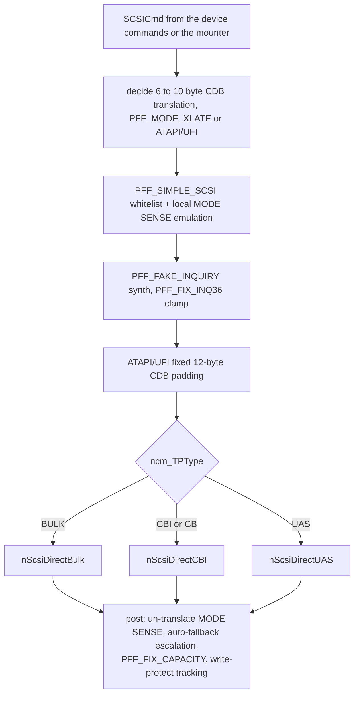

The transports never see quirks — they get an already-massaged `SCSICmd`. Key behaviors:

* **6→10 byte CDB translation** (`PFF_MODE_XLATE`, or forced for ATAPI/UFI which never take 6-byte
  CDBs).
* **`PFF_SIMPLE_SCSI`** — a hard command whitelist that fabricates MODE SENSE pages locally from
  `ncm_Geometry` and rejects everything else with a synthetic CHECK CONDITION, keeping fragile
  firmware from crashing on unexpected opcodes.
* **INQUIRY handling** — `PFF_FAKE_INQUIRY` synthesizes a 36-byte response from Poseidon's known
  vendor/product strings; `PFF_FIX_INQ36` clamps the allocation length.
* **Auto-fallback escalation** — on phase errors the class *escalates quirks and persists them*:
  `PFF_FIX_INQ36 → PFF_FAKE_INQUIRY`, `PFF_MODE_XLATE → PFF_SIMPLE_SCSI`, each saved via
  `nStoreConfig`. The driver learns a device's brokenness and remembers it.
* **CD/DVD NAK floor** — an INQUIRY reporting `PDT_CDROM`/`PDT_WORM` also puts a floor under the
  NAK timeout, because optical drives NAK for many seconds while seeking or spinning up: a
  configured value below `MIN_CD_NAKTIMEOUT` (15 s) is raised to it across *every* live pipe via
  `nApplyNakTimeout`. It is a floor, not an override — a longer setting is left alone and a
  configured 0 ("NAK timeouts off") is honoured. Unlike the escalations above it is deliberately
  **not** persisted: the default sits above the floor, so reaching this path means the value was
  chosen on purpose, and the stored preference stays intact.
* **`PFF_FIX_CAPACITY`** (off-by-one READ CAPACITY) and live **write-protect tracking** from MODE
  SENSE replies.

The full 14-flag quirk matrix is in §15 / the appendix.

---

## 9. The three USB transports

`nScsiDirect` dispatches by `ncm_TPType` to one of three back-ends, each a different USB protocol.

### 9.1 BBB — Bulk-Only (the common case)

The classic 3-phase Command/Data/Status over two bulk pipes:

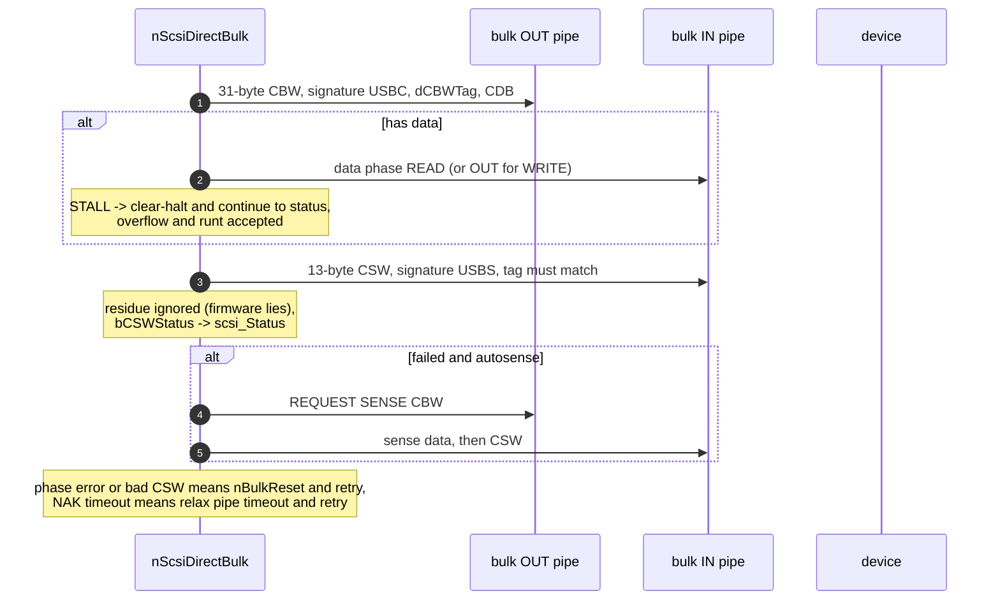

* **CBW** = 31 bytes (sent as `UMSCBW_SIZEOF`, *not* `sizeof` which pads to 32). `dCBWTag` is
  `(IPTR)scsicmd + ++ncm_TagCount` — pointer-derived *plus* an incrementing counter, so a retry and
  its follow-up sense CBW get distinct tags — and is matched in the CSW.
* Data-phase errors are handled leniently so the code **usually reaches the CSW** (the device's
  status is authoritative). The residue is deliberately ignored. The exception is a data-phase
  **NAK timeout**, which breaks straight to the retry rung without reading the CSW.
* **"Device sent too much" is forgiven on every transport, via `nIsOverflowErr()`.** The helper
  treats `UHIOERR_BABBLE` exactly like `UHIOERR_OVERFLOW`, because that is the same wire condition
  spelled differently: UHCI/OHCI/EHCI report it as overflow, xHCI folds it into Babble Detected.
  AROS-era code forgave only `UHIOERR_OVERFLOW`, which turned every over-read on `xhci.device`
  into a spurious phase error. All three transports go through the helper — BBB on data, CSW,
  sense data and sense CSW; CBI on data; UAS via `nUasErrForgiven`. **Any new error check that
  means "too much data" must use it.**
* Recovery ladder, more precisely than "clear then reset":
  * a **CBW-phase** stall → `nBulkClear`;
  * a **data-** or **CSW-phase** stall → an inline EP0 `CLEAR_FEATURE(ENDPOINT_HALT)`, *not*
    `nBulkClear`;
  * phase errors and hard errors → `nBulkReset` (Bulk-Only Mass Storage Reset + clear-halt both
    endpoints);
  * NAK-timeouts are treated as "busy": back off 500 ms and **relax the pipe NAK timeout** (CSW
    and CBW to 120 s, data to 60 s read / 120 s write) for slow flash erase/program.
* **`nBulkReset` self-degrades.** One failed `BULK_ONLY_RESET` sets `ncm_BulkResetBorks`, after
  which the class-specific reset is never attempted again on that device — recovery silently
  becomes clear-halt-only. Worth knowing when a device "stops recovering" mid-session.
* **The "command-level retry loop" is one retry, not a loop.** `retrycnt` starts at **0** unless
  the caller set the autoretry flag (`scsi_Flags & 0x80`) or a NAK-timeout bumped it to 1.
* **BOT is queue-depth 1 by specification, and that is not a limitation of this driver.** Exactly
  one CBW may be outstanding: the device must finish the data phase and return the CSW before the
  host may send the next CBW. The tag only validates the single outstanding command (`dCSWTag ==
  dCBWTag`); it is *not* a queuing mechanism. A second CBW sent early is read by the device as
  data-phase payload (write corruption) or as a protocol violation → phase error → Reset Recovery,
  and on sloppy firmware as silent corruption. Every OS runs BOT at QD1; UAS (§9.3) exists
  precisely to add the queuing BOT structurally lacks. Class-level substitutes are deliberately
  not attempted: read-ahead is disabled in this driver by design, and coalescing adjacent
  requests would not pay — concurrent requests come from different partitions and are rarely
  adjacent.

### 9.2 CBI — Control/Bulk/Interrupt

Command via a control transfer (ADSC), data via bulk, status via the interrupt endpoint:

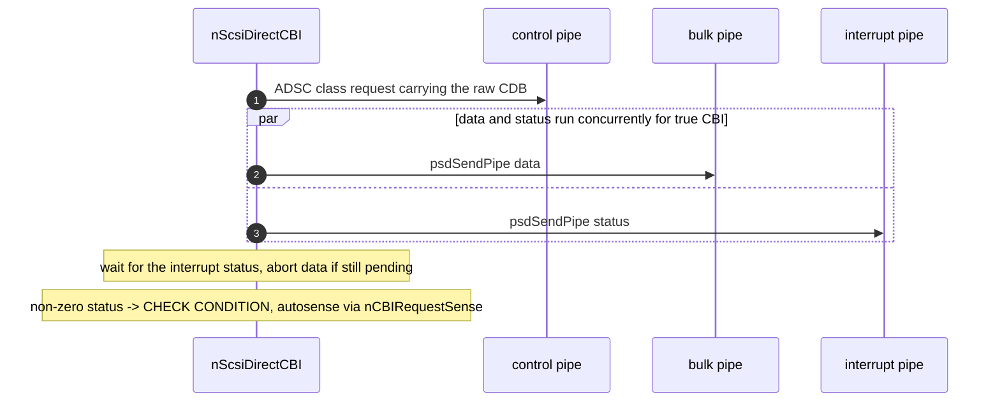

The fork-join (data ‖ interrupt-status) is necessary because the device may signal completion on
the interrupt endpoint before the data transfer finishes — the status pipe is armed *first*, then
the data pipe. Plain CB (no interrupt EP) degrades to a synchronous data phase with a synthesized
PASS status.

Three details the diagram flattens:

* **The fork-join only runs when there is data.** A zero-length command reads the interrupt status
  synchronously with `psdDoPipe`.
* **The status byte is pre-seeded to `USMF_CSW_PHASEERR`** before the pipe is armed, so an aborted
  or short status reads as a phase error rather than as success. A `UHIOERR_RUNTPACKET` on the
  status read is forgiven.
* **Recovery is shared with BBB.** CBI's command-phase stall uses `nBulkClear`, and its reset rung
  is the same `nBulkReset`, which for CBI/CB issues the 12-byte `0x1D 0x04 FF…` reset command
  instead of the Bulk-Only class request.

### 9.3 UAS — USB Attached SCSI (USB3)

Replaces the serial CBW/CSW model with tagged **Information Units** over up to four pipes, and on
USB3 uses **bulk streams** for pipelining:

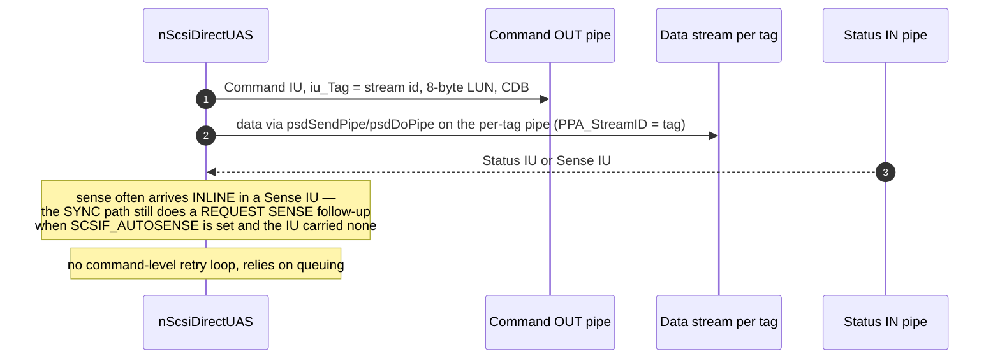

* The **stream ID is the tag**, binding a command's data and status to its stream (on SS the
  Status IU for tag *n* arrives on stream *n* of the status pipe; the command pipe stays plain per
  the UAS spec).
* **The multi-tag engine is the only UAS transport** (`cdc_UasQueueDepth` 1–16, floor enforced at
  config load): `nUasInitTags` builds `ncm_UasQueueDepth` tag contexts (`struct UasTag`, up to
  `NCM_MAXTAGS` 16), each with its own status/data-in/data-out pipes at `PPA_StreamID == tag`
  (ids assigned descending so the library's `ALLOC_STREAMS` fires once per endpoint), then
  verifies `EA_StreamsAlloc ≥ QD` on all three endpoints — a silent single-ring fallback would
  interleave tags on one ring and corrupt data. **Any gate failing fails the bind loudly**
  (`RETURN_FAIL` in the Trident log; the *"MSD … available through usbscsi.device unit N!"* line
  never appears and the unit gets no task): the binding already guaranteed a SuperSpeed device on
  a stream-capable HCD, so a gate failure is a genuine fault, not a degraded mode. There is,
  however, a third outcome between "works" and "fails loudly": a device advertising **fewer**
  streams than `cdc_UasQueueDepth` silently **clamps the queue depth down** — only a *zero*
  `EA_MaxStreams` on any of the three endpoints is fatal, and the `EA_StreamsAlloc` verify then
  runs against the clamped depth. Per chunk, a tag arms its status pipe, then its data pipe
  (`psdSendPipe`), then
  sends the Command IU with a blocking `psdDoPipe` on the shared command pipe (Linux uas
  ordering); the task reaps completions off `ncm_TaskMsgPort` with `psdCheckPipe`/`psdWaitPipe`,
  chunks large transfers on the same tag (`cdc_MaxTransfer` granularity), aborts a failed chunk's
  sibling pipe, and replies the client request from `nUasFinalizeTag`. Synchronous commands take a
  free tag of their own (`nUasClaimTag` inside `nUasDoCommand`, waiting for one when the engine is
  saturated) — the stream endpoints are in LSA mode, so plain pipes can't reach them, and a claimed
  tag is marked `UTS_RUNNING` with no `ut_IOReq`, which keeps both the FIFO dispatcher and the
  reaper off it. They no longer drain the engine (§6).
* **A killed tag is quarantined, not freed** (`UTS_QUARANTINE`). A host-side kill — NAK timeout,
  `AbortIO`, any pipe error — leaves the *device* still owning the command whenever the Command IU
  was delivered and no Sense IU came back (tracked per chunk as `ut_CmdSent` / `ut_StatusSeen`).
  Reusing that tag would let the old command's Sense IU land in the new command's status transfer,
  so the tag stays unusable until the device lets go. The ladder:
  1. **ABORT TASK** Task Management IU on the command pipe (`nUasIssueTMF`), one TMF at a time.
     The TM IU carries a tag of its own: stream id **QD+1**, reserved at `nUasInitTags` when
     `EA_MaxStreams` has the headroom — allocated *first*, because the first `PPA_StreamID` on an
     endpoint sizes its ring set. Without headroom the engine runs in **borrow mode**: it waits
     for every other tag to go idle and lends the TMF one of their tags (never the target's — that
     would collide with the very task being aborted), and at QD 1 it skips straight to the reset.
  2. The **Response IU** arrives on the TM tag's status stream; only `TMF_COMPLETE`/`TMF_SUCCEEDED`
     release the tag. The TM pipe's NAK timeout *is* the TMF deadline — there is no second timer.
  3. Anything else (refused, garbled, timed out) escalates to **`psdResetDevice()`**, which
     port-resets and re-addresses the device; the engine is then torn down and rebuilt on the fresh
     endpoint contexts. If the stack cannot reset (an HCD or library without
     `NSCMD_USB_RESET_DEVICE`), the class logs one warning and releases the tags anyway — degrading
     to the historical stale-Sense hazard rather than wedging the unit for good.
  Quarantined tags count as busy for `nUasTagsIdle()`, so both `nUasDrainTags()` and the suspend
  probe wait for the ladder to resolve — which it does in bounded time, by construction.
* **Engine invariants worth stating explicitly:**
  * **A tag is reused only at `ut_Outstanding == 0`.** Cross-pipe coupling means a failed chunk
    aborts its sibling pipe; reusing the tag before both pipes have retired would let a late
    sibling reply land in the reused tag's fresh transfer.
  * **Completions are reaped with `psdCheckPipe` + `psdWaitPipe`, never `GetMsg`.** `psdWaitPipe`
    on a replied-but-not-yet-dequeued pipe collects the result with full DeadCount/IOBusyCount
    bookkeeping and removes the node safely; a `GetMsg` followed by `psdWaitPipe` would Remove the
    same node twice. It also only ever consumes *its own* pipe's reply, re-setting the port signal
    — which is what lets a synchronous command block on one tag while others stay in flight.
  * **Only a Sense IU closes a command.** `nUasParseStatusIU` reads the SCSI status from byte 6
    for a Sense IU *only*; in any other IU that byte means something else entirely (in a Response
    IU it is additional response info). An unexpected IU on a command tag is a protocol violation
    → `HFERR_Phase`, and the tag is quarantined because the command's device-side fate is unknown.
  * **No autosense follow-up on the tagged path.** UAS delivers sense inline in the Sense IU, and
    the block-IO family discards sense anyway (`nRead64`'s sense buffer is never inspected), so a
    bad status maps straight to `HFERR_BadStatus` with no REQUEST SENSE round trip.
  * **`ncm_XFerLock` is inert for UAS.** `GET_MAX_LUN` is skipped, so `ncm_MaxLUN == 0` and
    `nLockXFer`/`nUnlockXFer` never actually lock (they only do for multi-LUN). UAS serialization
    comes purely from the single-threaded unit task.
* **Completion ordering across tags is not guaranteed, by design.** Submission is FIFO, but the
  tags carry the SCSI SIMPLE attribute and may complete in any order. That is safe here:
  concurrent requests come from different partitions (disjoint block ranges), and exec IO promises
  no cross-request completion ordering to begin with — so no FUA or barrier machinery is needed.
* **Throughput reference (2026-07-10, PiStorm + RPi4/CM4, VL805):** max sequential read
  **377 MB/s**. That is the platform ceiling, not a stack limit — the VL805 sits on PCIe Gen2 ×1
  (4 Gbps, ≈400 MB/s after 8b/10b and packet overhead), and Linux UAS SSD figures on the same
  silicon run ~320–360 MB/s. There is nothing left to chase on reads.
* **UAS is LUN 0 only.** `GET_MAX_LUN` is a BOT request and is skipped for UAS, so exactly one
  unit binds. Multi-LUN UAS would need SCSI `REPORT LUNS` discovery at bind (the Command IU's
  8-byte LUN field is already filled by `nUasFillLun`) plus moving the tag engine into a
  per-interface transport object shared by the LUN units — a Phase-6b-sized follow-up, out of
  scope for now.
* On the context backend the library backs these stream pipes with real xHCI stream rings
  (`NSCMD_USB_ALLOC_STREAMS`, issued automatically when the pipes join the stream id space; freed
  on close). The `EA_StreamsAlloc` verify in `nUasInitTags` is what turns the library's silent
  single-ring fallback into the loud bind failure described above.
* **Binding prefers the UAS alternate** on a BOT+UAS device when it can actually run:
  `usbAttemptInterfaceBinding` declines the active BOT interface if an alternate is UAS, the device is
  SuperSpeed, and the hardware reports `HA_StreamsSupported` — the class scan then offers the UAS
  alternate, which is accepted and switched to once. HS devices and stream-less backends keep binding
  BOT exactly as before. Two qualifiers: the whole preference is skipped when **`PFF_NO_UAS`** is
  set (the "Prefer UAS" GUI toggle, §12) — and that flag is read from the **class default** config,
  not the per-device one, so it is a global opt-out; and the alternate is switched by
  `nAllocMS` itself via `psdSetAltInterface`, deliberately **before** stream setup and INQUIRY,
  because the enumerator's own switch of the accepted alternate happens after the bind task has
  run — too late for the endpoints to exist when the streams are allocated.
* Status/sense come back as structured IUs (often **inline sense**, avoiding a round-trip). The
  per-tag pipes are armed with `PPA_AllowRuntPackets` on status, `PPA_NoShortPackets` on data-out,
  and the configured NAK timeout on all three.

---

## 10. Removable media and auto-mount

One global `nRemovableTask`, started lazily by the first removable LUN (`nStartRemovableTask`,
semaphore-guarded and idempotent), polls every ~3 seconds.

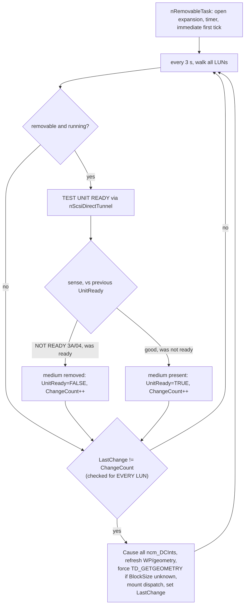

* **Media-change is edge-triggered** by comparing `ncm_LastChange != ncm_ChangeCount`. On an edge
  it `Cause()`s every registered disk-change interrupt (telling DOS the disk changed), refreshes
  write-protect/geometry, and runs the mount dispatch (§11).
* **The change check runs for *every* LUN, not just removable ones** — it sits outside the
  removable/TUR branch. That is exactly how **fixed** disks get mounted: `nMSTask` sets
  `ncm_ForceRTCheck` for non-removables and their `ChangeCount` is bumped from elsewhere. Note
  also that both TUR edges are guarded by the *previous* `ncm_UnitReady`, so `ChangeCount` moves
  only on a genuine transition, not on every poll.
* Before mounting, a `TD_GETGEOMETRY` is forced when `ncm_BlockSize` is still 0 — the mounter
  needs the block size — and a freshly inserted medium on a UFI-subclass unit gets a `CMD_START`.
* **The DOS-availability dance**: at cold boot the task may run before `dos.library` exists. It
  retries `OpenLibrary("dos.library")` each pass; once DOS appears it forces a re-mount of every
  unit and relaunches itself as a *process* (so it can safely call DOS).
* **Startup delay** (`cdc_StartupDelay`) is applied per-device in `nMSTask` before the first
  INQUIRY, giving slow drives time to spin up. **Auto-unmount** (`cuc_AutoUnmount`) tears down
  volumes when a LUN goes away.

---

## 11. Partition parsing and mounting

All media parsing and mounting lives in the **vendored A4091 `mounter/mounter.c`** (fork,
branch `poseidon-fixes`; compiled with `-DMOUNTER_LOG -DMOUNTER_TRACE=1` — MBR/GPT/superfloppy
support is always built now, the old `-DDISKLABELS` gate is gone). The class builds three
`struct MountFS` "recipes" (FAT / NTFS / CD: dostype, handler path, DOS name, `de_Control`,
buffers, MaxTransfer) from its config and calls `MountDrive()` once per media insert.

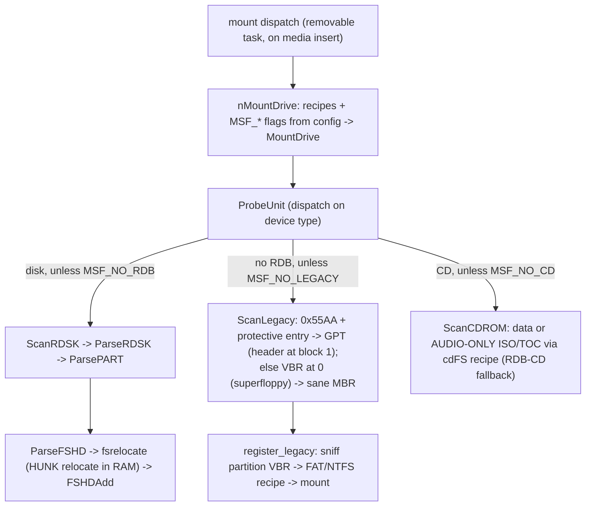

* **RDB**: `ScanRDSK` → `ParsePART`; filesystems come from `FileSystem.resource` or are HUNK-
  relocated in RAM from the RDB's FSHD/LSEG blocks (`fsrelocate`) and published to the resource.
* **MBR/GPT/superfloppy**: `ScanLegacy` disambiguates a filesystem-at-block-0 (VBR) from a real
  partition table, then `register_legacy` sniffs each partition's own boot sector to pick the
  **FAT or NTFS recipe** (the MBR type byte / GPT GUID is only a hint); exFAT/unknown content is
  skipped. Extended containers (0x05/0x0F/0x85) are walked; entries are sanity-checked.
* **CDs**: `ScanCDROM` mounts data CDs with the CD recipe (Amiga-bootable ones get boot
  priority); RDB CDs fall back to `ScanRDSK`. **Audio-only discs** are mounted too, but only when
  the CD handler can actually cope: the class sets `MSF_CD_AUDIO` from `nCDFSHandlesAudio()`, a
  case-insensitive **basename** match for `odfilesystem`, and the mounter refuses an audio-only
  disc unless both a `cdFS` recipe and that flag are present. A legacy `CDFileSystem` therefore
  never sees one.
* **DMA alignment is handed to the mounter.** `ncm_DmaAlign` (cached from `HA_DMAAlignment` at
  bind) becomes `ms.dmaAlign`; when non-zero, recipe mounts get
  `de_BufMemType = MEMF_FAST|MEMF_PUBLIC|MEMF_CLEAR` and `de_Mask = 0x7FFFFFFE & ~(dmaAlign-1)`
  instead of the classic `MEMF_ANY` / word-aligned defaults — this is what keeps DOS buffers
  DMA-reachable on PiStorm.
* **Filesystem resolution** (`SetupFileSystem`): `FileSystem.resource` by dostype first, else the
  recipe's handler file becomes `dn_Handler` (+ `dn_GlobalVec = -1`) so DOS loads it from `L:` on
  first access — no FileSystem.resource entry needed for fat95/NTFS/CDFileSystem.
* **Naming**: recipe DOS name gets a trailing digit ensured (`UMSD` → `UMSD0`) and bumped past
  collisions (`UMSD1`, …, `UMSD10`) via `CheckAndFixDevName`, which checks both `eb_MountList` and
  the live DOS device/volume/assign lists. The `MS0`/`CD0` fallbacks only fire when the recipe
  name is *empty*. Note the class currently passes the **same `cuc_DOSName` to all three
  recipes** (there is a `//TODO` in-code about it), so a CD mounts into the `UMSD*` sequence too
  rather than getting its own `UCD*` pool.
* **Config gating**: `cuc_AutoMountRDB` → `MSF_NO_RDB`, `cuc_AutoMountLegacy` → `MSF_NO_LEGACY`,
  `cuc_MountAllLegacy` → `MSF_LEGACY_FIRST_ONLY`, `cuc_Boot` → `MSF_NO_BOOT`,
  `cuc_AutoMountCD` → `MSF_NO_CD`/`cdFS`. An empty handler name means
  "FileSystem.resource lookup only" for all three recipes; partitions whose dostype resolves
  to neither a resource entry nor a handler file are skipped (`FileSystemAvailable`).
* **Unmount** (`nUnmountPartition`, on removal with `cuc_AutoUnmount`): finds DOS device entries
  whose FSSM points at our unit, `ACTION_INHIBIT`+`ACTION_DIE`s live handlers (skipping
  never-started ones), `RemDosEntry`s the node and unlinks any stale `BootNode`.

The old in-class AROS-era machinery (second RDB walk, `T:`-file HUNK loader, `CheckPartition`/
`MountPartition`, FAT super-floppy and ISO9660 probing) was deleted — the mounter covers all of
it, config-aware.

---

## 12. Config and GUI

Two IFF config chunks (`massstorage.h:25/44`), keyed by device-ID + interface-ID strings:

* **`ClsDevCfg`** (chunk `MSDC`, per device/interface): NAK timeout, **`cdc_PatchFlags`**
  (the `PFF_*` quirk bitmask), FAT/CD/NTFS handler names + dostypes + control strings,
  `cdc_StartupDelay`, `cdc_MaxTransfer`, `cdc_UasQueueDepth` (UAS tag-engine queue depth,
  default 4, GUI slider 1–16 next to the NAK timeout; applies on rebind — the chunk loader
  `min()`s on the stored length, so configs saved by older versions simply leave it at the
  default, and `nUasInitTags` clamps whatever it is handed — including a pre-floor 0 — into
  1–`NCM_MAXTAGS` before it touches the tag array).
* **`ClsUnitCfg`** (chunk `LUN0 + LUN`, per LUN): `cuc_AutoMountLegacy` (**MBR/GPT** — the GUI
  label is "AutoMount MBR/GPT partitions"; it is not a FAT switch), `cuc_MountAllLegacy` (mount
  every legacy partition, not just the first), `cuc_AutoMountRDB`, `cuc_AutoMountCD`,
  `cuc_DOSName`, `cuc_Buffers`, `cuc_Boot`, `cuc_DefaultUnit`, `cuc_AutoUnmount`.

**The queue depth is latched at bind, not live.** `nUasInitTags` reads `cdc_UasQueueDepth` once
while building the tag contexts; moving the slider changes nothing until the next rebind (a
replug, or an unbind/bind from Trident). **QD 1 is not a bypass** — it is the tag engine running
at depth one, with the pre-posted Status IU, per-tag pipes, FIFO dispatcher, chunk continuation
and in-flight `devAbortIO` handling all active. It is the serialization escape hatch that still
exercises the engine code path.

`nLoadClassConfig`/`nLoadBindingConfig` overlay saved config onto hard-coded defaults via
`psdGetClsCfg`/`psdGetUsbDevCfg`; `nStoreConfig` writes the `MSDC` entry plus a per-LUN `LUN0+n`
chunk for each sibling. Note the **default patch flags are already non-empty** at bind —
`MODE_XLATE | NO_RESET | FIX_INQ36 | SIMPLE_SCSI` — so §8's translation and whitelisting are the
out-of-the-box behaviour, not opt-ins.

The **GUI** (`nGUITask`) is a large MUI window of quirk toggles, filesystem strings and a LUN
listview, using the same ROM-safe per-instance MUI base mechanism as the other classes (the
instance `ncm` carried in `tc_UserData`). Device-page gadgets worth naming:

* **"Prefer UAS"** — an **inverted** checkbox over `PFF_NO_UAS` (ticked = flag clear = prefer the
  UAS alternate, §9.3).
* **NAK timeout** and, next to it, the **UAS queue depth** slider (1–`NCM_MAXTAGS`).
* **Three filesystem rows — FAT, NTFS and CD** — each with handler name, DOS type and a `Ctrl`
  string that becomes the recipe's `de_Control` (BSTR + `de_TableSize = 19`) in the mounter.
* **`cdc_MaxTransfer`** as a cycle gadget, plus an **"Auto-detect"** button →
  `AutoDetectMaxTransfer`, a benchmark that opens the unit through the public `usbscsi.device`,
  reads a reference block-by-block and re-reads it in one `maxtrans` chunk, escalating until a
  read mis-compares, then backing off.

Per-LUN page: **"Mount all MBR/GPT partitions"** (`cuc_MountAllLegacy`) and **"AutoMount CD/DVD"**
(`cuc_AutoMountCD`) alongside the older auto-mount switches.

---

## 13. End-to-end flows

**Plug → volumes:**

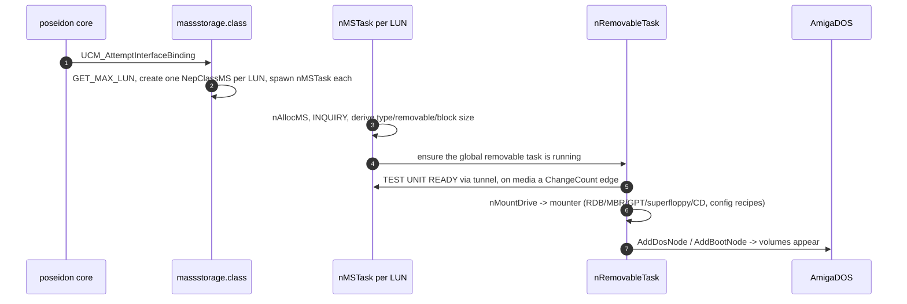

**A read request:**

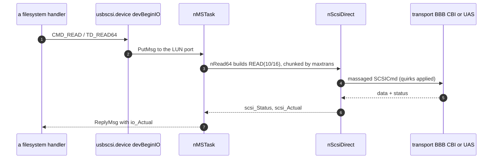

---

## 14. State machines

| Machine | Kind | State carrier |
|---|---|---|
| Per-LUN IO completion | implicit | the `unit_MsgPort` queue + the single `nMSTask` |
| Media presence / change | implicit edge | `ncm_UnitReady` + `ncm_ChangeCount` vs `ncm_LastChange` |
| BBB transport phase | implicit | the Command→Data→Status sequence + retry counter |
| Quirk escalation | implicit, persistent | `PFF_*` bits in `cdc_PatchFlags`, learned at runtime and saved |
| Cross-LUN bus access | lock | `ncm_UnitLUN0->ncm_XFerLock` (only if `MaxLUN != 0`) |
| UAS tag lifecycle | explicit, per tag | `ut_State` (`UTS_FREE`/`UTS_RUNNING`) + `ut_Outstanding` |

The most interesting one is **quirk escalation**: the `PFF_*` flag set is effectively a learned
device-compatibility state that ratchets toward "safer" behavior on errors and is **persisted**, so
the second encounter with a broken device starts already-adapted. The **media-change** machine is a
classic edge detector driving both DOS disk-change interrupts and the mount dispatch.

---

## 15. Notable quirks and refactoring hazards

* **The `PFF_*` quirk soup.** 15 flags set three ways (vendor tables, GUI, runtime auto-fallback)
  and persisted. Powerful but sprawling; it's the accumulated scar tissue of bad USB firmware. Any
  refactor must preserve the *learned-and-saved* escalation behavior. Note the default set applied
  at bind is already non-empty — `MODE_XLATE | NO_RESET | FIX_INQ36 | SIMPLE_SCSI` — so §8 reads
  "translated and whitelisted" out of the box, not raw.
* **`usbscsi.device` is a co-resident `MakeLibrary`'d device** (same trick as usbaudio's AHI
  sub-driver) — don't split it from the class.
* **The XFerLock-only-if-`MaxLUN` + LUN-0 tunnel** is subtle: single-LUN devices skip the lock,
  and background IO must tunnel through the LUN-0 task. Removing the tunnel re-introduces
  cross-task pipe races. Note the corollary for UAS: UAS implies `MaxLUN == 0`, so `nLockXFer` is
  inert there and the **async tag path takes no transport lock at all** — only the single-threaded
  unit task keeps it safe.
* **EP0's NAK timeout is deliberately 100 ms longer than the data pipes'**, so the control pipe —
  which carries the recovery traffic (`CLEAR_FEATURE(ENDPOINT_HALT)`, bulk-only reset) — outlives
  the pipe whose timeout triggered the recovery. That offset is why EP0 cannot be handed to
  `nSetNakTimeout` alongside the others: with NAK timeouts switched off the sum would be a live
  100 ms window instead of "off". `nApplyNakTimeout` owns both the offset and its zero case; arm
  pipes through it rather than open-coding `PPA_NakTimeout`.
* **Residue is intentionally ignored** in BBB and the CSW signature check is skippable
  (`PFF_CSS_BROKEN`): correctness deliberately yields to firmware reality. Don't "fix" these.
* **Units are reused across replugs, so endpoint pointers must be reassigned unconditionally.**
  A unit is matched back to a returning device by DevID/IfID/LUN, which means a rebind starts with
  the *previous* device's object pointers still in place. `nUasCollectEndpoints` therefore clears
  the four UAS endpoint pointers before collecting, and `nFreeMS` NULLs every pipe pointer after
  freeing. Both are load-bearing: an "assign only if NULL" collector keeps the freed device's
  endpoints and allocates pipes against them (this bit UAS in 2026-07; BOT never hit it because
  its path always reassigns), and a UAS↔BOT transport flip on the same unit would double-free the
  stale UAS pipes.

---

## 16. Appendix — maps and indexes

### 16.1 `usbscsi.device` command set (`devBeginIO`)

* **Block IO:** `CMD_READ`, `CMD_WRITE`, `TD_READ64`, `TD_WRITE64`, `TD_FORMAT64`, `TD_SEEK64`,
  `TD_FORMAT`, `TD_SEEK`, and the `NSCMD_TD_*64` aliases → `nRead64`/`nWrite64`/`nSeek64`.
* **Geometry/control:** `TD_GETGEOMETRY` → `nGetGeometry`; `CMD_START`/`STOP`/`TD_EJECT` →
  `nStartStop`; `CMD_RESET`/`CMD_FLUSH` (abort pending/queued); `CMD_CLEAR`/`CMD_UPDATE`/`TD_MOTOR`
  (NOPs).
* **State:** `TD_CHANGENUM`, `TD_CHANGESTATE`, `TD_PROTSTATUS`, `TD_ADDCHANGEINT`/`TD_REMCHANGEINT`
  (inline).
* **Passthrough:** `HD_SCSICMD` → `nScsiDirect`. **NSD:** `NSCMD_DEVICEQUERY` →
  `NSDEVTYPE_TRACKDISK` + a 28-entry `NSDSupported[]`.
* **Gone-device short-circuit:** when `ncm_DenyRequests` is set, enqueued commands are rejected
  *before* the `PutMsg`, with two different errors — `TDERR_DiskChanged` for the legacy group and
  `IOERR_ABORTED` for the `NSCMD_TD_*64` group.
* **`cmdNSDeviceQuery` validates strictly** (null `io_Data`, short `io_Length`, non-zero
  `DevQueryFormat` or `SizeAvailable` → `IOERR_NOCMD`) and calls `TermIO` itself, returning
  `RC_DONTREPLY` — deliberately, so the dispatcher's error path can't write past a short
  IORequest.

### 16.2 `PFF_*` patch flags (`massstorage.h`)

15 flags: `SINGLE_LUN`, `MODE_XLATE` (6→10), `EMUL_LARGE_BLK`, `REM_SUPPORT`, `FIX_INQ36`,
`DELAY_DATA`, `SIMPLE_SCSI`, `NO_RESET`, `FAKE_INQUIRY`, `FIX_CAPACITY`, `NO_FALLBACK`,
`CSS_BROKEN`, `CLEAR_EP`, `DEBUG`, and **`NO_UAS`** (0x010000 — force Bulk-Only, §9.3). Bits
0x08 and 0x20 are unallocated gaps. Default set at bind:
`MODE_XLATE | NO_RESET | FIX_INQ36 | SIMPLE_SCSI`.

### 16.3 Key functions by area

* **Library/dual:** `libInit`/`libOpen`/`libClose`/`libExpunge`, `devInit`/`devOpen`/`devClose`/
  `devExpunge`/`devReserved`/`devBeginIO`/`devAbortIO`/`cmdNSDeviceQuery`/`TermIO` (`dev.c`).
* **Binding:** `usbAttemptInterfaceBinding`, `nPreferUasAlternate`, `usbForceInterfaceBinding`,
  `usbReleaseInterfaceBinding`, `usbDoMethodA`/`usbGetAttrsA`/`usbSetAttrsA` (the last a stub).
* **Per-LUN task:** `nMSTask`, `nAllocMS`, `nFreeMS`, `nIsBulkTransport` (UAS setup lives in
  `massstorage_uas.c`: `nUasCollectEndpoints`/`nUasInitTags`/`nUasDisableTags`).
* **Device commands:** `nGetGeometry`/`nFakeGeometry`/`nGetBlockSize`/`nGetModePage`,
  `nStartStop`, `nGetWriteProtect`, `nBuildRWCdb`, `nRead64`/`nWrite64`(`Emul`)/`nSeek64`,
  `nSetNakTimeout`/`nApplyNakTimeout`, `nLockXFer`/`nUnlockXFer`,
  `nIOCmdTunnel`/`nScsiDirectTunnel`.
* **SCSI/transports:** `nScsiDirect`; `nScsiDirectBulk`/`nBulkReset`/`nBulkClear`
  (`massstorage_bulk.c`); `nScsiDirectCBI`/`nCBIRequestSense` (`massstorage_cbi.c`).
* **UAS** (`massstorage_uas.c`) — sync path `nScsiDirectUAS`/`nUasDoCommand`/`nUasParseStatusIU`/
  `nUasFillLun`/`nUasErrForgiven`; tag engine `nUasInitTags`/`nUasDisableTags`/`nUasEligible`/
  `nUasSubmitTag`/`nUasSubmitChunk`/`nUasTagPipeDone`/`nUasFinalizeTag`/`nUasFreeTag`/
  `nUasReapTags`/`nUasProcessAborts`/`nUasTagsIdle`/`nUasDrainTags`/`nUasTagDataPipe`/
  `nUasTagAbortArmed`/`nUasCollectEndpoints`.
* **Removable/mount:** `nStartRemovableTask`/`nRemovableTask`/`nAllocRT`/`nFreeRT`/`nOpenDOS`,
  `nFillMountFS`/`nCDFSHandlesAudio`/`nMountDrive`/`nUnmountPartition`/`FindMatchingDevice`/
  `nGetDosType`/`mounter_log` (in-class);
  `MountDrive`/`ProbeUnit`/`ScanRDSK`/`ParsePART`/`ParseFSHD`/`fsrelocate`/`ScanLegacy`/
  `ParseMBR`/`ParseGPT`/`register_legacy`/`ScanCDROM`/`SetupFileSystem`/`CheckAndFixDevName`
  (`mounter/mounter.c`).
* **Config/GUI:** `nLoadClassConfig`/`nLoadBindingConfig`/`nStoreConfig`,
  `nGUITask`/`nGUITaskCleanup`/`LUNListDisplayHook`, `nOpenBindingCfgWindow`,
  `AutoDetectMaxTransfer`, `nHexString`.

> `nFormat64` is prototyped but never defined — `TD_FORMAT*` all fall through to `nWrite64`.

### 16.4 Key structures

| Struct | Role |
|---|---|
| `NepMSBase` | class base: `nh_DevBase`, `nh_Units`, `nh_RemovableTask`, `nh_DummyNCM`, `nh_TaskLock`, the expansion/DOS/psd bases, the poll timer, `nh_RestartIt` |
| `NepClassMS` | one LUN; embeds `struct Unit`; per-transport pipes, `ncm_UasTags[]`, `ncm_XFerQueue`, `ncm_DmaAlign`, SCSI state, config, GUI objects |
| `UasTag` | one UAS tag context: `ut_IOReq`, its three stream pipes, `ut_Tag`/`ut_State` (`UTS_FREE`/`UTS_RUNNING`)/`ut_Outstanding`, `ut_AbortReq`/`ut_Failed`, the chunk cursor (`ut_Offset`/`ut_Remain`/`ut_StartBlock`), `ut_CmdIU`, `ut_StatusBuf[64]`. `NCM_MAXTAGS` = 16 |
| `NepMSDevBase` | the `usbscsi.device` base |
| `ClsDevCfg` / `ClsUnitCfg` | per-device (`MSDC`) / per-LUN (`LUN0+n`) config |
| `MountFS` / `MountData` (`mounter/`) | one filesystem recipe / A4091 mounter session state |

### 16.5 File map

| File | Contents |
|---|---|
| `massstorage.class.c` | class + binding + tasks + device commands + SCSI hub + the mounter recipe builder (`nFillMountFS`/`nMountDrive`) |
| `massstorage.h` / `massstorage.class.h` | structs, `PFF_*`, `nIsOverflowErr()`, prototypes |
| `dev.c` / `dev.h` | the `usbscsi.device` Exec device vectors |
| `massstorage_bulk.c` | BBB transport (CBW/CSW), `nBulkReset`/`nBulkClear` |
| `massstorage_cbi.c` | CBI/CB transport |
| `massstorage_uas.c` | UAS transport: IUs, the sync path, and the multi-tag engine |
| `mounter/mounter.c`, `mounter.h`, `legacy.h` | vendored A4091 RDB/MBR/GPT/CD parser + in-RAM HUNK relocator |
| `CMakeLists.txt` | builds the mounter with `MOUNTER_LOG` + `MOUNTER_TRACE=1` |

### 16.6 See also

[poseidon.library-architecture.md](poseidon.library-architecture.md) (§5 pipes, §7 binding, §10
locks), and [usbaudio.class-architecture.md](usbaudio.class-architecture.md) for the comparable
dual-library (`MakeLibrary`'d co-resident) pattern.
</content>
