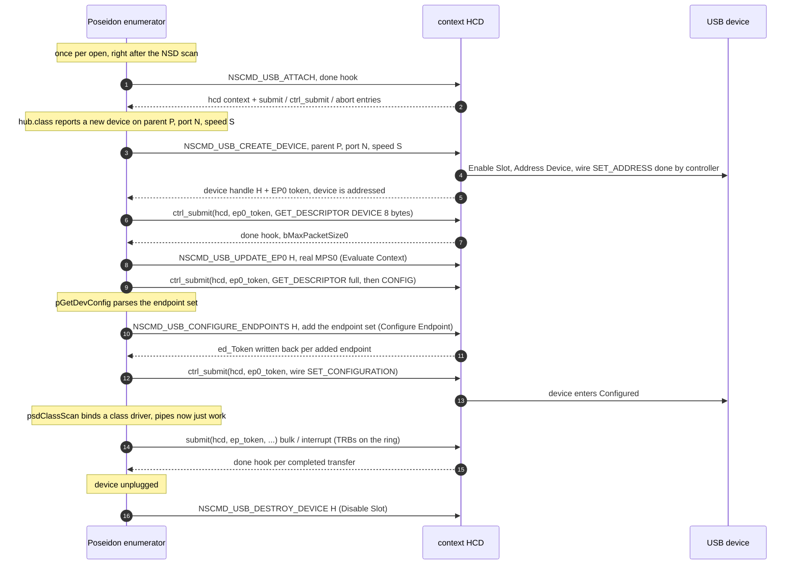
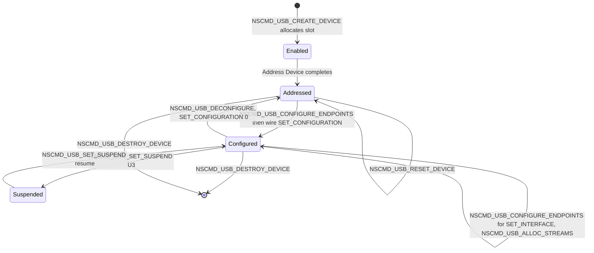
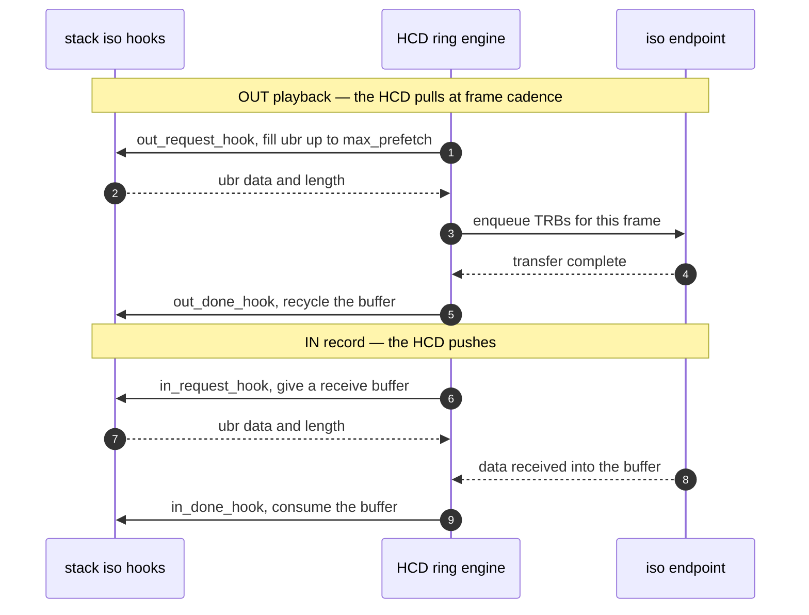

# The context HCD ABI — a device/endpoint-lifecycle interface for xHCI-class controllers

> This document specifies the **context HCD ABI**: the client ABI that `xhci.device`
> speaks and the only lower-edge interface Poseidon uses to drive it. It is the xHCI-native
> half of the two-ABI split; the other half is the frozen legacy ABI (USB 2.0, unchanged).
> The ABI models device and endpoint **lifecycle** explicitly, the way xHCI hardware (and
> Linux `usbcore`) actually work, instead of inferring it from snooped control transfers.
>
> The ABI is **fully self-contained**: it has its own commands and its own request structs and
> shares nothing with the legacy per-transfer wire format (`usbhardware.h` V1+V2) except the
> `UHIOERR_`/`ERR_` error-value pool and the `UHA_Capabilities`/`TAG_DRIVER_FEATURES` tag
> namespace. A driver opts in with the `UHCF_CONTEXT` capability bit and advertises the
> individual commands it implements through `NSCMD_DEVICEQUERY`.
>
> The **authoritative definitions of every op, struct, handle, flag, and error value ship in
> the vendored header `include/devices/usbhcd_context.h`** (source of truth in
> poseidon-backport; an identical copy lives in the driver tree). The struct listings in §5
> are illustrative summaries — the header is normative. §10 specifies the two data paths:
> the transfer path (direct submit) and the clock-driven iso hooks.

---

## Table of contents

1. [Why a context ABI](#1-why-a-context-abi)
2. [Design principles](#2-design-principles)
3. [The model — handles, contexts, transfers](#3-the-model--handles-contexts-transfers)
4. [The operation set](#4-the-operation-set)
5. [Operation reference](#5-operation-reference)
6. [Encoding](#6-encoding)
7. [A worked enumeration sequence](#7-a-worked-enumeration-sequence)
8. [Device-handle state machine](#8-device-handle-state-machine)
9. [Hubs, streams, power](#9-hubs-streams-power)
10. [The data paths — direct transfer submit, clock-driven iso hooks](#10-the-data-paths--direct-transfer-submit-clock-driven-iso-hooks)
11. [Error model, ordering, concurrency](#11-error-model-ordering-concurrency)
12. [Mapping: op to xHCI command to usbcore hook](#12-mapping-op-to-xhci-command-to-usbcore-hook)
13. [Design decisions (settled)](#13-design-decisions-settled)
14. [See also](#14-see-also)

---

## 1. Why a context ABI

xHCI keeps each device's durable state — address, route, speed, parent, TT, and per-endpoint
parameters — in DMA-resident **contexts** that are programmed *once* by command-ring operations
(Enable Slot, Address Device, Configure Endpoint, Evaluate Context). A transfer is then a minimal TRB
that references a context by `(slot, endpoint index)`. The legacy Poseidon model has no concept of
these operations: the stack assigns addresses itself, emits `SET_ADDRESS`/`SET_CONFIGURATION` as
opaque control transfers, and tells the HCD only what a single transfer needs. On that model an xHCI
driver has to *reverse-engineer* the device/endpoint lifecycle by snooping the wire — the exact cost
the two-ABI split was created to remove (the full analysis is in
[poseidon-vs-xhci-driver-model.md](poseidon-vs-xhci-driver-model.md)). The context ABI makes the
lifecycle explicit: the stack hands the HCD each device/endpoint fact directly, in its own op, and the
HCD owns addressing and routing. There is nothing to snoop.

---

## 2. Design principles

These six invariants define the ABI:

1. **State lives in contexts, established once.** Device-scoped state (address, route, speed, parent,
   TT, hub info) is set when the device is created; endpoint-scoped state (type, max-packet, interval,
   burst, streams) is set when endpoints are configured. Never per transfer.
2. **Transfers carry nothing durable.** A transfer is a direct call into the HCD keyed by an opaque
   per-endpoint **token** the lifecycle ops return: `{token, buffer, flags, optional stream id, NAK
   timeout, (control) setup}` — the submit entries of §6/§10, and nothing more. No IORequest travels
   for a transfer.
3. **The HCD owns addressing and routing.** The stack never picks a USB address and never emits a
   `SET_ADDRESS` control transfer. It supplies the *tree edge* (parent handle + port + speed) and the
   HCD assigns the address and derives the route string itself.
4. **The stack supplies edges; the HCD maintains the tree.** Because every device is created with its
   parent handle and port, the HCD has the full topology with no snooping and no
   one-device-at-address-0 race.
5. **Wire transfers the device still needs stay wire transfers.** `SET_CONFIGURATION` and
   `SET_INTERFACE` are still issued on the wire (the device must enter Configured / change altsetting)
   — but *after* the corresponding configure op has built the contexts. (`SET_ADDRESS` is the
   exception: the HCD's create-device op performs the wire addressing, so the stack never issues it.)
6. **Backward-value-compatible where it matters.** The ABI reuses the `ERR_*`/`UHIOERR_` value pool,
   the `#pragma pack(2)` discipline, and the `UHA_Capabilities`/`TAG_DRIVER_FEATURES` tag namespace
   (and the transfer-flag bit positions equal their legacy `UHFB_` counterparts, so a stack translates
   with a single AND mask). Everything else is its own: transfers are direct calls through the entries
   `NSCMD_USB_ATTACH` returns, and the lifecycle/hook commands live in the NewStyle `NSCMD_*` pool, so
   `NSCMD_DEVICEQUERY` enumerates them and legacy command numbers are untouched.

---

## 3. The model — handles, contexts, transfers

* **Device handle** — an opaque `ULONG` token the HCD allocates in *create-device* and returns. It
  replaces the USB address as the device's identity. Every later op and transfer carries it. The stack
  treats it as opaque; internally it is the xHCI slot.
  * The **root hub(s) are emulated** by the HCD (no hardware slot): create returns a reserved handle,
    and every implemented lifecycle op on a root-hub handle is a successful no-op — the stack drives
    the root devices through the same code path as any other device, including the endpoint tokens
    their create/configure ops return, whose submits the HCD routes to the root-hub emulation.
  * A controller with both USB2-protocol and USB3-protocol root ports exposes **TWO protocol-pure root
    hubs**: `UHCD_HANDLE_ROOTHUB` (`0xFFFFFFFE`, the SuperSpeed root hub) and
    `UHCD_HANDLE_ROOTHUB_USB2` (`0xFFFFFFFD`, the USB 2.0 root hub). `CREATE_DEVICE(parent=0)` selects
    by `cdo_Speed`. The count is reported via `UHA_NumRootHubs`/`TAG_DRIVER_NUM_ROOT_HUBS`, and
    `DRIVER_FEAT_USB3` is advertised only when USB3-protocol root ports exist. Each root hub serves
    protocol-pure descriptors and port statuses (the SS one is indistinguishable from an external SS
    hub). `cdo_HubPort` for a root-port device is the port number *on that root hub*; the HCD
    translates internally.
  * Handle values `>= UHCD_HANDLE_RESERVED` (`0xFFFFFFF0`) are reserved for emulated devices; `0` is
    never a valid device handle (it means "root hub" in `cdo_ParentHandle` only).
* **Endpoint address** — the standard `bEndpointAddress` (number + direction: `num | 0x80` for IN),
  as `ed_Address`. Endpoint contexts are named within a lifecycle op by this.
* **Endpoint token** — an opaque `APTR` the lifecycle ops return per endpoint, and the key of every
  transfer submit: `NSCMD_USB_CREATE_DEVICE` yields the device's EP0 token (`cdo_Ep0Token`, root hubs
  included), `NSCMD_USB_CONFIGURE_ENDPOINTS` writes one token per added endpoint back into the op
  block (`ed_Token`). A token is valid from delivery until its endpoint is dropped
  (`SET_INTERFACE`/`DECONFIGURE`) or its device destroyed; a stale token is **safe** — the submit
  entries fail it with `UHIOERR_TIMEOUT` (device-gone semantics), never crash.
* **Stream id** — for SS bulk streams (UAS); `0` = the default (non-stream) ring.
* **Transfer** — a direct call into the HCD through the submit entries `NSCMD_USB_ATTACH` hands out
  (§6/§10): `submit()` for bulk/interrupt/iso, `ctrl_submit()` for control. It carries the endpoint
  token, flags, stream id, a NAK timeout, the buffer, and (for control) the setup packet; completion
  arrives exactly once through the attach-time done hook. No device address, no topology, no
  SS-companion facts, no power policy — those live in the contexts the lifecycle ops built.

---

## 4. The operation set

The **commands are allocated from the NewStyle (`NSCMD_*`) command pool**, not the low `CMD_NONSTD`
space. That keeps them clear of every legacy command number and — because NSD commands are exactly
what `NSCMD_DEVICEQUERY` enumerates — makes them **self-describing**: a driver advertises precisely
the ops it implements, and one that lacks an op rejects it with `IOERR_NOCMD`. Transfers are not
commands at all: they are direct calls through the entries `NSCMD_USB_ATTACH` returns (§6/§10). The
commands occupy a contiguous block in the NewStyle pool's third-party area (the NSD standard keeps
0x4000-0x7FFF and 0xC000-0xFFFF for the OS); each is `[M]` mandatory (a
`UHCF_CONTEXT` driver must implement it — the gate is `UHCD_MANDATORY_CMD_MASK`) or `[O]` optional:

```c
#define NSCMD_USBHCD_BASE              0x8800   /* third-party block in the NewStyle pool */

/* lifecycle ops (struct IOStdReq framing) */
#define NSCMD_USB_CREATE_DEVICE        (NSCMD_USBHCD_BASE + 0x00)  /* [M] */
#define NSCMD_USB_DESTROY_DEVICE       (NSCMD_USBHCD_BASE + 0x01)  /* [M] */
#define NSCMD_USB_UPDATE_EP0           (NSCMD_USBHCD_BASE + 0x02)  /* [M] */
#define NSCMD_USB_CONFIGURE_ENDPOINTS  (NSCMD_USBHCD_BASE + 0x03)  /* [M] */
#define NSCMD_USB_DECONFIGURE          (NSCMD_USBHCD_BASE + 0x04)  /* [O] */
#define NSCMD_USB_UPDATE_HUB           (NSCMD_USBHCD_BASE + 0x05)  /* [M] */
#define NSCMD_USB_RESET_DEVICE         (NSCMD_USBHCD_BASE + 0x06)  /* [O] */
#define NSCMD_USB_SET_SUSPEND          (NSCMD_USBHCD_BASE + 0x07)  /* [O] */
#define NSCMD_USB_SET_LINK_POWER       (NSCMD_USBHCD_BASE + 0x08)  /* [O] */
#define NSCMD_USB_ALLOC_STREAMS        (NSCMD_USBHCD_BASE + 0x09)  /* [O] */
#define NSCMD_USB_FREE_STREAMS         (NSCMD_USBHCD_BASE + 0x0a)  /* [O] */
/* the transfer-path attach handshake (§6, §10.2) */
#define NSCMD_USB_ATTACH               (NSCMD_USBHCD_BASE + 0x0b)  /* [M] */
/* clock-driven iso hooks (§10.3): HCD pulls/pushes via struct USBIsoHooks */
#define NSCMD_USB_REGISTER_HOOKS       (NSCMD_USBHCD_BASE + 0x0c)  /* [O] */
#define NSCMD_USB_UNREGISTER_HOOKS     (NSCMD_USBHCD_BASE + 0x0d)  /* [O] */
#define NSCMD_USB_START_STREAM         (NSCMD_USBHCD_BASE + 0x0e)  /* [O] */
#define NSCMD_USB_STOP_STREAM          (NSCMD_USBHCD_BASE + 0x0f)  /* [O] */
```

| Op | Establishes / does | xHCI command |
|---|---|---|
| `NSCMD_USB_CREATE_DEVICE` | allocate handle; set slot+EP0 context from `{parent, port, speed, tt}`; address the device | Enable Slot + Address Device |
| `NSCMD_USB_UPDATE_EP0` | correct EP0 max-packet once `bMaxPacketSize0` is known | Evaluate Context |
| `NSCMD_USB_CONFIGURE_ENDPOINTS` | add/drop the endpoint set for a config or altsetting | Configure Endpoint |
| `NSCMD_USB_DECONFIGURE` | drop all endpoints, return device to Addressed (`SET_CONFIGURATION 0`) | Configure Endpoint (DC=1) |
| `NSCMD_USB_UPDATE_HUB` | mark the device a hub; set port count, TT think-time, multi-TT | Evaluate/Configure (slot ctx) |
| `NSCMD_USB_ALLOC_STREAMS` / `NSCMD_USB_FREE_STREAMS` | allocate/free per-endpoint stream rings | Configure Endpoint + stream ctx |
| `NSCMD_USB_RESET_DEVICE` | re-address after a port reset of an addressed device | Reset Device |
| `NSCMD_USB_SET_SUSPEND` | device suspend (U3) / resume — the one link state software drives | stop rings + port PLS |
| `NSCMD_USB_SET_LINK_POWER` | U1/U2 *policy*: enable + timeouts + MEL (entry/exit stays autonomous) | PORTPMSC + Evaluate Context |
| `NSCMD_USB_ATTACH` | exchange the stack's completion hook for the HCD's direct submit/abort entries (§6, §10.2) | (software; transfers ride the rings) |
| `NSCMD_USB_REGISTER_HOOKS` / `START/STOP_STREAM` | clock-driven iso hook engine (§10.3) | iso TDs at frame cadence |
| `NSCMD_USB_DESTROY_DEVICE` | free contexts and the slot | Disable Slot |

One capability bit advertises the ABI: `DRIVER_FEAT_CONTEXT` = `UHCF_CONTEXT` = **`BIT(5)`**,
returned via `TAG_DRIVER_FEATURES`. (Bit 4 is the classic `UHCF_USB2OTG`: `UHA_Capabilities` and
`TAG_DRIVER_FEATURES` are the *same* tag value (`TAG_USER+0x4732`), so bit 5 is the first free bit in
the merged namespace.) The transfer path needs no bit of its own — it is integral to the ABI:
`NSCMD_USB_ATTACH` is a **mandatory** op, and a failed attach keeps the driver on the legacy backend.
Poseidon binds the context backend (companion doc §9.5) only for HCDs that advertise the bit plus the
mandatory op set; everything else uses the legacy backend. The definitions live in the vendored header
`include/devices/usbhcd_context.h` (source of truth in poseidon-backport; identical copy in the driver
tree).

**Command discovery via NSD.** Because the HCD is an Exec device, it also implements the NewStyle
Device protocol: `NSCMD_DEVICEQUERY` returns a `SupportedCommands` list that includes the context-op
command numbers it implements. `DRIVER_FEAT_CONTEXT` is the coarse "I speak the context ABI" gate;
**NSD gives fine-grained per-command discovery** — a driver may implement
`NSCMD_USB_CONFIGURE_ENDPOINTS` but not `NSCMD_USB_ALLOC_STREAMS`, for example. Poseidon consults both:
the feature bit plus the mandatory ops (`UHCD_MANDATORY_CMD_MASK`: `CREATE_DEVICE`, `DESTROY_DEVICE`,
`UPDATE_EP0`, `CONFIGURE_ENDPOINTS`, `UPDATE_HUB`, `ATTACH`) to choose the backend, and the NSD list to
learn which *optional* ops exist and degrade gracefully (no `NSCMD_USB_ALLOC_STREAMS` → single-ring
UAS; no `NSCMD_USB_SET_LINK_POWER` → no LPM; no `NSCMD_USB_DECONFIGURE` → replace-config only; no
`NSCMD_USB_REGISTER_HOOKS` → no realtime iso). The class-side devices in this stack (`usbscsi.device`
et al.) already support NSD, so this is consistent — one idiomatic discovery mechanism for the whole
op set.

---

## 5. Operation reference

Parameter structs are summarized below; the **authoritative definitions ship in the vendored header
`include/devices/usbhcd_context.h`** (`struct UhcdCreateDevice` et al., `cdo_*`/`ceo_*`/… field names,
Amiga types, `pack(2)`). Each lifecycle op is a `struct IOStdReq` whose `io_Command` is the op and
whose `io_Data` points at the op block; `io_Error` returns a `UHIOERR_`/`ERR_` code. OUT fields are
filled by the HCD.

### NSCMD_USB_CREATE_DEVICE
```c
struct UhcdCreateDevice {           /* header names: cdo_* */
    u32 parent_handle;      /* 0 = this create is a root hub */
    u16 hub_port;           /* 1-based port on the parent hub */
    u16 speed;              /* UHCD_SPEED_LOW/FULL/HIGH/SUPER/SUPERPLUS */
    u32 tt_hub_handle;      /* LS/FS behind a HS hub: the TT hub; 0 = none */
    u16 tt_port;            /* TT port number */
    u16 tt_think_time;      /* encoded think time */
    u16 ep0_maxpacket_hint; /* 0 = HCD guesses from speed */
    u16 _pad;
    u32 device_handle;      /* OUT: the allocated handle */
    APTR ep0_token;         /* OUT: the device's EP0 submit token (§6, §10.2) */
};
```
Semantics: the HCD enables a slot, builds the slot + default-control-endpoint contexts from the tree
edge it was handed (deriving the **route string** and **root port** itself from the parent chain it
already tracks), addresses the device, and returns the handle plus the device's **EP0 token**
(`cdo_Ep0Token`) — the key of every control submit on the default pipe (a root-hub create returns a
root-hub-flavored token, routed to the emulation). After this the device is addressed and EP0 is
usable. **The stack never issues a wire `SET_ADDRESS`.** Precondition: the parent device exists
(was created earlier) — guaranteed by top-down enumeration. `parent_handle == 0` selects the matching
protocol-pure root hub by `speed` (§3).

### NSCMD_USB_UPDATE_EP0
```c
struct UhcdUpdateEp0 { u32 device_handle; u16 ep0_maxpacket; u16 _pad; };
```
Called once the device descriptor's `bMaxPacketSize0` is read and differs from the create-time guess.
The value is validated per speed (LS: 8; FS: 8/16/32/64; HS: 64; SS+: always 512 — the SS descriptor
byte is an exponent and must never be passed through raw); an out-of-range value is rejected with
`ERR_BAD_PARAMETERS` rather than shrinking EP0 into a babble trap. xHCI: Evaluate Context on EP0 only.

### NSCMD_USB_CONFIGURE_ENDPOINTS
```c
struct UhcdEndpointDesc {           /* header names: ed_* */
    u8  address;            /* bEndpointAddress: number | direction */
    u8  type;               /* UHCD_EPTYPE_CONTROL/ISO/BULK/INTERRUPT */
    u16 max_packet;         /* RAW wMaxPacketSize (bits 10:0 size, 12:11 HS extra xacts) */
    u8  interval;           /* encoded */
    u8  max_burst;          /* SS companion; 0 otherwise */
    u8  mult;               /* SS isoch */
    u8  if_class;           /* bInterfaceClass of the owning interface (controller quirks key on it) */
    u16 bytes_per_interval; /* SS companion */
    u16 max_streams;        /* SS bulk; 0 = no streams */
    APTR token;             /* OUT: the endpoint's submit token, written on success */
};
struct UhcdConfigureEndpoints {     /* header names: ceo_* */
    u32 device_handle;
    u16 config_value;       /* the configuration being selected */
    u16 num_add;
    struct UhcdEndpointDesc *add;   /* endpoints to add */
    u16 num_drop;
    u16 _pad;
    u8  *drop_addresses;        /* endpoint addresses to drop (for SET_INTERFACE) */
};
```
Semantics: the HCD builds endpoint contexts (and transfer rings) for the `add` set, drops the `drop`
set, and issues one Configure Endpoint. The stack populates `add` straight from its parsed
`PsdConfig`/`PsdInterface`/`PsdEndpoint` tree (`pGetDevConfig` already has every field, including the
owning interface's class for controller quirks). On success the HCD writes each added endpoint's
**submit token** back into its `ceo_Add[]` entry (`ed_Token`) — the op block is **referenced, not
copied**, and must stay valid for the whole op; this token write-back happens on root-hub handles too,
where the op is otherwise a no-op. **Dropping an endpoint invalidates its token and retires its
in-flight transfers.** **After this op succeeds, the stack issues the wire `SET_CONFIGURATION` (or
`SET_INTERFACE`) as a normal EP0 transfer** so the device enters the new state. A `SET_INTERFACE` is
the same op with both `add` and `drop` populated.

### NSCMD_USB_DECONFIGURE
```c
struct UhcdDeconfigure { u32 device_handle; };
```
`SET_CONFIGURATION 0`: drop all endpoint contexts and return the slot to Addressed (Configure Endpoint
with the Deconfigure bit). The wire `SET_CONFIGURATION 0` follows.

### NSCMD_USB_UPDATE_HUB
```c
struct UhcdUpdateHub {
    u32 device_handle; u16 num_ports; u16 tt_think_time; u8 multi_tt;
    u8 hdr_dec_lat; u16 hub_delay;   /* SS hubs: bHubHdrDecLat / wHubDelay; 0 otherwise */
};
```
Called when a device is found to be a hub (its hub descriptor has been read). Marks the slot context as
a hub and sets port count / TT think-time / MTT, which xHCI needs before LS/FS children behind it can
be addressed. For SS hubs the header/delay latencies feed the HCD's U1/U2 exit-latency computation for
downstream devices.

### NSCMD_USB_ALLOC_STREAMS / NSCMD_USB_FREE_STREAMS
```c
struct UhcdStreams { u32 device_handle; u8 ep_address; u8 _pad; u16 num_streams; };
```
Allocate/free per-endpoint stream rings for SS bulk (UAS). `num_streams` is the **highest stream id**
the stack will use (≤ the `max_streams` the endpoint was configured with); the endpoint must be
configured, bulk, and idle. After a successful alloc, every bulk submit on the endpoint selects its
ring by its `stream_id` argument (1..N — 0 becomes invalid, a linear-stream-array endpoint has no default ring);
FREE returns it to the single default ring and is idempotent. Without a successful alloc the endpoint
stays single-ring and stream ids ride along ignored — the pre-streams behavior. A driver lists these
ops in its NSD response only when the controller supports streams (xHCI: `HCCPARAMS1.MaxPSASize` > 0),
and — the emulated root hubs having no bulk endpoints — rejects reserved handles with
`ERR_BAD_PARAMETERS`, like the RT-ISO ops.

Poseidon issues the alloc automatically on the context backend when a class puts an endpoint's pipes
into the stream id space (`psdOpenStream` on an endpoint with `EA_StreamBase` set, or `PPA_StreamID`
on a plain pipe — the UAS status pipe), and the free when the stream user goes away (`psdCloseStream`,
`EA_StreamBase` back to 0). massstorage's UAS transport gets all three stream pipes (data IN/OUT +
status) this way without a driver-visible class change.

### NSCMD_USB_ATTACH — the transfer-path handshake
```c
struct UhcdAttach {                 /* header names: ato_* */
    struct Hook *done_hook;     /* IN:  the stack's transfer-completion hook */
    APTR  user_data;            /* IN:  hook object (a2) for done calls */
    APTR  hcd_context;          /* OUT: first argument of every entry */
    APTR  submit;               /* OUT: UhcdSubmitFunc (bulk/interrupt/iso) */
    APTR  ctrl_submit;          /* OUT: UhcdCtrlSubmitFunc (control) */
    APTR  abort;                /* OUT: UhcdAbortFunc */
};
```
Issued **once per open, right after the NSD scan**: the stack passes its transfer-completion hook and
the HCD returns its three direct transfer entries plus an opaque controller context, passed back as
the **first argument of every entry** — HCDs are ROM-able and carry no writable data sections, so the
context is their only anchor. Re-attach replaces the hook. A failed attach keeps the driver on the
legacy backend (the op is mandatory — part of `UHCD_MANDATORY_CMD_MASK`). The full transfer-path
contract — signatures, tokens, the done hook, abort semantics — is §6 and §10.2.

### NSCMD_USB_RESET_DEVICE / NSCMD_USB_DESTROY_DEVICE
```c
struct UhcdResetDevice   { u32 device_handle; };
struct UhcdDestroyDevice { u32 device_handle; };
```
`RESET_DEVICE` re-addresses after a port reset (xHCI Reset Device) and **preserves the handle**.
`DESTROY_DEVICE` disables the slot and frees contexts.

**`RESET_DEVICE` contract.** The stack port-resets the device *first* — its hub class owns the port,
the HCD never drives it — so the device is in Default state on the wire when the op arrives. The HCD
then runs Reset Device and chains **Address Device (BSR=0)** itself, replying only when that
completes. On success the handle is unchanged and Addressed, EP0 is rebuilt, and **every other
endpoint context is gone** (stream rings with them) — the caller restores state with the wire
`SET_CONFIGURATION` + `NSCMD_USB_CONFIGURE_ENDPOINTS`, then `SET_INTERFACE` for any non-default
alternate and `NSCMD_USB_ALLOC_STREAMS` for any stream user. Everything in flight is failed
`IOERR_ABORTED` (recovery collateral, not `UHIOERR_TIMEOUT`, which the stack's dead-device counter
weighs three times worse). A reserved (root-hub) handle is rejected: a root hub has no port to
reset. On **any** error the caller must treat the device as lost — the slot may already be disabled.
The op is optional: it appears in the NSD `SupportedCommands` list only when implemented, and the
stack's `psdResetDevice()` degrades to "no reset available" without wire traffic when the bit is
absent.

### NSCMD_USB_SET_SUSPEND / NSCMD_USB_SET_LINK_POWER — suspend (U3) and the U1/U2 link-power *policy*

Power splits into two distinct things, because **xHCI manages U1/U2 entry and exit autonomously**: the
controller decides, per the timeouts programmed in the port and the device's exit latencies, when a
link drops to U1/U2 and when it wakes. Software does **not** command U1/U2 entry/exit; it only sets
**policy**.

```c
/* (a) device suspend / resume — the one state software drives directly.
 * The op is a pure ENDPOINT-RING quiesce/restart (xHCI 4.15.1: stop all rings
 * before U3).  The port/link transition itself is the hub class's job on every
 * tier (external-hub port or root-hub view alike): suspend = SET_SUSPEND(1)
 * then port to U3; resume = port to U0 then SET_SUSPEND(0).  Idempotent both
 * ways; a root-hub handle is a successful no-op -- and the stack RELIES on
 * that: suspending a root hub runs the identical code path, with the port
 * transition simply absent.  An HCD must not fail the op on a root handle. */
struct UhcdSetSuspend {
    u32 device_handle;
    u16 suspend;            /* 1 = quiesce endpoint rings, 0 = restart them */
    u16 _pad;
};

/* (b) U1/U2 link-power POLICY plus the pre-parsed BOS facts the HCD needs to
 * program it.  The stack owns the BOS read/parse and the go/no-go policy; the
 * HCD owns the computation (SEL/PEL/MEL, timeouts, HIRD/BESL) and the mechanism.
 * Timeout/MEL fields are overrides (0 = HCD computes). */
struct UhcdSetLinkPower {
    u32 device_handle;
    u16 flags;              /* UHCD_LPF_* capability facts from the BOS */
    u16 u1_enable;          /* policy: allow U1 on the upstream link */
    u16 u2_enable;          /* policy: allow U2 */
    u16 u1_dev_exit_lat;    /* BOS SS cap (µs); 0 = incapable */
    u16 u2_dev_exit_lat;
    u16 u1_timeout;         /* override; 0 = HCD computes */
    u16 u2_timeout;
    u32 max_exit_latency;   /* override MEL (µs); 0 = HCD computes */
};
```

* **(a) Suspend / resume (U3)** is the only link state software drives directly. The HCD stops the
  device's endpoint rings first (xHCI §4.15.1); the hub class then drives the port to U3, and resume
  reverses it. This is the operation behind Poseidon's `psdSuspendDevice`/`psdResumeDevice`: on a
  context HCD they become this op (for the endpoint-ring quiesce) plus the hub-class `PORT_SUSPEND`
  request that moves the link.
* **(b) U1/U2 is policy only.** The op writes the **Max Exit Latency** into the slot context — which the
  xHC evaluates *only* at Address Device / Evaluate Context, never from a transfer (a concrete reason
  MEL cannot live on the transfer path) — and, for a device on a **root** port, writes the U1/U2
  inactivity timeouts into that port's `PORTPMSC` register (a controller register Poseidon cannot reach
  any other way). It does **not** enable U1/U2 on the device itself: the device-side
  `SET_FEATURE(U1/U2_ENABLE)` and `SET_SEL` stay **normal EP0 wire transfers** the stack issues
  (devices reject them until Configured, so the stack sequences them after the wire
  `SET_CONFIGURATION`). For a device behind an **external hub**, the downstream-port U1/U2 timeouts are
  set with hub-class `SET_FEATURE(PORT_U1/U2_TIMEOUT)` requests — again normal wire transfers, issued by
  `hub.class`, not this op.

* **(c) A withheld policy is a teardown request, not "arm nothing".** The op is re-issue-safe in
  *both* directions, and the stack uses that: when the user turns link power management off, it
  re-issues `SET_LINK_POWER` with everything withheld — zero enables, zero exit latencies **and none
  of the `UHCD_LPF_*` capability facts**. An HCD must treat that as "tear down whatever an earlier
  op armed": drop its cached facts, and clear its controller-side state (for xHCI: the USB2
  hardware-LPM `PORTPMSC.HLE` and its stale `L1DS` slot pointer). Withholding the *enables alone* is
  not enough and never was: `UHCD_LPF_LTM` and `UHCD_LPF_USB2_LPM` are evaluated independently of
  `slo_U1Enable`/`slo_U2Enable`, so an HCD that only masked the exit latencies would leave L1 and
  LTM armed. The stack issues the device- and hub-side halves of the teardown itself
  (`CLEAR_FEATURE(U1/U2/LTM_ENABLE)`, port U1/U2 timeouts back to zero) before this op.
* **Non-guarantee:** the op never reports whether USB2 hardware LPM was actually armed. There is no
  `slo_OutFlags` bit for it, and eligibility depends on a root-port capability the stack cannot see.
  The stack therefore tracks only "I offered a non-empty policy" and relies on the HCD's teardown
  being a no-op when nothing was armed.

So the division is clean and matches the hardware: **device- and hub-side requests stay wire transfers
(the ABI never snoops or replaces them); only the controller-side state the device requests can't reach
— MEL and root-port `PORTPMSC` timeouts — is an explicit op.** Root-hub ports therefore need no special
"configure port" op for the LPM case: their per-port timeouts are written when
`NSCMD_USB_SET_LINK_POWER` targets a device on that root port, and everything else about a root port
(reset, power, status) is driven through the HCD's root-hub emulation by the standard hub-class requests
Poseidon sends to the root hub like any other hub.

---

## 6. Encoding

The ABI has two framings: **commands** ride the ordinary Exec device transport (message port + unit
task), **transfers** are direct calls into the HCD.

* **Lifecycle ops** (and the iso-hook ops of §10.3, and `NSCMD_USB_ATTACH` itself) are synchronous
  commands carried on a plain `struct IOStdReq`, exactly like `NSCMD_DEVICEQUERY`: `io_Command` is the
  `NSCMD_USB_*` op, `io_Data` points at the `Uhcd*` op block, `io_Length` is its size, and `io_Error`
  returns a `UHIOERR_`/`ERR_` code. OUT fields (e.g. `cdo_DeviceHandle`, `cdo_Ep0Token`, `ed_Token`)
  are filled by the HCD. The enumerator issues them with `DoIO` — it needs them ordered and complete
  before proceeding, and they are not on a latency-critical path. The only bus-level command shared
  with the legacy format is `UHCMD_USBRESET` (the root reset probe); no other legacy command reaches
  a context HCD, and **no transfer traffic is message-framed at all**.
* **Transfers** are direct calls through the entries `NSCMD_USB_ATTACH` returns (§5), each taking the
  opaque HCD context as its first argument:

  ```c
  LONG err = submit(hcd, ep_token, data, length, naktimeout_ms,
                    stream_id, flags, cookie);          /* bulk/interrupt/iso */
  LONG err = ctrl_submit(hcd, ep0_token, setup, data, length,
                         naktimeout_ms, cookie);        /* control */
  ```

  The entries use the plain C (stack-argument) calling convention; they are callable from any task,
  never from interrupts. The endpoint's **transfer type is known HCD-side from the token**, so there
  is one submit for bulk/interrupt/iso (iso submits are gated by the `UHCF_ISO` capability) and one
  for control. Control takes a `const struct UhcdSetupData *` (the wire setup packet, 16-bit fields
  LE); the data-phase direction comes from bit 7 of `usd_RequestType`, and `*setup` is copied before
  `ctrl_submit` returns. `cookie` is the caller's demux handle; `naktimeout_ms` 0 = none; `stream_id`
  selects an allocated stream ring (0 = default ring); `flags` are `UHCD_XFF_NOSHORTPKT` (bit 2) and
  `UHCD_XFF_ALLOWRUNT` (bit 4) — the bit positions **equal** the matching legacy `UHFB_` bits of
  `iouh_Flags`, so a stack translates with a single AND mask. Nothing durable rides the transfer; the
  stream id is the one piece of per-transfer state that legitimately stays on it.

  A non-zero return is the **synchronous** `UHIOERR_` failure and no completion follows; on 0 the
  transfer is in flight and completion arrives **exactly once** via the attach hook:

  ```c
  CallHookPkt(ato_DoneHook, ato_UserData, &UhcdXferDone)
  /* struct UhcdXferDone: { uxd_Cookie, uxd_Actual, uxd_ExtError, uxd_Error, uxd_Pad } */
  ```

  called from the HCD's completion context (its unit task). The hook must be non-blocking and may
  re-enter `submit()`. `abort(hcd, ep_token, cookie)` requests an abort of a submitted transfer — a
  **wish**, like `AbortIO`: the completion still arrives, possibly successful. A stale token (endpoint
  dropped, device destroyed) fails the entries with `UHIOERR_TIMEOUT` — device-gone semantics, never a
  crash. (xhci.device realizes this by making tokens packed 32-bit values carrying a per-create
  generation — nothing to dereference.)

The ABI is **fully self-contained**: `struct IOUsbHWReq` stays pure classic V1+V2 (90 bytes) and the
context ABI shares nothing with it — no reinterpreted address field, no request-layout extension, no
offset-90 anything. The only things shared with the legacy per-transfer format are the `UHIOERR_`/`ERR_`
value pool, the `UHA_Capabilities`/`TAG_DRIVER_FEATURES` tag namespace, and the deliberate flag-bit
alignment above.

§10 details the two data paths this encoding serves: the transfer path itself (§10.2 — every
control/bulk/interrupt/iso transfer, UAS streams included) and the **clock-driven iso hooks** (§10.3 —
HCD pull/push at frame cadence for continuous isochronous streaming). Both avoid an
IORequest-per-packet relay and enable zero-copy; both are orthogonal to the lifecycle ops.

---

## 7. A worked enumeration sequence



Step by step (each exchange of the diagram, with the data that flows and the xHCI command behind it):

1. **Attach (once per open).** Right after the NSD scan, `NSCMD_USB_ATTACH` exchanges the stack's
   transfer-completion hook for the HCD's `submit`/`ctrl_submit`/`abort` entries plus the opaque HCD
   context (§5, §6). Every transfer below is a direct call through these entries, completing through
   the hook.
2. **Detect (hub.class).** A device appears on a port. `hub.class` powers and resets the port, reads
   the post-reset status to learn the **speed**, and reports the new device's **parent handle** (the
   hub it sits under) and **port number** to the enumerator. No USB address is chosen by anyone.
3. **Create.** The enumerator issues `NSCMD_USB_CREATE_DEVICE(parent=P, port=N, speed=S)`. The HCD
   allocates a slot, builds the **slot context** and the **default control endpoint (EP0) context** —
   deriving the **route string** and **root-hub port** itself from where `P` sits in the tree it already
   holds — uses a speed-derived **EP0 max-packet guess**, runs **Enable Slot + Address Device** (the
   controller performs the wire SET_ADDRESS and picks the real address), and returns the opaque
   **handle H** plus the device's **EP0 token**. From here the stack names the device by `H` in every
   lifecycle op and keys every EP0 submit by the token.
4. **Probe EP0.** The stack reads the first 8 bytes of the device descriptor with a normal
   `ctrl_submit(hcd, ep0_token, …)`, to learn `bMaxPacketSize0`.
5. **Correct EP0.** If the real MPS0 differs from the create-time guess,
   `NSCMD_USB_UPDATE_EP0(H, mps0)` → **Evaluate Context** patches the EP0 context. (Cheap; skipped if equal.)
6. **Read descriptors.** The stack reads the full device descriptor and the configuration descriptor(s)
   with `ctrl_submit` on the EP0 token; `pGetDevConfig` parses them into the
   `PsdConfig`/`PsdInterface`/`PsdEndpoint` tree.
7. **Configure.** `NSCMD_USB_CONFIGURE_ENDPOINTS(H, the parsed endpoint set)` → **one Configure Endpoint**
   builds every endpoint context and transfer ring for the chosen configuration, from data the stack
   already has, and writes each added endpoint's **submit token** back into the op block (`ed_Token`).
   (Hubs first get `NSCMD_USB_UPDATE_HUB` so their port-count/TT is in the slot context.)
8. **Enter configured.** The stack issues the wire `SET_CONFIGURATION` as a normal EP0 transfer; the
   device enters the **Configured** state. The HCD already has the rings, so the very first
   class-driver transfer works with no setup latency.
9. **Run.** `psdClassScan` binds a class driver. Its `psdAllocPipe`/`psdDoPipe` lower to
   `submit(hcd, ep_token, …)` — minimal TRBs on the pre-built ring, completion via the done hook, with
   **no per-transfer topology, no context setup, nothing durable**.
10. **Teardown.** On unplug, `NSCMD_USB_DESTROY_DEVICE(H)` → **Disable Slot** frees the contexts and the
   slot (and invalidates the device's tokens — a straggler submit fails safely with `UHIOERR_TIMEOUT`).

Every fact the HCD needs arrives in an explicit op, in order, with the data already in hand: no address
is chosen by the stack, no descriptor is re-parsed by the driver, and EP0's max packet is corrected by
an explicit op rather than guessed and re-detected on the wire.

---

## 8. Device-handle state machine



The states mirror the xHCI slot states (Disabled → Enabled → Addressed → Configured). Making them an
explicit handle lifecycle keeps the ordering in the stack — which already knows the sequence — rather
than in a driver-private shadow state machine.

---

## 9. Hubs, streams, power

* **Hubs** are devices that need two extra slot-context facts xHCI requires before their children can
  be addressed: the **hub bit + port count** and the **TT think-time / multi-TT**. `NSCMD_USB_UPDATE_HUB`
  supplies them once, after the stack reads the hub descriptor (it already does, in `hub.class`).
  Children are then created with `NSCMD_USB_CREATE_DEVICE` carrying `parent_handle = the hub's handle` and
  the child's port — exactly the tree edge the HCD needs, with no snooping.
* **Streams (UAS)** are first-class: `NSCMD_USB_ALLOC_STREAMS` builds the
  stream rings; submits pick a ring by their `stream_id` argument. This restores the parallel command/data/status
  concurrency that a legacy single-ring path loses. UAS on SS runs **all three** stream pipes this way
  (data IN/OUT and the status pipe — the Status IU for tag *n* arrives on stream *n*); the command pipe
  stays a plain bulk pipe per the UAS spec. Recovery is **surgical per ring**, on stream and plain
  endpoints alike: an abort/timeout stops the endpoint, then — ring by ring — No-Ops just the
  victim TDs' TRBs, replies them, and re-arms that one ring with a single Set TR Dequeue (carrying
  its stream id). Rings with no victim are never touched, and survivors *on the same ring* keep
  running, because the re-arm dequeue points at the first surviving TD rather than at the software
  enqueue. Each transfer ring owns its TD list, so the restart doorbells only the rings that still
  hold TDs. The coarse fail-everything flush remains for STALL/reset, ordinary stop, an
  out-of-memory degrade and teardown, where the endpoint is going down anyway.
* **Device-side abort (UAS Task Management).** Killing a transfer host-side does not tell the
  *device* to drop the command, so the stack quarantines the UAS tag and sends an ABORT TASK Task
  Management IU; only the Response IU releases the tag for reuse. When the TMF itself is refused or
  times out the stack escalates to `NSCMD_USB_RESET_DEVICE` (below), which is why that op exists.
  This is entirely a stack-side protocol — the HCD sees ordinary transfers on the command and
  status pipes — but it is the reason the driver must never silently recycle a stream ring's state
  behind an abort.
* **Power** is explicit and split (§5): `NSCMD_USB_SET_SUSPEND` drives device suspend (U3)/resume — the
  one link state software controls — while `NSCMD_USB_SET_LINK_POWER` sets the U1/U2 *policy* (enable,
  timeouts, MEL). The xHC enters/exits U1/U2 autonomously and evaluates MEL only at Address/Evaluate
  Context, never from a transfer — another reason power policy can't be a transfer field. That U1/U2
  policy is user-visible and live-togglable in the stack, so the op must be re-issue-safe in **both**
  directions: a block with every enable and every `UHCD_LPF_*` fact withheld is a request to tear the
  controller-side state down, not a request to arm nothing (§5). The
  clock-driven iso hooks (`NSCMD_USB_REGISTER_HOOKS`/`START/STOP_STREAM`, §10.3) carry the classic
  RT-ISO hook contract keyed on device handles; every demand-driven transfer travels the direct
  transfer path of §10.2.

---

## 10. The data paths — direct transfer submit, clock-driven iso hooks

> The authoritative struct definitions live in the vendored `include/devices/usbhcd_context.h`.
> §10.2 is **the** transfer path — every control/bulk/interrupt/iso transfer travels it; §10.3 is the
> hook engine for continuous isochronous streaming.

An IORequest per transfer would be fine for control-rate traffic, but for **high-rate streaming**
(UAS, isochronous audio/video) the relay round-trip and a copy per transfer hurt — so the ABI carries
no message-framed transfers at all. **The right data path depends on which party is *active*** (who
initiates the data movement), and that splits cleanly by endpoint type. Getting the **direction**
wrong is the trap.

### 10.1 The principle: the active party drives

* **Demand-driven endpoints — control, bulk, interrupt, and UAS bulk streams.** There is **no
  schedule**; a transfer happens because the **class driver has data and submits it**. The class driver
  is the active party, so the data path runs **caller → HCD**: the class driver, through Poseidon, calls
  the direct *submit* entry the HCD hands out at `NSCMD_USB_ATTACH`, enqueuing the buffer on the
  endpoint ring in the caller's context — no IORequest alloc, no message-port round-trip — and
  completion arrives via the attach-time *done* hook. The HCD never "pulls": there is nothing to pull
  on demand.
* **Clock-driven endpoints — continuous isochronous streaming.** The **bus schedule** is the active
  party: every (micro)frame the controller *must* move a packet on each active iso endpoint whether or
  not the app is ready, so the source/sink has to be ready *when the controller asks*. This data path
  runs **HCD → stack**: the HCD calls stack hooks to pull (OUT) or push (IN) buffers at frame cadence.

So the callback direction **follows who initiates**: demand-driven → the caller submits; clock-driven →
the controller pulls/pushes. (Putting an HCD "pull" hook on a bulk endpoint is the trap — with no
schedule, the HCD would have to poll it speculatively.) In both cases the class-driver-facing API
(`psdAllocPipe`/`psdDoPipe`) is unchanged; these are lower-edge data paths Poseidon uses on the class
driver's behalf.

### 10.2 The transfer path — direct submit (control / bulk / interrupt / iso / UAS)

The class driver's `psdSendPipe`/`psdDoPipe` lowers **every** transfer to a **direct submit call**
into the HCD — there is no IORequest-framed alternative. This is the caller-context `BeginIO` idea of
the legacy `UHCF_QUICKIO`/`IOF_QUICK` protocol made a clean, race-free explicit entry point. The
handshake is `NSCMD_USB_ATTACH` (§5): once per open, the stack passes its completion hook and the HCD
returns the opaque `hcd` context plus three entries (§6 has the full signatures and semantics):

```c
LONG err = submit(hcd, ep_token, data, length, naktimeout_ms,
                  stream_id, flags, cookie);          /* bulk/interrupt/iso */
LONG err = ctrl_submit(hcd, ep0_token, setup, data, length,
                       naktimeout_ms, cookie);        /* control */
LONG err = abort(hcd, ep_token, cookie);              /* a wish, like AbortIO */
/* completion, exactly once per accepted submit, from the HCD's unit task: */
/*   CallHookPkt(ato_DoneHook, ato_UserData, &UhcdXferDone)                */
struct UhcdXferDone { APTR uxd_Cookie; ULONG uxd_Actual; UWORD uxd_ExtError; UBYTE uxd_Error; UBYTE uxd_Pad; };
```

* **Submit (caller → HCD).** `submit()`/`ctrl_submit()` enqueue a TD on the endpoint (or stream) ring
  **synchronously, in the caller's task**, and return. No IORequest is built and the relay task is
  untouched. The endpoint's transfer type is known HCD-side from the token — one entry serves
  bulk/interrupt/iso (iso gated by `UHCF_ISO`), the other control (setup packet by pointer, copied
  before return, direction from bit 7 of `usd_RequestType`). `cookie` is the caller's per-transfer
  handle so completion needs no lookup; NAK timeout and the `UHCD_XFF_*` flags ride per submit, so
  timeout-armed pipes lower too. A non-zero return is a synchronous rejection with no completion to
  follow.
* **Done (HCD → caller).** When the TD retires, the HCD calls the attach hook from its completion
  context (its unit task) with a `struct UhcdXferDone`. The hook does minimal work and may re-enter
  `submit()`. Poseidon's hook writes the result into the pipe and replies `pp_Msg`, keeping
  `psdWaitPipe`/`psdCheckPipe` path-agnostic; `psdAbortPipe` routes through the abort entry (a wish,
  like `AbortIO`: the completion still arrives, possibly successful).
* **Tokens, not registrations.** Submits are keyed by the opaque per-endpoint tokens the lifecycle ops
  deliver — `cdo_Ep0Token` from CREATE_DEVICE (so EP0 is submittable the moment the device exists,
  root hubs included), `ed_Token` per added endpoint from CONFIGURE_ENDPOINTS. Tokens arrive
  **passively** on ops the stack issues anyway: no per-endpoint registration, no extra round trips, no
  start/stop — each submit is an independent transfer, like an IORequest, just cheaper. A token dies
  with its endpoint (SET_INTERFACE drop, DECONFIGURE, device destroy); a stale token fails the entries
  with `UHIOERR_TIMEOUT` (device-gone semantics), never a crash — xhci.device makes tokens packed
  32-bit values carrying a per-create generation, so there is nothing to dereference.
* **UAS** is exactly this, **per stream**: the class driver submits each command's data on its
  `stream_id`, keeping many commands in flight without an IORequest per command — the *demand-driven*
  way to use streams, with the class driver (not the HCD) driving. (`NSCMD_USB_ALLOC_STREAMS` must have
  created the stream rings first.)
* **Concurrency (driver side).** The submit runs in an arbitrary task, so the driver serializes its
  whole transfer plane through one semaphore (xhci.device: `ctrl->xfer_lock`): the unit task holds it
  around event processing/command dispatch/timeout scans, the direct entries hold it around theirs.
  Critical sections are short; the done hook runs under it (nested re-entry is legal). Root-hub
  transfers are the one exception to caller-context enqueue: the HCD defers them internally to its
  unit task (the port-register views are unit-task state) — invisible to the caller, who still gets
  the ordinary done-hook completion.

### 10.3 Clock-driven iso hooks (isochronous) — the HCD pulls and pushes

For continuous iso streaming the HCD is the active party, so it calls stack hooks at frame cadence.
The hook engine serves any iso endpoint, realtime or not (still clock-driven) — and it is **not** used
for bulk.

```c
/* generalizes the realtime-iso hook block; isochronous endpoints only */
struct USBIsoHooks {
    struct Hook *uih_OutRequestHook; /* OUT: fill the buffer request with the next data to send  */
    struct Hook *uih_OutDoneHook;    /* OUT: a buffer has been transmitted (recycle it)           */
    struct Hook *uih_InRequestHook;  /* IN:  provide a buffer to receive into                     */
    struct Hook *uih_InDoneHook;     /* IN:  a buffer has been filled (consume it)                */
    struct Hook *uih_ReleaseHook;    /* stream died without a client STOP; may be NULL            */
    ULONG        uih_MaxPrefetch;    /* OUT: max bytes the HCD may pull ahead (0 = HCD default)   */
    UWORD        uih_Flags;  UWORD uih_Pad;
    APTR         uih_Object;         /* hook object (a2) for every call — caller-chosen           */
};
struct UhcdIsoHooks { ULONG uio_DeviceHandle; UBYTE uio_EpAddress; UBYTE uio_Pad; UWORD uio_Pad2;
                      struct USBIsoHooks *uio_Hooks; };  /* the four ops' param block */
```

Each hook is `CallHookPkt(hook, uih_Object, &ubr)` — the caller-chosen object in `a2` (Poseidon passes
the classic `IOUsbHWRTIso` block, so existing class hooks run **unchanged and without a trampoline**),
and the classic 12-byte iso buffer block in `a1` (`{data, length, frame, flags}` — Poseidon's
`struct IOUsbHWBufferReq`). `flags` carries `UBFF_CONTBUFFER` and, on the *done* direction,
`UHCD_UBF_XFER_ERROR` when the interval failed on the wire. The hooks run in the HCD's completion
context and must be non-blocking: `uih_OutRequestHook` fills the next OUT span (`length` = 0 →
underrun, the HCD idles, as RT-ISO already does), `uih_OutDoneHook` recycles it, `uih_InRequestHook`
provides a receive span, `uih_InDoneHook` consumes it (e.g. the usbaudio record path's sample
conversion), and `uih_ReleaseHook` (may be NULL — Poseidon keeps its own device-removal release
semantics) fires once when the stream dies without a client STOP. **The usbaudio class already
implements exactly this shape** (its double-buffer + sample-conversion hooks).



Registration uses the iso commands in the pool: `NSCMD_USB_REGISTER_HOOKS` installs the hook block
(which must stay valid until UNREGISTER); `NSCMD_USB_START_STREAM` / `NSCMD_USB_STOP_STREAM` arm/disarm
the continuous engine (STOP replies once the rings drained). (Start/stop exist *here* because the iso
engine runs on its own schedule; the transfer path of §10.2 has no such engine — each submit stands
alone.) Poseidon re-keys the classic `psdAllocRTIsoHandler` contract onto these ops, so classes —
usbaudio included — are untouched.

### 10.4 DMA, errors, capability (both paths)

* **DMA / coherency:** for true zero-copy the buffer handed across must be DMA-reachable; otherwise the
  HCD bounces it. On PiStorm/RPi the HCD already bounces non-reachable buffers, so both paths deliver
  ordinary pointers and zero-copy is realized only when the stack supplies reachable buffers — a
  stack-side optimization, not a correctness requirement.
* **Errors:** results ride `uxd_Error`/`uxd_Actual` in the done message for transfers, the
  `USBBufferRequest` status (`UHCD_UBF_XFER_ERROR`) for iso; endpoint-fatal conditions fail the submit /
  stop the stream (and, for iso, fire `uih_ReleaseHook`). The dead-device error weighting (§11) applies
  to whatever the stack maps these to.
* **Capability:** the transfer path is **integral to `UHCF_CONTEXT`** — `NSCMD_USB_ATTACH` is a
  mandatory op, and a failed attach keeps the driver on the legacy backend; there is no separate
  capability bit for it. The iso hooks stay NSD-discovered (`NSCMD_USB_REGISTER_HOOKS` et al. in the
  NSD list; absent → no realtime iso).

This keeps the **control plane** (the lifecycle ops) simple and synchronous, and runs the **data plane
in the correct direction per endpoint type**: the caller submits for demand-driven
control/bulk/interrupt/UAS, the controller pulls/pushes for clock-driven iso.

---

## 11. Error model, ordering, concurrency

* **Errors** reuse the existing `ERR_*`/`UHIOERR_` values and the dead-device weighting contract
  (`TIMEOUT`=+3, `NAK_TIMEOUT`=+2, `CRC_ERROR`=+1, halve otherwise; `NAK_TIMEOUT` with partial
  `actual_length` is continuable). Lifecycle ops add the ordinary
  `ERR_NO_ERROR`/`ERR_ALLOC_ERROR`/`ERR_HCI_ERROR`/`ERR_BAD_PARAMETERS`, plus `ERR_NO_BANDWIDTH`
  (= `UHIOERR_NO_BANDWIDTH` = 14) for a configure/alloc-streams op rejected for periodic bandwidth.
* **Ordering** is the stack's responsibility and is naturally satisfied: create before transfer,
  configure before the wire `SET_CONFIGURATION`, update-hub before addressing children. Because the ops
  are synchronous `DoIO`s on the enumeration path, the stack sequences them directly; the driver keeps
  no internal one-op-in-flight state machine to defer/pre-fetch, because the data arrives in the op.
* **Concurrency:** the per-HCD unit task serializes the lifecycle ops; transfers are direct calls
  from arbitrary tasks, serialized inside the driver by its transfer-plane lock (§10.2), with every
  completion delivered from the unit task through the attach hook.
  With explicit parent/port at create time, a context HCD needs **no address-0 serialization** —
  `NSCMD_USB_CREATE_DEVICE` performs the whole Enable Slot → Address Device internally, so identity is
  the handle, never a shared address-0 slot, and multiple devices can be created/addressed concurrently
  across hubs. (Address-0 serialization for the legacy path is kept by `hub.class` itself; see §13.)

---

## 12. Mapping: op to xHCI command to usbcore hook

The op set is deliberately isomorphic to the proven Linux `usbcore` `hc_driver` device-model hooks —
the strongest validation that this is the right shape, not an invention.

| Context-ABI op | xHCI command | Linux `hc_driver` hook |
|---|---|---|
| `NSCMD_USB_CREATE_DEVICE` | Enable Slot + Address Device | `alloc_dev` + `address_device` |
| `NSCMD_USB_UPDATE_EP0` | Evaluate Context | (`address_device` re-eval) |
| `NSCMD_USB_CONFIGURE_ENDPOINTS` | Configure Endpoint | `add_endpoint` + `drop_endpoint` + `check_bandwidth` |
| `NSCMD_USB_DECONFIGURE` | Configure Endpoint (DC=1) | `reset_bandwidth` / deconfigure |
| `NSCMD_USB_UPDATE_HUB` | Evaluate/Configure (slot) | `update_hub_device` |
| `NSCMD_USB_ALLOC_STREAMS` / `NSCMD_USB_FREE_STREAMS` | Configure Endpoint + stream ctx | `alloc_streams` / `free_streams` |
| `NSCMD_USB_RESET_DEVICE` | Reset Device | `reset_device` |
| `NSCMD_USB_SET_SUSPEND` | port PLS (U3) | `bus_suspend` / `bus_resume` (device-scoped) |
| `NSCMD_USB_SET_LINK_POWER` | PORTPMSC timeouts + Evaluate Context (MEL) | `update_device` / `set_usb2_hw_lpm` |
| `NSCMD_USB_DESTROY_DEVICE` | Disable Slot | `free_dev` |
| direct submit entries (`ato_Submit`/`ato_CtrlSubmit`) | TRB on the endpoint ring | `urb_enqueue` |

---

## 13. Design decisions (settled)

**Non-goals**

* **The context ABI does not replace the legacy ABI.** Software-managed controllers (UHCI/OHCI/EHCI,
  soft HCs) keep the frozen legacy ABI; the context ABI is opt-in via `DRIVER_FEAT_CONTEXT`. The legacy
  ABI is a *hard compatibility requirement* — classic third-party Poseidon HCDs (Deneb, Subway, Highway,
  Thylacine, …) keep working unchanged (companion doc §9.1).
* **The class-driver-facing API is unchanged.** `psdAllocPipe`/`psdDoPipe` are untouched; the split is
  entirely below them (companion doc §9.5). `hub.class`/`hubss.class` are exempt from that freeze — they
  are restructured together with the library where it simplifies the lower edge; all other classes stay
  untouched.

**Settled decisions**

* **Dedicated identity.** Lifecycle ops carry a dedicated device handle and transfers a dedicated
  endpoint token; there is no address field to reinterpret. The legacy and context request streams
  never mix, so there is no ambiguity.
* **Configure is separate from the wire `SET_CONFIGURATION`.** `NSCMD_USB_CONFIGURE_ENDPOINTS` builds
  the contexts; the stack then issues the wire `SET_CONFIGURATION` as a normal EP0 transfer. Matches
  usbcore (context first, wire second) and keeps the op pure.
* **Bandwidth admission has its own error.** `NSCMD_USB_CONFIGURE_ENDPOINTS` (and `ALLOC_STREAMS`) fail
  with `ERR_NO_BANDWIDTH` (= `UHIOERR_NO_BANDWIDTH` = 14) when the xHC rejects an endpoint set for
  periodic bandwidth, so the stack can fall back to a lighter altsetting instead of treating it as a
  generic allocation failure.
* **`RESET_DEVICE`, not destroy/re-create.** After a port reset of an addressed device the stack calls
  `NSCMD_USB_RESET_DEVICE` and re-issues `NSCMD_USB_CONFIGURE_ENDPOINTS` + the wire `SET_CONFIGURATION`.
  Reset preserves the handle (and the stack's device node), keeping bindings stable across recovery.
* **Context HCDs need no address-0 serialization.** `NSCMD_USB_CREATE_DEVICE` performs the entire Enable
  Slot → Address Device sequence internally — there is never a software-visible "device at address 0"
  phase — so enumeration under a context HCD may proceed concurrently across hubs. The legacy path
  keeps the serialization, hosted in `hub.class` (its own class-wide embedded `nh_Adr0Sema`);
  `hubss.class` is context-only and doesn't serialize address 0.
* **The legacy ABI stays software-addressed.** HCD-owned addressing is context-ABI-only; the frozen
  legacy ABI keeps the stack picking addresses and emitting `SET_ADDRESS`, unchanged. A unified
  addressing model, if ever wanted, would be a *new* op on a future ABI revision, never an edit to the
  frozen one.

---

## 14. See also

* [poseidon-vs-xhci-driver-model.md](poseidon-vs-xhci-driver-model.md) — the analysis this ABI answers
  (the five impedance mismatches, the two-ABI strategy §9, and the lower-edge split §9.5).
* [poseidon.library-architecture.md](poseidon.library-architecture.md) §5–§6 — the lower edge (pipes,
  enumeration, `pGetDevConfig`, the `phw_PrepareEndpoint`/`pep_IOReq` seed of this design).
* The vendored header `include/devices/usbhcd_context.h` — the authoritative definitions of every op,
  struct, handle, flag, and error value in this document.
* The driver's `hcd_api.h` at
  `emu68-driver-stack/components/emu68-xhci-driver-context/xhci.device/include/devices/` — the driver-side view
  of the frozen legacy V1+V2 per-transfer ABI (`CMD_NONSTD+N`, `ERR_*`, realtime hooks); the context ABI
  shares only its error-value pool.
