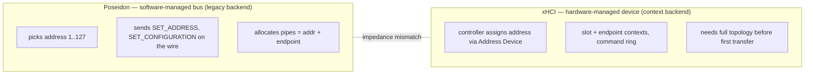

# Poseidon HCD model vs the xHCI device model — design rationale

> Why the context HCD ABI ([poseidon-context-hcd-abi.md](poseidon-context-hcd-abi.md)) is shaped
> the way it is: a comparison of **Poseidon's host-controller-driver model** (its lower-edge
> contract, see [poseidon.library-architecture.md](poseidon.library-architecture.md) §5) against
> the **xHCI hardware model**. The two disagree on who owns addressing, when topology is known, and
> in what order endpoint contexts can be built. The context ABI resolves those mismatches by
> modelling device and endpoint *lifecycle* explicitly — the way Linux `usbcore` does — rather than
> smearing context-grade state across every transfer.
>
> This is a rationale document, not an architecture reference: it records the reasoning that led to
> the shipped design. For the design itself see the ABI doc (the op set) and the library
> architecture doc §5 (the two-backend lower edge).

---

## 1. The two models

Poseidon descends from the **software-managed bus** controllers (UHCI/OHCI/EHCI): software owns the
bus state and the controller is a comparatively dumb transfer engine. xHCI is a **hardware-managed
device** controller: the controller owns device state (slots, contexts, addresses) and software
drives it through a command ring. The two disagree on three fundamental questions.

| Question | Poseidon model (software-managed) | xHCI model (hardware-managed) |
|---|---|---|
| **Who assigns the USB address?** | Software. Poseidon picks 1–127 (`pAllocDevAddr`) and sends a standard `SET_ADDRESS` control transfer. | The controller. `Address Device` assigns the address; there is no software `SET_ADDRESS`. |
| **What is a device's handle?** | The USB address (`iouh_DevAddr`) + endpoint number. | A controller-allocated **slot** + per-endpoint **context**. The USB address is just a field in the slot context. |
| **When/how is an endpoint usable?** | Implicitly, once the device is configured; the HCD is told per transfer. A pipe is just (addr, ep, maxpkt). | Only after an **endpoint context** (transfer ring + parameters) is built and a `Configure Endpoint` command runs. |
| **Who knows the topology?** | The stack. The HCD is told only what a single transfer needs. | The controller needs the full path: route string, root port, speed, parent-hub slot, TT info — in the slot context, *before* the first transfer. |
| **Transfer model** | One `IOUsbHWReq` per transfer (`UHCMD_CONTROL/BULK/INT/ISOXFER`). | TRBs on per-endpoint rings; completions via a shared event ring. |

The Poseidon column is not history: it is exactly the **legacy backend**'s model, and classic
third-party HCDs (Deneb, Subway, …) still run on it. The context ABI is the alternative for
xHCI-native drivers that would otherwise have to *fake* a software-managed bus.

---

## 2. Why lifecycle ops, not per-transfer topology

The tempting shortcut is to enrich the transfer request with the topology xHCI needs — attach route
string, root port, split/TT and SuperSpeed parameters to every `IOUsbHWReq` (the AROS "V3" field
set). That is a category error, and being precise about why is what drives the op set.

xHCI's defining idea is that **immutable per-device and per-endpoint state lives in DMA-resident
*contexts*, established once**, and a transfer is then a minimal TRB that references those contexts
by `(slot, endpoint index)`. Transfers are cheap *because* the controller already knows everything
durable about the device. Per-transfer topology inverts this — it recomputes and re-passes
context-grade data on the hot path of every transfer. Sorting those extras by their true scope makes
the mistake plain:

| Field | True scope under xHCI | Belongs in |
|---|---|---|
| route string, root port | **device** (slot context) | a once-per-device setup op |
| split-hub addr/port, TT/think-time | **device** (slot context) | once-per-device setup |
| SS max-burst, mult, bytes-per-interval | **endpoint** (endpoint context) | once-per-endpoint configure |
| power policy | device/endpoint policy | device or endpoint setup |
| stream id | **the transfer** | the transfer — the *only* genuinely per-transfer field |

Of the whole set, only the stream id legitimately belongs per transfer. A device's route string
cannot change mid-life, so re-supplying it per transfer carries no information after the first, and
there is no xHCI operation that re-routes an already-addressed device from a bulk transfer's
parameters. So the design does not carry that state per transfer at all: it establishes it once, in
the operations where it belongs (§3), exactly as Linux `usbcore` does via its
`alloc_dev`/`address_device`/`add_endpoint` hooks. A context-ABI transfer submit
therefore carries only the endpoint token, flags, stream id, NAK timeout, buffer and (for control)
the setup packet — no address, no topology.

---

## 3. The five mismatches and how the context ABI resolves each

Each row is an inherent Poseidon-vs-xHCI disagreement (§1) and the op that settles it. Without the
context ABI, an xHCI driver has to reverse-engineer the same facts by snooping wire traffic — which
is precisely what the legacy driver model did, and what the context ABI made unnecessary (deleted in
Phase 5).

| # | Mismatch | Resolved by |
|---|---|---|
| 1 | **Addressing ownership is inverted.** xHCI assigns the address; Poseidon assumes software does. | `NSCMD_USB_CREATE_DEVICE` — the HCD owns addressing and returns an opaque handle (`pd_Handle`); no wire `SET_ADDRESS`. Identity is the handle, not the address. |
| 2 | **The HCD must know topology before the first transfer**, but the legacy contract only ever tells it a single transfer's (addr, ep). | `CREATE_DEVICE` carries parent handle / port / speed / TT once; the driver builds the route string and slot context from that. No bus-shadow, no `SET_ADDRESS` correlation. |
| 3 | **EP0 max-packet sequencing.** xHCI needs the real MPS0 in the slot context; it is only known after the first descriptor read. | `NSCMD_USB_UPDATE_EP0` — an explicit Evaluate-Context step, per-speed-validated, instead of a speed-guess-then-correct snoop. |
| 4 | **Endpoint contexts must be built before use**, from full endpoint parameters (incl. SS companion fields). | `NSCMD_USB_CONFIGURE_ENDPOINTS` takes a `UhcdEndpointDesc[]` built from the descriptor tree; `NSCMD_USB_DECONFIGURE` tears them down. No descriptor cache, no wire `SET_CONFIGURATION` snoop. |
| 5 | **Streams, hubs, suspend, LPM** — device- and endpoint-scoped state with no per-transfer home. | `UPDATE_HUB` (port count / TT / MTT / SS latencies), `SET_SUSPEND` (ring quiesce), `SET_LINK_POWER` (LPM facts + policy), and — planned — `ALLOC/FREE_STREAMS` for UAS. |

**Invariant across both ABIs** (they are value-level contracts, not model-specific): `CMD_FLUSH`
replies every outstanding request; clear-halt is de-duplicated at the endpoint layer; the
dead-device error weighting is `ERR_TIMEOUT` +3 / `ERR_NAK_TIMEOUT` +2 / `ERR_CRC_ERROR` +1, halved
on decay. These are specified in the ABI doc §11 and hold on the legacy backend too.

---

## 4. Where the design lives now

* **The op set and encoding** — [poseidon-context-hcd-abi.md](poseidon-context-hcd-abi.md).
* **The library's two-backend lower edge** (the `PsdHCDOps` vtable, `pd_Handle` identity, the
  legacy-vs-context selection, submit-boundary marshalling) —
  [poseidon.library-architecture.md](poseidon.library-architecture.md) §5.
* **The driver side** — `emu68-driver-stack/components/emu68-xhci-driver-context/README-internal.md`.

The lower edge was split so both models coexist: the context backend serves xHCI-native drivers, the
frozen legacy backend serves classic software-managed-bus HCDs. Neither the address-0 serialization
nor the topology reconstruction that the legacy model needs applies to a context HCD —
`CREATE_DEVICE` is atomic in the driver, so `hub.class`'s address-0 lock (`nh_Adr0Sema`) is skipped
there.
