# poseidon.library — Architecture (reverse-engineered)

> Scope: the **core stack library** `poseidon.library` only. Class drivers (`*.class`)
> and applications are treated here as black boxes at the boundary — their *protocol*
> with the core is documented, their *internals* are a separate document.
>
> Sources reverse-engineered: `poseidon.library/poseidon.library.c` (~10.8k lines),
> `poseidon.library/poseidon_intern.h`, `poseidon.library/poseidon_main.c`,
> `poseidon.library/poseidon.sfd`, the boundary headers `include/devices/usbhcd_common.h`,
> `usbhardware.h` and `usbhcd_context.h` (lower edge) and `include/libraries/usbclass.h`
> (upper edge), `include/libraries/poseidon.h` (public API), and the class skeleton
> `classes/class_main.c`. Function names are the anchors throughout — this document carries no
> line references.

---

## Table of contents

1. [Layered architecture](#1-layered-architecture)
2. [The library as a classic Amiga shared library](#2-the-library-as-a-classic-amiga-shared-library)
3. [Object model — the USB device tree](#3-object-model--the-usb-device-tree)
4. [Process & task model](#4-process--task-model)
5. [Lower edge — communication with host-controller drivers (HCDs)](#5-lower-edge--communication-with-host-controller-drivers-hcds)
6. [Device enumeration](#6-device-enumeration)
7. [Upper edge — communication with class drivers](#7-upper-edge--communication-with-class-drivers)
8. [Configuration & persistence (IFF)](#8-configuration--persistence-iff)
9. [Event / notification subsystem](#9-event--notification-subsystem)
10. [The custom reader/writer lock](#10-the-custom-readerwriter-lock)
11. [End-to-end: bringing the stack up](#11-end-to-end-bringing-the-stack-up)
12. [Device lifecycle — connect and disconnect](#12-device-lifecycle--connect-and-disconnect)
13. [Failure recovery and resilience](#13-failure-recovery-and-resilience)
14. [State machines](#14-state-machines)
15. [Notable quirks & refactoring hazards](#15-notable-quirks--refactoring-hazards)
16. [Power policy — link power and suspend](#16-power-policy--link-power-and-suspend)
17. [Appendix — maps & indexes](#17-appendix--maps--indexes)

---

## 1. Layered architecture

Poseidon is a **hub-and-spoke** design: `poseidon.library` is a passive shared library at
the centre that owns all USB state and mediates between two replaceable edges.

* **Lower edge — host-controller drivers (HCDs).** Ordinary Exec `*.device`s (e.g. the
  user's `xhci.device`). The library's lower edge has **two backends** behind a
  `struct PsdHCDOps` vtable (`phw_HCDOps`), selected per-`PsdHardware`: a **legacy** backend
  that drives classic third-party HCDs through `struct IOUsbHWReq` / `UHCMD_*` commands
  (`devices/usbhardware.h`) with software-managed addressing, and a **context** backend for
  xHCI-native drivers using device/endpoint-lifecycle `NSCMD_USB_*` ops + direct, token-keyed
  transfer submits (`devices/usbhcd_context.h`) with HCD-owned addressing. Poseidon never contains
  controller-specific code.
* **Upper edge — class drivers.** Ordinary Exec `*.library`s (e.g. `hub.class`,
  `massstorage.class`) that all implement the 3-method `usbclass` ABI. They consume the
  public `psd*` API and are called back through `usbDoMethod(UCM_*)`.
* **Applications / tools** (Trident, the CLI loaders, USB apps) use the same public `psd*`
  API plus *app bindings* to claim devices.

The single mandatory class is **`hub.class`**: it is a normal class driver, but because the
USB topology is a tree of hubs it is what recursively drives enumeration of everything below
the root hub. The core only directly enumerates/scans **root hubs**; all deeper devices are
handled in the owning hub's task context.

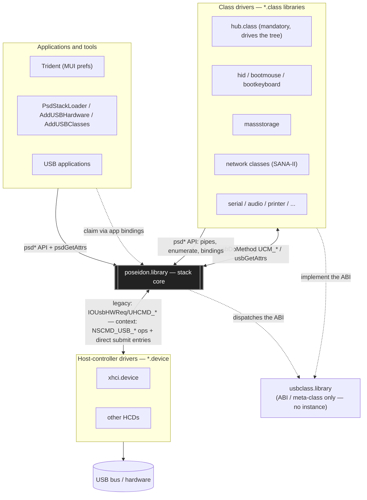

**Why this is the load-bearing structure.** The two edges share *nothing* with each other —
a class driver knows only the `psd*`/`UCM_*` protocol, an HCD speaks only its lower-edge
transport (legacy `IOUsbHWReq`/`UHCMD_*` or context `NSCMD_USB_*` ops + direct transfer
entries) — and the core is the only component that understands USB
semantics (addressing, descriptors, configurations, power, topology). That is what lets the
same Poseidon binary run unmodified over a brand-new `xhci.device`, and lets new class
drivers appear without touching the core.

---

## 2. The library as a classic Amiga shared library

`poseidon.library` is a standard Exec `RTF_AUTOINIT` resident built from a hand-written
skeleton (`poseidon_main.c` + `poseidon_funcs.inc` + `poseidon_end.c`); proto/inline/clib
headers are generated from `poseidon.sfd` by `sfdc`.

* **Romtag / resident** (`poseidon_main.c`): `romTag` is a `const struct Resident` —
  `RTC_MATCHWORD`, `RTF_AUTOINIT | RTF_COLDSTART`, version `POSEIDON_VERSION`, `NT_LIBRARY`,
  priority `LIBRARY_PRIORITY` (−44), `initTable`. `initTable = { sizeof(struct PsdBase),
  funcTable, NULL, LibInit }`.
* **LVO table** is `funcTable[]`: the four standard vectors `LibOpen, LibClose,
  LibExpunge, LibNull`, then `#include "poseidon_funcs.inc"` (99 `psd*` entries in
  `.sfd` order), then the `(APTR)-1` terminator. The `.sfd` declares **`==bias 30`**, so the
  first user function `psdAllocVec` is at LVO `-30` and each subsequent at `-6`.
* **Library base** is `struct PsdBase` (`poseidon_intern.h`), beginning with
  `struct Library ps_Library`. It holds every global list, both memory pools, the two custom
  locks, the timer request, the IFF config root, the PoPo (GUI) state, and the event-handler
  task state.
* **Register-args ABI.** Every LVO is written in plain C with bebbo-gcc register
  annotations, e.g. `APTR (psdAllocVec)(ULONG size asm("d0"), struct PsdBase *ps asm("a6"))`.
  The function name is **parenthesised** in the definition so the inline call-macros don't
  expand at the definition site.
* **Internal self-calls** go through the generated inline stubs:
  `poseidon.library.h` does `#define POSEIDON_BASE_NAME ps` then `#include <inline/poseidon.h>`,
  so an internal `psdFoo(...)` expands to an `LPn` LVO jump using the in-scope `ps` in `a6`.
  It deliberately does **not** include `<proto/poseidon.h>` (whose plain prototypes would
  clash with the register-arg definitions).
* **ROM-clean discipline.** `__NOLIBBASE__` is defined and `SysBase` is read from absolute
  `$4` (`#define EXEC_BASE_NAME (*(struct ExecBase **)4UL)`); all string tables are `const`.

### Lifecycle

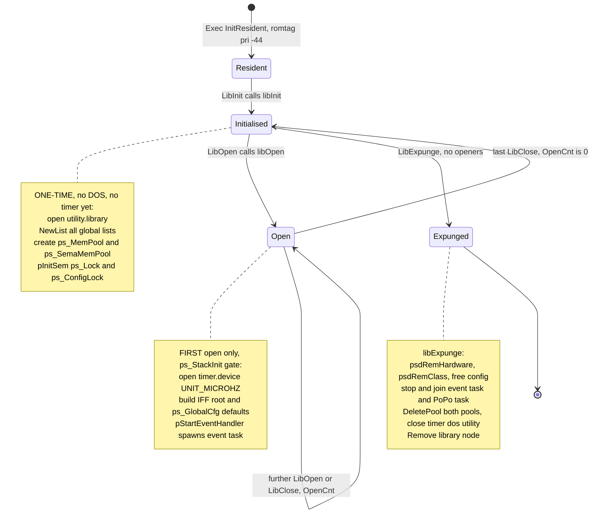

Key separation: **`libInit` builds the framework but adds no USB state.** The stack is
populated later by an external driver (the `PsdStackLoader` tool or the ROM startup
residents) calling `psdAddHardware` / `psdAddClass` / `psdClassScan` — see §11.

---

## 3. Object model — the USB device tree

All USB state is a tree of pool-allocated nodes hung off Exec `struct List`s. Every child
carries a direct **up-link** to its parent, so any node can walk up to the library base:
`pep → pif → pc → pd → phw → ps`.

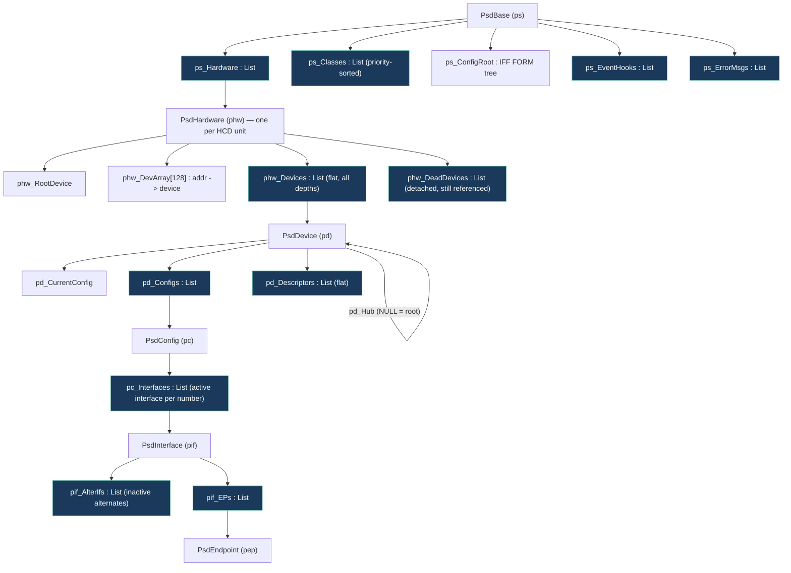

Field roles that matter for refactoring:

* **`PsdHardware`** — `phw_Devices` is **flat**: every device on a controller lives in one
  list regardless of depth. Tree shape is reconstructed from `pd_Hub` (parent hub device)
  and `pd_HubPort`. `phw_DevArray[128]` is the address→device map (index 0 reserved) used by
  the **legacy backend only** (context HCDs own addressing). `phw_Capabilities` (`UHCF_*`)
  comes from the HCD's `UHCMD_QUERYDEVICE` reply; `phw_HCDOps` (the `PsdHCDOps` lifecycle
  vtable) is the per-hardware backend selected right after that query — legacy or context
  (see §5.4).
* **`PsdDevice`** — `pd_Flags` (`PDFF_*`: speed, connected, configured, dead, suspended,
  needs-split, app-binding, del-expunge), `pd_DevAddr`, `pd_CurrentConfig`/`pd_CurrCfg`,
  `pd_IDString` (the persistence key, see §8), `pd_UseCnt` (deferred-free guard),
  `pd_DevBinding`/`pd_ClsBinding` (device-level binding + owning class).
* **`PsdInterface`** — alternates are modelled specially: `pc_Interfaces` holds only the
  *currently active* alternate for each interface number; the inactive ones hang off the
  active one's `pif_AlterIfs` with `pif_ParentIf` pointing back. `psdSetAltInterface`
  surgically swaps which one is "in the main list". `pif_IfBinding`/`pif_ClsBinding` are the
  interface-level binding.
* **`PsdDescriptor`** — `pd_Descriptors` is a **flat** list of *every* descriptor seen, each
  carrying optional up-links (`pdd_Config`/`pdd_Interface`/`pdd_Endpoint`) that locate it in
  the tree, plus raw bytes for class-specific descriptors.

---

## 4. Process & task model

Poseidon is multi-tasked. Tasks are created **only** through `psdSpawnSubTask` — which builds
a Process via `CreateNewProcTags` if DOS is up, or a bare `AddTask` Task if not — plus a
startup handshake (`SIGB_SINGLE`) where the parent waits until the child publishes its
`*_Task` field. Every task is spawned at `pgc_SubTaskPri` and then re-prioritises itself.

The stack is a single compile-time constant, `SUBTASKSTACKSIZE` (32 KB), and it is sized for the
**GUI** tasks rather than the workers: PoPo and every `CLASS_NAME " GUI"` task is a full MUI
application, and MUI 5 puts up a modal warning below 32 KB. Worker tasks inherit the same figure
because there is one spawn path, not two.

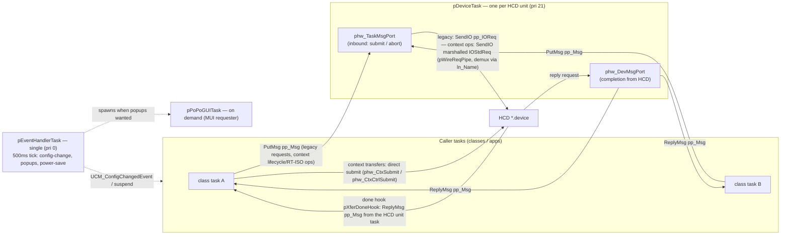

Task inventory:

| Task | Count | Spawned by | Role |
|---|---|---|---|
| `pDeviceTask` | one per HCD unit | `psdAddHardware` | Opens the HCD, selects the lower-edge backend (legacy vs context — decided here after `UHCMD_QUERYDEVICE` from `UHCF_CONTEXT` + the mandatory NSD op set, sealed by the `NSCMD_USB_ATTACH` handshake, `pCtxAttach`), relays **message-framed** pipe IO between callers and the device — legacy requests, context lifecycle ops, RT-ISO hook ops and bus commands only; context transfers are direct submits that never touch it — and handles aborts and shutdown (`CMD_FLUSH`). Priority 21. |
| `pEventHandlerTask` | exactly one | `libOpen` → `pStartEventHandler` | Always-on housekeeping on a 500 ms tick: recomputes the config hash when `ps_CheckConfigReq` is set, debounces `EHMB_CONFIGCHG` into `UCM_ConfigChangedEvent`, lazily launches the popup GUI, runs power-saving auto-suspend (§16.5), and applies link-power policy changes (§16.4). Priority 0. |
| `pPoPoGUITask` | at most one, on demand | event task | The built-in MUI device requester (`popo.gui.c`). Only if a Workbench screen exists and popups are enabled. |

> **No stream task.** `PsdPipeStream.pps_AsyncTask` exists in the struct but is never
> assigned — streams run in the **caller's** task; `PSFF_ASYNCIO` only changes the buffering
> code path, it does not spawn a thread.

---

## 5. Lower edge — communication with host-controller drivers (HCDs)

### 5.1 The contract (`usbhcd_common.h`, `usbhardware.h`, `usbhcd_context.h`)

An HCD is an Exec `*.device`. The contract is split across three headers:
`devices/usbhcd_common.h` owns what both backends share (`UHCMD_QUERYDEVICE`, `UHCMD_USBRESET`,
every `UHIOERR_*`, the `UHA_*` query tags and the `UHCF_*` capability bits),
`devices/usbhardware.h` the legacy transfer ABI, and `devices/usbhcd_context.h` the context ABI.

A **legacy** HCD is driven through `struct IOUsbHWReq` (an `IORequest` superset) carrying
`UHCMD_*` commands:

| Command | Meaning |
|---|---|
| `UHCMD_QUERYDEVICE` | Tag-based identity + capability bits |
| `UHCMD_USBRESET` | Root-port reset. The neighbouring `USBSUSPEND`/`USBOPER`/`USBRESUME` trio is legacy-ABI-only (`usbhardware.h`): the stack never issues it and the context HCD does not dispatch it |
| `UHCMD_CONTROLXFER` | EP0 setup+data+status (uses `iouh_SetupData`) |
| `UHCMD_BULKXFER` | Bulk transfer. The legacy ABI has **no** stream support — bulk streams are context-only (§5.6) |
| `UHCMD_INTXFER` | Interrupt transfer (`iouh_Interval`) |
| `UHCMD_ISOXFER` | Isochronous transfer |
| `UHCMD_ADDISOHANDLER` / `REMISOHANDLER` / `STARTRTISO` / `STOPRTISO` | Real-time ISO (audio/MIDI) |
| `CMD_FLUSH` | Abort everything outstanding (shutdown) |

The HCD advertises capability bits (`UHCF_USB20`, `UHCF_ISO`, `UHCF_RT_ISO`, `UHCF_QUICKIO`,
`UHCF_USB30`, `UHCF_CONTEXT`, …) via the `UHCMD_QUERYDEVICE` tag reply. The per-pipe
endpoint-context callback tags `UHA_PrepareEndpoint` / `UHA_DestroyEndpoint` are reserved and
never queried.

A **context** HCD (an xHCI-native driver such as `xhci.device`) additionally advertises
`UHCF_CONTEXT` and the mandatory NSD op set. Its contract (`devices/usbhcd_context.h`) is the
device/endpoint **lifecycle** ops `NSCMD_USB_*` — `CREATE_DEVICE`, `UPDATE_EP0`,
`CONFIGURE_ENDPOINTS`, `DECONFIGURE`, `UPDATE_HUB`, `SET_SUSPEND`, `SET_LINK_POWER`,
`RESET_DEVICE`, `DESTROY_DEVICE`, plus two distinct further groups — the **RT-ISO hook ops**
(`REGISTER`/`UNREGISTER_HOOKS`, `START`/`STOP_STREAM`) and the **bulk stream ops**
(`ALLOC`/`FREE_STREAMS`, §5.6) — with transfers as **direct calls** into the
HCD: `NSCMD_USB_ATTACH` (issued once per open by `pCtxAttach`, right after the NSD scan) exchanges
the library's completion hook (`phw_XferDoneHook`) for the driver's entries — the opaque
`phw_CtxHcd` context plus `phw_CtxSubmit` (bulk/interrupt/iso), `phw_CtxCtrlSubmit` (control) and
`phw_CtxAbort` — and every submit is keyed by an opaque **endpoint token** the lifecycle ops
return (`pd_Ep0Token` from `CREATE_DEVICE`, `pep_Token` per endpoint configured by
`CONFIGURE_ENDPOINTS`). A submit carries **no** device address and **no** per-transfer topology:
parent/port/speed/TT are passed once at `CREATE_DEVICE`, where the HCD owns addressing and hands
back an opaque `pd_Handle`.

### 5.2 The relay-task transport — why there are two ports

Each `PsdHardware` owns a dedicated **relay task** (`pDeviceTask`) and **two message ports**:

* **`phw_TaskMsgPort`** — *inbound*. Callers `PutMsg` a `PsdPipe` here to submit (or abort) work.
* **`phw_DevMsgPort`** — *completion*. It is the `mn_ReplyPort` of every IO request; the HCD
  posts finished `IOUsbHWReq`s here.

Two ports exist so the single relay task can `Wait()` on **both** signals at once and bridge
two independent flows: *many caller tasks → relay* (submit/abort) and *HCD → relay*
(completion). Serialising every `SendIO`/`AbortIO` onto one task (priority 21) means the HCD
never sees concurrent submission from the relay path, while arbitrarily many callers submit
concurrently. **The relay carries message-framed traffic only** — legacy requests, context
lifecycle ops, RT-ISO hook ops, and bus-level commands (`UHCMD_USBRESET`); context **transfers**
are direct submits (§5.3) that never touch it. On the **legacy** backend the bridge key is
`iouh_UserData = owning PsdPipe`, set before every `SendIO`/`BeginIO`; on the **context** backend
the relay task demuxes wire requests by `ln_Name` (`pWireReqPipe`, the marshalled lifecycle or
RT-ISO op). `phw_MsgCount` (volatile) tracks in-flight **message-framed** requests for clean
shutdown on both backends — direct submits never touch it, so the shutdown drain does not cover
them.

A `PsdPipe` embeds **both** a `struct Message pp_Msg` (the completion token the *stack*
waits on) **and** a `struct IOUsbHWReq pp_IOReq`. On the **legacy** backend `pp_IOReq` is what
the *HCD* sees. On the **context** backend `pp_IOReq` stays the library's internal pipe state:
transfers lower to `pDirectSubmit()` — the HCD's submit entry called in the caller's task, keyed
by `pep_Token`/`pd_Ep0Token` re-read per submit, with `pp_WireReq = NULL` (the direct-path marker) —
and the HCD's done hook (`pXferDoneHook`) writes the result into `pp_IOReq` and replies `pp_Msg`
from the driver's unit task; the lifecycle/RT-ISO ops are marshalled onto `IOStdReq`s
(`pp_Ctx`), with `pCtxCompletePipe()` copying `io_Error` back before `psdWaitPipe` sees it.
Either way completion is the **separate** `pp_Msg` replied to the caller's own `pp_MsgPort`.
`pp_Msg.mn_Node.ln_Type` is the pipe's little state machine:
`NT_FREEMSG → NT_MESSAGE (in flight) → NT_REPLYMSG (done) → NT_FREEMSG`.

### 5.3 Pipe lifecycle


Notes:

* **Route selection** happens in `pSubmitPipe`: on a context backend the four transfer commands
  (`UHCMD_CONTROLXFER/BULK/INT/ISOXFER`) lower to `pDirectSubmit()`, the RT-ISO control commands
  are re-keyed onto the context iso-hook ops (`pCtxMarshalIsoHooks`), and bus-level commands
  (`UHCMD_USBRESET`) keep legacy framing by design; everything message-framed then picks
  **QuickIO vs relay** on `phw_Capabilities & UHCF_QUICKIO` — QuickIO calls `BeginIO` directly in
  the caller's task (low latency), the relay path `PutMsg`s to the task port. **Every path
  delivers completion as `pp_Msg` on `pp_MsgPort`** — the direct path via the done hook — so
  `psdWaitPipe`/`psdCheckPipe`/streams are path-agnostic. A direct submit with no token yet
  (endpoint unconfigured, device gone) is rejected synchronously with `UHIOERR_TIMEOUT`.
* **Abort is asymmetric**: for a message-framed request `psdAbortPipe` allocates a shadow
  `PsdPipe` with `pp_AbortPipe` set and `PutMsg`s it to `phw_TaskMsgPort` — even on a QuickIO
  HCD — so the relay must stay alive to service aborts (`AbortIO(victim->pp_WireReq)`). A
  direct-submitted pipe (`pp_WireReq == NULL`) instead calls the HCD's abort entry (`phw_CtxAbort`)
  straight from the caller's task — a wish, like `AbortIO`; the completion still arrives through
  the done hook and `psdWaitPipe` collects the outcome.
* **Dead-device weighting** in `psdWaitPipe` scores every completion into `pd_DeadCount` — see
  §13.1 for the weights and thresholds.

### 5.4 The lifecycle backend vtable (`PsdHCDOps`)

The lifecycle moments of the lower edge are routed through a per-`PsdHardware` operations vtable
(`phw_HCDOps`, `struct PsdHCDOps` in `poseidon_intern.h`), bound by the relay task right after
`UHCMD_QUERYDEVICE`. There are **two backends**: the **legacy** backend (`pLegacyHCDOps`) — the
classic software-managed addressing behavior — is the default; the **context** backend
(`pContextHCDOps`, HCD-owned addressing per
[poseidon-context-hcd-abi.md](poseidon-context-hcd-abi.md)) is selected when the driver advertises
`UHCF_CONTEXT` **and** carries the mandatory NSD op set (`CREATE_DEVICE`, `DESTROY_DEVICE`,
`UPDATE_EP0`, `CONFIGURE_ENDPOINTS`, `UPDATE_HUB`, `ATTACH`) **and** the `NSCMD_USB_ATTACH`
handshake succeeds (`pCtxAttach` — it stores the driver's direct transfer entries in
`phw_CtxHcd`/`phw_CtxSubmit`/`phw_CtxCtrlSubmit`/`phw_CtxAbort`); a driver that claims
`UHCF_CONTEXT` but is missing an op, or whose attach fails, stays on the legacy backend.
Backend selection is entirely capability-driven — there is no override lever.

| Hook | Called from | Legacy backend | Context backend |
|---|---|---|---|
| `hop_AddressDevice` | `psdEnumerateDevice` (start) | `pAllocDevAddr` + EP0-MPS guess + `GET_DESCRIPTOR(8)` probe at address 0 + wire `SET_ADDRESS` (lost-ACK retry) + 50 ms settle; sets `pd_Handle = pd_DevAddr` | `NSCMD_USB_CREATE_DEVICE` (explicit parent/port/speed/TT; HCD owns addressing) → opaque `pd_Handle` + the EP0 submit token `pd_Ep0Token` |
| `hop_UpdateEp0MaxPacket` | `psdEnumerateDevice`, after MPS0 validated | no-op (implicit per transfer) | `NSCMD_USB_UPDATE_EP0` |
| `hop_ConfigureEndpoints` | `psdSetDeviceConfig`, before the wire `SET_CONFIGURATION` | no-op | `NSCMD_USB_CONFIGURE_ENDPOINTS` with a `UhcdEndpointDesc[]` built from the PsdConfig/PsdInterface/PsdEndpoint tree; the HCD writes each added endpoint's submit token back (`ed_Token` → `pep_Token`) |
| `hop_SetInterface` | `psdSetAltInterface`, before the wire `SET_INTERFACE` | no-op | `NSCMD_USB_CONFIGURE_ENDPOINTS` for the selected alternate (dropped endpoints lose their `pep_Token`, added ones get fresh tokens) |
| `hop_UpdateHub` | `psdSetAttrs(DA_HubNumPorts)` | no-op | `NSCMD_USB_UPDATE_HUB` (port count / TT think time / multi-TT) |
| `hop_DestroyDevice` | `pFreeDevice` | release the `phw_DevArray` slot | `NSCMD_USB_DESTROY_DEVICE` |

Outside the vtable the context backend also uses `NSCMD_USB_DECONFIGURE`,
`NSCMD_USB_SET_SUSPEND` (ring quiesce, §14.3), `NSCMD_USB_SET_LINK_POWER` (LPM, §16),
`NSCMD_USB_RESET_DEVICE` (`psdResetDevice`, §13.7), the RT-ISO hook ops and the bulk stream ops
(§5.6), and — once per open, right after the NSD scan — `NSCMD_USB_ATTACH` (`pCtxAttach`), which
installs `phw_XferDoneHook` (`pXferDoneHook`) with the driver and receives the direct transfer
entries in return.

`pd_Handle` (ULONG) is the backend-agnostic device identity token and the realized device
identity: the legacy backend sets it to the USB address; the context backend stores the HCD's
opaque handle there.

### 5.5 Speed, split-transactions, and topology fields (legacy backend)

Per-pipe topology is a **legacy-backend** concern. When `psdAllocPipe` builds a legacy IOReq it
fills the topology/speed fields the HCD needs:

* speed flags from `pd_Flags` — only `UHFF_LOWSPEED` and `UHFF_HIGHSPEED` exist, plus the HS
  `UHFF_MULTI_1/2/3` from `pep_NumTransMuFr`. The legacy ABI has no SuperSpeed flag and no SS
  companion fields, which is one reason USB3 is context-only;
* split-transaction fields when `PDFF_NEEDSSPLIT`: `UHFF_SPLITTRANS` + `iouh_SplitHubAddr/Port`
  from `pGetTTInfo` (walks up to the nearest high-speed TT hub) + the `UHFS_THINKTIME` nibble.
  `pGetTTInfo` also reports whether the TT is multi-TT, but there is no per-pipe field for it —
  multi-TT reaches a *context* HCD through `uho_MultiTT` at `UPDATE_HUB` instead.

On the **context** backend a direct submit carries **none** of this: parent/port/speed/TT are passed
once at `CREATE_DEVICE`, the HCD then tracks topology behind `pd_Handle` and knows each endpoint's
type and parameters from the token, and USB3 routing (root port / route string) is computed inside
the driver — the library never builds one. `struct IOUsbHWReq` is pure classic V1+V2, 90 bytes.

### 5.6 Bulk streams (context backend only)

USB3 bulk streams give an endpoint several independent transfer rings, so a class can keep many
commands in flight on one endpoint (massstorage's UAS tag engine is the only user today). The
library owns the *allocation* of those rings; the class only labels its pipes.

**How a pipe joins the stream id space.** Either a stream opened on an endpoint carrying
`EA_StreamBase`, or the `PPA_StreamID` pipe attribute on a plain pipe. Both routes call
`pCtxEnsureStreams`, which issues `NSCMD_USB_ALLOC_STREAMS` for the endpoint and records the count
in `pep_StreamsAlloc`. `pCtxFreeStreams` issues `NSCMD_USB_FREE_STREAMS`, and is reached by
`psdCloseStream`, by `EA_StreamBase → 0`, or by clearing `PPA_StreamID` to 0 on a plain pipe. An
alternate-setting change is *not* one of those routes: `pContextSetInterface` clears the
bookkeeping inline, because the HCD frees the rings along with the dropped endpoint. Hardware
capability is published to classes as the
`HA_StreamsSupported` hardware attribute, and the per-endpoint ceiling as `EA_MaxStreams`; the
count actually allocated is readable as `EA_StreamsAlloc`.

Three properties of this machinery are load-bearing for any class that uses it:

* **Assign stream ids descending.** `pCtxEnsureStreams` grows an endpoint's ring set by
  *free + re-allocate*, not by extension. Labelling pipes with ascending `PPA_StreamID` therefore
  triggers a free/realloc cycle per pipe; assigning the highest id first makes the first pipe size
  the endpoint and every later pipe hit the early-return.
* **A failed allocation is silent.** If `ALLOC_STREAMS` fails, `pCtxEnsureStreams` only warns and
  leaves the endpoint single-ring — transfers still work, but every stream id collapses onto one
  ring. That is survivable at queue depth 1 and data-corrupting above it, which is precisely why
  `EA_StreamsAlloc` is exposed: a class running concurrent tags **must** verify the rings exist
  rather than trust the allocation.
* **A config rebuild invalidates the rings.** `pContextConfigureEndpoints` clears
  `pep_StreamsAlloc` and `pep_Token` for every endpoint it rebuilds, because the HCD drops the old
  endpoint contexts (and with them the stream rings and submit tokens). Without that clear, the
  next `pCtxEnsureStreams` would early-return on a stale count and hand out phantom rings.

On the driver side a submit is routed to a ring by its stream id; a single-ring endpoint ignores
the id it is handed, so a stack running over a driver without the stream ops simply keeps the
pre-streams behaviour, and an endpoint in stream mode rejects stream id 0.

---

## 6. Device enumeration

Enumeration has two entry points. `psdEnumerateHardware` enumerates a controller's **root
hub**(s); `psdEnumerateDevice` enumerates **one device** the hub class has already allocated
and attached to a port. Both build the tree described in §3.

### 6.1 Root-hub enumeration (`psdEnumerateHardware`)

Allocates a probe device + default pipe and issues one `UHCMD_USBRESET` as a plain bus reset
(only `UHIOERR_HOSTERROR` is acted on — the reset's speed bits are never read). Root-hub speed
comes from the capability bits instead: a **SuperSpeed** root hub is enumerated when the hardware
is on the context backend and advertises `UHCF_USB30`, and the USB2 root hub is marked
`PDFF_CONNECTED | PDFF_HIGHSPEED` unconditionally. Both set `phw_RootDevice` and fire
`EHMB_ADDDEVICE` — this is the **only** place the core fires that event itself (§9).

### 6.2 Per-device enumeration (`psdEnumerateDevice`)

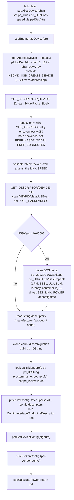

* **EP0 max-packet validation is per link speed, not per `bcdUSB`.** LS, HS and SS each have one
  legal value that the descriptor byte cannot override; only FS has a real choice. The validated
  result is pushed down through `hop_UpdateEp0MaxPacket`.
* **Addressing (legacy backend).** `pAllocDevAddr` scans `phw_DevArray[1..127]` for a free slot;
  the address becomes live on the wire only after the `SET_ADDRESS` control transfer (before that,
  `iouh_DevAddr = 0` / the default pipe is used). On the **context** backend there is no wire
  `SET_ADDRESS`: `NSCMD_USB_CREATE_DEVICE` makes the device addressable and the HCD owns the
  address behind the opaque `pd_Handle`.
* **Config-descriptor parsing** (`pGetDevConfig`) fetches each config's full blob and walks
  it descriptor-by-descriptor: `CONFIGURATION` → new `PsdConfig`; `INTERFACE` → new
  `PsdInterface` (alternates re-parented onto `pif_AlterIfs`); `ENDPOINT` → new `PsdEndpoint`
  with per-speed `pep_Interval` normalisation; `SS_EP_COMPANION` / `SS_ISO_COMPANION` modify
  the *preceding* endpoint; **every** descriptor is also recorded flat in `pd_Descriptors`
  with up-links and a class-specific name.
* **Identity strings.** `pd_IDString` =
  `"<product>-<VID%04x>-<PID%04x>-<serial>-<clone%02x>"`; `pif_IDString` =
  `"<if%02x>-<alt%02x>-<class%02x>-<sub%02x>-<proto%02x>"` (prefixed with config number for
  config > 1). These are the **persistence/binding keys** (see §8).
* **Detach.** `pFreeBindings` first moves the device to `phw_DeadDevices` (so a concurrent
  class-scan can't re-bind a dying device), releases bindings, then `pFreeDevice` — which
  *refuses to free* while `pd_UseCnt != 0` (sets `PDFF_DELEXPUNGE` and defers), and even when
  it does free, deliberately **does not** free the `PsdDevice` struct itself (other tasks may
  still hold the pointer). Dead devices are reaped by `psdRemHardware`.

---

## 7. Upper edge — communication with class drivers

### 7.1 The dispatch trick (`UsbClsBase`)

Poseidon does **not** call class drivers through a stored function pointer. It calls the
inline `usbclass` stubs `usbDoMethod` / `usbGetAttrs` / `usbSetAttrs` (declared in
`usbclass.sfd`, bias 30), which read their library base from a symbol named `UsbClsBase`,
which the core `#define`s as:

```c
#define UsbClsBase puc->puc_ClassBase
```

That `#define` is file-local to `poseidon.library.c`, so inside it **every** `usbDoMethod(UCM_…)`
site must have a `struct PsdUsbClass *puc` in scope, and the call lands in the LVO of *that* class
library. Iterating `puc` over `ps_Classes` and calling
`usbDoMethod(UCM_AttemptInterfaceBinding, …)` is literally "offer this to each class in priority
order." This polymorphism-by-macro is the core idea of the upper edge. Other translation units
(`popo.gui.c`) declare a real `UsbClsBase` local and bind it by hand instead.

The mirror image: every `*.class` is an `RTF_AUTOINIT` library whose `funcTable` (shared
skeleton in `classes/class_main.c`) exposes the 3 ABI vectors **`usbGetAttrsA` /
`usbSetAttrsA` / `usbDoMethodA`** at fixed offsets 30/36/42. `usbclass.library` itself is
**not an instantiated library** — it is purely the ABI contract + constants; there is no
`_UsbClsBase` instance, callers always rebind it.

### 7.2 The binding model

| Level | Binding ptr | Owning class | Example |
|---|---|---|---|
| Device | `pd_DevBinding` | `pd_ClsBinding` | `hub.class` claims the whole device |
| Interface | `pif_IfBinding` | `pif_ClsBinding` | `bootmouse`, `cdcacm` claim one interface |
| App | `pd_DevBinding` (+`PDFF_APPBINDING`, `pd_ClsBinding == NULL`) | — | Trident / app claims a device |

A "binding" is an **opaque pointer the class returns** — usually its own per-instance context
(it typically spawns a worker subtask there). Poseidon never dereferences it; it only stores
it and hands it back on later `UCM_Release*` / `UCM_*Suspend*` calls. The companion
`*_ClsBinding` records which `PsdUsbClass` owns the bond so releases route to the right
library. Device-level and interface-level binding are mutually exclusive on one device.

### 7.3 The class-scan / bind algorithm

`psdClassScan` walks all hardware and calls `psdHubClassScan` on each **root hub only**;
every deeper device is scanned by its parent hub's task (via `UCM_HubClassScan`). For one
device, `psdHubClassScan` runs (under PBase read lock + device write lock):

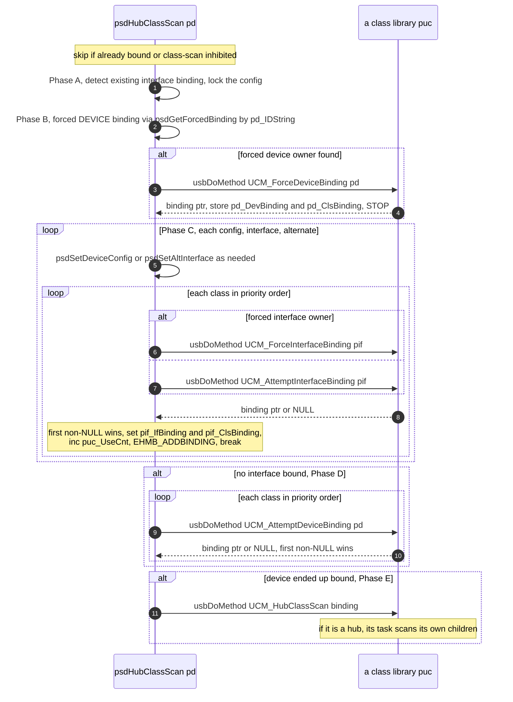

* **Order = priority.** Classes are kept on `ps_Classes` sorted descending by `UCCA_Priority`
  (queried at `psdAddClass`), so higher-priority classes get first refusal (e.g. `hid.class`
  before `bootmouse`).
* **Alternate probing is descriptor-only.** For an unbound interface with alternates, Phase C
  offers the active alternate and then each inactive one to the classes **without touching the
  wire** — classes decide from the parsed descriptor tree. Only when a class *accepts* an alternate
  does the scan issue a single `psdSetAltInterface` (which early-returns if it is already the
  active one); if that wire switch fails, the binding is released
  (`UCM_ReleaseInterfaceBinding`) and the alternate skipped. Because nothing switches while
  probing, the loop iterates the stable `pif_AlterIfs` list of the original main interface
  directly, and needs no restore when no class binds.
* **Accept/decline** is the class's choice: it inspects `IFA_Class/SubClass/Protocol` via
  `psdGetAttrs` and returns a binding or `NULL`.
* **Forced bindings** (`psdSetForcedBinding`, keyed by `pd_IDString`[`+pif_IDString`]) pin a
  device/interface to a named class regardless of priority.

### 7.4 Release — direct calls against the target

The public release entry points (`psdReleaseDevBinding`/`IfBinding`/`AppBinding`) call the
mutating primitives (`psdHubReleaseDevBinding`/`IfBinding`) **directly, in the caller's task**.
The serializer is the target device's own write lock plus NULL-before-invoke idempotency inside
the primitives: the binding field is cleared under the lock *before* the class's release method
runs, so a concurrent release of the same node resolves to exactly one class invocation. Classes
that block waiting for a worker task to exit use `psdBorrowLocksWait` from the real caller.

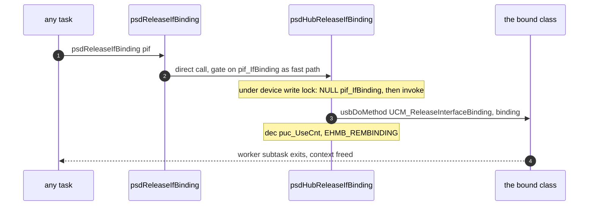

Both hub classes still *implement* the `UCM_HubReleaseDevBinding`/`IfBinding` methods for ABI
compatibility, but the library never sends them: routing a release through the hub is unsafe,
because the hub's `pd_DevBinding` — the routing token — is NULL for the whole of the hub class's
own teardown, so a release aimed at a child of a dying hub would be dropped.

**Claim, by contrast, is routed**: `psdClaimAppBinding` sends `UCM_HubClaimAppBinding` to the hub
task — claiming genuinely touches hub state — which calls back into `psdHubClaimAppBindingA`
to set `PDFF_APPBINDING` + `pd_DevBinding = pab` (with `pab_ReleaseHook` for when the stack
needs the app to let go; that hook runs in whatever task releases the binding).

### 7.5 The `UCM_*` method protocol (who triggers what)

| Method | Triggered by | Returns |
|---|---|---|
| `UCM_AttemptInterfaceBinding` / `ForceInterfaceBinding` | scan Phase C | binding or NULL |
| `UCM_AttemptDeviceBinding` / `ForceDeviceBinding` | scan Phase B/D | binding or NULL |
| `UCM_ReleaseInterfaceBinding` / `ReleaseDeviceBinding` | `psdHubRelease*Binding` | — |
| `UCM_AttemptSuspendDevice` / `AttemptResumeDevice` | `psdSuspendBindings`/`psdResumeBindings`, power-save | TRUE if (un)suspendable |
| `UCM_SafeEject` | `psdSafeEjectDevice` — every bound class advertising `UCCA_SupportsSafeEject`, deduped by class (the method is device-scoped), then the hub port goes down. Runs on the caller's Process, no device lock held: an eject blocks for as long as the filesystems and the hardware need. `DA_CanSafeEject` answers "would this do anything" for greying a menu/button | `SAFEEJECT_*` |
| `UCM_ConfigChangedEvent` | event task, debounced | class reloads its config |
| `UCM_DOSAvailableEvent` | AfterDOS pass | — |
| `UCM_HubClassScan` | scan Phase E | hub task scans children |
| `UCM_HubClaimAppBinding` | `psdClaimAppBinding` (§7.4) | binding |
| `UCM_HubReleaseDevBinding` / `HubReleaseIfBinding` | *nothing* — never sent (§7.4) | — |
| `UCM_HubSuspendDevice` / `HubResumeDevice` | `psdSuspendDevice` / `psdResumeDevice` | — |
| `UCM_HubPowerCyclePort` / `HubDisablePort` | PoPo recovery, Trident, `psdSafeEjectDevice` | — |
| `UCM_HubResetPort` | `psdResetDevice` (§13.7) | — |
| `UCM_MediaPending` / `UCM_PortsPending` | the ROM resident pre-DOS, not the library | TRUE while a verdict is outstanding |

`UCM_LocaleAvailableEvent`, `UCM_SoftRestart` and `UCM_HardRestart` are part of the ABI but are
not sent by anything in this tree; `UCM_OpenCfgWindow`/`OpenBindingCfgWindow` come only from
`popo.gui.c`.

---

## 8. Configuration & persistence (IFF)

All stack configuration is a nested IFF FORM tree, held in memory as `PsdIFFContext` nodes
(`ps_ConfigRoot`) and serialised to `ENV:`/`ENVARC:Sys/poseidon.prefs`. Class drivers cannot
touch the tree directly — they inject/extract whole sub-FORMs **by copy**.

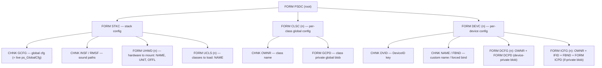

* **`PsdIFFContext`** is a hybrid: the **FORM hierarchy is a node tree** (`pic_SubForms`),
  but the **chunks inside a form are an opaque big-endian byte blob** (`pic_Chunks`) scanned
  linearly. Chunks are replace-by-id; FORMs are append. This keeps the class-visible
  interface ("give me / take this FORM buffer") trivially copyable. All multi-byte integers
  are stored big-endian on disk via `AROS_LONG2BE` regardless of host.
* **Class-visible API**: `psdGetClsCfg`/`psdSetClsCfg` (the `GCPD` blob keyed by owner),
  `psdGetUsbDevCfg`/`psdSetUsbDevCfg` (the `DCPD`/`ICPD` blobs keyed by `(devid[,ifid],owner)`).
  The getters hand back the **live** FORM node; the copy happens one level down — a class reads
  its data out with `psdGetCfgChunk` (which returns a `psdAllocVec`'d chunk it must free) or
  serialises with `psdWriteCfg`, and the setters copy a supplied FORM buffer in. The keys are the
  `pd_IDString`/`pif_IDString` built during enumeration (§6).
* **Apply step** (`psdParseCfg`): reconciles the *running* stack against `STKC` — marks all
  hardware/classes for removal, un-marks those listed in `UHWD`/`UCLS` (keeping ROM-resident
  in-use classes), drops the orphans, adds the missing ones (`psdAddClass` /
  `psdAddHardware` + `psdEnumerateHardware`), then `psdClassScan`. Safety quirk: an empty
  `UHWD` does **not** strand existing hardware (so a blank config can't kill a boot keyboard).
* **Change detection**: `pCalcCfgCRC` computes a cheap structural hash over the whole tree;
  `ps_ConfigHash` (current) vs `ps_SavedConfigHash` (last load/save) tell clients there are
  unsaved changes. `ps_CheckConfigReq` is the "recompute needed" flag set by every mutating
  call and polled by the event task, which calls `pCheckCfgChanged` → fires `EHMB_CONFIGCHG`.
  `pUpdateGlobalCfg` keeps the live `ps_GlobalCfg` struct and the `STKC/GCFG` chunk in sync
  (the struct's first 8 bytes *are* a ready-to-embed `GCFG` chunk).
* **`struct PsdGlobalCfg` is append-only**, because it *is* the `GCFG` chunk and is merged
  back with a `min(saved, current)` length copy: every field an older prefs file does not
  carry simply keeps its `libOpen` default. Inserting, reordering or resizing a field
  silently corrupts every existing `poseidon.prefs`. The defaults are chosen so that inheritance
  is the wanted behaviour: `pgc_MakeMeBoring` (the last field) defaults `FALSE`, so a prefs file
  that predates it keeps Poseidon's traditional message wording, and `pgc_LinkPowerMgmt` before it
  defaults `TRUE` so link-power management stays on.

---

## 9. Event / notification subsystem

A broadcast bus: any number of subscribers register a `MsgPort` + a bitmask of event types;
the core `PutMsg`s a `PsdEventNote` to each interested port. There are 15 event types
(`EHMB_ADDHARDWARE … EHMB_DEVRESUMED`); `Param1` carries the relevant object.

```mermaid
flowchart LR
    subgraph PRODUCERS["Event producers"]
        E1["root-hub enumerate (core) / hot-plug (hub classes)<br/>-> EHMB_ADDDEVICE / REMDEVICE"]
        E2["bind -> EHMB_ADDBINDING / REMBINDING"]
        E3["pCheckCfgChanged -> EHMB_CONFIGCHG"]
        E4["psdWaitPipe -> EHMB_DEVICEDEAD"]
    end
    SE["psdSendEvent(ehmt, p1, p2)"]
    HOOKS["ps_EventHooks : list of PsdEventHook (port + mask)"]
    RP["ps_EventReplyPort (PA_IGNORE)"]

    PRODUCERS --> SE
    SE -->|"for each hook where mask matches"| HOOKS
    HOOKS -->|"PutMsg PsdEventNote (reply = ps_EventReplyPort)"| SUBS["subscriber ports<br/>(Trident, event task, ...)"]
    SUBS -.->|"ReplyMsg"| RP
    SE -->|"pGarbageCollectEvents drains + frees"| RP
```

* Delivery is fire-and-forget; the reply port is `PA_IGNORE` so replies pile up silently and
  are reaped lazily by `pGarbageCollectEvents` (called at the front of every `psdSendEvent`).
* **The core fires `EHMB_ADDDEVICE`/`REMDEVICE` only for root hubs** (§6.1); every hot-plugged
  device's add/remove events come from the hub class that owns the port.
* The hook list is guarded by the plain Exec `ps_ReentrantLock` (not the custom lock).
* The **always-on event task** (`pEventHandlerTask`, §4) is both a *consumer* (it subscribes
  to `EHMF_CONFIGCHG`) and the *launcher* of the popup GUI. Each 500 ms tick it: runs
  `pCheckCfgChanged` if requested; ~2 ticks after a config change, broadcasts
  `UCM_ConfigChangedEvent` to every class (coalescing rapid edits); lazily spawns
  `pPoPoGUITask` if popups are wanted; and (if `pgc_PowerSaving`) auto-suspends idle non-hub
  devices past `pgc_SuspendTimeout`.

---

## 10. The custom reader/writer lock

Poseidon replaces Exec `SignalSemaphore` with its own multi-reader/single-writer lock
(`struct PsdLockSem`, embedded in `PsdBase.ps_Lock`, `PsdBase.ps_ConfigLock`,
`PsdDevice.pd_Lock`). Two requirements drive this:

1. **Lock hand-off across a `Wait()`** — a device/relay task often must release the locks it
   holds, block on a signal from another task, and reacquire afterwards, *without* letting
   the protected structures be torn down and *without* deadlocking against the task that will
   wake it. This is the **borrow-lock** mechanism (`psdBorrowLocksWait`).
2. **Deadlock observability** — every lock is registered on `ps_DeadlockDebug` so
   `psdDebugSemaphores` can dump owner, waiters, and shared holders.

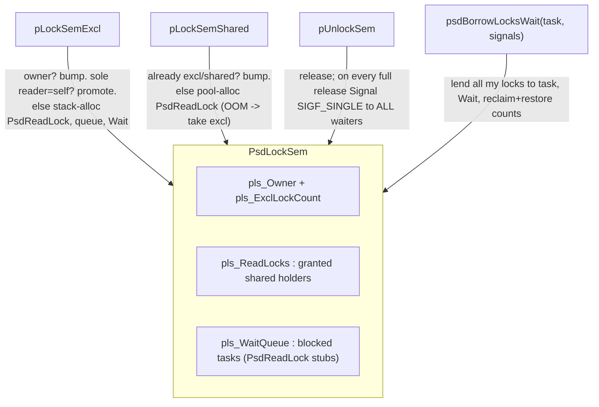

Important properties for refactoring:

* The lock protects itself with `Forbid()/Permit()` and signals waiters with `SIGF_SINGLE`.
* A separate pool (`ps_SemaMemPool`) backs lock records so the lock code never re-enters the
  sem-protected general allocator. On OOM, a shared request **degrades to exclusive** (needs
  no memory) — correctness over concurrency.
* `pUnlockSem` does a deliberate **thundering-herd**: on every full release it signals *all*
  waiters, because a waiter may already hold a shared lock on the same sema and signalling
  only at count-zero could hang it. Woken tasks recheck and re-wait.
* `pCheckForDeadlock` is **declared but not implemented** — there is no active deadlock
  *detector*; only the `psdDebugSemaphores` dump path.
* Public wrappers: `psdLockRead/WritePBase` + `psdUnlockPBase` (guard the global lists),
  `psdLockRead/WriteDevice` + `psdUnlockDevice` (per-device `pd_Lock`). Most config functions
  take `ps_ConfigLock` directly — `psdGetUsbDevCfg` shared, `psdSetClsCfg` exclusive — but
  `psdGetClsCfg` takes no lock at all. A recurring idiom drops the config lock before calling
  `psdRemClass`/`psdRemHardware` (which re-enter and take other locks).

---

## 11. End-to-end: bringing the stack up

`libOpen` only builds the framework. The stack is populated by an external driver — normally
the `PsdStackLoader` CLI tool (placed in `S:User-Startup`), or the ROM startup residents on a
Kickstart-replacement boot.

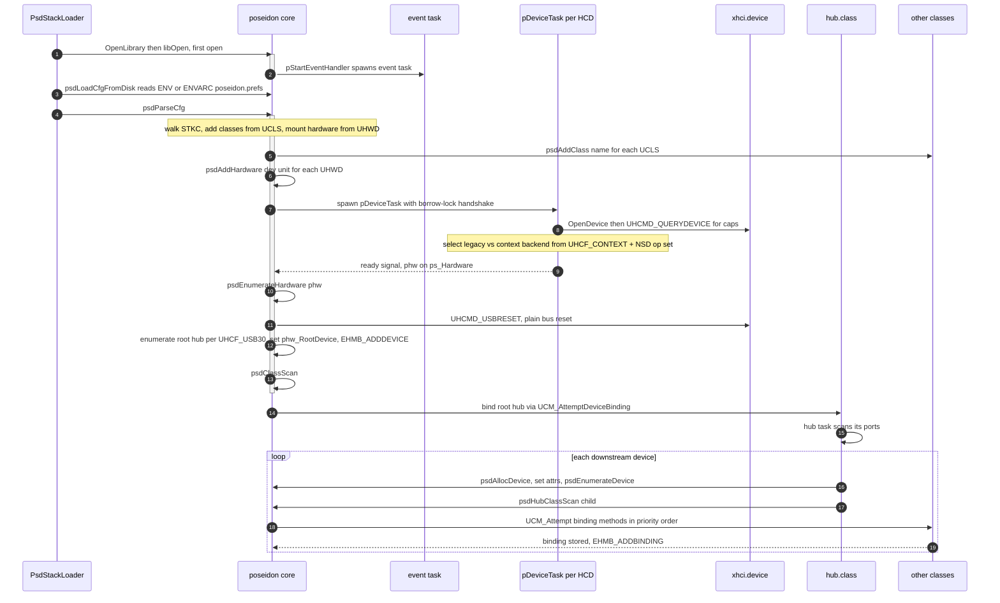

`ps_StartedAsTask` and the **AfterDOS** dance: on a cold-boot ROM path the stack is first
configured from a Task before `dos.library` exists. `psdParseCfg` reads
`nodos = (ln_Type != NT_PROCESS)` and uses it to gate three things — the AfterDOS pass, the
`ps_StartedAsTask` latch and the boot delay. (What keeps a blank config from stranding cold-boot
hardware is the separate rule above: no `UHWD` FORM at all means nothing is marked for removal.)
Once DOS appears the AfterDOS pass runs — temporarily releasing bindings for classes flagged
`UCCA_AfterDOSRestart` (so `hid.class` can overrule `bootmouse`/`bootkeyboard`) and broadcasting
`UCM_DOSAvailableEvent`, then re-scanning. The ROM resident that drives this is
`romstartup/usbromstart.c` — see [rom-image.md](rom-image.md). `ps_StartedAsTask` is set by both
`psdParseCfg` and `psdClassScan`, which is what lets the resident — which never calls
`psdParseCfg` — get the latch by calling `psdClassScan` unconditionally, even on a machine where
no host controller turned up.

---

## 12. Device lifecycle — connect and disconnect

This is the runtime **hot-plug** path. It spans `hub.class` (the per-hub task `nHubTask`, which
owns the USB hub-class port mechanics) and the core. Markers: **[H]** = runs in the hub task
(`hub.class`); **[C]** = core logic owned by `poseidon.library.c` (executed *in the hub task's
context* — a library call, not a separate task). `hub.class` internals are a separate document;
they appear here only as far as needed to make the flow end-to-end.

**Per-hub context.** Each bound hub runs its own `nHubTask` with state in `struct NepClassHub`:
`nch_Downstream[port]` (the per-port `PsdDevice*` — the source of truth for "is a device on
port N", NULL = empty), `nch_PortChanges[]` (the interrupt change bitmap), and the deferred-action
flags `nch_DisablePort` / `nch_PowerCycle` / `nch_ClassScan`. **Address-0 enumeration is serialised
in `hub.class`, not in the library**, by its class-wide `nh_Adr0Sema`: only one legacy device may
sit at USB address 0 at a time, so a slow or stuck reset holds the semaphore and stalls all other
`hub.class` enumeration. The semaphore is taken at the *top* of `nConfigurePort` — before the first
`GET_PORT_STATUS`, because even that reply can re-arm a driver's port-to-`SET_ADDRESS` correlation —
and held across the whole port bring-up. Context HCDs **skip** it (`CREATE_DEVICE` is atomic in the
driver, so there is no wire address-0 window), and `hubss.class` is context-only and has no
address-0 semaphore at all.

### 12.1 Connect

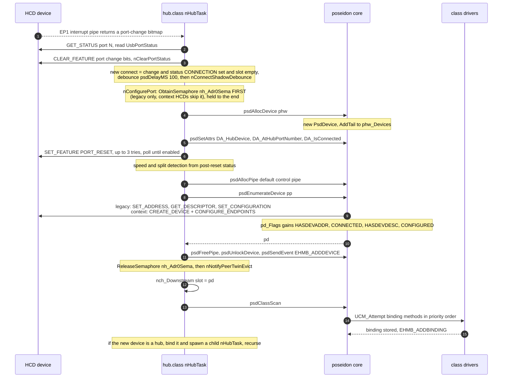

Ordered phases:

1. **Detect [H].** The hub's EP1 interrupt pipe (`psdSendPipe`) completes with a port-change
   bitmap; the task reads `GET_STATUS` for each changed port and `nClearPortStatus` acks the
   change bits. New-connect condition = change *and* status `UPSF_PORT_CONNECTION` set *and*
   `nch_Downstream[port-1] == NULL`; debounce 100 ms, then `nConnectShadowDebounce` settles the
   USB-2 twin of a SuperSpeed port before `nConfigurePort` runs.
2. **Claim address 0 [H].** `nConfigurePort` takes `nh_Adr0Sema` first (legacy backend only) and
   holds it for everything below.
3. **Allocate + link [C].** `psdAllocDevice(phw)` makes a zeroed `PsdDevice` and `AddTail`s it to
   `phw_Devices`. The hub then sets `pd_Hub` / `pd_HubPort` / `PDFF_CONNECTED` via
   `psdSetAttrs(PGA_DEVICE,…)` — this is what places the device in the tree.
4. **Reset + speed [H].** `SET_FEATURE PORT_RESET` (≤3 attempts, poll ≤500 ms until enabled);
   derive speed/split from post-reset status (`PDFF_HIGHSPEED` / `PDFF_LOWSPEED` /
   `PDFF_NEEDSSPLIT`); settle delay.
5. **Enumerate [C].** `psdAllocPipe` default control pipe → `psdEnumerateDevice(pp)`: address the
   device (legacy `SET_ADDRESS` / context `CREATE_DEVICE`), read descriptors, parse configs, set
   configuration — progressively setting `PDFF_HASDEVADDR | CONNECTED | HASDEVDESC | CONFIGURED`
   (see §6).
6. **Announce + bind.** `psdFreePipe`, `psdUnlockDevice`, `psdSendEvent(EHMB_ADDDEVICE)`, then
   release `nh_Adr0Sema` — in that order — and notify the peer twin [H]; store `pd` in
   `nch_Downstream` [H]; `psdClassScan` [C] offers the device to classes in priority order
   (`UCM_Attempt*Binding`) → binding stored, `EHMB_ADDBINDING` (see §7). A *hot-plug* connect calls
   `psdClassScan`; `psdHubClassScan(pd)` is the initial-port-pass and deferred/power-cycle path.
7. **Recurse [H].** If the new device is itself a hub, `hub.class` binds it
   (`UCM_AttemptDeviceBinding`) and `psdSpawnSubTask`s a fresh `nHubTask` — which restarts this
   flow for the child hub's ports. **Topology discovery is one hub task per hub, expanding
   leaf-ward.**

### 12.2 Disconnect

Three triggers, all converging on `psdFreeDevice`: **(A)** a live port-disconnect change on
EP1; **(B)** an explicit `UCM_HubDisablePort` / `UCM_HubPowerCyclePort` method (e.g. from the
PoPo auto-recovery in §13); **(C)** the hub itself vanished — EP1 `UHIOERR_TIMEOUT` or the hub
binding released → `nFreeHub` tears down every port.

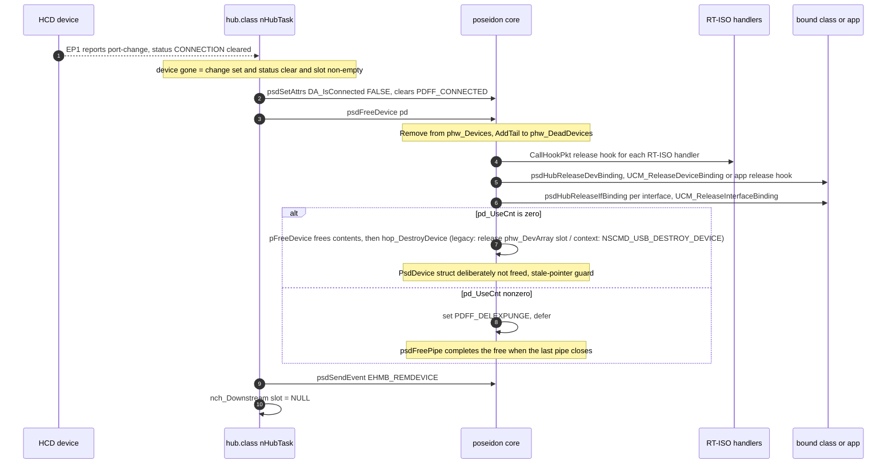

Ordered phases:

1. **Detect [H].** Port change with `UPSF_PORT_CONNECTION` cleared and `nch_Downstream[port-1]`
   non-NULL → device gone.
2. **Mark offline [C].** `psdSetAttrs(DA_IsConnected, FALSE)` clears `PDFF_CONNECTED`.
3. **Free [C] (`psdFreeDevice`).** `Remove` from `phw_Devices` and `AddTail` to
   `phw_DeadDevices` **immediately** (closes the race where a class scan could re-touch a dying
   device); notify each `pd_RTIsoHandlers` entry via its `prt_ReleaseHook`; release the
   device-level binding (`psdHubReleaseDevBinding` → `UCM_ReleaseDeviceBinding`, or the app's
   `pab_ReleaseHook`), then every interface binding (`psdHubReleaseIfBinding` →
   `UCM_ReleaseInterfaceBinding`); each release fires `EHMB_REMBINDING`.
4. **Free or defer [C] (`pFreeDevice`).** At `pd_UseCnt == 0` it clears `PDFF_DELEXPUNGE` first —
   disarming the deferred collector, because the context backend's `hop_DestroyDevice` pumps a
   temporary EP0 pipe through `psdFreePipe`, which would otherwise re-enter `pFreeDevice` — then
   frees configs, descriptors and strings, tears down backend addressing via `hop_DestroyDevice`
   (context `DESTROY_DEVICE` latches and zeroes `pd_Handle` *before* issuing the op, so it is
   idempotent), and deletes `pd_Lock`, but deliberately **does not** free the `PsdDevice` struct.
   At `pd_UseCnt != 0` it sets `PDFF_DELEXPUNGE` and defers; the `psdFreePipe` that drops the count
   to 0 calls it again to finish.
5. **Announce + clear slot [H].** `psdSendEvent(EHMB_REMDEVICE)`; `nch_Downstream[port-1] = NULL`.
6. **Recursive hub teardown.** Removing a hub signals its `nHubTask` (`SIGBREAKF_CTRL_C`);
   `nFreeHub` runs the disconnect path for *every* downstream port. Because each child hub's
   binding is released first (its task signalled and exits), teardown unwinds **leaf-first**.
7. **HW-interface removal [C] (`psdRemHardware`).** Frees all live devices, then reaps
   `phw_DeadDevices` with the wait-then-abandon escalation (§13.5).

---

## 13. Failure recovery and resilience

The dominant theme is **soft degradation over hard failure**: score-and-decay rather than a hard
flip, *abandon* rather than hang, *degrade* rather than fail to allocate, and keep a
half-enumerated device rather than discard it.

The central artefact is the **device-health** machine driven by the per-IO dead-device counter:

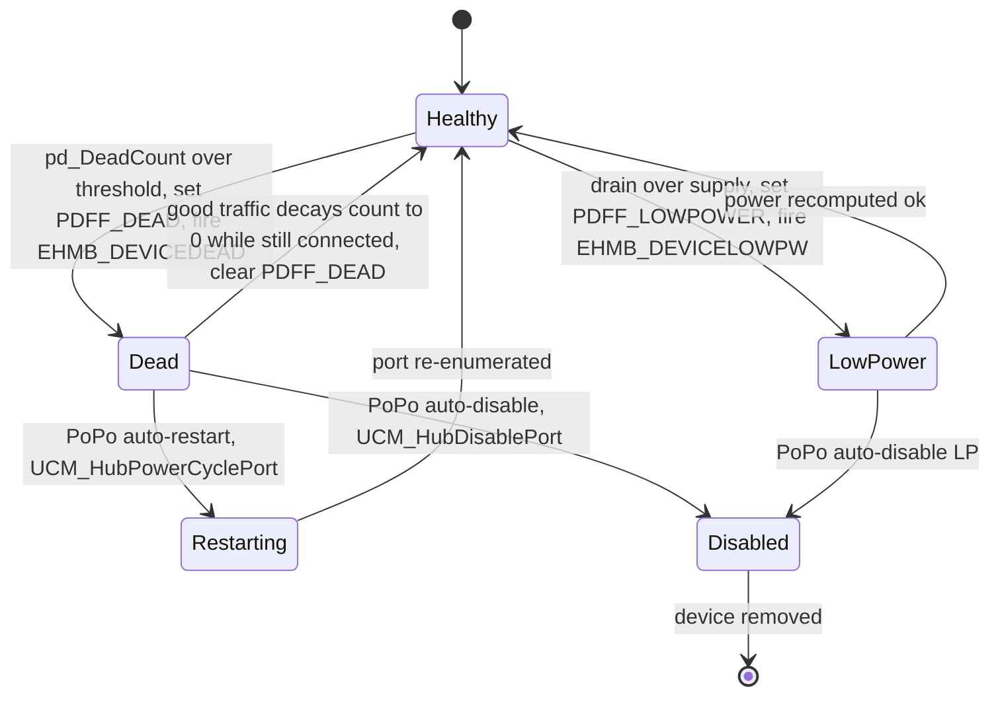

### 13.1 Dead-device counter (`psdWaitPipe`)

Every completed transfer is scored by IO error in a deliberate fall-through switch: `UHIOERR_TIMEOUT`
adds 3 (falls through to NAKTIMEOUT and CRC), `UHIOERR_NAKTIMEOUT` adds 2, `UHIOERR_CRCERROR` adds 1;
any other result (including success) **halves** the counter (`pd_DeadCount >>= 1`). So one timeout
costs 3 but recovery is **geometric**. Thresholds: `pd_DeadCount > 19`, or `> 14` if the device
already has an address/descriptor (`PDFF_HASDEVADDR|HASDEVDESC` — a partially-enumerated device is
condemned sooner), set `PDFF_DEAD` and fire `EHMB_DEVICEDEAD` once. Recovery: when the count decays
to 0 *and* the device is still `PDFF_CONNECTED`, `PDFF_DEAD` is cleared ("the zombie returned").

### 13.2 Auto-recovery (PoPo task, `popo.gui.c`)

On `EHMB_DEVICEDEAD` / `EHMB_DEVICELOWPW`, the PoPo GUI task consults three global-config booleans
and acts **on the parent hub's binding**: `pgc_AutoRestartDead` + dead →
`usbDoMethod(UCM_HubPowerCyclePort, hubpd, pd_HubPort)` (disable then re-enumerate the port);
otherwise `pgc_AutoDisableDead` / `pgc_AutoDisableLP` → `usbDoMethod(UCM_HubDisablePort, …)` (unbind,
free, electrically disable the port). **Note the coupling:** this recovery *policy* lives in the GUI
task, not the core proper — a refactor that assumes the core is self-healing will be wrong.

### 13.3 Power model (`psdCalculatePower` / `pPowerRecurseDrain` / `pPowerRecurseSupply`)

This is the **electrical** mA budget only. User-facing power *policy* — link power management and
suspend — is §16.

Recomputed after every enumerate, every free, and on config change. Two recursive passes sum drain
and distribute supply; if `pd_PowerDrain > pd_PowerSupply` it sets `PDFF_LOWPOWER` and fires
`EHMB_DEVICELOWPW`, self-clearing when the budget is restored.

### 13.4 Enumeration robustness

* **SET_ADDRESS lost-ACK retry (legacy backend)**, in `pLegacyAddressDevice`: the device may accept
  the address but lose the ACK, so on `TIMEOUT`/`STALL` it waits 250 ms and retries **once at the
  new address** (no re-setup). Back in `psdEnumerateDevice`, `fail_restore` rolls back
  `iouh_DevAddr` and the flags if a later step fails. (The context backend has no wire
  `SET_ADDRESS`; `CREATE_DEVICE` addresses the device atomically.)
* **NAK-timeout arming**: enumeration sets `UHFF_NAKTIMEOUT` + `iouh_NakTimeout = 1000` on both
  backends so a mute device can't wedge the bus; restored on every exit path.
* **Descriptor tolerance**: `UHIOERR_OVERFLOW` (babble) and `UHIOERR_RUNTPACKET` (short) are swallowed
  on string and first-8-byte device reads; a missing LangID synthesises a dummy `0x0409` (US-English).
* **String hygiene**: `psdGetStringDescriptor` maps embedded NUL characters to spaces, tolerating
  buggy devices that stuff NULs into their UTF-16 string descriptors.
* **`pFixBrokenConfig`**: a `switch` on `pd_VendorID` that patches known-broken devices after parse —
  malformed interface descriptors (mostly mass-storage class/subclass/protocol) and, for some,
  the product string.
* **"Return the device even if config parse failed"**: if `pGetDevConfig` fails, the device is
  still returned enumerated and bindable — "maybe some firmware will use it anyway."

### 13.5 Shutdown / teardown give-up (anti-hang)

* `pDeviceTask`: on shutdown it `CMD_FLUSH`es the HCD then drains `phw_MsgCount`,
  warning at ~5 s ("driver buggy?") and **force-zeroing the count at ~30 s** rather than hang the
  unit on a buggy driver.
* `psdRemHardware`: for in-use dead devices it waits with a per-device grace, warns at 5 s, and
  after 30 s **abandons** the device: unlinks it, clears `PDFF_CONNECTED|PDFF_DELEXPUNGE`, deletes
  its lock, and deliberately leaks configs/descriptors — the never-released pipes still reference
  the endpoint structures, and HC state is reclaimed by `CloseDevice` in the device task. The use
  counter is left truthful (never force-zeroed): `psdFreePipe`'s decrement saturates at 0, so a
  late free on an abandoned device is harmless and can never wrap the counter or resurrect the
  deferred collector.

### 13.6 Allocation- and lock-level resilience

* **Deferred free** (`pFreeDevice`): `PDFF_DELEXPUNGE` defers teardown while pipes are open; the
  collector in `psdFreePipe` decrements `pd_UseCnt` saturating-at-0 under `Forbid()` and fires
  `pFreeDevice` when it reaches 0 with the flag set (the flag is cleared on entry to the actual
  free, so the collector cannot re-fire mid-teardown). Even a full teardown leaves the `PsdDevice`
  struct itself allocated — a use-after-free guard for tasks still holding the pointer.
* **Lock OOM degradation** (`pLockSemShared`): a shared lock that can't allocate its read-lock record
  falls back to the (allocation-free) exclusive path — correctness over concurrency.
* **Borrow-lock** (`psdBorrowLocksWait`): lends held locks to a task you're about to wait on, so
  enumeration handshakes (hub task ↔ core) can't deadlock.

### 13.7 Runtime guards

* **Resume-refusal rebind** (`psdResumeBindings`): a class that refuses `UCM_AttemptResumeDevice`
  is released and `psdClassScan` re-run so a different driver can claim the resumed device.
* **Offline / suspended pipe guard** (`psdDoPipe` / `psdSendPipe`): on a disconnected
  device, transfers fail fast with a synthetic `UHIOERR_TIMEOUT` (feeding the dead counter) instead of
  blocking; on a suspended device they transparently `psdResumeDevice` first.
* **Idle auto-suspend** (`pIdleSuspendSweep`, called once a second from `pEventHandlerTask`): idle
  configured non-hub devices past `pgc_SuspendTimeout` are suspended (gated by class
  `UCCA_SupportsSuspend` / `pgc_ForceSuspend`, and by the per-device `poc_NoAutoSuspend`). The sweep
  zeroes `pd_LastActivity` on each attempt and skips devices with a zero stamp, so a *failed*
  suspend is never retried — which is what makes the rollback below load-bearing. It holds
  `psdLockReadPBase()` across the walk and drops it around the blocking `psdSuspendDevice`; the
  stamp is zeroed *before* the lock goes, which is what lets the walk restart from the head safely.
  Full policy description in §16.5.
* **Suspend rollback** (`psdSuspendDevice`): the port park is delegated to the parent hub's class, and
  if it does not happen — hub gone, no class binding on the hub, or a partial failure earlier in
  `psdSuspendBindings` — the bindings are resumed and the ctx-HCD rings restarted
  (`psdResumeBindings`, preceded by a `UCM_HubResumeDevice` when the hub is still connected, since a
  NAK on the status stage can still have delivered the park). Without it the device is left with its
  bindings stopped and its rings quiesced while `PDFF_SUSPENDED` is still clear, and nothing recovers
  it: the auto-resume guard above keys off that flag, and the idle sweep has already written the
  device off. The rollback runs *outside* the device lock (`psdResumeBindings` can reach
  `psdLockWriteDevice` on the same device) and never writes `PDFF_SUSPENDED` itself.
* **Device reset without teardown** (`psdResetDevice`): the recovery of last resort for a class
  whose device stopped answering at the protocol level — today, massstorage's UAS task-management
  escalation. It is the software mirror of Linux's `usb_reset_device`: the device object, its
  bindings and its handle all survive; only the wire state and the HCD's endpoint contexts are
  rebuilt. The sequence is
  1. **capability gate** — a context backend, `NSCMD_USB_RESET_DEVICE` advertised in the HCD's NSD
     list (`phw_CtxCmdMask`), a live handle, and a parent hub (a root hub has no port to reset).
     Any miss returns `FALSE` with no wire traffic, so the caller degrades instead of crashing on
     an older driver;
  2. **port reset** via the parent hub's class (`UCM_HubResetPort`, implemented by both hub
     classes) — the hub owns the port, and it runs in the hub task so it cannot race that task's own
     port-change processing. It clears the change bits before returning, so the change loop never
     sees an unexplained `C_PORT_RESET`;
  3. **`NSCMD_USB_RESET_DEVICE`**, which re-addresses the preserved handle and drops every endpoint
     context but EP0 (ABI doc §5);
  4. **restore** — the wire `SET_CONFIGURATION` through `psdSetDeviceConfig` (which rebuilds the
     endpoint contexts and, in doing so, invalidates `pep_StreamsAlloc`/`pep_Token` so stream users
     re-allocate honestly), then a wire `SET_INTERFACE` for every non-default alternate;
  5. `ps_LinkPowerReq` so the sweep re-arms U1/U2, which the reset cleared.

  **The caller owns quiescence**: everything still in flight is failed, not replayed, so a class
  must kill its own traffic before calling. Step 2 runs under `psdLockReadDevice`; the write lock
  is taken once the port reset returns, so steps 3–4 run under `psdLockWriteDevice`.

---

## 14. State machines

Poseidon contains **no textbook `enum state; switch(state){…}`** machine. State is carried in
message node types, flag bitsets, lock fields, and list membership. Two are "real" (an explicit state
variable with direct-assignment transitions); the rest are implicit flag/list progressions. The large
USB **hub port** FSM lives in `hub.class` (separate document).

| Machine | Kind | State carrier |
|---|---|---|
| Pipe completion | **Real** (explicit var, no switch) | `pp_Msg.mn_Node.ln_Type` |
| Device enumeration / health | Implicit | `pd_Flags` (`PDFF_*`) bitset |
| HCD / USB operational | Defined, **not driven in core** | `iouh_State` (`UHSF_*`) — owned by the HCD driver |
| Library lifecycle | **Real**, external (exec) | open count / romtag |
| Custom reader/writer lock | **Real** (explicit state, no switch) | `PsdLockSem` owner / counts / queues |
| Hub per-port | Implicit | `nch_Downstream[]` + change/action bitmasks (`hub.class`) |
| Pipe stream | Implicit | Free/Ready lists + `pps_ActivePipe` |

### 14.1 Pipe completion FSM (real)

The Exec message node type **is** the pipe's lifecycle state, with direct-assignment transitions and
an explicit busy-wait predicate (`psdWaitPipe`):

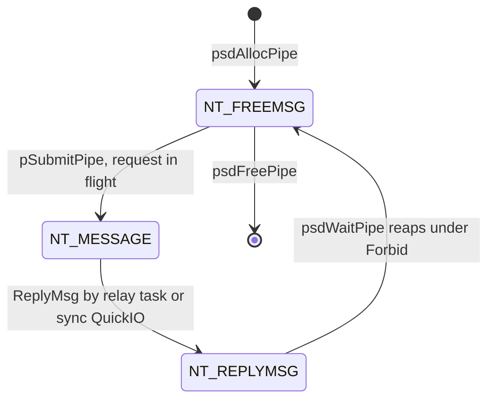

`psdCheckPipe` returns NULL while `NT_MESSAGE`; `psdFreePipe` detects a still-pending pipe and
aborts+waits before freeing. There is no `switch` — the state is read by the `while(... == NT_MESSAGE)`
poll and a `Forbid()`-guarded reap.

### 14.2 Device enumeration / health progression (implicit)

There is no `pd_State` field; the set of `PDFF_*` bits *is* the state. The forward progression and the
side-states (dead / low-power / suspended / del-expunge) are scattered `|=` / `&=` assignments, read as
composite predicates in a few places (e.g. the auto-suspend guard `== PDFF_CONFIGURED`, the dead-recovery
test `== (PDFF_DEAD|PDFF_CONNECTED)`):

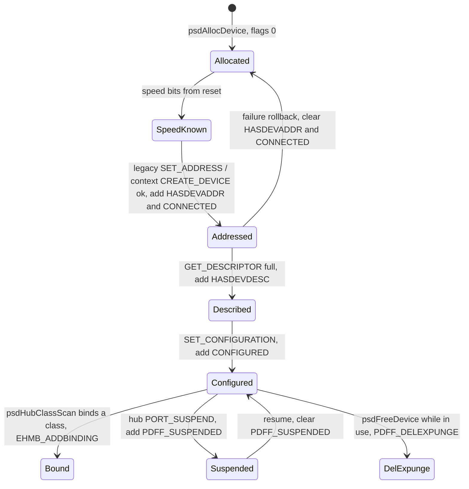

`PDFF_SUSPENDED` is set/cleared by the hub classes (`DA_IsSuspended`), not the core, which only reads it.
The one exception is a **root** device (`pd_Hub == NULL`), where no parent hub class exists to own the
flag, so `psdSuspendDevice`/`psdResumeDevice` write it themselves — after the bindings stopped, and
before they resume, respectively (§16.6).
That is precisely why a failed port park must roll the *bindings and rings* back (§13.7) rather than
set the flag: the flag means "the port is parked", and only the class that parks it may say so.
`PDFF_DEAD` / `PDFF_LOWPOWER` are the health side-states shown in §13.

### 14.3 The other machines (brief)

* **Custom RW lock (real).** `PsdLockSem` carries explicit state — `pls_Owner`, `pls_ExclLockCount`,
  `pls_SharedLockCount`, the `pls_ReadLocks` and `pls_WaitQueue` lists — with `if`-chain transitions in
  `pLockSemExcl`/`pLockSemShared`/`pUnlockSem`, plus read→write promotion and cross-task lock borrowing
  (§10).
* **HCD operational state (not driven here).** `usbhardware.h` defines `UHSF_OPERATIONAL / RESUMING /
  SUSPENDED / RESET` and the `UHCMD_USBOPER / USBSUSPEND / USBRESUME` trio, but the core issues none
  of them — its only bus command is `UHCMD_USBRESET` (`usbhcd_common.h`), once per controller at
  root-hub enumeration, and root-hub suspend is built from the hub class's own
  `UCM_AttemptSuspendDevice` plus a core-owned `PDFF_SUSPENDED` write (§16.6). The trio is therefore
  legacy-ABI-only, and a context HCD replies `IOERR_NOCMD` to it. This FSM belongs to the HCD
  `.device`. Per-device suspend/resume rides the hub-class `PORT_SUSPEND` transition; on **context**
  HCDs the library also issues `NSCMD_USB_SET_SUSPEND` (ring quiesce) around it, with the ring
  restart centralised in `psdResumeBindings`.
* **Pipe stream (implicit).** A producer/consumer machine expressed as list membership: a pipe is in
  `pps_FreePipes` (idle), `pps_ReadyPipes` (completed, buffered), or `pps_ActivePipe` (the single in-flight
  writer), with scalar buffer state (`pps_BytesPending`/`pps_Offset`/`pps_ReqBytes`). Transitions live in
  `psdStreamRead`/`psdStreamWrite`.
* **Library lifecycle (real, external).** The standard exec romtag/open-count machine of §2.

---

## 15. Notable quirks & refactoring hazards

A checklist of non-obvious things that will bite a refactor:

* **The `pp_Msg` / `pp_IOReq` duality has three bridges** (§5.2), one per path: legacy
  `iouh_UserData = pp` stamped in `pSubmitPipe()`, the context done hook `pXferDoneHook`, and the
  `ln_Name` demux of marshalled ops (`pWireReqPipe` → `pCtxCompletePipe()`). Drop any of them and
  the completion demux crashes.
* **Abort routes by framing**: a message-framed request is aborted via the task port — even on
  QuickIO HCDs, so the relay task must stay armed — while a direct-submitted pipe
  (`pp_WireReq == NULL`) calls `phw_CtxAbort` straight from the caller's task.
* **`phw_MsgCount` is non-atomic across two tasks**; the QuickIO-deferred `++` is wrapped in
  `Forbid()/Permit()` to serialise against the relay's `--`.
* **`pFreeDevice` intentionally leaks the `PsdDevice` struct** (other tasks may hold the
  pointer); only its children/strings/address slot are freed. Don't "fix" this into a free.
* **`psdTxt(plain, flavour)` selects between two format strings that share one argument
  list.** The plain variant's specifier sequence must be an exact **prefix** of the flavour's —
  same specifiers, same order, dropping only from the end — and a zero-specifier flavour needs a
  zero-specifier plain, because `psdAddErrorMsg0` passes `NULL` as the `RAWARG`. `psdAddErrorMsg`
  has no `format` attribute (the sfd cannot express one) and `RawDoFmt` walks the vararg array
  positionally, so a swapped `%s`/`%ld` is a wild pointer dereference in `pPutChar`, not a cosmetic
  bug. `scripts/check_psdtxt.py` audits the tree for this (and for double-wrapping); run it before
  a release build. The macro needs an in-scope `ps` like `psdAddErrorMsg` does — inside the library
  `poseidon.library.h` overrides it to read `ps_GlobalCfg` directly rather than call the
  `psdIsBoring()` LVO.
* **Dispatch-by-macro (`UsbClsBase = puc->puc_ClassBase`)** means any `usbDoMethod` site is
  only correct if a `puc` is in scope pointing at the intended class. This is invisible at the
  call site.
* **Releases are direct, claims are routed** (§7.4) — don't re-route releases through the hub task.
* **Custom lock degrades shared→exclusive on OOM** and **signals all waiters on every full
  release** (by design). A "more efficient" single-wakeup will hang waiters that already hold
  a shared lock.
* **IFF chunks are an opaque big-endian byte blob**, replace-by-id, linear-scan — only FORMs
  are nodes. The outer FORM id is the classic `PSDC` (not AROS `PSBC`/`PSLC`), which is what keeps
  4.5-era prefs files readable.
* **`pps_AsyncTask` is never assigned** — streams have no async thread (§4).
* **`psdClassScan` only directly scans root hubs**; everything deeper is scanned in the
  owning hub's task. Changing this re-introduces the re-entrancy/deadlock it was built to
  avoid.
* **Dead/low-power recovery policy lives in the PoPo GUI task** (`popo.gui.c`), not the core —
  the auto-disable/auto-restart actions only happen if the PoPo task is running. The core only
  *flags* `PDFF_DEAD`/`PDFF_LOWPOWER` and fires events; it does not self-heal (§13.2).
* **Address-0 serialization is `hub.class`-local, not a library concern** (§12) — don't
  reintroduce a stack-wide semaphore, and don't narrow the hub-class one's scope.
* **`DA_Address` exposes `pd_DevAddr` in the public API** (read-only PACK entry). `pd_Handle` is the
  realized backend-agnostic device identity (USB address on the legacy backend, the opaque HCD
  handle on the context backend), while `DA_Address` answers `pd_DevAddr` for any external tool
  that reads it.
* **Device addresses are only reclaimed during device teardown (legacy backend).** The
  `phw_DevArray` slot allocated by `pAllocDevAddr` is released by `hop_DestroyDevice` →
  `pLegacyDestroyDevice`, called from `pFreeDevice` — there is no earlier release point, so a
  missed disconnect leaks the slot until the hardware interface is removed (bounded by the
  127-address space; legacy enumeration fails loudly on exhaustion). A **legacy-backend** concern
  only: context HCDs own addressing behind `pd_Handle`.
* **`psdEnumerateDevice` configures the device during enumeration** (`psdSetDeviceConfig` right
  after `pGetDevConfig`) — deliberate: it guards against devices that misbehave while unconfigured,
  and an unconfigured device is limited to 100 mA. The class scan's `pd_CurrCfg` check avoids a
  duplicate wire `SET_CONFIGURATION`. On the **context** backend this is exactly where
  `hop_ConfigureEndpoints` fires (`NSCMD_USB_CONFIGURE_ENDPOINTS`), so the configure-endpoints op
  sits naturally at this point.
* **Config-parse deadlock FIXME**: `psdParseCfg` warns that a class doing config work from an
  external task during `libOpen` can deadlock against the config lock. Unresolved; be careful
  adding new config traffic from class/binding paths.

---

## 16. Power policy — link power and suspend

The *mechanisms* are described elsewhere: the electrical mA budget in §13.3, the ring quiesce around
a port park in §14.3, the LPM op in the ABI doc. This section is the **policy** layer on top of them
— what the user can decide, where the decision is stored, and how a change reaches a device that is
already running.

### 16.1 The two switches, and why they are independent

| Setting | Default | Gates |
|---|---|---|
| `pgc_PowerSaving` | FALSE | the idle auto-suspend sweep (§16.5) and the enumeration-time remote-wake arming |
| `pgc_LinkPowerMgmt` | **TRUE** | whether LPM is armed at all: U1/U2 on SuperSpeed, hardware L1 on High-Speed, LTM |

They are deliberately *not* nested. Link power is a link-level state the controller enters and
leaves autonomously between transfers; suspend is a device state the user drives, costs a resume
latency, and only pays off after tens of seconds of idleness. They also want opposite defaults,
which one switch could not give them.

Both live in `struct PsdGlobalCfg`, which **is** the `GCFG` chunk — see §8 for the append-only rule
that makes `pgc_LinkPowerMgmt` default to TRUE in prefs files written before it existed.

Two per-device overrides sit in `struct PsdPoPoCfg` (the same append-only rule, both defaulting to
their zero value):

* `poc_LinkPowerOverride` — `POCL_INHERIT` / `POCL_DISABLE` / `POCL_ENABLE`, exposed as
  `DA_LinkPowerOverride`.
* `poc_NoAutoSuspend` — `DA_NoAutoSuspend`, consulted by the idle sweep **only**.

### 16.2 Composing the decision (`pLinkPowerWanted`)

The per-device override **wins outright** over the global switch — it is not an AND. The point of
the override is to force a known-bad device off, or a known-good device on, whatever the global
default happens to be.

`poc_NoAutoSuspend` deliberately does *not* gate `psdSuspendDevice`. It inhibits *automatic*
suspend; an explicit suspend from Trident or an application is a deliberate act on one named device.
That keeps `psdSuspendDevice` a pure mechanism, the same split `pgc_ForceSuspend` already follows.

### 16.3 Arming and disarming (`pLinkPowerArm` / `pLinkPowerDisarm` / `pLinkPowerApply`)

Arming is the sequence the ABI documents: `NSCMD_USB_SET_LINK_POWER` (the HCD computes exit
latencies, latches MEL, programs its USB2 L1 registers and hands back the wire parameters), then
`SET_SEL`, the parent-hub port U1/U2 inactivity timeouts, the device `SET_FEATURE(U1/U2_ENABLE)` and
`SET_FEATURE(LTM_ENABLE)`.

Disarming reverses it (mirroring Linux `usb_disable_link_state`): the device-initiated states go off
first, so the device stops proposing U1/U2 before the port stops allowing it; then the port
timeouts; then a **fully withheld** `SET_LINK_POWER` — zero enables **and none of the `UHCD_LPF_*`
capability facts**, because the HCD evaluates LTM and USB2 hardware LPM independently of the enable
words. Withholding only the enables would leave L1 armed.

Everything that reached the wire is recorded in `pd_LpmArmed` (`PDLPMF_*`, `poseidon_intern.h`) so
the disarm takes back exactly what the arm put on:

| Bit | Meaning |
|---|---|
| `PDLPMF_POLICY` | the last decision for this device was ON — set **unconditionally**, including on the early returns for an incapable HCD or a silent BOS. This is what makes the sweep terminate. |
| `PDLPMF_U1DEV` / `U2DEV` / `LTM` | the device accepted that `SET_FEATURE` |
| `PDLPMF_PORTU1` / `PORTU2` | the parent hub accepted a non-zero port timeout |
| `PDLPMF_CTXOP` | the HCD accepted a non-empty policy and may hold controller-side state |

**There is no "USB2 L1 armed" bit, and there cannot be one:** `slo_OutFlags` never reports it, and
the HCD decides eligibility from a root-port capability the stack cannot see. `PDLPMF_CTXOP` stands
in for the whole controller side; the driver's teardown is a no-op when nothing was armed.

Nothing in the disarm is fatal — LPM is advisory, and a half-disarmed device is worse than a fully
attempted one. Steps that talk to the device drop their bit whatever the device answers (if it did
not hear us the link is gone anyway). The ctx op is the single exception: it **keeps** its bit on
failure so the next sweep retries, because a stale `PORTPMSC.HLE` pointing at a live slot is the one
leftover with consequences.

`pLinkPowerArm`/`Disarm` take a caller-supplied EP0 pipe — enumeration passes its own, so
`psdSetDeviceConfig` allocates nothing extra. `pLinkPowerApply` is the entry for everyone else: it
owns its port and pipe (`pArmRemoteWakeup` is the same shape) and no-ops when the device is already
in the wanted state.

### 16.4 Applying a change to running devices (`pLinkPowerSweep`)

A policy change must reach devices that are already configured, in both directions.

`psdSetAttrsA` snapshots the old value **before** the pack and raises `ps_LinkPowerReq` only if it
actually changed — Trident rewrites every setting on every gadget click, so without the comparison
one unrelated click would sweep the whole bus. It does **not** do the work: the caller is the MUI
task, and the work is a series of blocking control transfers per device.

`pEventHandlerTask` owns the sweep, exactly as it owns `ps_CheckConfigReq`. It is a priority-0
subtask that already blocks for seconds, and the 500 ms tick bounds the latency; no signalling is
needed.

The sweep holds `psdLockReadPBase()` across the walk and drops it around each `pLinkPowerApply`,
restarting from the head afterwards (the `psdRemClass` idiom). Restarting from the head is not just
safety: it keeps parents ahead of children, which the *arm* direction needs, because the HCD only
considers a child LPM-capable once its parent hub is. Termination is guaranteed by `PDLPMF_POLICY`
flipping on every visit.

Two rules the sweep must keep:

* **Skip `PDFF_SUSPENDED`.** `psdDoPipe` transparently resumes a suspended device, so touching one
  would wake the bus for a policy change. `psdResumeBindings` re-raises `ps_LinkPowerReq` when the
  device it just woke is out of line, which closes the only hole where a device could permanently
  miss a change.
* **A sweep restamps `pd_LastActivity`** (via `psdDoPipe`), so it postpones every device's idle
  suspend by one round. Harmless, but not an accident.

### 16.5 The idle auto-suspend sweep (`pIdleSuspendSweep`)

Runs once a second from `pEventHandlerTask` while `pgc_PowerSaving` is set (every other 500 ms
tick). Eligibility: configured, non-hub, not dead/suspended/app-bound/expunging, not
`poc_NoAutoSuspend`, idle for longer than `pgc_SuspendTimeout`, and every bound class answering
`UCCA_SupportsSuspend` — unless `pgc_ForceSuspend` and the device can remote-wake.

It holds PBase across the walk and drops it around `psdSuspendDevice`, same idiom as above.
`pd_LastActivity` is zeroed **before** the lock is dropped: that is both what makes a restart from
the head safe and what preserves the fire-once semantics (a failed suspend is never retried until
fresh IO restamps the device), which is why the rollback in §13.7 is load-bearing.

**Hubs stay excluded, deliberately.** A suspended hub cannot see its own disconnection, so detection
is its parent's job — and a root hub has none. A hub is also idle almost permanently, and suspending
one suspends everything below it, including devices this very walk is iterating over. See
`hub.class-architecture.md` §9.

### 16.6 Root-hub suspend

A root device (`pd_Hub == NULL`) has no parent hub, so there is no port to park and no upstream link
to drive to U3. "Suspended" means the whole subtree below it is suspended and its own class binding
has gone quiet — which is precisely what `psdSuspendBindings` already achieves, because both hub
classes implement `UCM_AttemptSuspendDevice` as *"`psdSuspendDevice` every downstream device, and
only if all of them succeed abort EP1 and clear `nch_Running`"*. So the root path is the ordinary
path with two differences:

* `pArmRemoteWakeup` is skipped (EP0 is emulated inside the HCD; there is no upstream link).
* The `UCM_HubSuspendDevice` step is replaced by the core writing `PDFF_SUSPENDED` itself.

That write is the **documented exception** to the sole-writer rule of `hub.class-architecture.md`
§9: no hub class can own the flag for a root device, because there is no parent hub class.
**Ordering is load-bearing.** The flag is set strictly *after* `psdSuspendBindings` and cleared
strictly *before* `psdResumeBindings`, because the child port operations run control transfers on
the root device's *own* EP0 pipe and `psdDoPipe` auto-resumes a flagged device — the resume
direction would otherwise recurse straight back into `psdResumeDevice`.

Partial failure is handled by the ordinary path too: `UCM_AttemptSuspendDevice` returns falsy if any
child refuses and does not roll the earlier children back, and the shared
`if(!res) psdResumeBindings(pd);` tail issues `UCM_AttemptResumeDevice`, which resumes all of them.

The ctx `NSCMD_USB_SET_SUSPEND` is still issued on the root handle, unconditionally on that backend.
`xhci.device` treats it as a successful no-op for a root handle, which keeps one code shape here and
leaves room for an HCD to implement a real bus-level quiesce behind that handle.

**Scope.** A USB3 controller has **two** root devices — the SuperSpeed root hub and the USB2 root
hub (`psdEnumerateHardware`). Suspending "the root hub" therefore suspends one root-hub *view*, not
the controller. Resuming a root hub whose children were unplugged while it was parked will make
`psdResumeDevice(child)` time out into the dead-device counter; that is correct, not a bug.

---

## 17. Appendix — maps & indexes

The public API surface is not listed here: `poseidon.library/poseidon.sfd` is the canonical
declaration of every LVO, in LVO order, with its register arguments.

### 17.1 Key structures (in `poseidon_intern.h`)

| Struct | Role |
|---|---|
| `PsdBase` | the library base; all global lists, pools, locks, config root, task state |
| `PsdHardware` | one HCD unit: relay task, two ports, root IOReq template, caps, device map |
| `PsdHCDOps` | the per-hardware lower-edge backend vtable — legacy or context (§5.4) |
| `PsdDevice` / `PsdConfig` / `PsdInterface` / `PsdEndpoint` | the USB device tree |
| `PsdDescriptor` | a flat record of one descriptor with tree up-links |
| `PsdPipe` | one transfer/op: `pp_Msg` (stack token) + `pp_IOReq` (the HCD's request on the legacy backend; internal state on context, where transfers are direct submits) |
| `PsdPipeStream` | buffered stream over an array of pipes (caller-task driven) |
| `PsdRTIsoHandler` | real-time ISO transfer handler |
| `PsdUsbClass` | a registered class library (base, name, priority, use-count) |
| `PsdAppBinding` | an application's claim on a device (release hook, task) |
| `PsdLockSem` / `PsdReadLock` / `PsdBorrowLock` / `PsdSemaInfo` | the custom R/W lock |
| `PsdIFFContext` | one node of the in-memory IFF config tree |
| `PsdBosCaps` | parsed BOS facts (LPM/BESL, U1/U2 exit latency) that feed `pLinkPowerArm` (§16) |
| `PsdEventHook` / `PsdEventNote` | event subscription + delivered note |
| `PsdErrorMsg` | one entry of the error/log list |
| `PsdPoPo` / `PsdHandlerTask` | popup-GUI state / event-handler-task state |

### 17.2 File map

| File | Contents |
|---|---|
| `poseidon.library/poseidon.library.c` | all `psd*` LVOs + internal `p*` helpers + the tasks |
| `poseidon.library/poseidon_intern.h` | private structs + IFF layout commentary |
| `poseidon.library/poseidon.library.h` | internal includes + helper prototypes |
| `poseidon.library/poseidon_main.c` | romtag, `initTable`, `funcTable`, lifecycle vectors |
| `poseidon.library/poseidon_funcs.inc` | the 99-entry LVO order |
| `poseidon.library/poseidon.sfd` | the public ABI (`==bias 30`) + register args — the canonical API list |
| `poseidon.library/numtostr.c` | `const` string tables for `psdNumToStr` |
| `poseidon.library/popo.gui.c` | the built-in MUI device requester task |
| `romstartup/usbromstart.c` | the ROM startup resident that brings the stack up before DOS (§11, [rom-image.md](rom-image.md)) |
| `include/devices/usbhcd_common.h` | **lower-edge** shared contract: `UHCMD_QUERYDEVICE`/`USBRESET`, `UHIOERR_*`, `UHA_*`, `UHCF_*` |
| `include/devices/usbhardware.h` | **lower-edge** legacy transfer contract (`IOUsbHWReq`, the transfer `UHCMD_*`) |
| `include/devices/usbhcd_context.h` | **lower-edge** context contract (`NSCMD_USB_*` ops, `UhcdAttach`, submit entries, tokens) |
| `include/libraries/usbclass.h` | **upper-edge** contract (`UCM_*`, `UGA_*`, `UCCA_*`) |
| `include/libraries/poseidon.h` | public API tags, events, IFF ids, `PsdGlobalCfg` |
| `classes/class_main.c` | the shared `*.class` skeleton (romtag + 7-vector `funcTable`) |
| `usbclass.library/usbclass.sfd` | the 3-method meta-class ABI |
