# poseidon.library — Architecture (reverse-engineered)

> Scope: the **core stack library** `poseidon.library` only. Class drivers (`*.class`)
> and applications are treated here as black boxes at the boundary — their *protocol*
> with the core is documented, their *internals* are a separate document.
>
> Sources reverse-engineered: `poseidon.library/poseidon.library.c` (~9.3k lines),
> `poseidon.library/poseidon_intern.h`, `poseidon.library/poseidon_main.c`,
> `poseidon.library/poseidon.sfd`, the boundary headers `include/devices/usbhardware.h`
> (lower edge) and `include/libraries/usbclass.h` (upper edge), `include/libraries/poseidon.h`
> (public API), and the class skeleton `classes/class_main.c`.
> Line numbers are indicative (against the state of the tree when this was written).

---

## Table of contents

1. [Layered architecture](#1-layered-architecture)
2. [The library as a classic Amiga shared library](#2-the-library-as-a-classic-amiga-shared-library)
3. [Object model — the USB device tree](#3-object-model--the-usb-device-tree)
4. [Process & task model](#4-process--task-model)
5. [Lower edge — communication with host-controller drivers (HCDs)](#5-lower-edge--communication-with-host-controller-drivers-hcds)
6. [Device enumeration](#6-device-enumeration)
7. [Upper edge — communication with class drivers](#7-upper-edge--communication-with-class-drivers)
8. [Configuration & persistence (IFF)](#8-configuration--persistence-iff)
9. [Event / notification subsystem](#9-event--notification-subsystem)
10. [The custom reader/writer lock](#10-the-custom-readerwriter-lock)
11. [End-to-end: bringing the stack up](#11-end-to-end-bringing-the-stack-up)
12. [Device lifecycle — connect and disconnect](#12-device-lifecycle--connect-and-disconnect)
13. [Failure recovery and resilience](#13-failure-recovery-and-resilience)
14. [State machines](#14-state-machines)
15. [Notable quirks & refactoring hazards](#15-notable-quirks--refactoring-hazards)
16. [Appendix — maps & indexes](#16-appendix--maps--indexes)

---

## 1. Layered architecture

Poseidon is a **hub-and-spoke** design: `poseidon.library` is a passive shared library at
the centre that owns all USB state and mediates between two replaceable edges.

* **Lower edge — host-controller drivers (HCDs).** Ordinary Exec `*.device`s (e.g. the
  user's `xhci.device`). The library's lower edge has **two backends** behind a
  `struct PsdHCDOps` vtable (`phw_HCDOps`), selected per-`PsdHardware`: a **legacy** backend
  that drives classic third-party HCDs through `struct IOUsbHWReq` / `UHCMD_*` commands
  (`devices/usbhardware.h`) with software-managed addressing, and a **context** backend for
  xHCI-native drivers using device/endpoint-lifecycle `NSCMD_USB_*` ops + direct, token-keyed
  transfer submits (`devices/usbhcd_context.h`) with HCD-owned addressing. Poseidon never contains
  controller-specific code.
* **Upper edge — class drivers.** Ordinary Exec `*.library`s (e.g. `hub.class`,
  `massstorage.class`) that all implement the 3-method `usbclass` ABI. They consume the
  public `psd*` API and are called back through `usbDoMethod(UCM_*)`.
* **Applications / tools** (Trident, the CLI loaders, USB apps) use the same public `psd*`
  API plus *app bindings* to claim devices.

The single mandatory class is **`hub.class`**: it is a normal class driver, but because the
USB topology is a tree of hubs it is what recursively drives enumeration of everything below
the root hub. The core only directly enumerates/scans **root hubs**; all deeper devices are
handled in the owning hub's task context.

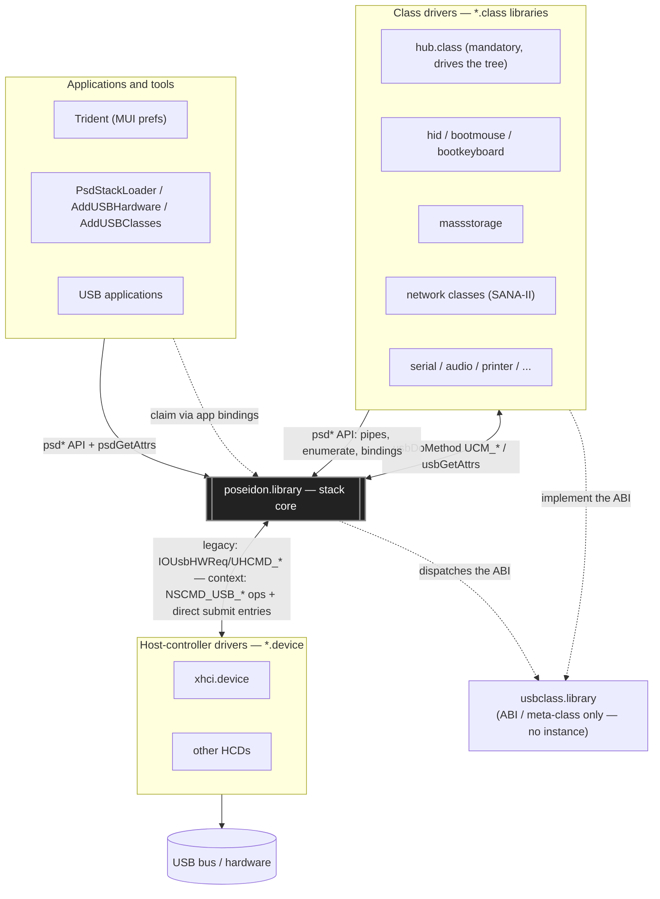

**Why this is the load-bearing structure.** The two edges share *nothing* with each other —
a class driver knows only the `psd*`/`UCM_*` protocol, an HCD speaks only its lower-edge
transport (legacy `IOUsbHWReq`/`UHCMD_*` or context `NSCMD_USB_*` ops + direct transfer
entries) — and the core is the only component that understands USB
semantics (addressing, descriptors, configurations, power, topology). That is what lets the
same Poseidon binary run unmodified over a brand-new `xhci.device`, and lets new class
drivers appear without touching the core.

---

## 2. The library as a classic Amiga shared library

`poseidon.library` is a standard Exec `RTF_AUTOINIT` resident. The AROS `genmodule`
machinery was replaced by a hand-written skeleton (`poseidon_main.c` + `poseidon_funcs.inc`
+ `poseidon_end.c`); proto/inline/clib headers are generated from `poseidon.sfd` by `sfdc`.

* **Romtag / resident** (`poseidon_main.c`): `romTag` is a `const struct Resident`
  (`RTC_MATCHWORD`, `RTF_AUTOINIT`, version `5`, `NT_LIBRARY`, priority `48`,
  `initTable`). `initTable = { sizeof(struct PsdBase), funcTable, NULL, LibInit }`.
* **LVO table** is `funcTable[]`: the four standard vectors `LibOpen, LibClose,
  LibExpunge, LibNull`, then `#include "poseidon_funcs.inc"` (96 `psd*` entries in
  `.sfd` order), then the `(APTR)-1` terminator. The `.sfd` declares **`==bias 30`**, so the
  first user function `psdAllocVec` is at LVO `-30` and each subsequent at `-6`.
* **Library base** is `struct PsdBase` (`poseidon_intern.h:215`), beginning with
  `struct Library ps_Library`. It holds every global list, both memory pools, the two custom
  locks, the timer request, the IFF config root, the PoPo (GUI) state, and the event-handler
  task state.
* **Register-args ABI (de-AROS'd).** Every LVO is written in plain C with bebbo-gcc register
  annotations, e.g. `APTR (psdAllocVec)(ULONG size asm("d0"), struct PsdBase *ps asm("a6"))`.
  The function name is **parenthesised** in the definition so the inline call-macros don't
  expand at the definition site.
* **Internal self-calls** go through the generated inline stubs:
  `poseidon.library.h` does `#define POSEIDON_BASE_NAME ps` then `#include <inline/poseidon.h>`,
  so an internal `psdFoo(...)` expands to an `LPn` LVO jump using the in-scope `ps` in `a6`.
  It deliberately does **not** include `<proto/poseidon.h>` (whose plain prototypes would
  clash with the register-arg definitions).
* **ROM-clean discipline.** `__NOLIBBASE__` is defined and `SysBase` is read from absolute
  `$4` (`#define EXEC_BASE_NAME (*(struct ExecBase **)4UL)`); all string tables are `const`.

### Lifecycle


Key separation: **`libInit` builds the framework but adds no USB state.** The stack is
populated later by an external driver (the `PsdStackLoader` tool or the ROM startup
residents) calling `psdAddHardware` / `psdAddClass` / `psdClassScan` — see §11.

---

## 3. Object model — the USB device tree

All USB state is a tree of pool-allocated nodes hung off Exec `struct List`s. Every child
carries a direct **up-link** to its parent, so any node can walk up to the library base:
`pep → pif → pc → pd → phw → ps`.

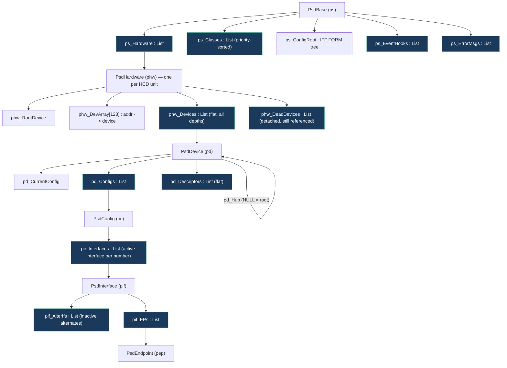

Field roles that matter for refactoring:

* **`PsdHardware`** — `phw_Devices` is **flat**: every device on a controller lives in one
  list regardless of depth. Tree shape is reconstructed from `pd_Hub` (parent hub device)
  and `pd_HubPort`. `phw_DevArray[128]` is the address→device map (index 0 reserved) used by
  the **legacy backend only** (context HCDs own addressing). `phw_Capabilities` (`UHCF_*`)
  comes from the HCD's `UHCMD_QUERYDEVICE` reply; `phw_HCDOps` (the `PsdHCDOps` lifecycle
  vtable) is the per-hardware backend selected right after that query — legacy or context
  (see §5.4).
* **`PsdDevice`** — `pd_Flags` (`PDFF_*`: speed, connected, configured, dead, suspended,
  needs-split, app-binding, del-expunge), `pd_DevAddr`, `pd_CurrentConfig`/`pd_CurrCfg`,
  `pd_IDString` (the persistence key, see §8), `pd_UseCnt` (deferred-free guard),
  `pd_DevBinding`/`pd_ClsBinding` (device-level binding + owning class).
* **`PsdInterface`** — alternates are modelled specially: `pc_Interfaces` holds only the
  *currently active* alternate for each interface number; the inactive ones hang off the
  active one's `pif_AlterIfs` with `pif_ParentIf` pointing back. `psdSetAltInterface`
  surgically swaps which one is "in the main list". `pif_IfBinding`/`pif_ClsBinding` are the
  interface-level binding.
* **`PsdDescriptor`** — `pd_Descriptors` is a **flat** list of *every* descriptor seen, each
  carrying optional up-links (`pdd_Config`/`pdd_Interface`/`pdd_Endpoint`) that locate it in
  the tree, plus raw bytes for class-specific descriptors.

---

## 4. Process & task model

Poseidon is multi-tasked. Tasks are created **only** through `psdSpawnSubTask`
(`poseidon.library.c:1340`) — which builds a Process via `CreateNewProcTags` if DOS is up,
or a bare `AddTask` Task if not — plus a startup handshake (`SIGB_SINGLE`) where the parent
waits until the child publishes its `*_Task` field.

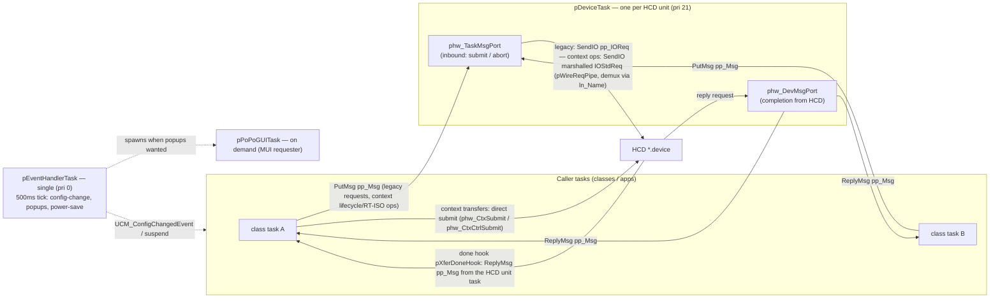

Task inventory:

| Task | Count | Spawned by | Role |
|---|---|---|---|
| `pDeviceTask` | one per HCD unit | `psdAddHardware` | Opens the HCD, selects the lower-edge backend (legacy vs context — decided here after `UHCMD_QUERYDEVICE` from `UHCF_CONTEXT` + the mandatory NSD op set, sealed by the `NSCMD_USB_ATTACH` handshake, `pCtxAttach`), relays **message-framed** pipe IO between callers and the device — legacy requests, context lifecycle ops, RT-ISO hook ops and bus commands only; context transfers are direct submits that never touch it — and handles aborts and shutdown (`CMD_FLUSH`). Priority 21. |
| `pEventHandlerTask` | exactly one | `libOpen` → `pStartEventHandler` | Always-on housekeeping: polls config-change CRC, debounces `EHMB_CONFIGCHG` into `UCM_ConfigChangedEvent`, lazily launches the popup GUI, runs power-saving auto-suspend. Priority 0. |
| `pPoPoGUITask` | at most one, on demand | event task | The built-in MUI device requester (`popo.gui.c`). Only if a Workbench screen exists and popups are enabled. |

> **No stream task.** `PsdPipeStream.pps_AsyncTask` exists in the struct but is never
> assigned in this backport — streams run in the **caller's** task; `PSFF_ASYNCIO` only
> changes the buffering code path, it does not spawn a thread.

---

## 5. Lower edge — communication with host-controller drivers (HCDs)

### 5.1 The contract (`devices/usbhardware.h`, `devices/usbhcd_context.h`)

An HCD is an Exec `*.device`. A **legacy** HCD is driven through `struct IOUsbHWReq` (an
`IORequest` superset) carrying `UHCMD_*` commands:

| Command | Meaning |
|---|---|
| `UHCMD_QUERYDEVICE` | Tag-based identity + capability bits |
| `UHCMD_USBRESET` (+ legacy `USBRESUME` / `USBSUSPEND` / `USBOPER`) | Root-port reset — leaves speed bits in `iouh_Flags`. The power trio is legacy-ABI-only (defined in `usbhardware.h`): unused by the stack and not dispatched by the context HCD |
| `UHCMD_CONTROLXFER` | EP0 setup+data+status (uses `iouh_SetupData`) |
| `UHCMD_BULKXFER` | Bulk transfer (streams via `iouh_StreamID`) |
| `UHCMD_INTXFER` | Interrupt transfer (`iouh_Interval`) |
| `UHCMD_ISOXFER` | Isochronous transfer |
| `UHCMD_ADDISOHANDLER` / `REMISOHANDLER` / `STARTRTISO` / `STOPRTISO` | Real-time ISO (audio/MIDI) |
| `CMD_FLUSH` | Abort everything outstanding (shutdown) |

The HCD advertises capability bits (`UHCF_USB20`, `UHCF_ISO`, `UHCF_RT_ISO`, `UHCF_QUICKIO`,
`UHCF_USB30`, `UHCF_CONTEXT`, …) via the `UHCMD_QUERYDEVICE` tag reply. (The former per-pipe
endpoint-context callback tags `UHA_PrepareEndpoint` / `UHA_DestroyEndpoint` are gone; their tag
values stay reserved but unused.)

A **context** HCD (an xHCI-native driver such as `xhci.device`) additionally advertises
`UHCF_CONTEXT` and the mandatory NSD op set. Its contract (`devices/usbhcd_context.h`) is the
device/endpoint **lifecycle** ops `NSCMD_USB_*` — `CREATE_DEVICE`, `UPDATE_EP0`,
`CONFIGURE_ENDPOINTS`, `DECONFIGURE`, `UPDATE_HUB`, `SET_SUSPEND`, `SET_LINK_POWER`,
`DESTROY_DEVICE`, plus the RT-ISO hook/stream ops — with transfers as **direct calls** into the
HCD: `NSCMD_USB_ATTACH` (issued once per open by `pCtxAttach`, right after the NSD scan) exchanges
the library's completion hook (`phw_XferDoneHook`) for the driver's entries — the opaque
`phw_CtxHcd` context plus `phw_CtxSubmit` (bulk/interrupt/iso), `phw_CtxCtrlSubmit` (control) and
`phw_CtxAbort` — and every submit is keyed by an opaque **endpoint token** the lifecycle ops
return (`pd_Ep0Token` from `CREATE_DEVICE`, `pep_Token` per endpoint configured by
`CONFIGURE_ENDPOINTS`). A submit carries **no** device address and **no** per-transfer topology:
parent/port/speed/TT are passed once at `CREATE_DEVICE`, where the HCD owns addressing and hands
back an opaque `pd_Handle`.

### 5.2 The relay-task transport — why there are two ports

Each `PsdHardware` owns a dedicated **relay task** (`pDeviceTask`) and **two message ports**:

* **`phw_TaskMsgPort`** — *inbound*. Callers `PutMsg` a `PsdPipe` here to submit (or abort) work.
* **`phw_DevMsgPort`** — *completion*. It is the `mn_ReplyPort` of every IO request; the HCD
  posts finished `IOUsbHWReq`s here.

Two ports exist so the single relay task can `Wait()` on **both** signals at once and bridge
two independent flows: *many caller tasks → relay* (submit/abort) and *HCD → relay*
(completion). Serialising every `SendIO`/`AbortIO` onto one task (priority 21) means the HCD
never sees concurrent submission from the relay path, while arbitrarily many callers submit
concurrently. **The relay carries message-framed traffic only** — legacy requests, context
lifecycle ops, RT-ISO hook ops, and bus-level commands (`UHCMD_USBRESET`); context **transfers**
are direct submits (§5.3) that never touch it. On the **legacy** backend the bridge key is
`iouh_UserData = owning PsdPipe`, set before every `SendIO`/`BeginIO`; on the **context** backend
the relay task demuxes wire requests by `ln_Name` (`pWireReqPipe`, the marshalled lifecycle or
RT-ISO op). `phw_MsgCount` (volatile) tracks in-flight requests for clean shutdown on both.

A `PsdPipe` embeds **both** a `struct Message pp_Msg` (the completion token the *stack*
waits on) **and** a `struct IOUsbHWReq pp_IOReq`. On the **legacy** backend `pp_IOReq` is what
the *HCD* sees. On the **context** backend `pp_IOReq` stays the library's internal pipe state:
transfers lower to `pDirectSubmit()` — the HCD's submit entry called in the caller's task, keyed
by `pep_Token`/`pd_Ep0Token` re-read per submit, with `pp_WireReq = NULL` (the direct-path marker) —
and the HCD's done hook (`pXferDoneHook`) writes the result into `pp_IOReq` and replies `pp_Msg`
from the driver's unit task; the lifecycle/RT-ISO ops are marshalled onto `IOStdReq`s
(`pp_Ctx`), with `pCtxCompletePipe()` copying `io_Error` back before `psdWaitPipe` sees it.
Either way completion is the **separate** `pp_Msg` replied to the caller's own `pp_MsgPort`.
`pp_Msg.mn_Node.ln_Type` is the pipe's little state machine:
`NT_FREEMSG → NT_MESSAGE (in flight) → NT_REPLYMSG (done) → NT_FREEMSG`.

### 5.3 Pipe lifecycle

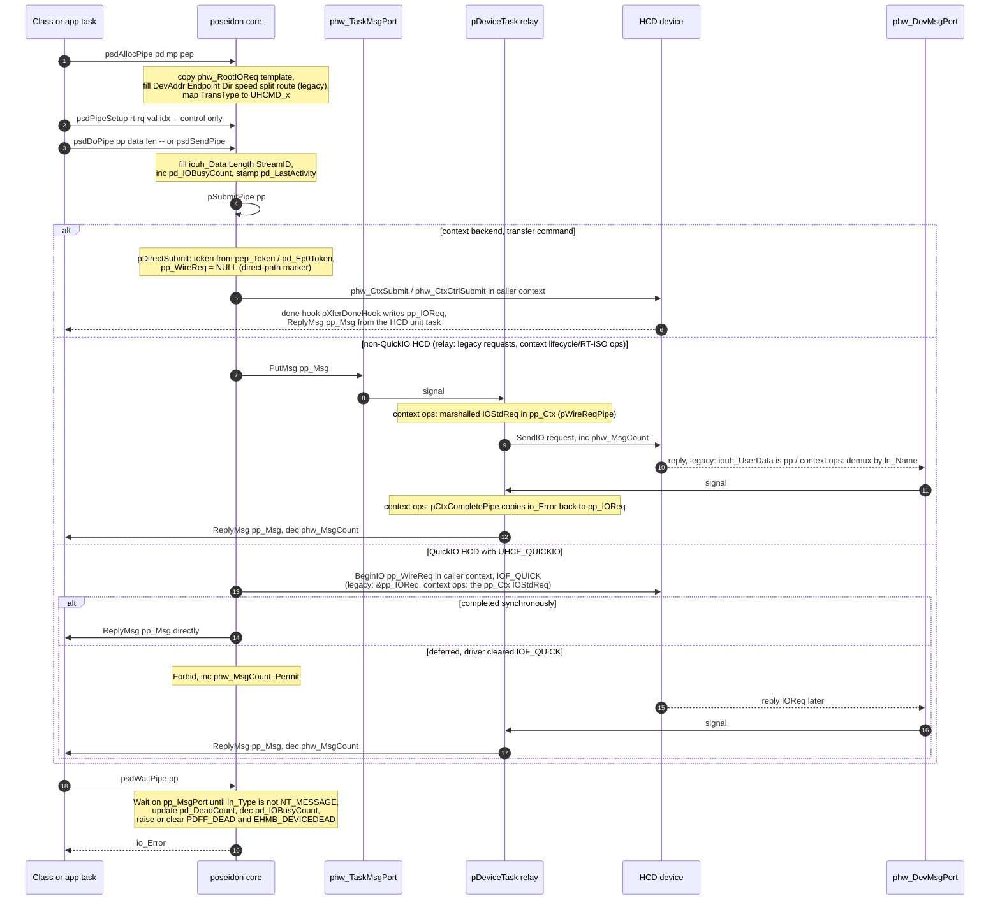

Notes:

* **Route selection** happens in `pSubmitPipe`: on a context backend the four transfer commands
  (`UHCMD_CONTROLXFER/BULK/INT/ISOXFER`) lower to `pDirectSubmit()`, the RT-ISO control commands
  are re-keyed onto the context iso-hook ops (`pCtxMarshalIsoHooks`), and bus-level commands
  (`UHCMD_USBRESET`) keep legacy framing by design; everything message-framed then picks
  **QuickIO vs relay** on `phw_Capabilities & UHCF_QUICKIO` — QuickIO calls `BeginIO` directly in
  the caller's task (low latency), the relay path `PutMsg`s to the task port. **Every path
  delivers completion as `pp_Msg` on `pp_MsgPort`** — the direct path via the done hook — so
  `psdWaitPipe`/`psdCheckPipe`/streams are path-agnostic. A direct submit with no token yet
  (endpoint unconfigured, device gone) is rejected synchronously with `UHIOERR_TIMEOUT`.
* **Abort is asymmetric**: for a message-framed request `psdAbortPipe` allocates a shadow
  `PsdPipe` with `pp_AbortPipe` set and `PutMsg`s it to `phw_TaskMsgPort` — even on a QuickIO
  HCD — so the relay must stay alive to service aborts (`AbortIO(victim->pp_WireReq)`). A
  direct-submitted pipe (`pp_WireReq == NULL`) instead calls the HCD's abort entry (`phw_CtxAbort`)
  straight from the caller's task — a wish, like `AbortIO`; the completion still arrives through
  the done hook and `psdWaitPipe` collects the outcome.
* **Dead-device weighting** in `psdWaitPipe`: `UHIOERR_TIMEOUT` bumps `pd_DeadCount` most,
  `NAKTIMEOUT` less, `CRCERROR` least (fall-through chain); success halves it. Crossing the
  threshold flags `PDFF_DEAD` and fires `EHMB_DEVICEDEAD`.

### 5.4 The lifecycle backend vtable (`PsdHCDOps`)

The lifecycle moments of the lower edge are routed through a per-`PsdHardware` operations vtable
(`phw_HCDOps`, `struct PsdHCDOps` in `poseidon_intern.h`), bound by the relay task right after
`UHCMD_QUERYDEVICE`. There are **two backends**: the **legacy** backend (`pLegacyHCDOps`) — the
classic software-managed addressing behavior — is the default; the **context** backend
(`pContextHCDOps`, HCD-owned addressing per
[poseidon-context-hcd-abi.md](poseidon-context-hcd-abi.md)) is selected when the driver advertises
`UHCF_CONTEXT` **and** carries the mandatory NSD op set (`CREATE_DEVICE`, `DESTROY_DEVICE`,
`UPDATE_EP0`, `CONFIGURE_ENDPOINTS`, `UPDATE_HUB`, `ATTACH`) **and** the `NSCMD_USB_ATTACH`
handshake succeeds (`pCtxAttach` — it stores the driver's direct transfer entries in
`phw_CtxHcd`/`phw_CtxSubmit`/`phw_CtxCtrlSubmit`/`phw_CtxAbort`); a driver that claims
`UHCF_CONTEXT` but is missing an op, or whose attach fails, stays on the legacy backend. There is
**no** `ForceLegacyHCD` lever.

| Hook | Called from | Legacy backend | Context backend |
|---|---|---|---|
| `hop_AddressDevice` | `psdEnumerateDevice` (start) | `pAllocDevAddr` + EP0-MPS guess + `GET_DESCRIPTOR(8)` probe at address 0 + wire `SET_ADDRESS` (lost-ACK retry) + 50 ms settle; sets `pd_Handle = pd_DevAddr` | `NSCMD_USB_CREATE_DEVICE` (explicit parent/port/speed/TT; HCD owns addressing) → opaque `pd_Handle` + the EP0 submit token `pd_Ep0Token` |
| `hop_UpdateEp0MaxPacket` | `psdEnumerateDevice`, after MPS0 validated | no-op (implicit per transfer) | `NSCMD_USB_UPDATE_EP0` |
| `hop_ConfigureEndpoints` | `psdSetDeviceConfig`, before the wire `SET_CONFIGURATION` | no-op | `NSCMD_USB_CONFIGURE_ENDPOINTS` with a `UhcdEndpointDesc[]` built from the PsdConfig/PsdInterface/PsdEndpoint tree; the HCD writes each added endpoint's submit token back (`ed_Token` → `pep_Token`) |
| `hop_SetInterface` | `psdSetAltInterface`, before the wire `SET_INTERFACE` | no-op | `NSCMD_USB_CONFIGURE_ENDPOINTS` for the selected alternate (dropped endpoints lose their `pep_Token`, added ones get fresh tokens) |
| `hop_UpdateHub` | `psdSetAttrs(DA_HubNumPorts)` | no-op | `NSCMD_USB_UPDATE_HUB` (port count / TT think time / multi-TT) |
| `hop_DestroyDevice` | `pFreeDevice` | release the `phw_DevArray` slot | `NSCMD_USB_DESTROY_DEVICE` |

Outside the vtable the context backend also uses `NSCMD_USB_DECONFIGURE`,
`NSCMD_USB_SET_SUSPEND` (ring quiesce, §14.3), `NSCMD_USB_SET_LINK_POWER` (LPM, §6), the
RT-ISO hook/stream ops, and — once per open, right after the NSD scan — `NSCMD_USB_ATTACH`
(`pCtxAttach`), which installs `phw_XferDoneHook` (`pXferDoneHook`) with the driver and receives
the direct transfer entries in return.

`pd_Handle` (ULONG) is the backend-agnostic device identity token and the realized device
identity: the legacy backend sets it to the USB address; the context backend stores the HCD's
opaque handle there.

### 5.5 Speed, split-transactions, and topology fields (legacy backend)

Per-pipe topology is a **legacy-backend** concern. When `psdAllocPipe` builds a legacy IOReq it
fills the topology/speed fields the HCD needs:

* speed flags from `pd_Flags` (`UHFF_LOWSPEED`/`HIGHSPEED`/`SUPERSPEED`), HS `UHFF_MULTI_*`
  from `pep_NumTransMuFr`, SS companion (`iouh_SS_MaxBurst`/`Mult`/`BytesPerInterval`);
* split-transaction fields when `PDFF_NEEDSSPLIT`: `UHFF_SPLITTRANS` + `iouh_SplitHubAddr/Port`
  from `pGetTTInfo` (walks up to the nearest high-speed TT hub) + optional thinktime / multi-TT.

On the **context** backend a direct submit carries **none** of this: parent/port/speed/TT are passed
once at `CREATE_DEVICE`, the HCD then tracks topology behind `pd_Handle` and knows each endpoint's
type and parameters from the token, and USB3 routing (root port / route string) is computed inside
the driver — the library never builds it. (There are no per-pipe root-port/route-string helpers and
no AROS V3 request extension; `struct IOUsbHWReq` is pure classic V1+V2, 90 bytes.)

### 5.6 Bulk streams (context backend only)

USB3 bulk streams give an endpoint several independent transfer rings, so a class can keep many
commands in flight on one endpoint (massstorage's UAS tag engine is the only user today). The
library owns the *allocation* of those rings; the class only labels its pipes.

**How a pipe joins the stream id space.** Either `psdOpenStream` with `EA_StreamBase` set, or the
`PPA_StreamID` pipe attribute on a plain pipe. Both routes call `pCtxEnsureStreams`, which issues
`NSCMD_USB_ALLOC_STREAMS` for the endpoint and records the count in `pep_StreamsAlloc`.
`pCtxFreeStreams` (via `psdCloseStream`, `EA_StreamBase → 0`, or an alternate-setting change)
issues `NSCMD_USB_FREE_STREAMS`. Hardware capability is published to classes as the
`HA_StreamsSupported` hardware attribute, and the per-endpoint ceiling as `EA_MaxStreams`; the
count actually allocated is readable as `EA_StreamsAlloc`.

Three properties of this machinery are load-bearing for any class that uses it:

* **Assign stream ids descending.** `pCtxEnsureStreams` grows an endpoint's ring set by
  *free + re-allocate*, not by extension. Labelling pipes with ascending `PPA_StreamID` therefore
  triggers a free/realloc cycle per pipe; assigning the highest id first makes the first pipe size
  the endpoint and every later pipe hit the early-return.
* **A failed allocation is silent.** If `ALLOC_STREAMS` fails, `pCtxEnsureStreams` only warns and
  leaves the endpoint single-ring — transfers still work, but every stream id collapses onto one
  ring. That is survivable at queue depth 1 and data-corrupting above it, which is precisely why
  `EA_StreamsAlloc` is exposed: a class running concurrent tags **must** verify the rings exist
  rather than trust the allocation.
* **A config rebuild invalidates the rings.** `pContextConfigureEndpoints` clears
  `pep_StreamsAlloc` and `pep_Token` for every endpoint it rebuilds, because the HCD drops the old
  endpoint contexts (and with them the stream rings and submit tokens). Without that clear, the
  next `pCtxEnsureStreams` would early-return on a stale count and hand out phantom rings.

On the driver side a submit is routed to a ring by its stream id; single-ring endpoints ignore the
id (so an old library over a new driver still works), and an endpoint in stream mode rejects
stream id 0.

---

## 6. Device enumeration

Enumeration has two entry points. `psdEnumerateHardware` enumerates a controller's **root
hub**(s); `psdEnumerateDevice` enumerates **one device** the hub class has already allocated
and attached to a port. Both build the tree described in §3.

### 6.1 Root-hub enumeration (`psdEnumerateHardware`)

Allocates a probe device + default pipe, issues `UHCMD_USBRESET` to learn the link speed
(`pApplySpeedFromReset`), then enumerates the SuperSpeed root hub (if `UHCF_USB30` and the
reset reported `UHFF_SUPERSPEED`) and/or the USB2 root hub, setting `phw_RootDevice` and
firing `EHMB_ADDDEVICE`.

### 6.2 Per-device enumeration (`psdEnumerateDevice`)

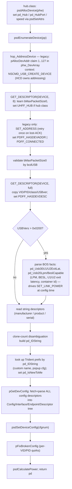

* **Addressing (legacy backend).** `pAllocDevAddr` scans `phw_DevArray[1..127]` for a free slot;
  the address becomes live on the wire only after the `SET_ADDRESS` control transfer (before that,
  `iouh_DevAddr = 0` / the default pipe is used). On the **context** backend there is no wire
  `SET_ADDRESS`: `NSCMD_USB_CREATE_DEVICE` makes the device addressable and the HCD owns the
  address behind the opaque `pd_Handle`.
* **Config-descriptor parsing** (`pGetDevConfig`) fetches each config's full blob and walks
  it descriptor-by-descriptor: `CONFIGURATION` → new `PsdConfig`; `INTERFACE` → new
  `PsdInterface` (alternates re-parented onto `pif_AlterIfs`); `ENDPOINT` → new `PsdEndpoint`
  with per-speed `pep_Interval` normalisation; `SS_EP_COMPANION` / `SS_ISO_COMPANION` modify
  the *preceding* endpoint; **every** descriptor is also recorded flat in `pd_Descriptors`
  with up-links and a class-specific name.
* **Identity strings.** `pd_IDString` =
  `"<product>-<VID%04x>-<PID%04x>-<serial>-<clone%02x>"`; `pif_IDString` =
  `"<if%02x>-<alt%02x>-<class%02x>-<sub%02x>-<proto%02x>"` (prefixed with config number for
  config > 1). These are the **persistence/binding keys** (see §8).
* **Detach.** `pFreeBindings` first moves the device to `phw_DeadDevices` (so a concurrent
  class-scan can't re-bind a dying device), releases bindings, then `pFreeDevice` — which
  *refuses to free* while `pd_UseCnt != 0` (sets `PDFF_DELEXPUNGE` and defers), and even when
  it does free, deliberately **does not** free the `PsdDevice` struct itself (other tasks may
  still hold the pointer). Dead devices are reaped by `psdRemHardware`.

---

## 7. Upper edge — communication with class drivers

### 7.1 The dispatch trick (`UsbClsBase`)

Poseidon does **not** call class drivers through a stored function pointer. It calls the
inline `usbclass` stubs `usbDoMethod` / `usbGetAttrs` / `usbSetAttrs` (declared in
`usbclass.sfd`, bias 30), which read their library base from a symbol named `UsbClsBase`,
which the core `#define`s as:

```c
#define UsbClsBase puc->puc_ClassBase
```

So **every** `usbDoMethod(UCM_…)` site must have a `struct PsdUsbClass *puc` in scope, and
the call lands in the LVO of *that* class library. Iterating `puc` over `ps_Classes` and
calling `usbDoMethod(UCM_AttemptInterfaceBinding, …)` is literally "offer this to each class
in priority order." This polymorphism-by-macro is the core idea of the upper edge.

The mirror image: every `*.class` is an `RTF_AUTOINIT` library whose `funcTable` (shared
skeleton in `classes/class_main.c`) exposes the 3 ABI vectors **`usbGetAttrsA` /
`usbSetAttrsA` / `usbDoMethodA`** at fixed offsets 30/36/42. `usbclass.library` itself is
**not an instantiated library** — it is purely the ABI contract + constants; there is no
`_UsbClsBase` instance, callers always rebind it.

### 7.2 The binding model

| Level | Binding ptr | Owning class | Example |
|---|---|---|---|
| Device | `pd_DevBinding` | `pd_ClsBinding` | `hub.class` claims the whole device |
| Interface | `pif_IfBinding` | `pif_ClsBinding` | `bootmouse`, `cdcacm` claim one interface |
| App | `pd_DevBinding` (+`PDFF_APPBINDING`, `pd_ClsBinding == NULL`) | — | Trident / app claims a device |

A "binding" is an **opaque pointer the class returns** — usually its own per-instance context
(it typically spawns a worker subtask there). Poseidon never dereferences it; it only stores
it and hands it back on later `UCM_Release*` / `UCM_*Suspend*` calls. The companion
`*_ClsBinding` records which `PsdUsbClass` owns the bond so releases route to the right
library. Device-level and interface-level binding are mutually exclusive on one device.

### 7.3 The class-scan / bind algorithm

`psdClassScan` walks all hardware and calls `psdHubClassScan` on each **root hub only**;
every deeper device is scanned by its parent hub's task (via `UCM_HubClassScan`). For one
device, `psdHubClassScan` runs (under PBase read lock + device write lock):

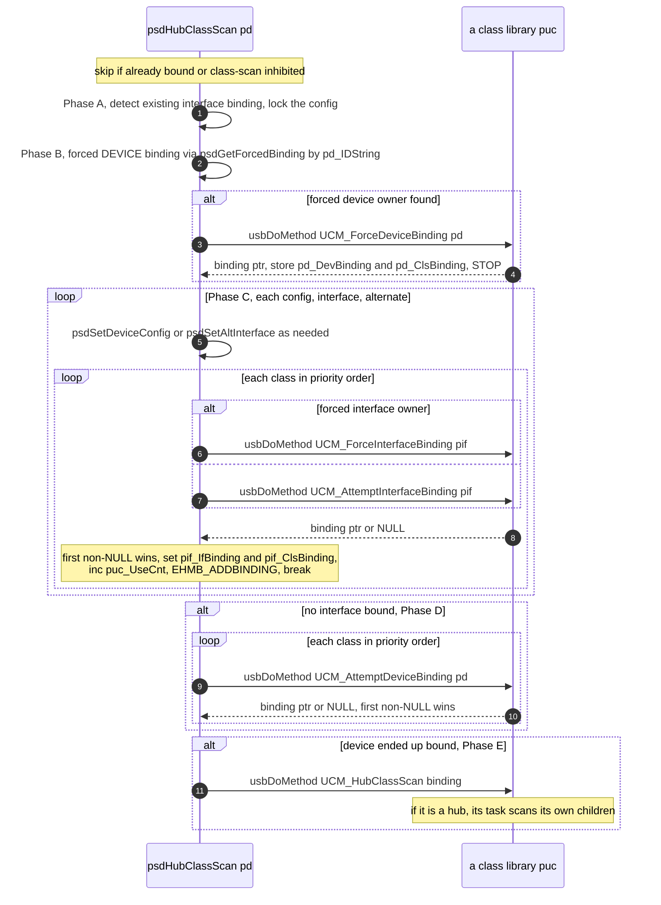

* **Order = priority.** Classes are kept on `ps_Classes` sorted descending by `UCCA_Priority`
  (queried at `psdAddClass`), so higher-priority classes get first refusal (e.g. `hid.class`
  before `bootmouse`).
* **Alternate probing is descriptor-only (since 2026-07-02, R5).** For an unbound interface with
  alternates, Phase C offers the active alternate and then each inactive one to the classes
  **without touching the wire** — classes decide from the parsed descriptor tree. Only when a
  class *accepts* an alternate does the scan issue a single `psdSetAltInterface` (which
  early-returns if it is already the active one, `:2526`); if that wire switch fails, the binding
  is released (`UCM_ReleaseInterfaceBinding`) and the alternate skipped. Historical note: the
  scan previously wire-switched through every probed alternate and restored afterwards — the
  `SET_INTERFACE` bursts behind the xHCI driver's RT-ISO suppression workaround (driver-model doc
  §6, recommendation R5) — and its loop termination silently depended on the tree rotation each
  switch performed. The rewrite iterates the (now stable) `pif_AlterIfs` list directly.
* **Accept/decline** is the class's choice: it inspects `IFA_Class/SubClass/Protocol` via
  `psdGetAttrs` and returns a binding or `NULL`.
* **Forced bindings** (`psdSetForcedBinding`, keyed by `pd_IDString`[`+pif_IDString`]) pin a
  device/interface to a named class regardless of priority.

### 7.4 Release — direct calls against the target

The public release entry points (`psdReleaseDevBinding`/`IfBinding`/`AppBinding`) call the
mutating primitives (`psdHubReleaseDevBinding`/`IfBinding`) **directly, in the caller's task**.
The serializer is the target device's own write lock plus NULL-before-invoke idempotency inside
the primitives: the binding field is cleared under the lock *before* the class's release method
runs, so a concurrent release of the same node resolves to exactly one class invocation. Classes
that block waiting for a worker task to exit use `psdBorrowLocksWait` from the real caller.

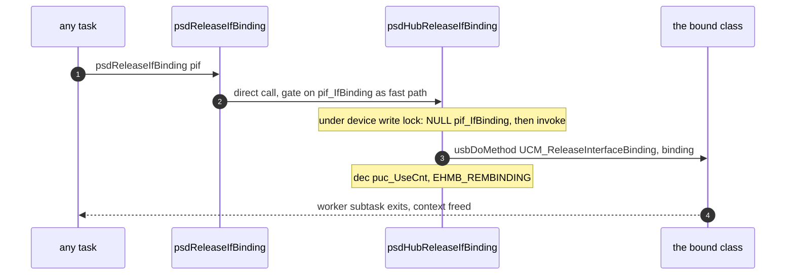

Historical note: releases used to detour through the *parent hub's* task via
`UCM_HubReleaseDevBinding`/`IfBinding`, using the hub's `pd_DevBinding` as the routing token.
That token is NULLed for the entire duration of the hub class's own release, so every routed
release aimed at a child of a dying hub was silently dropped (and `psdUnbindAll`/`psdRemClass`
spun forever on bindings that could not clear). Both hub classes still *implement* the
`UCM_HubRelease*` methods for ABI compatibility, but the library no longer sends them.

**Claim keeps the detour**: `psdClaimAppBinding` routes `UCM_HubClaimAppBinding` to the hub
task — claiming genuinely touches hub state — which calls back into `psdHubClaimAppBindingA`
to set `PDFF_APPBINDING` + `pd_DevBinding = pab` (with `pab_ReleaseHook` for when the stack
needs the app to let go; the hook now runs in whatever task releases the binding).

### 7.5 The `UCM_*` method protocol (who triggers what)

| Method | Triggered by | Returns |
|---|---|---|
| `UCM_AttemptInterfaceBinding` / `ForceInterfaceBinding` | scan Phase C | binding or NULL |
| `UCM_AttemptDeviceBinding` / `ForceDeviceBinding` | scan Phase B/D | binding or NULL |
| `UCM_ReleaseInterfaceBinding` / `ReleaseDeviceBinding` | `psdHubRelease*Binding` | — |
| `UCM_AttemptSuspendDevice` / `AttemptResumeDevice` | `psdSuspendBindings`/`psdResumeBindings`, power-save | TRUE if (un)suspendable |
| `UCM_ConfigChangedEvent` | event task, debounced | class reloads its config |
| `UCM_DOSAvailableEvent` | AfterDOS pass | — |
| `UCM_HubClassScan` | scan Phase E | hub task scans children |
| `UCM_HubClaimAppBinding` | app-binding claim detour | binding |
| `UCM_HubReleaseDevBinding` / `HubReleaseIfBinding` | *nothing* — kept in the hub classes for ABI compatibility; releases are direct (§7.4) | — |
| `UCM_HubSuspendDevice` / `HubResumeDevice` / `HubPowerCyclePort` / `HubDisablePort` | suspend/resume/port maintenance | — |

---

## 8. Configuration & persistence (IFF)

All stack configuration is a nested IFF FORM tree, held in memory as `PsdIFFContext` nodes
(`ps_ConfigRoot`) and serialised to `ENV:`/`ENVARC:Sys/poseidon.prefs`. Class drivers cannot
touch the tree directly — they inject/extract whole sub-FORMs **by copy**.

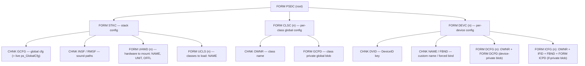

* **`PsdIFFContext`** is a hybrid: the **FORM hierarchy is a node tree** (`pic_SubForms`),
  but the **chunks inside a form are an opaque big-endian byte blob** (`pic_Chunks`) scanned
  linearly. Chunks are replace-by-id; FORMs are append. This keeps the class-visible
  interface ("give me / take this FORM buffer") trivially copyable. All multi-byte integers
  are stored big-endian on disk via `AROS_LONG2BE` regardless of host.
* **Class-visible API**: `psdGetClsCfg`/`psdSetClsCfg` (the `GCPD` blob keyed by owner),
  `psdGetUsbDevCfg`/`psdSetUsbDevCfg` (the `DCPD`/`ICPD` blobs keyed by `(devid[,ifid],owner)`).
  These always return a **copy** of the FORM. The keys are the `pd_IDString`/`pif_IDString`
  built during enumeration (§6).
* **Apply step** (`psdParseCfg`): reconciles the *running* stack against `STKC` — marks all
  hardware/classes for removal, un-marks those listed in `UHWD`/`UCLS` (keeping ROM-resident
  in-use classes), drops the orphans, adds the missing ones (`psdAddClass` /
  `psdAddHardware` + `psdEnumerateHardware`), then `psdClassScan`. Safety quirk: an empty
  `UHWD` does **not** strand existing hardware (so a blank config can't kill a boot keyboard).
* **Change detection**: `pCalcCfgCRC` computes a cheap structural digest over the whole tree;
  `ps_ConfigHash` (current) vs `ps_SavedConfigHash` (last load/save) tell clients there are
  unsaved changes. `ps_CheckConfigReq` is the "recompute needed" flag set by every mutating
  call and polled by the event task, which calls `pCheckCfgChanged` → fires `EHMB_CONFIGCHG`.
  `pUpdateGlobalCfg` keeps the live `ps_GlobalCfg` struct and the `STKC/GCFG` chunk in sync
  (the struct's first 8 bytes *are* a ready-to-embed `GCFG` chunk).

---

## 9. Event / notification subsystem

A broadcast bus: any number of subscribers register a `MsgPort` + a bitmask of event types;
the core `PutMsg`s a `PsdEventNote` to each interested port. There are 15 event types
(`EHMB_ADDHARDWARE … EHMB_DEVRESUMED`); `Param1` carries the relevant object.

```mermaid
flowchart LR
    subgraph PRODUCERS["Event producers (core)"]
        E1["enumerate -> EHMB_ADDDEVICE / REMDEVICE"]
        E2["bind -> EHMB_ADDBINDING / REMBINDING"]
        E3["pCheckCfgChanged -> EHMB_CONFIGCHG"]
        E4["psdWaitPipe -> EHMB_DEVICEDEAD"]
    end
    SE["psdSendEvent(ehmt, p1, p2)"]
    HOOKS["ps_EventHooks : list of PsdEventHook (port + mask)"]
    RP["ps_EventReplyPort (PA_IGNORE)"]

    PRODUCERS --> SE
    SE -->|"for each hook where mask matches"| HOOKS
    HOOKS -->|"PutMsg PsdEventNote (reply = ps_EventReplyPort)"| SUBS["subscriber ports<br/>(Trident, event task, ...)"]
    SUBS -.->|"ReplyMsg"| RP
    SE -->|"pGarbageCollectEvents drains + frees"| RP
```

* Delivery is fire-and-forget; the reply port is `PA_IGNORE` so replies pile up silently and
  are reaped lazily by `pGarbageCollectEvents` (called at the front of every `psdSendEvent`).
* The hook list is guarded by the plain Exec `ps_ReentrantLock` (not the custom lock).
* The **always-on event task** (`pEventHandlerTask`, §4) is both a *consumer* (it subscribes
  to `EHMF_CONFIGCHG`) and the *launcher* of the popup GUI. Each 500 ms tick it: runs
  `pCheckCfgChanged` if requested; ~2 ticks after a config change, broadcasts
  `UCM_ConfigChangedEvent` to every class (coalescing rapid edits); lazily spawns
  `pPoPoGUITask` if popups are wanted; and (if `pgc_PowerSaving`) auto-suspends idle non-hub
  devices past `pgc_SuspendTimeout`.

---

## 10. The custom reader/writer lock

Poseidon replaces Exec `SignalSemaphore` with its own multi-reader/single-writer lock
(`struct PsdLockSem`, embedded in `PsdBase.ps_Lock`, `PsdBase.ps_ConfigLock`,
`PsdDevice.pd_Lock`). Two requirements drive this:

1. **Lock hand-off across a `Wait()`** — a device/relay task often must release the locks it
   holds, block on a signal from another task, and reacquire afterwards, *without* letting
   the protected structures be torn down and *without* deadlocking against the task that will
   wake it. This is the **borrow-lock** mechanism (`psdBorrowLocksWait`).
2. **Deadlock observability** — every lock is registered on `ps_DeadlockDebug` so
   `psdDebugSemaphores` can dump owner, waiters, and shared holders.

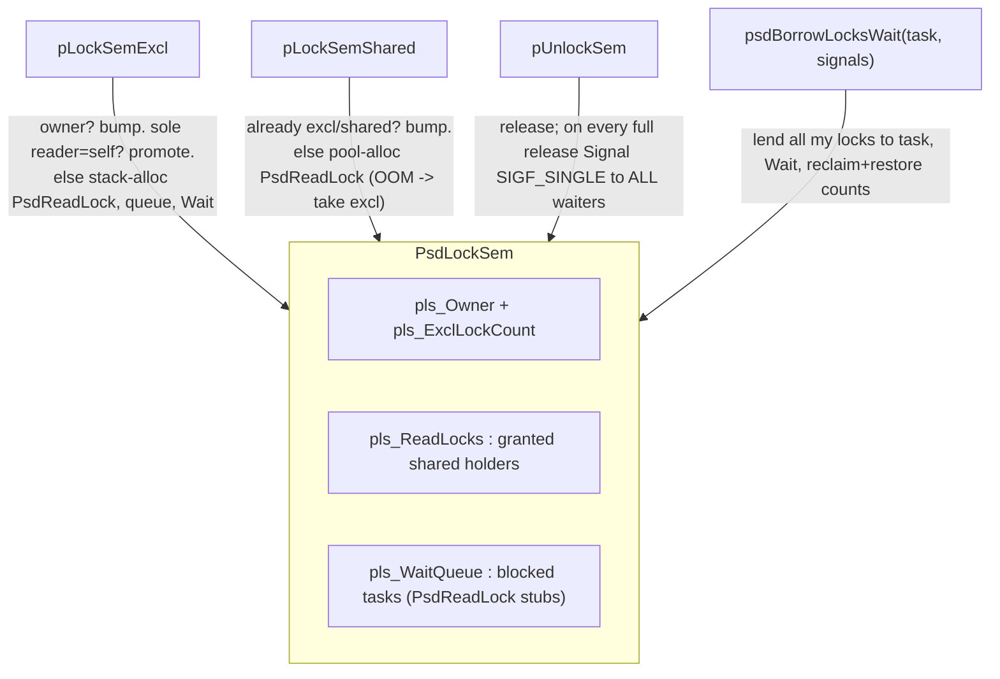

Important properties for refactoring:

* The lock protects itself with `Forbid()/Permit()` and signals waiters with `SIGF_SINGLE`.
* A separate pool (`ps_SemaMemPool`) backs lock records so the lock code never re-enters the
  sem-protected general allocator. On OOM, a shared request **degrades to exclusive** (needs
  no memory) — correctness over concurrency.
* `pUnlockSem` does a deliberate **thundering-herd**: on every full release it signals *all*
  waiters, because a waiter may already hold a shared lock on the same sema and signalling
  only at count-zero could hang it. Woken tasks recheck and re-wait.
* `pCheckForDeadlock` is **declared but not implemented** — there is no active deadlock
  *detector*; only the `psdDebugSemaphores` dump path.
* Public wrappers: `psdLockRead/WritePBase` + `psdUnlockPBase` (guard the global lists),
  `psdLockRead/WriteDevice` + `psdUnlockDevice` (per-device `pd_Lock`); the config functions
  take `ps_ConfigLock` directly. A recurring idiom drops the config lock before calling
  `psdRemClass`/`psdRemHardware` (which re-enter and take other locks).

---

## 11. End-to-end: bringing the stack up

`libOpen` only builds the framework. The stack is populated by an external driver — normally
the `PsdStackLoader` CLI tool (placed in `S:User-Startup`), or the ROM startup residents on a
Kickstart-replacement boot.

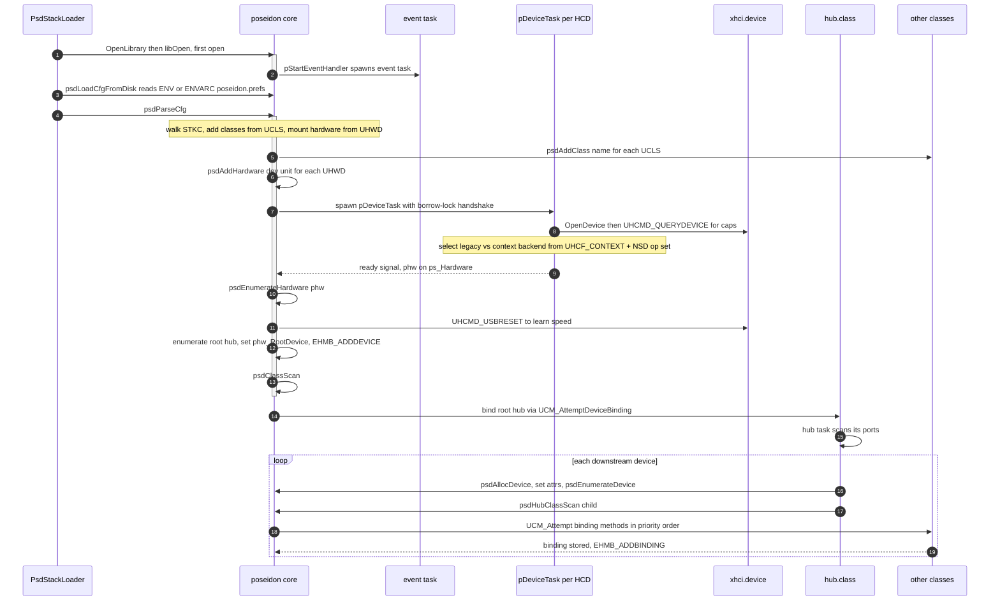

`ps_StartedAsTask` and the **AfterDOS** dance: on a cold-boot ROM path the stack is first
configured from a Task before `dos.library` exists. `psdParseCfg` is gated on
`nodos = (ln_Type != NT_PROCESS)` so it won't yank cold-boot hardware; once DOS appears it
runs the AfterDOS pass — temporarily releasing bindings for classes flagged
`UCCA_AfterDOSRestart` (so `hid.class` can overrule `bootmouse`/`bootkeyboard`) and
broadcasting `UCM_DOSAvailableEvent`, then re-scans. (The `usbromearlystartup.c` /
`usbromlatestartup.c` residents that drive this are **kept-but-unported** in this backport.)

---

## 12. Device lifecycle — connect and disconnect

This is the runtime **hot-plug** path. It spans `hub.class` (the per-hub task `nHubTask`, which
owns the USB hub-class port mechanics) and the core. Markers: **[H]** = runs in the hub task
(`hub.class`); **[C]** = core logic owned by `poseidon.library.c` (executed *in the hub task's
context* — a library call, not a separate task). `hub.class` internals are a separate document;
they appear here only as far as needed to make the flow end-to-end.

**Per-hub context.** Each bound hub runs its own `nHubTask` with state in `struct NepClassHub`:
`nch_Downstream[port]` (the per-port `PsdDevice*` — the source of truth for "is a device on
port N", NULL = empty), `nch_PortChanges[]` (the interrupt change bitmap), and the deferred-action
flags `nch_DisablePort` / `nch_PowerCycle` / `nch_ClassScan`. Address-0 enumeration is serialised by
`hub.class`'s own class-wide `nh_Adr0Sema` (the library no longer hosts an address-0 semaphore) —
only one legacy device may sit at USB address 0 at a time. This is `hub.class`-local: `hubss.class`
is context-only and doesn't serialise address 0. Context HCDs **skip** it even in `hub.class`:
`CREATE_DEVICE` is atomic in the driver, so there is no wire address-0 window to serialise.

### 12.1 Connect

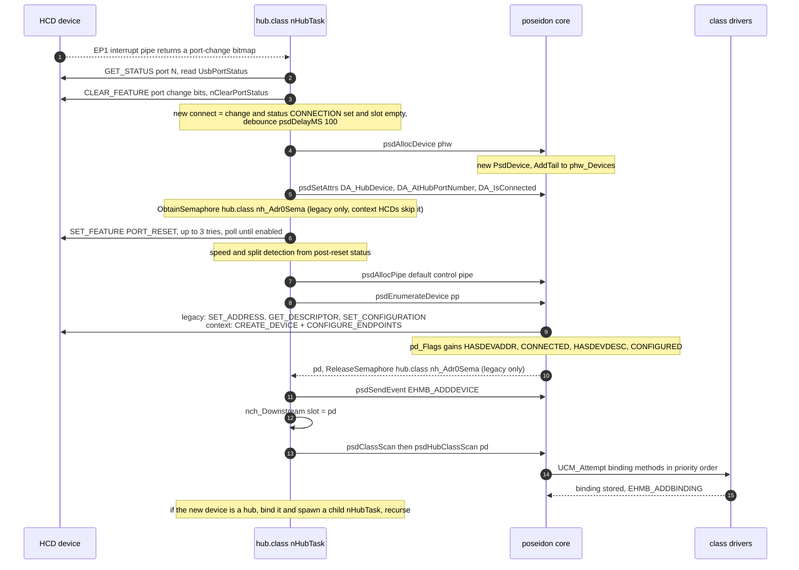

Ordered phases:

1. **Detect [H].** The hub's EP1 interrupt pipe (`psdSendPipe`) completes with a port-change
   bitmap; the task reads `GET_STATUS` for each changed port and `nClearPortStatus` acks the
   change bits. New-connect condition = change *and* status `UPSF_PORT_CONNECTION` set *and*
   `nch_Downstream[port-1] == NULL`; debounce 100 ms (`nConfigurePort`, `hub.class.c`).
2. **Allocate + link [C].** `psdAllocDevice(phw)` (`poseidon.library.c:2144`) makes a zeroed
   `PsdDevice` and `AddTail`s it to `phw_Devices`. The hub then sets `pd_Hub` / `pd_HubPort` /
   `PDFF_CONNECTED` via `psdSetAttrs(PGA_DEVICE,…)` (the PACK table at `:9039/:9059/:9069`) —
   this is what places the device in the tree.
3. **Reset + speed [H].** Claim `hub.class`'s `nh_Adr0Sema` (legacy backend only; context HCDs skip it);
   `SET_FEATURE PORT_RESET` (≤3 attempts, poll ≤500 ms until enabled); derive speed/split from
   post-reset status (`PDFF_HIGHSPEED` / `PDFF_LOWSPEED` / `PDFF_NEEDSSPLIT`); settle delay.
4. **Enumerate [C].** `psdAllocPipe` default control pipe → `psdEnumerateDevice(pp)`
   (`:3091`): address the device (legacy `SET_ADDRESS` / context `CREATE_DEVICE`), read
   descriptors, parse configs, set configuration — progressively setting
   `PDFF_HASDEVADDR | CONNECTED | HASDEVDESC | CONFIGURED` (see §6). Release `nh_Adr0Sema` (legacy).
5. **Announce + bind.** `psdSendEvent(EHMB_ADDDEVICE)` [H→C]; store `pd` in `nch_Downstream` [H];
   `psdClassScan` / `psdHubClassScan` [C] offers the device to classes in priority order
   (`UCM_Attempt*Binding`) → binding stored, `EHMB_ADDBINDING` (see §7).
6. **Recurse [H].** If the new device is itself a hub, `hub.class` binds it
   (`UCM_AttemptDeviceBinding`) and `psdSpawnSubTask`s a fresh `nHubTask` — which restarts this
   flow for the child hub's ports. **Topology discovery is one hub task per hub, expanding
   leaf-ward.**

### 12.2 Disconnect

Three triggers, all converging on `psdFreeDevice`: **(A)** a live port-disconnect change on
EP1; **(B)** an explicit `UCM_HubDisablePort` / `UCM_HubPowerCyclePort` method (e.g. from the
PoPo auto-recovery in §13); **(C)** the hub itself vanished — EP1 `UHIOERR_TIMEOUT` or the hub
binding released → `nFreeHub` tears down every port.

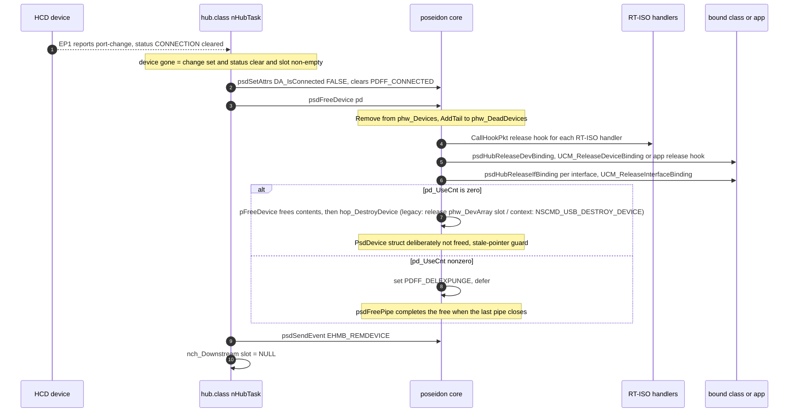

Ordered phases:

1. **Detect [H].** Port change with `UPSF_PORT_CONNECTION` cleared and `nch_Downstream[port-1]`
   non-NULL → device gone.
2. **Mark offline [C].** `psdSetAttrs(DA_IsConnected, FALSE)` clears `PDFF_CONNECTED`.
3. **Free [C] (`psdFreeDevice`, `:2094`).** `Remove` from `phw_Devices` and `AddTail` to
   `phw_DeadDevices` **immediately** (closes the race where a class scan could re-touch a dying
   device); notify each `pd_RTIsoHandlers` entry via its `prt_ReleaseHook`; release the
   device-level binding (`psdHubReleaseDevBinding` → `UCM_ReleaseDeviceBinding`, or the app's
   `pab_ReleaseHook`), then every interface binding (`psdHubReleaseIfBinding` →
   `UCM_ReleaseInterfaceBinding`); each release fires `EHMB_REMBINDING`.
4. **Free or defer [C] (`pFreeDevice`).** If `pd_UseCnt == 0`: clear `PDFF_DELEXPUNGE` first
   (disarming the deferred collector — the context backend's `hop_DestroyDevice` pumps a
   temporary EP0 pipe through `psdFreePipe`, which would otherwise re-enter `pFreeDevice`), free
   configs, descriptors and strings, tear down backend addressing via `hop_DestroyDevice`
   (legacy: release the `phw_DevArray[pd_DevAddr]` slot; context: `NSCMD_USB_DESTROY_DEVICE`,
   which latches and zeroes `pd_Handle` *before* issuing the op so it is idempotent), delete
   `pd_Lock` — but deliberately **do not** free the `PsdDevice` struct itself (stale-pointer
   guard). If `pd_UseCnt != 0`: set `PDFF_DELEXPUNGE` and defer; the final `psdFreePipe` that
   drops `pd_UseCnt` to 0 calls `pFreeDevice` again to complete teardown.
5. **Announce + clear slot [H].** `psdSendEvent(EHMB_REMDEVICE)`; `nch_Downstream[port-1] = NULL`.
6. **Recursive hub teardown.** Removing a hub signals its `nHubTask` (`SIGBREAKF_CTRL_C`);
   `nFreeHub` runs the disconnect path for *every* downstream port. Because each child hub's
   binding is released first (its task signalled and exits), teardown unwinds **leaf-first**.
7. **HW-interface removal [C] (`psdRemHardware`).** Frees all live devices, then reaps
   `phw_DeadDevices` with the wait-then-abandon escalation (§13.5).

---

## 13. Failure recovery and resilience

The dominant theme is **soft degradation over hard failure**: score-and-decay rather than a hard
flip, *abandon* rather than hang, *degrade* rather than fail to allocate, and keep a
half-enumerated device rather than discard it.

The central artefact is the **device-health** machine driven by the per-IO dead-device counter:

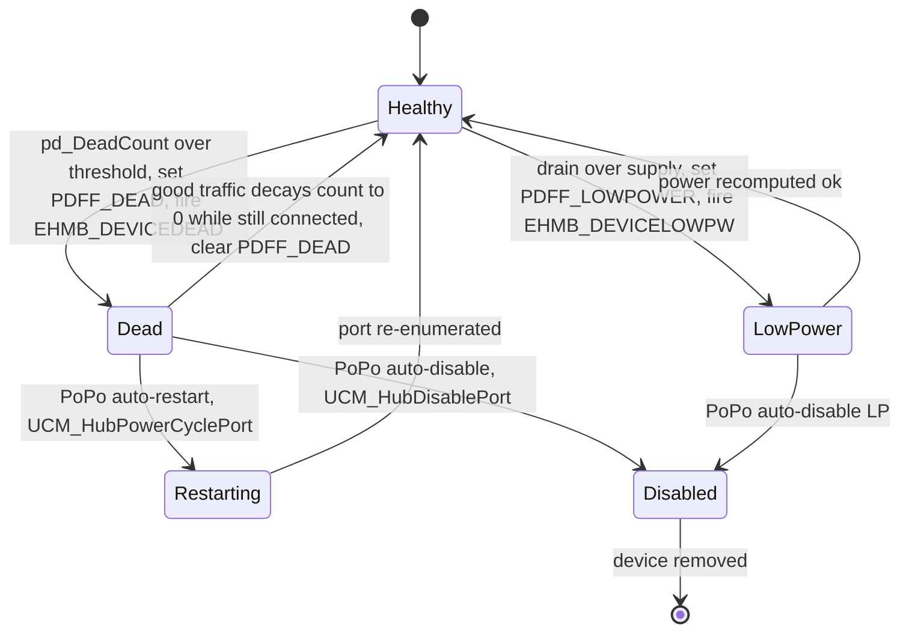

### 13.1 Dead-device counter (`psdWaitPipe`, `:4640-4678`)

Every completed transfer is scored by IO error in a deliberate fall-through switch: `UHIOERR_TIMEOUT`
adds 3 (falls through to NAKTIMEOUT and CRC), `UHIOERR_NAKTIMEOUT` adds 2, `UHIOERR_CRCERROR` adds 1;
any other result (including success) **halves** the counter (`pd_DeadCount >>= 1`). So one timeout
costs 3 but recovery is **geometric**. Thresholds: `pd_DeadCount > 19`, or `> 14` if the device
already has an address/descriptor (`PDFF_HASDEVADDR|HASDEVDESC` — a partially-enumerated device is
condemned sooner), set `PDFF_DEAD` and fire `EHMB_DEVICEDEAD` once. Recovery: when the count decays
to 0 *and* the device is still `PDFF_CONNECTED`, `PDFF_DEAD` is cleared ("the zombie returned").

### 13.2 Auto-recovery (PoPo task, `popo.gui.c:874-926`)

On `EHMB_DEVICEDEAD` / `EHMB_DEVICELOWPW`, the PoPo GUI task consults three global-config booleans
and acts **on the parent hub's binding**: `pgc_AutoRestartDead` + dead →
`usbDoMethod(UCM_HubPowerCyclePort, hubpd, pd_HubPort)` (disable then re-enumerate the port);
otherwise `pgc_AutoDisableDead` / `pgc_AutoDisableLP` → `usbDoMethod(UCM_HubDisablePort, …)` (unbind,
free, electrically disable the port). **Note the coupling:** this recovery *policy* lives in the GUI
task, not the core proper — a refactor that assumes the core is self-healing will be wrong.

### 13.3 Power model (`psdCalculatePower` / `pPowerRecurse*`, `:4236, :8254, :8298`)

Recomputed after every enumerate, every free, and on config change. Two recursive passes sum drain
and distribute supply; if `pd_PowerDrain > pd_PowerSupply` it sets `PDFF_LOWPOWER` and fires
`EHMB_DEVICELOWPW`, self-clearing when the budget is restored.

### 13.4 Enumeration robustness

* **SET_ADDRESS lost-ACK retry (legacy backend)** (`psdEnumerateDevice`, `:3203-3231`): the device
  may accept the address but lose the ACK, so on `TIMEOUT`/`STALL` it waits 250 ms and retries
  **once at the new address** (no re-setup). `fail_restore` rolls back `iouh_DevAddr` and the flags
  if a later step fails. (The context backend has no wire `SET_ADDRESS`; `CREATE_DEVICE` addresses
  the device atomically.)
* **NAK-timeout arming (legacy backend)**: legacy enumeration sets `UHFF_NAKTIMEOUT` +
  `iouh_NakTimeout = 1000` so a mute device can't wedge the bus; restored on every exit path.
* **Descriptor tolerance**: `UHIOERR_OVERFLOW` (babble) and `UHIOERR_RUNTPACKET` (short) are swallowed
  on string and first-8-byte device reads; a missing LangID synthesises a dummy `0x0409` (US-English).
* **String hygiene**: `psdGetStringDescriptor` maps embedded NUL characters to spaces, tolerating
  buggy devices that stuff NULs into their UTF-16 string descriptors.
* **`pFixBrokenConfig`** (`:8437`): a per-VID/PID quirk table that rewrites malformed interface
  descriptors (mostly mass-storage class/subclass/protocol fixes) after parse.
* **"Return the device even if config parse failed"** (`:3481`): if `pGetDevConfig` fails, the device
  is still returned enumerated and bindable — "maybe some firmware will use it anyway."

### 13.5 Shutdown / teardown give-up (anti-hang)

* `pDeviceTask` (`:8770-8794`): on shutdown it `CMD_FLUSH`es the HCD then drains `phw_MsgCount`,
  warning at ~5 s ("driver buggy?") and **force-zeroing the count at ~30 s** rather than hang the
  unit on a buggy driver.
* `psdRemHardware`: for in-use dead devices it waits with a per-device grace, warns at 5 s, and
  after 30 s **abandons** the device: unlinks it, clears `PDFF_CONNECTED|PDFF_DELEXPUNGE`, deletes
  its lock, and deliberately leaks configs/descriptors — the never-released pipes still reference
  the endpoint structures, and HC state is reclaimed by `CloseDevice` in the device task. The use
  counter is left truthful (never force-zeroed): `psdFreePipe`'s decrement saturates at 0, so a
  late free on an abandoned device is harmless and can never wrap the counter or resurrect the
  deferred collector.

### 13.6 Allocation- and lock-level resilience

* **Deferred free** (`pFreeDevice`): `PDFF_DELEXPUNGE` defers teardown while pipes are open; the
  collector in `psdFreePipe` decrements `pd_UseCnt` saturating-at-0 under `Forbid()` and fires
  `pFreeDevice` when it reaches 0 with the flag set (the flag is cleared on entry to the actual
  free, so the collector cannot re-fire mid-teardown). The `PsdDevice` struct is **never** freed
  even on full teardown (use-after-free guard for tasks still holding the pointer).
* **Lock OOM degradation** (`pLockSemShared`): a shared lock that can't allocate its read-lock record
  falls back to the (allocation-free) exclusive path — correctness over concurrency.
* **Borrow-lock** (`psdBorrowLocksWait`): lends held locks to a task you're about to wait on, so
  enumeration handshakes (hub task ↔ core) can't deadlock.

### 13.7 Runtime guards

* **Resume-refusal rebind** (`psdResumeBindings`, `:3677`): a class that refuses `UCM_AttemptResumeDevice`
  is released and `psdClassScan` re-run so a different driver can claim the resumed device.
* **Offline / suspended pipe guard** (`psdDoPipe` / `psdSendPipe`, `:4530, :4560`): on a disconnected
  device, transfers fail fast with a synthetic `UHIOERR_TIMEOUT` (feeding the dead counter) instead of
  blocking; on a suspended device they transparently `psdResumeDevice` first.
* **Idle auto-suspend** (`pEventHandlerTask`, `:8916-8955`): every ~2 s, idle configured non-hub devices
  past `pgc_SuspendTimeout` are suspended (gated by class `UCCA_SupportsSuspend` / `pgc_ForceSuspend`).
  The sweep zeroes `pd_LastActivity` after each attempt and skips devices with a zero stamp, so a
  *failed* suspend is never retried — which is what makes the rollback below load-bearing.
* **Suspend rollback** (`psdSuspendDevice`): the port park is delegated to the parent hub's class, and
  if it does not happen — hub gone, no class binding on the hub, or a partial failure earlier in
  `psdSuspendBindings` — the bindings are resumed and the ctx-HCD rings restarted
  (`psdResumeBindings`, preceded by a `UCM_HubResumeDevice` when the hub is still connected, since a
  NAK on the status stage can still have delivered the park). Without it the device is left with its
  bindings stopped and its rings quiesced while `PDFF_SUSPENDED` is still clear, and nothing recovers
  it: the auto-resume guard above keys off that flag, and the idle sweep has already written the
  device off. The rollback runs *outside* the device lock (`psdResumeBindings` can reach
  `psdLockWriteDevice` on the same device) and never writes `PDFF_SUSPENDED` itself.

---

## 14. State machines

Poseidon contains **no textbook `enum state; switch(state){…}`** machine. State is carried in
message node types, flag bitsets, lock fields, and list membership. Two are "real" (an explicit state
variable with direct-assignment transitions); the rest are implicit flag/list progressions. The large
USB **hub port** FSM lives in `hub.class` (separate document).

| Machine | Kind | State carrier |
|---|---|---|
| Pipe completion | **Real** (explicit var, no switch) | `pp_Msg.mn_Node.ln_Type` |
| Device enumeration / health | Implicit | `pd_Flags` (`PDFF_*`) bitset |
| HCD / USB operational | Defined, **not driven in core** | `iouh_State` (`UHSF_*`) — owned by the HCD driver |
| Library lifecycle | **Real**, external (exec) | open count / romtag |
| Custom reader/writer lock | **Real** (explicit state, no switch) | `PsdLockSem` owner / counts / queues |
| Hub per-port | Implicit | `nch_Downstream[]` + change/action bitmasks (`hub.class`) |
| Pipe stream | Implicit | Free/Ready lists + `pps_ActivePipe` |

### 14.1 Pipe completion FSM (real)

The Exec message node type **is** the pipe's lifecycle state, with direct-assignment transitions and
an explicit busy-wait predicate (`psdWaitPipe`):

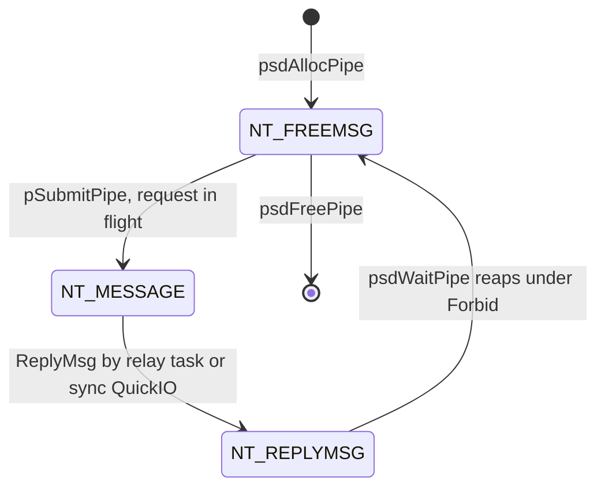

`psdCheckPipe` returns NULL while `NT_MESSAGE`; `psdFreePipe` detects a still-pending pipe and
aborts+waits before freeing. There is no `switch` — the state is read by the `while(... == NT_MESSAGE)`
poll and a `Forbid()`-guarded reap.

### 14.2 Device enumeration / health progression (implicit)

There is no `pd_State` field; the set of `PDFF_*` bits *is* the state. The forward progression and the
side-states (dead / low-power / suspended / del-expunge) are scattered `|=` / `&=` assignments, read as
composite predicates in a few places (e.g. the auto-suspend guard `== PDFF_CONFIGURED`, the dead-recovery
test `== (PDFF_DEAD|PDFF_CONNECTED)`):

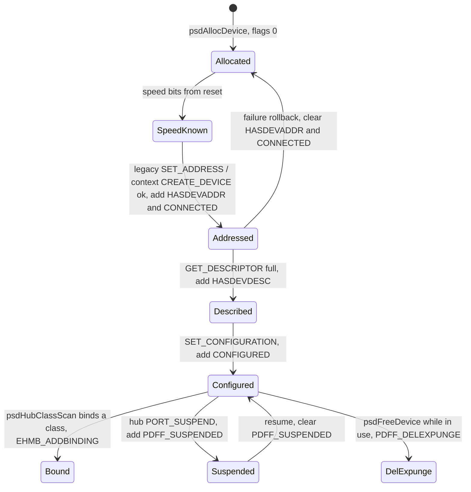

`PDFF_SUSPENDED` is set/cleared in `hub.class` (`DA_IsSuspended`), not the core; the core only reads it.
That is precisely why a failed port park must roll the *bindings and rings* back (§13.7) rather than
set the flag: the flag means "the port is parked", and only the class that parks it may say so.
`PDFF_DEAD` / `PDFF_LOWPOWER` are the health side-states shown in §13.

### 14.3 The other machines (brief)

* **Custom RW lock (real).** `PsdLockSem` carries explicit state — `pls_Owner`, `pls_ExclLockCount`,
  `pls_SharedLockCount`, the `pls_ReadLocks` and `pls_WaitQueue` lists — with `if`-chain transitions in
  `pLockSemExcl`/`pLockSemShared`/`pUnlockSem`, plus read→write promotion and cross-task lock borrowing
  (§10).
* **HCD operational state (not driven here).** The header defines `UHSF_OPERATIONAL / RESUMING /
  SUSPENDED / RESET` and the `UHCMD_USBOPER / USBSUSPEND / USBRESUME / USBRESET` commands, but the core
  only ever issues `UHCMD_USBRESET` (to learn link speed at root-hub enumeration); root-hub suspend/resume
  are explicit `FIXME` stubs. Because the stack never issues them, the `USBOPER / USBSUSPEND / USBRESUME`
  trio is legacy-ABI-only (`usbhardware.h`) and the context HCD no longer dispatches it (replies
  `IOERR_NOCMD`); only `USBRESET` (`CMD_DEVICE_RESET`) survives on the driver side. This FSM is owned by
  the HCD `.device`; in the stack it is effectively a passthrough. Per-device suspend/resume is realised via the hub-class `PORT_SUSPEND` port transition;
  on **context** HCDs the library additionally issues `NSCMD_USB_SET_SUSPEND` (ring quiesce) around that
  transition (`psdSuspendDevice`/`psdResumeDevice`), with the ring restart centralised in
  `psdResumeBindings`.
* **Pipe stream (implicit).** A producer/consumer machine expressed as list membership: a pipe is in
  `pps_FreePipes` (idle), `pps_ReadyPipes` (completed, buffered), or `pps_ActivePipe` (the single in-flight
  writer), with scalar buffer state (`pps_BytesPending`/`pps_Offset`/`pps_ReqBytes`). Transitions live in
  `psdStreamRead`/`psdStreamWrite`.
* **Library lifecycle (real, external).** The standard exec romtag/open-count machine of §2.

---

## 15. Notable quirks & refactoring hazards

A checklist of non-obvious things that will bite a refactor:

* **`pp_Msg` vs `pp_IOReq` duality.** The stack tracks completion via `pp_Msg`, *separate* from
  whatever the HCD sees. On the **legacy** backend the HCD replies its wire request to
  `phw_DevMsgPort` and the bridge is `iouh_UserData = pp`, stamped in `pSubmitPipe()` before
  every submission.
  On the **context** backend transfers never ride the wire at all — `pDirectSubmit()` marks
  `pp_WireReq = NULL` and passes the pipe as the submit cookie; the done hook
  (`pXferDoneHook`) writes the results into `pp_IOReq` and replies `pp_Msg` — while the marshalled
  lifecycle/RT-ISO ops (`pp_Ctx`) are demuxed by `ln_Name` (`pWireReqPipe`), with `io_Error` copied
  back by `pCtxCompletePipe()`. Drop any of these bridges and the demux crashes.
* **Abort routes by framing**: a message-framed request is aborted via the task port — even on
  QuickIO HCDs, so the relay task must stay armed — while a direct-submitted pipe
  (`pp_WireReq == NULL`) calls `phw_CtxAbort` straight from the caller's task.
* **`phw_MsgCount` is non-atomic across two tasks**; the QuickIO-deferred `++` is wrapped in
  `Forbid()/Permit()` to serialise against the relay's `--`.
* **`pFreeDevice` intentionally leaks the `PsdDevice` struct** (other tasks may hold the
  pointer); only its children/strings/address slot are freed. Don't "fix" this into a free.
* **Dispatch-by-macro (`UsbClsBase = puc->puc_ClassBase`)** means any `usbDoMethod` site is
  only correct if a `puc` is in scope pointing at the intended class. This is invisible at the
  call site.
* **Releases are direct, claims are routed** (§7.4). The public `psdRelease*Binding` call the
  `psdHub*` workers straight from the caller's task — the device write lock plus
  NULL-before-invoke makes that safe from any context. Only `UCM_HubClaimAppBinding` (and
  suspend/resume/port maintenance) still detour through the hub task; don't re-route releases
  through the hub, its routing token is NULL for the whole of its own teardown.
* **Custom lock degrades shared→exclusive on OOM** and **signals all waiters on every full
  release** (by design). A "more efficient" single-wakeup will hang waiters that already hold
  a shared lock.
* **IFF chunks are an opaque big-endian byte blob**, replace-by-id, linear-scan — only FORMs
  are nodes. The outer FORM id is kept as classic `PSDC` (not AROS `PSBC`/`PSLC`) for 4.5
  prefs compatibility — flagged as a revert point if HW testing disproves it.
* **`pCheckForDeadlock` is a dead declaration**; the only diagnostic is the
  `psdDebugSemaphores` dump.
* **`pps_AsyncTask` is never assigned** — streams have no async thread in this backport.
* **`psdClassScan` only directly scans root hubs**; everything deeper is scanned in the
  owning hub's task. Changing this re-introduces the re-entrancy/deadlock it was built to
  avoid.
* **Dead/low-power recovery policy lives in the PoPo GUI task** (`popo.gui.c`), not the core —
  the auto-disable/auto-restart actions only happen if the PoPo task is running. The core only
  *flags* `PDFF_DEAD`/`PDFF_LOWPOWER` and fires events; it does not self-heal (§13.2).
* **Address-0 serialization is `hub.class`-local, not a library concern.** The library no longer
  owns an address-0 semaphore; `hub.class` serialises **legacy** address-0 enumeration with its own
  class-wide embedded `nh_Adr0Sema` — only one legacy device may sit at USB address 0 at a time, and
  a slow/stuck reset holds it and stalls all other `hub.class` enumeration. `hubss.class` is
  context-only and has no software default-address phase, so it doesn't serialise address 0 at all.
  **Context** HCDs skip the lock even in `hub.class` — `CREATE_DEVICE` is atomic in the driver, so
  there is no address-0 window to serialise.
* **`DA_Address` exposes `pd_DevAddr` in the public API** (`poseidon.h:119`, read-only PACK entry
  at `:9034`). `pd_Handle` is now the realized backend-agnostic device identity (USB address on the
  legacy backend, the opaque HCD handle on the context backend), but `DA_Address` still answers
  `pd_DevAddr` for any external tool that reads it.
* **Device addresses are only reclaimed by `pFreeDevice` (legacy backend).** `pAllocDevAddr`
  (`:2203`) has no dedicated release counterpart; the `phw_DevArray` slot is cleared during device
  teardown. A missed disconnect therefore leaks the address slot until the hardware interface is
  removed (bounded by the 127-address space; legacy enumeration fails loudly on exhaustion,
  `:3133`). This is a **legacy-backend** concern only — context HCDs own addressing behind
  `pd_Handle`, so the exhaustion/leak question does not arise.
* **`psdEnumerateDevice` configures the device during enumeration** (`psdSetDeviceConfig` right
  after `pGetDevConfig`) — **intentional and kept**: it is original-author code (present since
  Chris Hodges' initial Poseidon import) guarding against devices that misbehave while unconfigured
  (and unconfigured devices are limited to 100mA). The class scan's `pd_CurrCfg` check avoids a
  duplicate wire `SET_CONFIGURATION`. On the **context** backend this is exactly where
  `hop_ConfigureEndpoints` fires (`NSCMD_USB_CONFIGURE_ENDPOINTS`), so the configure-endpoints op
  sits naturally at this point.
* **Config-parse deadlock FIXME** (`:6809`): `psdParseCfg` warns that a class doing config work
  from an external task during `libOpen` can deadlock against the config lock. Unresolved; be
  careful adding new config traffic from class/binding paths.

---

## 16. Appendix — maps & indexes

### 13.1 Public API surface (by area)

* **Memory / strings:** `psdAllocVec`, `psdFreeVec`, `psdCopyStr`, `psdCopyStrFmtA`,
  `psdSafeRawDoFmtA`, `psdNumToStr`, `psdDelayMS`.
* **Locks:** `psdLockRead/WritePBase`, `psdUnlockPBase`, `psdLockRead/WriteDevice`,
  `psdUnlockDevice`, `psdBorrowLocksWait`, `psdDebugSemaphores`.
* **Hardware (lower edge):** `psdAddHardware`, `psdRemHardware`, `psdEnumerateHardware`,
  `psdEnumerateDevice`, `psdCalculatePower`.
* **Device tree / queries:** `psdAllocDevice`, `psdFreeDevice`, `psdGetNextDevice`,
  `psdFindDevice(A)`, `psdFindInterface(A)`, `psdFindEndpoint(A)`, `psdFindDescriptor(A)`,
  `psdGetAttrs(A)`, `psdSetAttrs(A)`, `psdSuspend/ResumeDevice`, `psdSuspend/ResumeBindings`.
* **Pipes / IO:** `psdAllocPipe`, `psdFreePipe`, `psdPipeSetup`, `psdDoPipe`, `psdSendPipe`,
  `psdWaitPipe`, `psdAbortPipe`, `psdCheckPipe`, `psdGetPipeActual`, `psdGetPipeError`,
  `psdGetStringDescriptor`, `psdSetDeviceConfig`, `psdSetAltInterface`.
* **Streams / RT-ISO:** `psdOpenStream(A)`, `psdCloseStream`, `psdStreamRead/Write/Flush`,
  `psdGetStreamError`, `psdAllocRTIsoHandler(A)`, `psdFreeRTIsoHandler`, `psdStart/StopRTIso`.
* **Classes / bindings (upper edge):** `psdAddClass`, `psdRemClass`, `psdClassScan`,
  `psdHubClassScan`, `psdClaimAppBinding(A)`, `psdReleaseAppBinding`,
  `psdHubClaimAppBinding(A)`, `psdRelease/HubReleaseDev/IfBinding`, `psdUnbindAll`,
  `psdDoHubMethod(A)`, `psdSet/GetForcedBinding`.
* **Config (IFF):** `psdReadCfg`, `psdWriteCfg`, `psdParseCfg`, `psdLoad/SaveCfgToDisk`,
  `psdFind/NextCfgForm`, `psdAllocCfgForm`, `psdRemCfgForm`, `psdAddCfgEntry`,
  `psdRem/GetCfgChunk`, `psdSet/GetClsCfg`, `psdSet/GetUsbDevCfg`,
  `psdAdd/Match/GetStringChunk`.
* **Events / errors:** `psdAddEventHandler`, `psdRemEventHandler`, `psdSendEvent`,
  `psdAddErrorMsg(A)`, `psdRemErrorMsg`.
* **Tasks:** `psdSpawnSubTask`.

### 13.2 Key structures (in `poseidon_intern.h`)

| Struct | Role |
|---|---|
| `PsdBase` | the library base; all global lists, pools, locks, config root, task state |
| `PsdHardware` | one HCD unit: relay task, two ports, root IOReq template, caps, device map |
| `PsdDevice` / `PsdConfig` / `PsdInterface` / `PsdEndpoint` | the USB device tree |
| `PsdDescriptor` | a flat record of one descriptor with tree up-links |
| `PsdPipe` | one transfer/op: `pp_Msg` (stack token) + `pp_IOReq` (the HCD's request on the legacy backend; internal state on context, where transfers are direct submits) |
| `PsdPipeStream` | buffered stream over an array of pipes (caller-task driven) |
| `PsdRTIsoHandler` | real-time ISO transfer handler |
| `PsdUsbClass` | a registered class library (base, name, priority, use-count) |
| `PsdAppBinding` | an application's claim on a device (release hook, task) |
| `PsdLockSem` / `PsdReadLock` / `PsdBorrowLock` / `PsdSemaInfo` | the custom R/W lock |
| `PsdIFFContext` | one node of the in-memory IFF config tree |
| `PsdEventHook` / `PsdEventNote` | event subscription + delivered note |
| `PsdErrorMsg` | one entry of the error/log list |
| `PsdPoPo` / `PsdHandlerTask` | popup-GUI state / event-handler-task state |

### 13.3 File map

| File | Contents |
|---|---|
| `poseidon.library/poseidon.library.c` | all `psd*` LVOs + internal `p*` helpers + the tasks |
| `poseidon.library/poseidon_intern.h` | private structs + IFF layout commentary |
| `poseidon.library/poseidon.library.h` | internal includes + helper prototypes |
| `poseidon.library/poseidon_main.c` | romtag, `initTable`, `funcTable`, lifecycle vectors |
| `poseidon.library/poseidon_funcs.inc` | the 96-entry LVO order |
| `poseidon.library/poseidon.sfd` | the public ABI (`==bias 30`) + register args |
| `poseidon.library/numtostr.c` | `const` string tables for `psdNumToStr` |
| `poseidon.library/popo.gui.c` | the built-in MUI device requester task |
| `poseidon.library/usbrom{early,late}startup.c` | ROM autostart residents (kept-but-unported) |
| `include/devices/usbhardware.h` | **lower-edge** legacy contract (`IOUsbHWReq`, `UHCMD_*`, `UHCF_*`) |
| `include/devices/usbhcd_context.h` | **lower-edge** context contract (`NSCMD_USB_*` ops, `UhcdAttach`, submit entries, tokens) |
| `include/libraries/usbclass.h` | **upper-edge** contract (`UCM_*`, `UGA_*`, `UCCA_*`) |
| `include/libraries/poseidon.h` | public API tags, events, IFF ids, `PsdGlobalCfg` |
| `classes/class_main.c` | the shared `*.class` skeleton (romtag + 7-vector `funcTable`) |
| `usbclass.library/usbclass.sfd` | the 3-method meta-class ABI |
