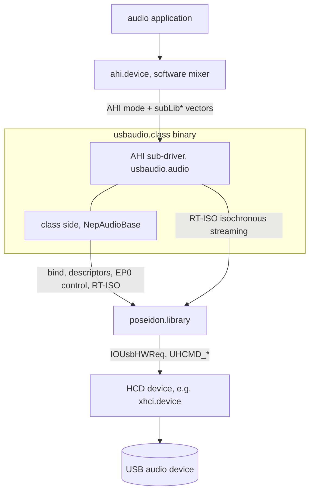
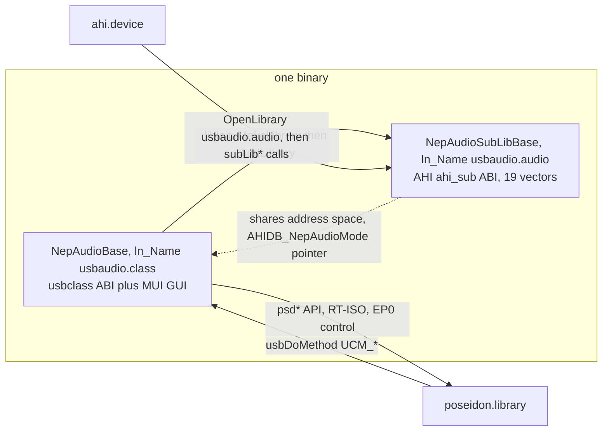
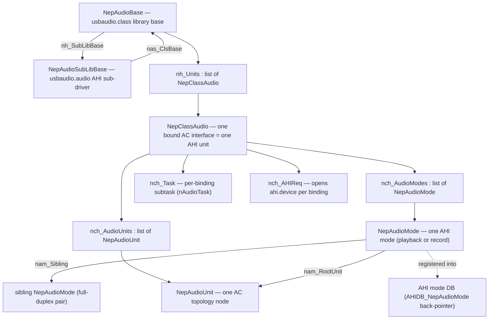
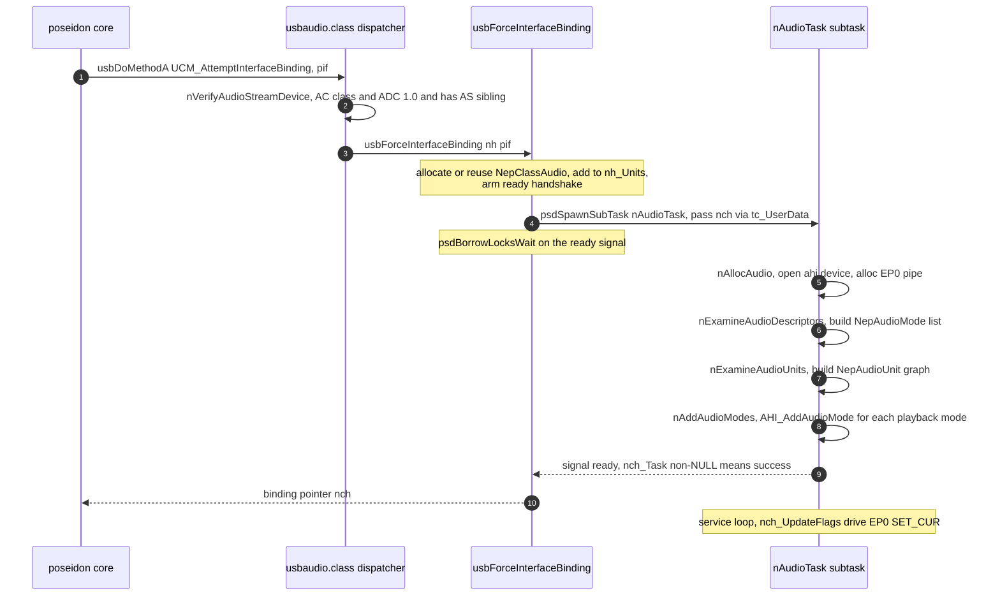
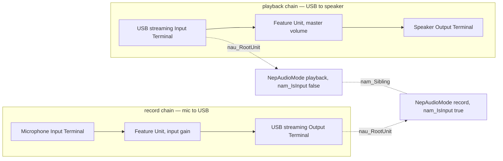
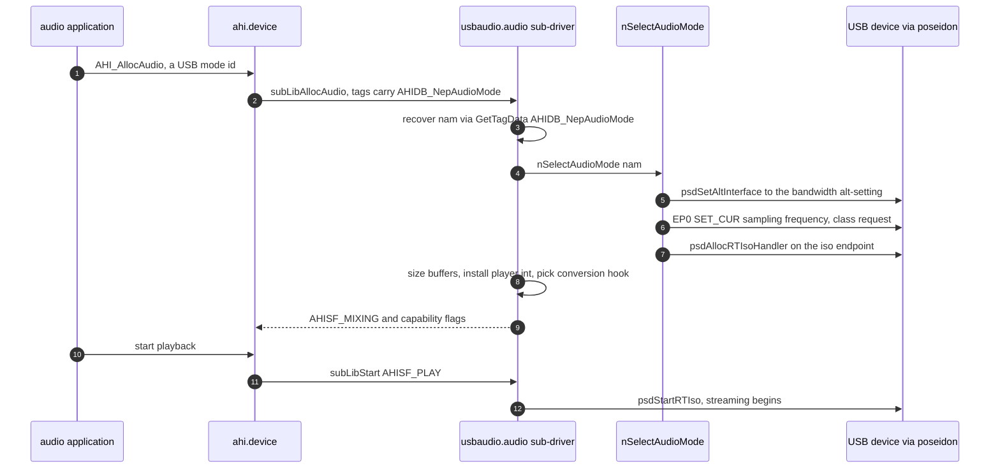
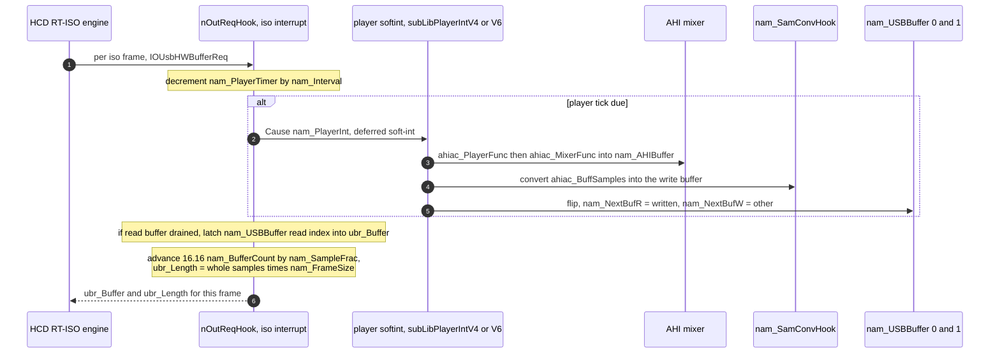
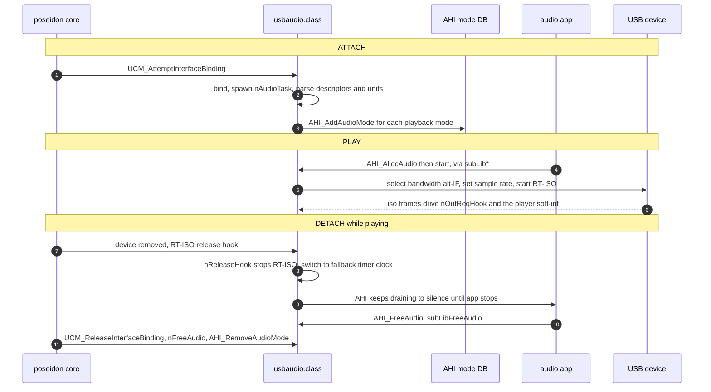
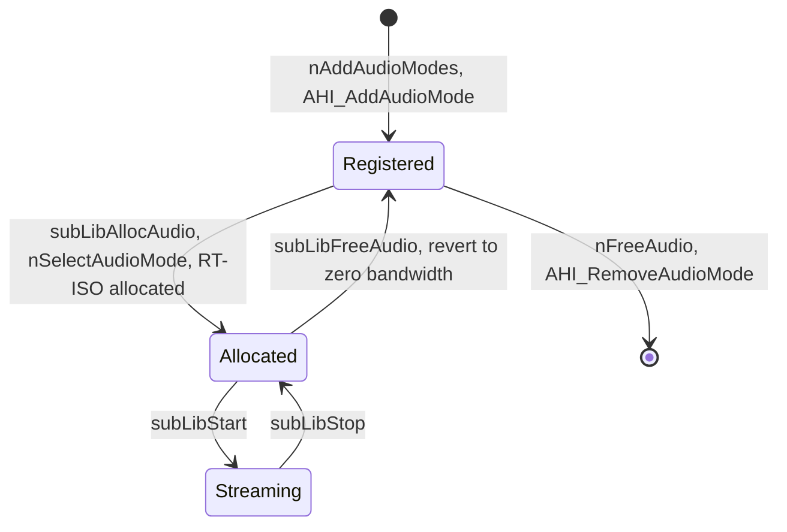
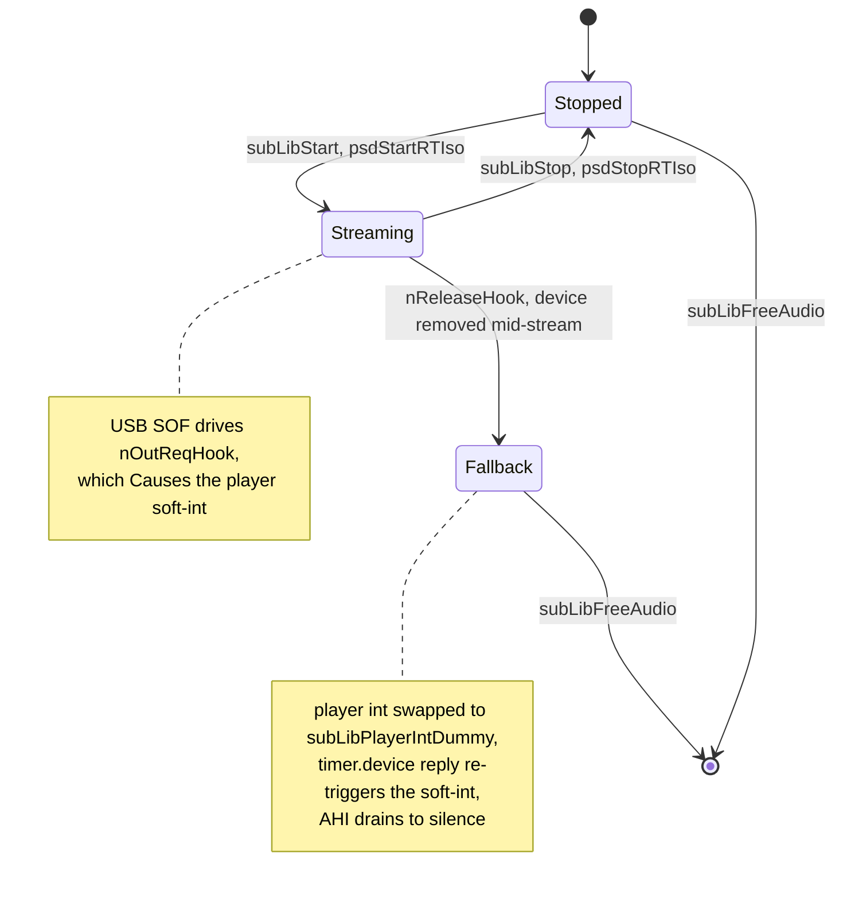

# usbaudio.class — Architecture (reverse-engineered)

> Scope: the **`usbaudio.class`** USB Audio class driver. This is a *consumer* of
> `poseidon.library` (the stack core — see
> [poseidon.library-architecture.md](poseidon.library-architecture.md)) on its lower edge and a
> *provider* to `ahi.device` (the Amiga audio system) on its upper edge. Familiarity with the
> core doc's §7 (class-driver binding) and §5 (RT-ISO / pipes) helps.
>
> Sources reverse-engineered: `classes/audio/usbaudio.class.c` (~3.9k lines),
> `classes/audio/usbaudio.h`, `classes/audio/usbaudio.class.h`, the shared class skeleton
> `classes/class_main.c`, and the headers `include/devices/usb_audio.h` (USB Audio Class 1.0
> descriptors), `include/devices/usbhardware.h` (RT-ISO transport), plus the AHI SDK headers
> `<devices/ahi.h>` / `<libraries/ahi_sub.h>`. Line numbers are indicative.

---

## Table of contents

1. [What this driver is](#1-what-this-driver-is)
2. [Layering](#2-layering)
3. [The dual-library structure](#3-the-dual-library-structure)
4. [Object model](#4-object-model)
5. [Binding lifecycle](#5-binding-lifecycle)
6. [USB-Audio descriptor parsing and the topology model](#6-usb-audio-descriptor-parsing-and-the-topology-model)
7. [AHI mode registration and realization](#7-ahi-mode-registration-and-realization)
8. [The AHI sub-driver ABI](#8-the-ahi-sub-driver-abi)
9. [The live isochronous data path](#9-the-live-isochronous-data-path)
10. [The control path — volume and selectors](#10-the-control-path--volume-and-selectors)
11. [Config GUI and persistence](#11-config-gui-and-persistence)
12. [End-to-end: attach, play, detach](#12-end-to-end-attach-play-detach)
13. [State machines](#13-state-machines)
14. [Notable quirks and refactoring hazards](#14-notable-quirks-and-refactoring-hazards)
15. [Appendix — maps and indexes](#15-appendix--maps-and-indexes)

---

## 1. What this driver is

`usbaudio.class` bridges a **USB Audio Class 1.0** device to **AHI**, the Amiga retargetable
audio API. It does three jobs:

1. **Binds** the USB Audio *Control* interface through the standard Poseidon class protocol
   (`UCM_*` methods), and parses the device's audio *topology* (terminals, feature units,
   selectors) and its *streaming* formats.
2. **Publishes** each usable streaming format as an **AHI audio mode** in the system AHI mode
   database, so any AHI application sees "USB audio" output/record modes.
3. **Streams** PCM between AHI's software mixer and the device's isochronous endpoint, using
   Poseidon's **RT-ISO** (real-time isochronous) handler mechanism, with format conversion and
   sample-rate matching.

The defining structural feature is that it is **two Exec libraries in one binary** (§3): the
Poseidon class (`NepAudioBase`) and an embedded AHI sub-driver named `usbaudio.audio`
(`NepAudioSubLibBase`).

It targets **USB Audio 1.0 only** (`bcdADC == 0x0100`); 2.0 devices are declined. It is a
**post-mixing** AHI driver (`AHISF_MIXING`): AHI does channel mixing in software and hands this
driver a finished buffer to convert and ship.

---

## 2. Layering

The class sits between two subsystems and speaks a different protocol to each:

* **Down to `poseidon.library`** — the `psd*` API: `usbGetAttrs`/`psdFindInterface`/
  `psdFindDescriptor` (topology), `psdAllocPipe`/`psdDoPipe` (EP0 class requests), and
  `psdAllocRTIsoHandler`/`psdStartRTIso` (isochronous streaming). It *implements* the
  `usbclass` ABI (`usbGetAttrsA`/`usbSetAttrsA`/`usbDoMethodA`) that the core calls.
* **Up to `ahi.device`** — the AHI **sub-driver** ABI (`<libraries/ahi_sub.h>`): the 19
  `subLib*` vectors AHI calls to allocate/start/stop/query a mode, plus `AHI_AddAudioMode` to
  register modes. It opens `ahi.device` *per binding* to register its modes.

---

## 3. The dual-library structure

`usbaudio.class` is simultaneously **two Exec libraries** built from one binary:

| Library | Base struct | `ln_Name` | Role |
|---|---|---|---|
| Poseidon USB class | `NepAudioBase` (`usbaudio.h:144`) | `usbaudio.class` | implements the `usbclass` ABI + MUI GUI |
| AHI sub-driver | `NepAudioSubLibBase` (`usbaudio.h:210`) | `usbaudio.audio` | implements the AHI `ahi_sub` ABI (19 vectors) |

**How the second library is born** (`libInit`, `usbaudio.class.c:59`). After opening
`utility.library`, the class calls `MakeLibrary(SubLibFuncTable, NULL, subLibInit,
sizeof(NepAudioSubLibBase), NULL)` (`:78`), which allocates the jump-table + data regions, builds
the `_LVO` vectors from `SubLibFuncTable[]` (`:23`), and runs `subLibInit` (`:2376`). It then sets
`nh_SubLibBase->nas_ClsBase = nh`, **`AddLibrary`**s the new base into the Exec library list under
the name `usbaudio.audio` (`:87`), and bumps its open count so it can't be expunged while the
class is resident.

**The load-bearing trick:** because the sub-lib is `AddLibrary`'d as `usbaudio.audio`, when AHI
later wants the driver named `"usbaudio"` (the `AHIDB_Driver` string), its
`OpenLibrary("usbaudio.audio", …)` resolves to **this in-memory node** instead of loading a file
from `DEVS:AHI/`. The AHI sub-driver therefore lives *inside* the USB class binary and **shares
its address space** — which is what makes the `AHIDB_NepAudioMode` pointer bridge (§7) work. No
separate `.audio` file is shipped.

The two bases cross-link: `NepAudioBase.nh_SubLibBase` → sub-lib; `NepAudioSubLibBase.nas_ClsBase`
→ class; each `NepAudioMode.nam_SubLibBase` caches the sub-lib too. Teardown is driven by the
class's `libExpunge` (`:109`), which frees all bindings/modes and `RemLibrary`s the sub-lib.

---

## 4. Object model

* **`NepClassAudio`** = one **binding** = one bound USB Audio Control interface = one AHI "unit"
  (`nch_UnitNo`). Holds the per-binding subtask, the EP0 control pipe, the AHI device handle, and
  the two lists below. **Cached across re-plug:** it is freed only in `libExpunge`, so its parsed
  modes survive a release/re-bind.
* **`NepAudioMode`** = one **AHI mode** = one usable streaming format (one streaming alt-setting).
  Carries the USB realization state (alt-interface, iso endpoint, RT-ISO handler), the format
  (resolution/channels/frame size), the supported-frequency list, the double-buffers and clock
  fields, and `nam_Sibling` linking a playback mode to its record mode for full-duplex.
* **`NepAudioUnit`** = one **USB-Audio topology node** (Input/Output Terminal, Feature, Selector,
  Mixer, …) with graph adjacency (`nau_InputUnit[]`/`nau_OutputUnit[]`) and the discovered
  control info (`nau_VolumeUnit`, `nau_VolCtrlMask`, min/max dB).

---

## 5. Binding lifecycle

The class implements the `usbclass` ABI via the shared skeleton (`class_main.c`): the LVO table
exposes `usbGetAttrsA`/`usbSetAttrsA`/`usbDoMethodA`. `usbDoMethodA` (`:455`) is the method
dispatcher the core calls:

| `UCM_*` method | Action |
|---|---|
| `UCM_AttemptInterfaceBinding` | `usbAttemptInterfaceBinding` — validate, then bind |
| `UCM_ForceInterfaceBinding` | `usbForceInterfaceBinding` — bind without the class-code check |
| `UCM_ReleaseInterfaceBinding` | `usbReleaseInterfaceBinding` — tear down |
| `UCM_OpenCfgWindow` | `nOpenCfgWindow` — spawn the MUI prefs GUI |
| `UCM_ConfigChangedEvent` | `nLoadClassConfig` — reload IFF prefs |
| `UCM_AttemptSuspendDevice` | refuse (FALSE) **while audio is playing** (`nch_CurrentMode` set), else allow |
| `UCM_AttemptResumeDevice` | signal the subtask, return TRUE |

`usbGetAttrsA` answers `UGA_CLASS` queries: `UCCA_Priority = 0`, description "USB Audio Streaming
Interface class", `UCCA_HasClassCfgGUI = TRUE`, `UCCA_SupportsSuspend = TRUE`,
`UCCA_AfterDOSRestart = FALSE`.

Key points:

* **Bindability test** (`nVerifyAudioStreamDevice`, `:162`): the interface must be
  `AUDIO_CLASSCODE` + `AUDIO_CTRL_SUBCLASS` (it binds the **Audio Control** interface, not the
  streaming interfaces), the class-specific AC header must report `bcdADC == 0x0100`, and at least
  one of the AudioStreaming interfaces it collects (`bInCollection`/`baInterfaceNr[]`) must exist.
* **Subtask handshake**: the binding object is created in the caller's context, but all device IO
  runs in a dedicated `nAudioTask` subtask. `usbForceInterfaceBinding` spawns it via
  `psdSpawnSubTask` and blocks in `psdBorrowLocksWait` until the subtask signals back; success is
  read from `nch_Task != NULL` (the subtask sets it only after `nAllocAudio` fully succeeds). This
  is the standard Poseidon "make the async bind synchronous" pattern (core doc §10 borrow-lock).
* **`nAllocAudio`** (`:1968`, subtask context): opens `poseidon.library`, opens **`ahi.device`
  per binding** (`nch_AHIReq`), allocates the EP0 control pipe, then parses descriptors
  (`nExamineAudioDescriptors` → modes; `nExamineAudioUnits` → unit graph) and registers modes
  (`nAddAudioModes`).
* **Release** (`usbReleaseInterfaceBinding`, `:351`): sets `nch_DenyRequests`, removes the binding
  from `nh_Units`, signals the subtask `SIGBREAKF_CTRL_C`, and waits for `nch_Task` to clear
  (`nFreeAudio` removes the AHI modes, frees the units/pipe, closes `ahi.device`). The `nch`
  struct and its mode list are **not** freed here — only in `libExpunge` — preserving them for a
  later re-plug.

---

## 6. USB-Audio descriptor parsing and the topology model

Parsing runs in two stages from `nAllocAudio`: `nExamineAudioDescriptors` builds the **mode list**
(streaming formats), then `nExamineAudioUnits` builds the **unit graph** (control topology) and
links the two.

### 6.1 Mode list — `nExamineAudioDescriptors` (`:1015`)

Walks each AudioStreaming alt-setting's class-specific descriptors:
`UDST_AUDIO_STREAM_GENERAL` (format tag, `bTerminalLink`) and `UDST_AUDIO_STREAM_FMT_TYPE`
(Type-I PCM only). For each usable format it allocates a `NepAudioMode` and fills:
`nam_NumChannels`×`nam_Resolution` → `nam_SampleType` (`AHIST_M8S/M16S/M32S/S8S/S16S/S32S`;
24-bit has no AHI representation), `nam_FrameSize`/`nam_SampleSize` from the format descriptor,
freq/pitch-control flags from the endpoint descriptor, and the supported-frequency list
(`nam_FreqArray[64]`) — discrete from `bSamFreqType`, or a continuous range intersected with a
common-rates table, **clamped to ≤64 kHz** because AHI represents frequency in 16 bits.
`nam_TerminalID = bTerminalLink` is the key matched against the unit graph. The mode-ID base is
set here: `AHI_USB_MODE_BASE + (nch_UnitNo << 12)`, with each mode getting the next sequential ID.

### 6.2 Unit graph — `nExamineAudioUnits` (`:1344`)

A `NepAudioUnit` is created per class-specific AC descriptor (terminals, feature, selector, mixer,
processing, extension), in five stages:

1. **Allocate** one unit per descriptor (`nau_Type`, `nau_UnitID`, raw `nau_Descriptor`).
2. **Connect edges** (`nFindAndConnectAudioUnit`) from each unit's `bSourceID`(s) — wiring
   `nau_InputUnit[]`/`nau_OutputUnit[]` bidirectionally (capped at 8).
3. **Channel/terminal attributes** — `nau_TermType`, `nau_OutChannels`, `nau_ChannelCfg`; a
   *streaming* terminal (`UAUTT_STREAMING`) sets `nau_RootUnit = self` and links the matching
   `NepAudioMode` (a streaming **Input** Terminal → playback mode `nam_IsInput = FALSE`; a
   streaming **Output** Terminal → record mode `nam_IsInput = TRUE`).
4. **Flow propagation** — `nFlowUp`/`nFlowDown` recurse the graph from terminals, propagating
   `nau_RootUnit` and building human-readable `nau_Name`s; `nFlowUpToUSBSource`/
   `nFlowDownToUSBSink` tag every node with the USB streaming terminal it comes from
   (`nau_SourceUnit`) or goes to (`nau_SinkUnit`).
5. **Control discovery** — for each Feature Unit, decode the per-channel control bitmaps and
   classify by graph position: rooted at a USB *input* stream → **master volume**; flows to a USB
   stream → **input gain**; otherwise → **monitor**. Build `nau_VolCtrlMask` (master/left/right)
   and query the dB range over EP0 (`GET_MIN`/`GET_MAX` on the feature unit). Selector units attach
   to their chain's sink (`nau_SelectorUnit`). Finally, **record↔playback modes are paired** by
   matching resolution/channels/frame-size/frequency and cross-linked via `nam_Sibling`
   (enabling full-duplex).

---

## 7. AHI mode registration and realization

There are two distinct phases — **declarative registration** at attach time, and **imperative
realization** when an application actually opens a mode.

### 7.1 Registration — `nAddAudioModes` (`:1902`, at attach)

Called from `nAllocAudio`. For each **playback** mode (record is exposed via the full-duplex
sibling, not as its own AHI mode) it builds an AHI mode name and a tag list and calls
`AHI_AddAudioMode`:

| Tag | Value |
|---|---|
| `AHIDB_AudioID` | `nam_AHIModeID` (`0x003b0000 + (unit << 12) + n`) |
| `AHIDB_Name` | e.g. "DevName: HiFi 24 bit stereo (6 bpf)" |
| `AHIDB_Driver` | `"usbaudio"` → resolves to the `usbaudio.audio` sub-lib |
| `AHIDB_Volume` / `Panning` / `Stereo` / `HiFi` | capability flags from the topology |
| **`AHIDB_NepAudioMode`** | `(IPTR) nam` — raw back-pointer to the `NepAudioMode` |

**The `AHIDB_NepAudioMode` bridge** (`AHIDB_UserBase+0`): the raw `NepAudioMode *` is stored in
the AHI mode database. Because the sub-driver shares the class's address space (§3), when AHI later
calls `subLibAllocAudio`/`subLibGetAttr` with the mode's tag list, the driver recovers its object
with `GetTagData(AHIDB_NepAudioMode, …)` — no lookup table, just a pointer round-tripped through
AHI. Modes are removed in `nFreeAudio` via `AHI_RemoveAudioMode`.

Registration reserves **no** USB bandwidth — the device stays in its zero-bandwidth alt-setting.

### 7.2 Realization — `nSelectAudioMode` (`:2976`, at AHI open)

`nSelectAudioMode` is where a mode is physically programmed onto the device: switch to the
bandwidth-bearing alt-interface (`psdSetAltInterface(nam_Interface)`), find the iso endpoint,
program the sampling frequency over EP0 (`SET_CUR(SAMPLING_FREQ_CONTROL)`), and
`psdAllocRTIsoHandler` on the endpoint (installing the data-path hooks of §9). `subLibFreeAudio`
reverses this, switching back to the **zero-bandwidth** alt-setting (`nam_ZeroBWIF`) so an idle
device reserves no USB isochronous bandwidth.

---

## 8. The AHI sub-driver ABI

`SubLibFuncTable[]` (`:23`) is the LVO vector array. Entries 0–3 are the Exec life-cycle vectors
(`subLibOpen/Close/Expunge/Reserved`); entries 4–18 are the AHI `ahi_sub` ABI:

| Vector | AHI meaning | What it does here |
|---|---|---|
| `subLibAllocAudio` | claim hardware for a mode | recover `nam`, open poseidon/timer/EP0, `nSelectAudioMode`, size buffers, install player int + conversion hook; set `AHISF_MIXING\|KNOWSTEREO\|KNOWHIFI` (+`CANRECORD` if a record sibling) |
| `subLibFreeAudio` | release hardware | stop+free RT-ISO, free buffers, **revert to zero-bandwidth alt-interface**, close everything |
| `subLibDisable` / `subLibEnable` | bracket the audio interrupt | **no-ops** (the data path runs on the RT-ISO/USB interrupt + a soft-int, not a driver-owned IRQ) |
| `subLibStart` | begin streaming | `psdStartRTIso` (or `Cause` the fallback player); start the record sibling on `AHISF_RECORD` |
| `subLibUpdate` | player frequency changed | recompute `nam_PlayerFrac` |
| `subLibStop` | halt streaming | `psdStopRTIso` (or abort the fallback timer) |
| `subLibSetVol`/`SetFreq`/`SetSound`/`SetEffect`/`LoadSound`/`UnloadSound` | per-channel mixing ops | **stubs** returning `AHIS_UNKNOWN` — AHI does the mixing; this driver only consumes the finished buffer |
| `subLibGetAttr` | query mode capabilities | answer `AHIDB_Bits`, the frequency list, record/full-duplex flags, and volume/gain/monitor ranges + input/output names from the `NepAudioUnit` graph |
| `subLibHardwareControl` | live mixer/monitor/input/output controls | store the value, set a `nch_UpdateFlags` bit, and `Signal` the class subtask (the actual USB `SET_CUR` is issued there — §10) |

`subLibInit`/`Open`/`Close`/`Expunge` are the standard Exec library life-cycle for the
`usbaudio.audio` base (version `AHI_SUB_LIB_VERSION = 4`); its seglist is NULL (created by
`MakeLibrary`, not `LoadSeg`), so real teardown is driven by the class's `RemLibrary`.

---

## 9. The live isochronous data path

This is the heart of the driver: moving PCM between AHI's mixer and the device's isochronous
endpoint, one USB frame at a time, through Poseidon's RT-ISO callbacks.

### 9.1 The RT-ISO contract

The HCD owns the isochronous schedule. The class registers a `struct IOUsbHWRTIso` of `Hook *`
callbacks (`psdAllocRTIsoHandler`); on each iso frame the RT-ISO engine calls a hook with a
`struct IOUsbHWBufferReq` (`ubr_Buffer`/`ubr_Length`/`ubr_Frame`/`ubr_Flags`). The hooks are:
`urti_OutReqHook` → `nOutReqHook` (playback), `urti_InReqHook` → `nInReqHook` and
`urti_InDoneHook` → `nInDoneHook` (record), plus a `RTA_ReleaseHook` → `nReleaseHook`
(device-removal). RT-ISO uses the **task path**, not QuickIO (core doc §5 / RT-ISO).

> **Transport note (unchanged for this class).** The `struct IOUsbHWRTIso`/`IOUsbHWBufferReq`
> contract above is the class-facing API and is stable. On a **context HCD** (xhci.device) the
> library lowers it onto the generalized clock-driven iso-hook ops
> (`NSCMD_USB_REGISTER_HOOKS`/`START_STREAM`, ABI doc §10.3) that Phase 7 introduced — passing the
> class's `IOUsbHWRTIso` block as the hook object, so `nOutReqHook` & co. run **byte-for-byte
> unchanged, with no trampoline**. This superseded the Phase-5 interim RT-ISO re-key ops; usbaudio
> needed no edit. On a legacy HCD the contract goes to the driver as before.

### 9.2 Playback

The split is deliberate: `nOutReqHook` runs in **iso-interrupt context** and only *schedules*
mixing via `Cause()`; the heavy AHI mix runs in the lower-priority **player soft-int**
(`subLibPlayerIntV4`/`V6`), which calls `ahiac_PlayerFunc` + `ahiac_MixerFunc` into the native
`nam_AHIBuffer`, runs `nam_SamConvHook` to convert into the *write* USB buffer, then **flips** the
ping-pong indices. The interrupt hook then feeds the *read* buffer to the wire.

* **Double-buffering is playback-only** (`nam_USBBuffer[2]`); record reuses one buffer.
* **Sample-rate matching** uses a **16.16 fractional accumulator**: `nam_SampleFrac` is
  samples-per-iso-interval at the mix rate; each frame `nam_BufferCount += nam_SampleFrac` and the
  whole part × `nam_FrameSize` is that frame's `ubr_Length`, with the fractional remainder carried
  across frames *and* buffer flips. This reconciles the fixed USB frame cadence with an arbitrary
  AHI mix rate without drift.

### 9.3 Record

Simpler and clock-driven by the callbacks (no soft-int): `nInReqHook` hands the HCD the fixed
`nam_USBBuffer[0]`; after the frame arrives `nInDoneHook` converts the received bytes (a `nRec*`
hook) into `nam_AHIBuffer` as **16-bit stereo** and delivers them to AHI via `ahiac_SamplerFunc`
with a persistent `AHIRecordMessage` (`AHIST_S16S`). The record node is the `nam_Sibling` of a
playback node.

### 9.4 Sample conversion table

One `nam_SamConvHook` whose entry is chosen by `nam_NumChannels | (nam_SampleSize << 8)`:

* **Playback** `nConv{8,16,24,32}Bit{Mono,Stereo}` — AHI native (16/32-bit) → little-endian USB
  wire format.
* **Record** `nRec{8,16,24,32}Bit{Mono,Stereo}` — USB wire → AHI, always widened to 16-bit
  stereo (`AHIST_S16S`).

### 9.5 Player clock and the fallback timer

Normally the **USB SOF is the clock** (the iso `nOutReqHook` drives the player soft-int). If the
device is **unplugged mid-stream**, `nReleaseHook` stops the RT-ISO stream — the USB clock is gone
— but AHI must keep being serviced until the application stops. So it swaps the player int's code
to `subLibPlayerIntDummy`, sets `nam_FallbackTimer`, and arms a `timer.device` loop whose reply
port is a `PA_SOFTINT` port targeting the player int. Each timer reply re-triggers the soft-int,
which mixes and **discards** the output — a self-sustaining timer→soft-int→timer loop that drains
AHI to silence rather than hanging.

---

## 10. The control path — volume and selectors

Volume/gain/monitor/input/output changes do **not** travel the audio data path. `subLibHardwareControl`
(called by AHI in its own context) stores the new value in the `NepAudioMode`, sets a `UAF_*` bit
in `nch_UpdateFlags`, and `Signal`s the binding's subtask. `nAudioTask`'s service loop (`:586`)
wakes, and for the current mode issues the corresponding **USB Audio class `SET_CUR` request on
the EP0 pipe**:

* `UAF_MASTER_VOLUME` → scale into the `nau_VolumeUnit`'s dB range, `SET_CUR(VOLUME)` per channel
  in `nau_VolCtrlMask`.
* `UAF_INPUT_GAIN` / `UAF_MONITOR_VOLUME` → same on the input/monitor unit located via
  `nGetInputUnit`.
* `UAF_SELECT_INPUT` / `UAF_SELECT_OUTPUT` → `SET_CUR` on the selector unit.

This keeps all blocking USB control traffic in the subtask, out of AHI's (and the iso interrupt's)
context.

---

## 11. Config GUI and persistence

`UCM_OpenCfgWindow` → `nOpenCfgWindow` (`:2133`) spawns the MUI GUI subtask `nGUITask` (`:2158`),
guarded against a second instance by `nh_GUITask`. The window currently exposes **no real
settings** (a "None" placeholder) — the machinery exists for future options.

Two notable mechanisms:

* **Per-instance MUI base.** Because the class is ROM-residentable it can't use a writable global
  MUI base. `nGUITask` rebinds `MUIMasterBase` as a task-local macro that fishes the base out of
  `ThisTask->tc_UserData->nh_MUIBase` (via `mui_base.h`, bound by
  `MUI_BASE_USERDATA`/`MUI_BASE_FIELD` in `usbaudio.h`). It also force-includes `mui_newobject_fix.h`
  to replace the SDK's `__inline MUI_NewObject`, which miscompiles under bebbo `-O2`.
* **Persistence** uses Poseidon's IFF config store: `nLoadClassConfig` reads the `ClsGlobalCfg`
  chunk via `psdGetClsCfg`/`psdGetCfgChunk` (length-clamped for forward/back compat); the GUI
  writes it back with `psdAddCfgEntry` + `psdSaveCfgToDisk`.

---

## 12. End-to-end: attach, play, detach

---

## 13. State machines

Two small state machines are worth drawing. (The class reuses Poseidon's binding/subtask patterns;
those FSMs are in the core doc §13–14.)

**Per-mode lifecycle** — registered (advertised) → allocated (USB programmed) → streaming:

**Streaming clock source** — normal (USB-driven) vs fallback (timer-driven after removal):

The **double-buffer ping-pong** (`nam_NextBufW`/`nam_NextBufR`, flipped in the player soft-int and
consumed in `nOutReqHook`) is a third, implicit state carried by those two indices plus the signed
`nam_USBCount` drain counter.

---

## 14. Notable quirks and refactoring hazards

* **Dual library in one binary.** The AHI sub-driver is `MakeLibrary`'d and `AddLibrary`'d as
  `usbaudio.audio` in the class's `libInit`; AHI reaches it by name. Both bases share one address
  space — the `AHIDB_NepAudioMode` pointer bridge depends on that. Don't split them.
* **`AHIDB_NepAudioMode` is a raw pointer in the AHI mode DB.** It is only valid while the class is
  resident and the `NepAudioMode` lives; a stale AHI mode entry pointing at a freed mode would
  crash. Mode removal (`AHI_RemoveAudioMode`) must stay paired with `NepAudioMode` lifetime.
* **Bindings are cached across re-plug**, freed only in `libExpunge` — the parsed mode/unit data
  survives release. A refactor that frees `nch` in `nFreeAudio` breaks re-plug reuse.
* **Registration vs realization split.** `nAddAudioModes` (attach) reserves no bandwidth;
  `nSelectAudioMode` (AHI open) switches to the bandwidth alt-interface and allocates RT-ISO;
  `subLibFreeAudio` must revert to `nam_ZeroBWIF` or the device keeps reserving iso bandwidth.
* **Channel/mixing ops are stubs** (`AHISF_MIXING`): AHI mixes; the driver only converts and ships.
  Don't implement `subLibSetVol`/`SetSound` etc. — volume goes through `subLibHardwareControl` →
  `nch_UpdateFlags` → subtask `SET_CUR`.
* **Interrupt/soft-int split** in playback: `nOutReqHook` (iso interrupt) must stay lightweight and
  only `Cause()` the player; the actual mix runs in the soft-int.
* **Fallback timer clock** keeps AHI serviced after device removal — `nReleaseHook` swaps the player
  int to `subLibPlayerIntDummy` and drives it from `timer.device`. Removing this re-introduces a
  hang on unplug-during-playback.
* **USB Audio 1.0 only.** `bcdADC` must be `0x0100`; 2.0 is declined. Adding 2.0 is a real project,
  not a tweak (different descriptor layout, clock model, and feature-unit control encodings).
* **24-bit has no AHI sample type** — such formats parse but yield no AHI representation on the mix
  side (conversion still handles 24-bit on the wire).
* **Frequencies clamped to ≤64 kHz** because AHI stores frequency in 16 bits.

---

## 15. Appendix — maps and indexes

### 15.1 Function index (by area)

* **Library / dual-lib:** `libInit` / `libOpen` / `libExpunge`, `SubLibFuncTable[]`,
  `subLibInit` / `subLibOpen` / `subLibClose` / `subLibExpunge` / `subLibReserved`.
* **Binding (usbclass ABI):** `usbDoMethodA`, `usbGetAttrsA`, `usbSetAttrsA`,
  `nVerifyAudioStreamDevice`, `usbAttemptInterfaceBinding`, `usbForceInterfaceBinding`,
  `usbReleaseInterfaceBinding`.
* **Per-binding subtask:** `nAudioTask`, `nAllocAudio`, `nFreeAudio`.
* **Topology parsing:** `nExamineAudioDescriptors`, `nExamineAudioUnits`, `nFindAudioUnit`,
  `nFindAndConnectAudioUnit`, `nFlowUp` / `nFlowDown`, `nFlowUpToUSBSource` /
  `nFlowDownToUSBSink`, `nGetInputUnit`, `nFindLogVolume`.
* **AHI mode registration / realization:** `nAddAudioModes`, `nSelectAudioMode`.
* **AHI sub-driver ABI:** `subLibAllocAudio` / `subLibFreeAudio`, `subLibEnable` /
  `subLibDisable`, `subLibStart` / `subLibUpdate` / `subLibStop`, `subLibGetAttr`,
  `subLibHardwareControl`, and the `subLibSet*` / `subLib*Sound` stubs.
* **Data path:** `nOutReqHook`, `nInReqHook`, `nInDoneHook`, `nReleaseHook`,
  `subLibPlayerIntV4` / `V6` / `Dummy`, `nConv*` (playback) / `nRec*` (record) conversion hooks.
* **GUI / config:** `nOpenCfgWindow`, `nGUITask`, `nGUITaskCleanup`, `nLoadClassConfig`.

### 15.2 Key structures (in `usbaudio.h`)

| Struct | Role |
|---|---|
| `NepAudioBase` | `usbaudio.class` library base; `nh_SubLibBase`, `nh_Units`, GUI/MUI state |
| `NepAudioSubLibBase` | the `usbaudio.audio` AHI sub-driver base; `nas_ClsBase` |
| `NepClassAudio` | one binding = one AHI unit; subtask, EP0 pipe, AHI handle, mode/unit lists, `nch_UpdateFlags` |
| `NepAudioMode` | one AHI mode; USB realization, format, frequency list, double-buffers, player clock, `nam_Sibling` |
| `NepAudioUnit` | one USB-Audio topology node; graph edges, control discovery (volume/gain/monitor) |

### 15.3 File map

| File | Contents |
|---|---|
| `classes/audio/usbaudio.class.c` | all class + AHI sub-driver + data-path code |
| `classes/audio/usbaudio.h` | private structs (`NepAudioBase`/`ClassAudio`/`Mode`/`Unit`/`SubLibBase`), constants |
| `classes/audio/usbaudio.class.h` | prototypes (the `subLib*` AHI vectors, hooks) |
| `classes/audio/numtostr.c` | string tables (terminal/spatial-location names) |
| `classes/class_main.c` | the shared `*.class` skeleton (romtag + LVO table) |
| `include/devices/usb_audio.h` | USB Audio Class 1.0 descriptor / request constants |
| `include/devices/usbhardware.h` | RT-ISO transport (`IOUsbHWRTIso`, `IOUsbHWBufferReq`) |
| `<devices/ahi.h>` / `<libraries/ahi_sub.h>` | AHI device + sub-driver ABI (toolchain SDK) |

### 15.4 Relationship to `poseidon.library`

The class consumes these core APIs (see the core doc): `usbGetAttrs`/`psdGetAttrs`,
`psdFindInterface`/`psdFindEndpoint`/`psdFindDescriptor` (topology), `psdAllocPipe`/`psdPipeSetup`/
`psdDoPipe` (EP0 class requests), `psdSetAltInterface` (bandwidth alt-interface), and
`psdAllocRTIsoHandler`/`psdFreeRTIsoHandler`/`psdStartRTIso`/`psdStopRTIso` (isochronous streaming,
which the core forwards to the HCD as `UHCMD_ADDISOHANDLER`/`STARTRTISO`/`STOPRTISO`). It is bound
and torn down through the `UCM_*` interface-binding protocol of core doc §7.
</content>
